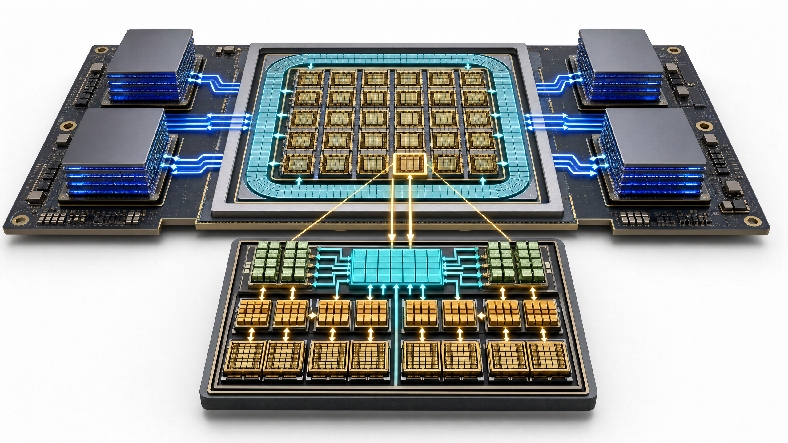
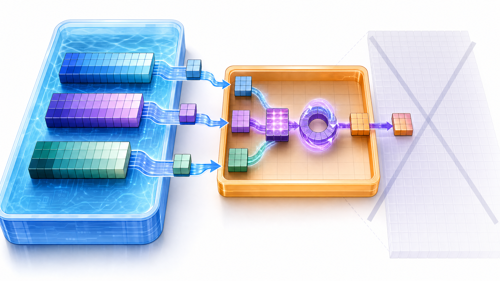
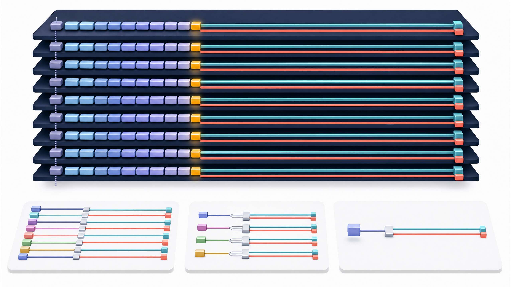
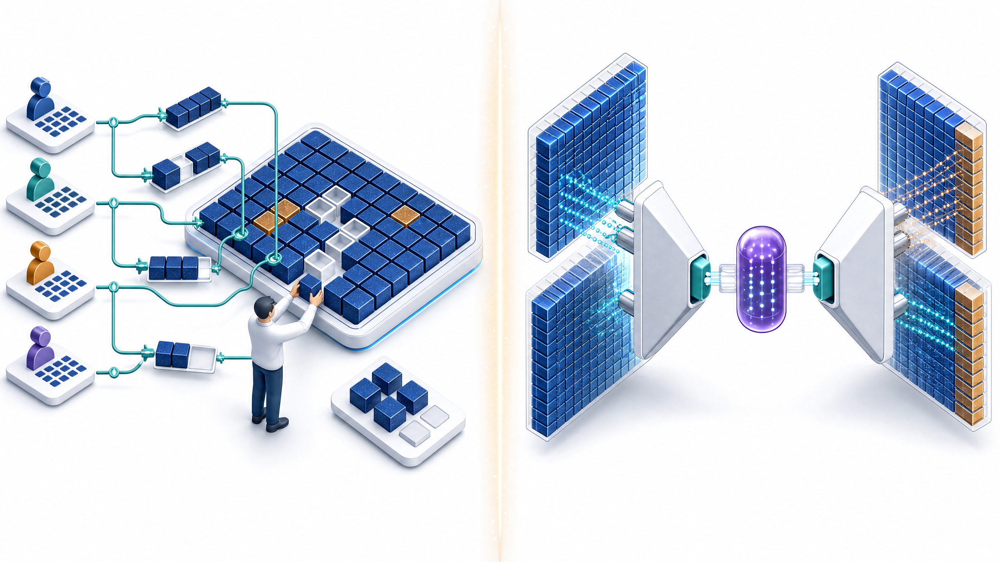

# 从 GPU 数据流到 KV Cache：LLM 推理显存的系统学习笔记

> **学习目标**：不把“GPU 很快”“显存不够”“KV Cache 很大”当作孤立结论，而是建立一条可计算、可排障的因果链：**模型运算 → 数据形状 → 数据移动 → 硬件层级 → 吞吐与显存边界 → 优化手段**。

| 项目 | 说明 |
| --- | --- |
| 主要学习来源 | [DataWhale：GPU 物理架构与内存层级][2]、[DataWhale：KV Cache 与显存增长][3] |
| 社区 | [DataWhale 社区官网][1]，一个以开源学习方式连接 AI 学习者、知识与实践场景的社区。[1] |
| 本文特点 | 在指定教程知识范围上**重新组织、独立表述并扩展推导**；示例代码为本笔记独立编写；全部概念图由 GPT-image-2 生成。 |
| 面向读者 | 具有 Transformer 基础、希望理解 LLM 训练或推理性能瓶颈的学习者。 |
| 先修知识 | 矩阵乘法、Self-Attention、Python 基础。 |

---

## 0. 先抓住全局：大模型显存里其实有“两本账”

很多初学者会把 Attention 的显存问题与 KV Cache 的显存问题混成一句“上下文长就会 OOM”。这句话并不够精确。**在 Prefill（处理整个提示词）阶段**，若显式物化注意力分数矩阵，`S × S` 的二维结构会使中间张量呈二次增长；FlashAttention 的主要贡献正是重写这部分的 **IO 路径**。**在 Decode（每步生成一个 token）阶段**，历史 token 的 K/V 会被保留下来避免重复投影，于是缓存对上下文长度 `S` 呈线性增长；长会话和高并发最终常被这部分容量卡住。[2] [3]

| 账本 | 典型阶段 | 关键张量形状 | 随序列长度的主要增长 | 代表性优化 |
| --- | --- | --- | --- | --- |
| Attention 中间结果账 | 训练、Prefill | `[B, H, S, S]` | **O(S²)** | Tiling、Online Softmax、FlashAttention |
| 历史状态账 | Decode，也贯穿整个会话 | 每层 K/V：`[B, H_kv, S, D]` | **O(S)** | GQA/MQA、MLA、KV 量化、分页管理、前缀复用 |

> **一句话版本**：FlashAttention 主要避免“把巨大中间矩阵写回显存”；KV Cache 主要承担“把历史 token 的状态长期留在显存中”。两者都与显存有关，但不是同一个问题。

---

## 1. GPU 并非一个黑盒：计算和数据搬运同时发生

GPU 适合深度学习，并不是因为它会“神奇地计算”，而是因为它把大量计算单元组织成并行的 **SM（Streaming Multiprocessor，流式多处理器）**，再配合多级存储与专门的矩阵运算单元。以 Hopper 为例，官方资料明确给出了 SM、Tensor Core、共享内存/L1、L2、HBM3 和高速互连的协同设计；其中 TMA 用于大块数据在全局内存与共享内存间的高效异步搬运。[4]



*图 1：把 GPU 看成“许多计算岛屿 + 分层数据仓库”。图是概念性说明，不按真实芯片面积或具体 SKU 比例绘制。*

### 1.1 从一个 token 的计算视角理解 GPU

对 Transformer 而言，线性层、Q/K/V 投影、输出投影和 MLP 的核心都是矩阵乘法。一个 GPU kernel 的理想流程不是“每算一次就去显存取数”，而是：把一小块输入从 HBM 搬到片上高速存储，在片上反复使用，再把最终结果写回。**复用越充分，单位字节搬运能换来的 FLOPs 越多。**

| 部件/概念 | 它解决的事 | 学习时应建立的直觉 |
| --- | --- | --- |
| SM | 承载线程执行、片上存储和计算资源的基本工作单元 | GPU 的并行不是一条很快的流水线，而是大量 SM 同时工作。 |
| CUDA Core | 面向标量、向量及通用算术指令的执行资源 | 适合细粒度通用计算，但不等于矩阵乘法的最高吞吐路径。 |
| Tensor Core | 面向矩阵乘加（MMA）的专用路径 | 当输入布局、精度、tile 尺寸和 kernel 满足条件时，GEMM 可以走更高吞吐的矩阵路径。 |
| Warp / Block | 线程组织和协作的基本单位 | 真正的优化要考虑并行粒度、访存合并、寄存器占用和共享内存占用。 |

### 1.2 CUDA Core 与 Tensor Core：差异不只是“更快”

普通标量 FMA 可以写成 `d = a × b + c`。而 Tensor Core 的思维单位是小型矩阵块：`D = A × B + C`。它不是简单地把同一条标量指令提频，而是将大量乘加按照矩阵 tile 组织，并支持适合 AI 的混合精度路径。Tensor Cores 最初在 V100 引入，后续 GPU 架构持续扩展数据类型与吞吐；Hopper 的第四代 Tensor Core 支持 FP8、FP16、BF16、TF32 等 MMA 类型，并与 Transformer Engine 协同。[4] [5]


*图 2：左侧表现标量 FMA 的细粒度并行，右侧表现 MMA 对矩阵 tile 的成批处理。**注意**：这不是某一代 NVIDIA SM 的微架构图，而是解释计算颗粒度的概念图。*

这里有一个很实用的工程提醒：**“模型用了 FP16/BF16”不自动等于“跑满 Tensor Core”。** 张量维度、内存布局、padding、kernel 实现、批大小、融合程度和框架选择都会影响实际利用率。硬件峰值是上界，不是应用天然能拿到的成绩单。

---

## 2. 显存层级：速度、容量与可复用性之间的交换

GPU 存储结构的核心规律是：**越靠近执行单元，越快、越小，也越难被随意共享；越远离执行单元，越大、越通用，但搬运代价越高。** 下面的表格刻意使用“角色”而不是硬背某个固定数字，因为不同架构和板卡形态的容量、带宽和延迟会变化。[2] [4]

| 层级 | 典型可见性 | 容量直觉 | 最合适的数据 | 常见坑 |
| --- | --- | --- | --- | --- |
| Registers（寄存器） | 单线程私有 | 极小、最快 | 线程正在计算的标量与局部累加值 | 用量过大可能降低并发度，甚至发生 spilling。 |
| Shared Memory / SRAM（共享内存） | 同一 thread block 协作 | 小但很快 | 需要被 block 内多线程复用的 tile | 容量有限；bank conflict 和过度占用都会伤害性能。 |
| L2 Cache | 多个 SM 共享 | 中等 | 跨 block、跨 SM 的热点数据 | 它是硬件管理的缓存，不应假设任意访问都命中。 |
| HBM / Global Memory（全局显存） | 所有 SM 可访问 | 大但相对远 | 模型权重、激活、KV Cache、最终输出 | 容量和带宽都宝贵；反复读写大张量会令 kernel 受带宽限制。 |

### 2.1 访存受限到底是什么意思？用 Roofline 思考

把一个 kernel 的计算量记为 `FLOPs`，移动的数据量记为 `Bytes`，定义其**算术强度**：

\[
I = \frac{\text{FLOPs}}{\text{Bytes moved}} \quad (\text{FLOP/Byte})
\]

若显存带宽为 `BW`，峰值计算能力为 `P_peak`，一个常用的简化 Roofline 上界为：

\[
P_{attainable} \le \min(P_{peak},\ I \times BW)
\]

当 `I × BW < P_peak` 时，算子更接近 **memory-bound（访存受限）**：即使增加计算单元，也常在等待数据。当 `I × BW ≥ P_peak` 时，才有机会转向 compute-bound（算力受限）。这正是为什么高算力 GPU 往往更强调片上复用和数据搬运优化——计算增长得比外部内存带宽更快时，“喂饱计算单元”会更难。[2] [4]

```python
# 简化 Roofline：只用于形成量级直觉，不是 benchmark 替代品。
def arithmetic_intensity(flops: float, bytes_moved: float) -> float:
    if bytes_moved <= 0:
        raise ValueError("bytes_moved 必须为正数")
    return flops / bytes_moved


def roofline_upper_bound_tflops(
    arithmetic_intensity_flop_per_byte: float,
    memory_bandwidth_tb_per_s: float,
    peak_compute_tflops: float,
) -> float:
    bandwidth_limited = (
        arithmetic_intensity_flop_per_byte * memory_bandwidth_tb_per_s
    )
    return min(bandwidth_limited, peak_compute_tflops)

ai = arithmetic_intensity(flops=2e12, bytes_moved=1e12)  # 2 FLOP/Byte
print(roofline_upper_bound_tflops(ai, 3.0, 1000.0))       # 6.0 TFLOP/s
```

上述示例中，算术强度只有 `2 FLOP/Byte`，即使假设峰值算力高达 `1000 TFLOP/s`，带宽侧上界也只有 `2 × 3 = 6 TFLOP/s`。它告诉我们：**先减少不必要的数据移动，可能比再堆一点计算更重要。**

---

## 3. 标准 Attention：为什么 `S²` 会成为危险项

对单层多头注意力而言，若显式构造 attention score，核心形状可抽象为：

\[
Q, K, V \in \mathbb{R}^{B \times H \times S \times D}
\]

\[
A = \operatorname{softmax}(QK^T / \sqrt{D})
\quad\Rightarrow\quad
A \in \mathbb{R}^{B \times H \times S \times S}
\]

因此，**单份**显式 score/probability 张量的字节数为：

\[
M_{score} = B \times H \times S^2 \times e
\]

其中 `e` 是每元素字节数。训练时，反向传播还会保存更多中间状态；所以它的总显存远大于这里的单一估算。但这个公式已经足以揭示风险：`S` 翻倍，`S²` 变成四倍。

```python
def naive_attention_score_bytes(
    batch_size: int,
    heads: int,
    sequence_length: int,
    dtype_bytes: int = 2,
) -> int:
    """计算一个显式 attention score/probability 张量 [B, H, S, S] 的大小。"""
    return batch_size * heads * sequence_length**2 * dtype_bytes

GiB = 1024**3
for s in (2_048, 8_192, 32_768):
    score_gib = naive_attention_score_bytes(1, 32, s) / GiB
    print(f"S={s:>6,}: {score_gib:>7.3f} GiB")
```

对于 `B=1, H=32, FP16/BF16` 的示例，`S=2,048` 时单份 score 为 `0.25 GiB`；增至 `8,192` 是 `4 GiB`；到 `32,768` 则达到 `64 GiB`。这些数值不代表完整模型的实际峰值显存，却精确地体现了二次项的破坏力。

### 3.1 FlashAttention 的核心：不让巨型中间结果频繁经过 HBM

FlashAttention 的关键不是“把 Attention 的数学计算从 O(S²) 变为 O(S)”。注意力对所有历史 token 的关联计算仍然存在。它改变的是 **IO 算法**：把 `Q/K/V` 切成能放进 SRAM 的 tile，在片上完成局部 score、在线 softmax 归约和与 `V` 的累积，避免将完整 `S × S` 中间矩阵反复写到 HBM 再读回来。[2] [6]



*图 3：Tiling 的本质是选择一个能驻留在 SRAM 的工作集，然后将“读块—计算—归约”尽量留在片上。图中打叉网格只表示不应物化完整中间矩阵，不表示 Attention 关系被忽略。*

| 朴素实现倾向 | 分块 IO 视角 | 为什么性能会不同 |
| --- | --- | --- |
| 生成完整 `S × S` score，写入 HBM | 加载 Q/K/V 的小块 | 大矩阵写回与重读减少。 |
| 再读取 score 做 softmax | 在 tile 内维护 running max 与 running sum | 避免完整 softmax 中间量落盘。 |
| 读取概率矩阵与 V 做乘法 | 在片上累积输出块 | 提高数据复用，降低外部存储往返。 |

> **不要误读**：FlashAttention 解决的是 Attention 计算中的工作集与 IO；它不会让生成式推理中的 KV Cache 自动消失。对系统实践而言，前者常直接影响 Prefill 吞吐和 TTFT，后者则常决定能装下多少长会话与多少并发请求。

---

## 4. KV Cache：把历史 K/V 变成“每个 token 的长期租金”

### 4.1 为什么需要 KV Cache

自回归生成在第 `t` 步需要新 token 的 Query 与此前 `1...t` 的 Key/Value 交互。若每步都重新为整个历史序列计算 K 和 V，就会产生大量重复投影。KV Cache 的做法是：当一个 token 首次经过某一层时，把其 K 和 V 存起来；之后只计算新 token 的 K/V，并把它们追加到缓存。

因此，KV Cache 以计算换存储：它减少重复计算，但要求每个活跃请求持续占用 GPU 显存。**它不是可选的“附件”，而是低延迟自回归解码的历史状态。**



*图 4：新 token 加入后，各层都追加 K 与 V。下方从左到右可用于对应理解 MHA、GQA、MQA 的 K/V 头共享程度。*

### 4.2 从张量形状推导出显存公式

对一层而言，单个请求的 Key 和 Value 通常各有形状：

\[
K, V \in \mathbb{R}^{H_{kv} \times S \times D}
\]

加入 batch `B`、层数 `L` 和每元素字节数 `e` 后，完整缓存的理想化预算是：

\[
\boxed{M_{KV} = 2 \times B \times L \times H_{kv} \times S \times D \times e}
\]

| 符号 | 含义 | 对容量的影响 |
| --- | --- | --- |
| `2` | 同时保存 Key 与 Value | 固定的双份成本。 |
| `B` | 活跃序列数/批大小 | 并发翻倍，缓存近似翻倍。 |
| `L` | Transformer 层数 | 每层都要保存一份历史状态。 |
| `H_kv` | KV 头数 | 决定要保存多少组 K/V；这不是 Query 头数。 |
| `S` | 当前已缓存 token 数 | 每生成一个 token，缓存线性增加。 |
| `D` | 每个 head 的维度 | 更宽的 K/V 向量意味着更大状态。 |
| `e` | 数据类型字节数 | FP16/BF16 通常为 2，FP8 或量化格式可能更低，但实现细节不同。 |

下面的代码采用 **GiB（2³⁰ 字节）**，便于与常见显卡的二进制容量语境对照。它只计算 KV Cache；不要把它当作“模型能否部署”的完整显存账本。

```python
from dataclasses import dataclass

BYTES_PER_GIB = 1024**3

@dataclass(frozen=True)
class ModelKVShape:
    layers: int
    kv_heads: int
    head_dim: int
    dtype_bytes: int = 2  # FP16/BF16


def kv_cache_bytes(sequence_length: int, batch_size: int, shape: ModelKVShape) -> int:
    return (
        2 * sequence_length * batch_size * shape.layers
        * shape.kv_heads * shape.head_dim * shape.dtype_bytes
    )


def kv_bytes_per_token_per_request(shape: ModelKVShape) -> int:
    return 2 * shape.layers * shape.kv_heads * shape.head_dim * shape.dtype_bytes
```

以 `L=32, H_kv=32, D=128, e=2` 为例，**单个新 token、单个请求**增加：

\[
2 \times 32 \times 32 \times 128 \times 2 = 524{,}288\ \text{bytes} = 0.5\ \text{MiB}
\]

这看似不大，但把它乘上 32K token 和多个并发请求，成本会立刻进入 GiB 甚至数十 GiB 的量级。

### 4.3 一个可复核的数量级表

假设 32 层、`head_dim=128`、FP16/BF16、单个请求。下面表格由本笔记附带代码计算得到：

| 上下文长度 `S` | MHA：`H_kv=32` | GQA：`H_kv=8` | MQA：`H_kv=1` |
| ---: | ---: | ---: | ---: |
| 2,048 | 1.000 GiB | 0.250 GiB | 0.031 GiB |
| 8,192 | 4.000 GiB | 1.000 GiB | 0.125 GiB |
| 32,768 | 16.000 GiB | 4.000 GiB | 0.500 GiB |

> **检查点**：表格中 MHA 的 32K 行是 `16 GiB`，不是模型完整显存。真正部署还要加上权重、临时工作区、激活（若适用）、CUDA allocator 余量、通信 buffer 等成本。

---

## 5. MHA、GQA、MQA：决定缓存大小的是 `H_kv`，不是 `H_q`

在标准 MHA 中，通常每个 Query head 都拥有对应的 K/V head，因而 `H_kv = H_q`。MQA 让多个 Query head 共享同一组 K/V；GQA 则让多个 Query head 按组共享 K/V，处于二者之间。这些结构的一个直接系统后果是：**KV Cache 的头维度从 `H_q` 改为 `H_kv`。** 因此，缓存按 `H_kv` 成比例缩小。[3]

| 注意力结构 | 例：`H_q=32` | `H_kv` | 相对 KV Cache | 主要取舍 |
| --- | ---: | ---: | ---: | --- |
| MHA | 每个 Query head 独立 K/V | 32 | 1.00× | 表达最细粒度，但缓存与解码读取压力最大。 |
| GQA | 每 4 个 Query head 共用一组 K/V | 8 | 0.25× | 以较小结构改变换取显著缓存下降，常是工程折中。 |
| MQA | 全部 Query head 共用一组 K/V | 1 | 0.03125× | 缓存最小，但共享最强，实际效果取决于模型设计与训练。 |

```python
def kv_cache_gib(seq_len: int, kv_heads: int) -> float:
    shape = ModelKVShape(layers=32, kv_heads=kv_heads, head_dim=128)
    return kv_cache_bytes(seq_len, batch_size=1, shape=shape) / BYTES_PER_GIB

for name, h_kv in [("MHA", 32), ("GQA", 8), ("MQA", 1)]:
    print(f"{name}: {kv_cache_gib(8192, h_kv):.3f} GiB")
```

该程序输出应接近 `4.000 GiB`、`1.000 GiB`、`0.125 GiB`。它不是在比较模型质量，只是在同样 `L、S、D、dtype` 下隔离 `H_kv` 这一项。

---

## 6. 长上下文优化地图：先分清“缩小 cache”与“管好 cache”

当系统出现缓存压力，容易把所有方案统称为“KV 优化”。更有用的分类是看优化改变了哪个变量：有的降低每个 token 的表示体积，有的提高同样显存下的有效利用率，有的减少重复前缀的再次计算。



*图 5：左边对应缓存组织与分配，右边对应缓存表示压缩。它们可组合，但解决的不是同一层问题。*

| 方法类别 | 典型方法 | 主要改变 | 它**没有**自动解决什么 |
| --- | --- | --- | --- |
| 降低 `H_kv` | MQA、GQA | 公式中的 `H_kv` | 内存碎片、跨请求调度、权重显存。 |
| 降低每元素成本 | KV 量化、低精度格式 | `e` | 分配碎片、质量损失与 kernel 支持问题。 |
| 压缩表示 | MLA 等潜变量/低维表示思路 | 每 token 的有效状态维度 | 缓存调度、页面映射和请求生命周期管理。 |
| 改善分配与组织 | PagedAttention | 物理布局、页级分配、复用方式 | 单 token 的理论 K/V 表示大小。 |
| 减少重复前缀工作 | Prefix caching / Radix 类复用 | 相同前缀的重建成本和重复占用 | 完全无关请求的缓存容量问题。 |

### 6.1 PagedAttention：像操作系统分页一样组织缓存

PagedAttention 的核心启发是把每条请求的 KV Cache 切成固定大小的块（页面），使用逻辑映射将 token 位置连接到不一定连续的物理页。这样，不必为一条长度未知的请求预先申请一大段连续显存，从而缓解服务场景中动态长度请求造成的外部碎片与分配困难。[3] [7]

它仍然有尾页的**内部浪费**：例如页长为 128，长度 8,321 的序列需要 `ceil(8321/128)=66` 页，最后一页空出 `66×128-8321=127` 个 token 槽位。分页并非“零浪费”，而是以可控的小粒度尾部浪费换取更灵活的分配、回收和调度。

```python
from math import ceil

def paged_allocation(sequence_length: int, tokens_per_page: int) -> tuple[int, int]:
    if tokens_per_page <= 0:
        raise ValueError("tokens_per_page 必须为正数")
    pages = ceil(sequence_length / tokens_per_page)
    unused_slots = pages * tokens_per_page - sequence_length
    return pages, unused_slots

pages, unused = paged_allocation(8_321, 128)
print(pages, unused)  # 66 127
```

### 6.2 并发预算：把公式转成可行动的容量规划

假设你已经从总显存中划出一个**纯 KV Cache 预算**，就可反推理想化并发上限。下例额外用 `safety_factor` 避免把预算压满；真实服务还应纳入最长请求比例、请求长度分布、allocator 行为、预留空间和批处理策略。

```python
def max_concurrent_sequences(
    cache_budget_gib: float,
    max_sequence_length: int,
    shape: ModelKVShape,
    safety_factor: float = 0.90,
) -> int:
    usable_bytes = cache_budget_gib * BYTES_PER_GIB * safety_factor
    one_request = kv_cache_bytes(max_sequence_length, 1, shape)
    return int(usable_bytes // one_request)

# 40 GiB 专门留给 KV Cache；32 层、8 个 KV head 的 GQA；最长 32K。
gqa = ModelKVShape(layers=32, kv_heads=8, head_dim=128)
print(max_concurrent_sequences(40, 32_768, gqa))  # 9
```

在这个**教学假设**下，40 GiB 预算、90% 安全系数、32K 上下文的 GQA 请求约可同时容纳 9 条。若把 GQA 改为 MHA，则每条请求从 `4 GiB` 变为 `16 GiB`，理想并发会显著下降。这就是架构选择如何直接改变在线服务容量。

---

## 7. 从硬件到服务：一张工程判断表

| 你看到的现象 | 先检查的对象 | 更可能的瓶颈 | 可尝试方向 |
| --- | --- | --- | --- |
| 长 prompt 的首 token 很慢，显存读写活跃 | Prefill attention kernel、序列长度、HBM 流量 | Attention 的 IO 或二次中间量 | FlashAttention、算子融合、分块与合适的 batch。 |
| 随对话变长，活跃请求数持续减少 | `L, H_kv, D, S, e` 与缓存预算 | KV Cache **容量** | GQA/MQA、KV 量化、缩短上下文、offload、容量规划。 |
| 请求长度很不均匀，显存剩余却频繁分配失败 | 分配器状态、连续大块申请、请求回收 | 碎片与缓存组织 | PagedAttention、块池、连续批处理、请求调度。 |
| Decode 每 token 慢，但显存没有 OOM | 每步读取历史 K/V 的带宽、batch 形状 | KV 读取的**带宽**与调度 | 调整批处理、GQA、量化、优化 kernel 与布局。 |
| 峰值算力很高但算子仍慢 | 算术强度、内存吞吐、kernel launch | Memory-bound 或低利用率 | 提升数据复用、融合小算子、减少格式转换。 |

### 7.1 我自己的系统化理解：容量、带宽与调度是三条不同轴

**第一条轴是容量**：缓存总字节数是否放得下。GQA/MQA、量化、MLA 这类方法的强项主要在这里。**第二条轴是带宽**：即使放得下，Decode 的每一步仍要读取历史 K/V；长上下文可能使每个生成 token 的读取量变大。**第三条轴是调度与利用率**：即使理论容量足够，碎片、连续申请、不同长度请求混合、前缀复用策略也能让可用并发远低于计算值。

这解释了一个常见现象：某优化“把 KV Cache 缩小了四倍”，并不保证吞吐一定四倍。它可能首先释放容量，随后使更大的 batch 成为可能；真正吞吐提升还要看新的 batch 是否让 kernel 更饱和，是否引入额外解码或访存成本，以及服务调度是否能利用释放出来的空间。

---

## 8. 常见误区与自测

| 误区 | 更准确的说法 |
| --- | --- |
| “HBM 有 TB/s 带宽，所以不可能被访存卡住。” | 高峰值计算能力意味着要搬运更多数据才能喂满计算单元；低算术强度 kernel 仍可能受 HBM 限制。 |
| “FlashAttention 把 Attention 的复杂度降成线性。” | 它主要减少 HBM IO 与显式中间结果存储；核心全量注意力关系的计算并未凭空消失。 |
| “KV Cache 只取决于上下文长度。” | 它与 `B、L、H_kv、D、e、S` 都成正比。 |
| “Query head 多就一定 Cache 大。” | 直接决定缓存头维度的是 `H_kv`；GQA/MQA 正是通过让多个 Query head 共用 K/V 来改变它。 |
| “PagedAttention 是压缩算法。” | 它主要优化缓存的页面化分配与访问组织；并不改变原始 K/V 表示的理论维度。 |
| “估算得到 40 GiB，就能把剩余 40 GiB 全给缓存。” | 线上部署需要考虑模型权重、工作区、运行时、通信与 allocator 余量，并应留出安全边界。 |

### 8.1 三个检验你是否真正掌握的问题

1. 一个模型的 `L=40、H_kv=8、D=128、FP16`，每个请求每新增一个 token 会增加多少字节的 KV Cache？请写出因式分解，而不只是报数。
2. 把 `S` 从 4K 提到 16K，显式 attention score 与 KV Cache 分别扩大多少倍？为什么这两种增长在系统设计上影响不同？
3. 若一个推理服务出现大量长度不均的请求，且监控显示“空闲显存看似不少但大块分配失败”，为什么只改 MHA 为 GQA 可能还不够？

---

## 9. 运行与复用

完整、可直接执行的教学工具箱见同目录的 `gpu_kv_toolbox.py`。运行方式如下：

```bash
python3 gpu_kv_toolbox.py
```

它会输出 MHA/GQA/MQA 在不同上下文长度下的 KV Cache、显式 score 矩阵与 KV Cache 的增长对比、简化的并发预算、分页尾部浪费与 Roofline 示例。建议先改变 `layers`、`kv_heads`、`head_dim`、`dtype_bytes` 和上下文长度，再将你的模型配置代入。

> **边界声明**：此工具箱为可解释的近似估算器，不能代替真实服务的 profiler、框架内存统计或容量压测。现实模型还会涉及权重格式、RoPE/位置编码、张量并行分片、缓存布局、allocator、CUDA Graph、MoE、CPU/GPU offload 等因素。

---

## 10. 参考资料

[1] [DataWhale 社区官网](https://datawhale.cn/)

[2] [DataWhale：03 GPU Architecture and Memory｜GPU 物理架构与内存层级](https://github.com/datawhalechina/llm-algo-leetcode/blob/main/01_Hardware_Math_and_Systems/03_GPU_Architecture_and_Memory.ipynb)

[3] [DataWhale：11 KV Cache and Memory Growth｜KV Cache 与显存增长](https://github.com/datawhalechina/llm-algo-leetcode/blob/main/01_Hardware_Math_and_Systems/11_KV_Cache_and_Memory_Growth.ipynb)

[4] [NVIDIA Technical Blog：NVIDIA Hopper Architecture In-Depth](https://developer.nvidia.com/blog/nvidia-hopper-architecture-in-depth/)

[5] [NVIDIA：Tensor Cores](https://www.nvidia.com/en-us/data-center/tensor-cores/)

[6] [Dao et al.：FlashAttention: Fast and Memory-Efficient Exact Attention with IO-Awareness](https://arxiv.org/abs/2205.14135)

[7] [Kwon et al.：Efficient Memory Management for Large Language Model Serving with PagedAttention](https://arxiv.org/abs/2309.06180)

---

## 附：一页记忆卡

> **要跑快**：让数据在 SRAM/L2 中多复用，少往返 HBM。  
> **要装下**：用 `2 × B × L × H_kv × S × D × e` 计算 KV Cache。  
> **要分清**：FlashAttention 优化 Attention 的 IO；GQA/MQA/MLA 缩小或重构 Cache；PagedAttention 管理 Cache。  
> **要部署**：容量、带宽、调度三个维度必须一起量。  
> **要验证**：公式用于预算，profiler 与压测用于决策。
