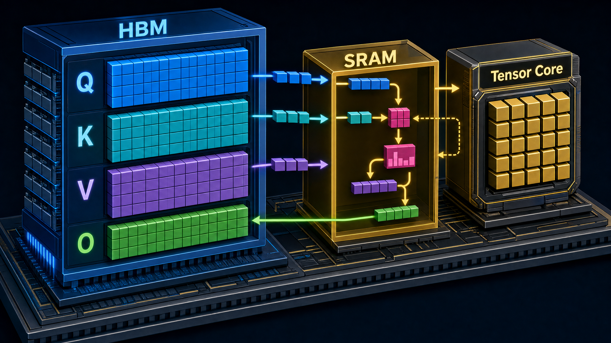
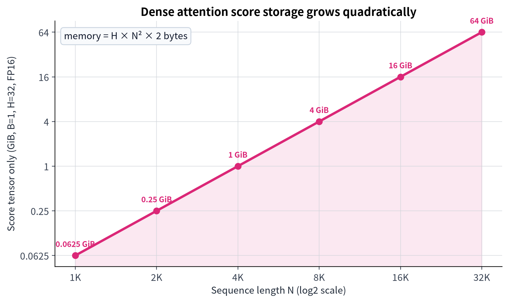
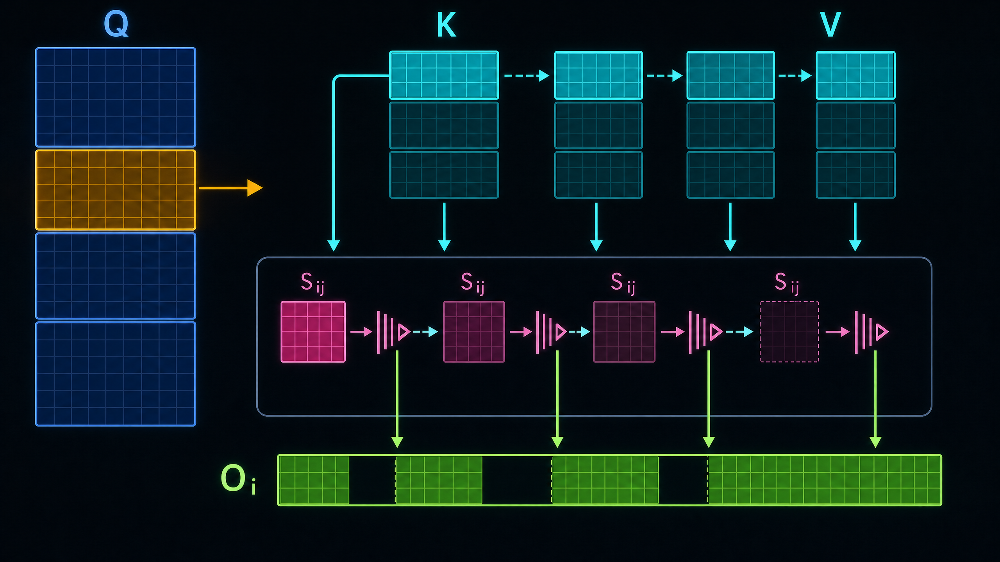
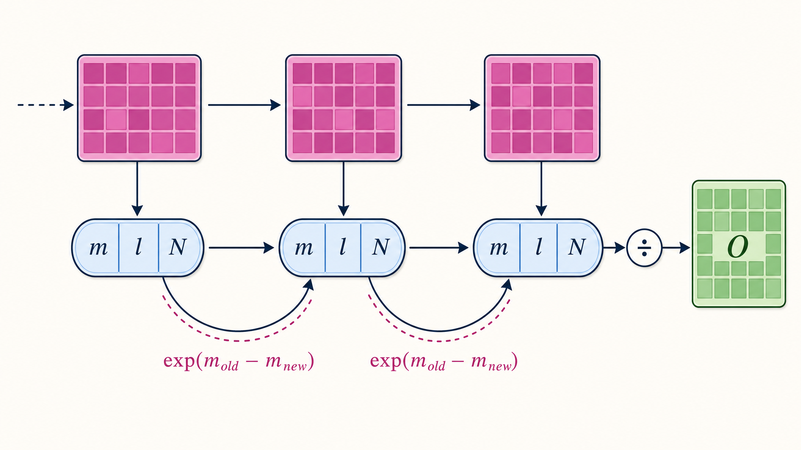
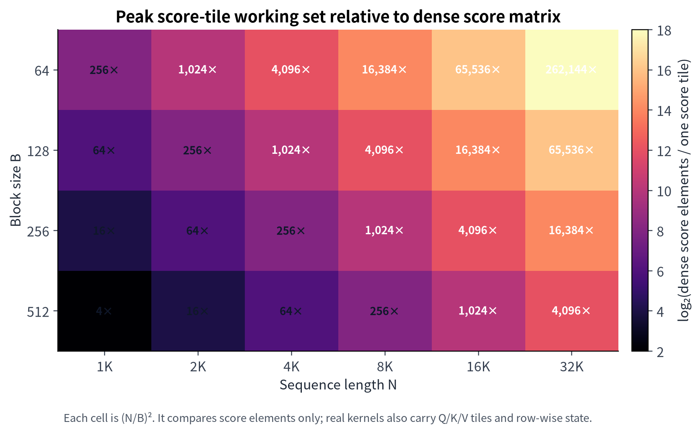
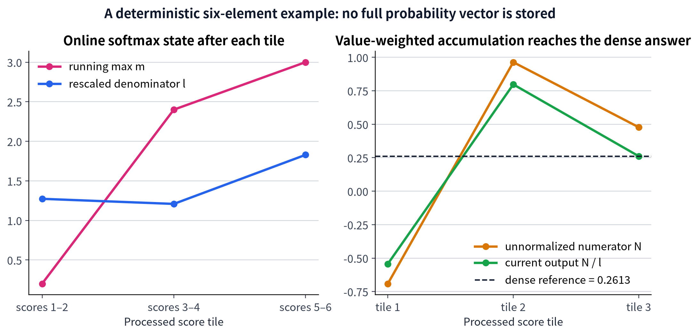

# 从显存瓶颈到 Online Softmax：FlashAttention 的 I/O 视角、推导与 PyTorch 仿真

> **一篇可运行、可验证、可视化的原创学习笔记**  
> 面向已经理解缩放点积注意力、但希望真正弄清 FlashAttention 为什么更省显存、为什么仍然精确的读者。



## 写在前面：本文与 DataWhale 教程的关系

这份笔记以 DataWhale 的两份教程为学习起点：一份建立 **HBM/SRAM 与工作集** 的直觉，另一份以纯 PyTorch 模拟 **分块计算与 online softmax**。两者的链接都列在下表中。[\[1\]][1] [\[2\]][2] 本文不复述教程行文，也不复制其填空式代码；而是重新组织成一条从公式、内存模型、数学推导到可执行验证的闭环，并新增了因果掩码、梯度核验、精确图表与三张原创概念图。

DataWhale 是一个采用开源学习模式、连接 AI 学习者与学习资源的社区；若这份笔记对你有帮助，也建议回到其课程和社区继续学习与交流。[\[3\]][3]

| 资源 | 用途 | 链接 |
| --- | --- | --- |
| DataWhale 社区 | 社区主页与学习路线 | [datawhale.cn][3] |
| 教程一：显存模型 | 建立 Attention 的 I/O 与分块工作集直觉 | [14_FlashAttention_Memory_Model.ipynb][1] |
| 教程二：PyTorch 模拟 | 观察分块前向与 online softmax | [20_FlashAttention_Sim.ipynb][2] |
| 本文代码 | 可运行的原创教学实现、图表脚本和入口 | [`code/` 与 `scripts/`](#完整源码) |

## 目录

1. [一分钟结论](#一分钟结论)
2. [符号、形状与标准 Attention](#符号形状与标准-attention)
3. [真正的痛点：不是公式，而是 I/O](#真正的痛点不是公式而是-io)
4. [FlashAttention 如何重新安排计算](#flashattention-如何重新安排计算)
5. [Online Softmax：不用保存整行分数也能精确归一化](#online-softmax不用保存整行分数也能精确归一化)
6. [PyTorch 仿真：可读、可跑、可验](#pytorch-仿真可读可跑可验)
7. [可视化与量级分析](#可视化与量级分析)
8. [从 V1 到 V3：优化对象在变化](#从-v1-到-v3优化对象在变化)
9. [常见误解、实践边界与我的思考](#常见误解实践边界与我的思考)
10. [完整源码](#完整源码)
11. [复现方式与参考资料](#复现方式与参考资料)

---

## 一分钟结论

**FlashAttention 没有把注意力从二次计算变成线性计算。** 对单头自注意力而言，计算 $QK^\top$ 仍需要二次量级的乘加；它改变的是 **何时保存什么、在哪一级存储器中复用什么**。原始论文将其称为 *IO-aware exact attention*：通过 tiling 减少 GPU 高带宽显存（HBM）与片上 SRAM 之间的读写，同时保持结果精确。[\[4\]][4]

| 问题 | 常规实现 | FlashAttention 的回答 |
| --- | --- | --- |
| 要不要构造 $N\times N$ score？ | 常常把完整 $S$ 作为中间张量物化 | 只构造一个小的 $S_{ij}$ tile，随后立即消费 |
| softmax 能否逐块做？ | 直觉上不能：整行最大值和分母尚未知 | 能：维护运行最大值 $m$ 与重标尺后的指数和 $\ell$ |
| 输出如何累加？ | 先得到完整 $P$，再算 $PV$ | 同时维护未归一化分子 $n$，最后只做一次 $n/\ell$ |
| 前向峰值 score 工作集 | $O(N^2)$ 元素 | 固定 tile 下为 $O(T_QT_K)$ 元素；连同输入输出与行状态为 $O(Nd + T_QT_K)$ |
| 是不是近似算法？ | 不适用 | **不是。** 分块顺序改变，数学目标不改变。[\[4\]][4] |

> **最值得带走的一句话：** FlashAttention 的关键不是“少算一个矩阵”，而是“让这个矩阵的每一个小块刚产生就被归约掉，不再长期占据 HBM”。

---

## 符号、形状与标准 Attention

设批大小为 $B$、注意力头数为 $H$、序列长度为 $N$、每头 query/key 维度为 $d_k$、value 维度为 $d_v$。为了突出核心推导，本文的主函数先只处理单头、单样本的二维张量；批和头只是外层可并行维度。

| 符号 | 形状（单头、单样本） | 含义 |
| --- | --- | --- |
| $Q$ | $N\times d_k$ | Query 矩阵 |
| $K$ | $N\times d_k$ | Key 矩阵 |
| $V$ | $N\times d_v$ | Value 矩阵 |
| $S$ | $N\times N$ | 缩放前/后的 attention score |
| $P$ | $N\times N$ | 对 score 的行 softmax 结果 |
| $O$ | $N\times d_v$ | 注意力输出 |
| $T_Q,T_K$ | tile 尺寸 | 一个 Q 块和一个 K/V 块的行数 |

缩放点积注意力写成：

$$
S = \frac{QK^\top}{\sqrt{d_k}},\qquad
P = \text{softmax}(S),\qquad
O = PV.
$$

其中 softmax 沿每行归一化。因果自注意力还会把未来位置置为 $-\infty$，使其指数权重为零。这个基础公式没有改变；变化的是执行路线。

```python
# Dense reference: clear but intentionally materializes an N x N score tensor.
def reference_attention(q, k, v, *, causal=False):
    scores = (q @ k.T) / math.sqrt(q.shape[1])
    if causal:
        valid = torch.arange(q.shape[0], device=q.device)[:, None] >= torch.arange(q.shape[0], device=q.device)[None, :]
        scores = scores.masked_fill(~valid, -torch.inf)
    probabilities = torch.softmax(scores, dim=-1)
    return probabilities @ v
```

这段实现是**正确性基线**。`scores` 与 `probabilities` 都是 $N\times N$；在训练中，自动求导还可能需要额外保存或重算中间信息。FlashAttention 的前向重点不是否认这些数学对象，而是避免将完整矩阵作为持久的中间结果写入慢一层的存储器。[\[4\]][4]

---

## 真正的痛点：不是公式，而是 I/O

GPU 的 HBM 容量很大，却离计算单元更远；寄存器与片上 SRAM 容量小得多，却更接近计算。原始 FlashAttention 的洞见是：在给定算术量的情况下，HBM 与 SRAM 之间的数据移动本身会成为决定性成本，因此应将其纳入算法设计。[\[4\]][4]


### 一个可计算的量级：$N^2$ 是怎么“爆炸”的？

只统计 score 张量 $S$，若使用 FP16/BF16（每元素 2 bytes），其字节数为：

$$
M_S = B\cdot H\cdot N^2\cdot 2\;\text{bytes}.
$$

下面的图固定 $B=1$、$H=32$，并且**只**计算一个 score 张量；它没有把 $P$、Q/K/V、输出、梯度和框架工作区算进去。因此，这是一张保守的量级图，而非端到端显存测量。



| 序列长度 $N$ | $N^2$ | 单个 score 张量（$B=1,H=32$，FP16） | 读图提示 |
| ---: | ---: | ---: | --- |
| 1,024 | 1,048,576 | 0.0625 GiB | 仍相对轻量 |
| 4,096 | 16,777,216 | 1 GiB | 仅 score 已达到 GiB 级 |
| 8,192 | 67,108,864 | 4 GiB | 其他激活尚未计入 |
| 16,384 | 268,435,456 | 16 GiB | 长上下文极易被中间态压垮 |
| 32,768 | 1,073,741,824 | 64 GiB | 只一个 score 张量就超出许多设备可用空间 |

这里的表格展示了一个经常被忽略的事实：**越长的上下文，越不能只用 FLOPs 解释性能。** 即使矩阵乘法本身可以高效执行，将大张量写到 HBM、再读回做归约和与 $V$ 相乘，也可能把吞吐拖入带宽受限区域。[\[4\]][4]

---

## FlashAttention 如何重新安排计算

FlashAttention 把 $Q,K,V$ 切为可放进片上工作空间的小块。对某个 $Q_i$，固定它在 SRAM 中；随后顺序读取每个 $K_j,V_j$，生成临时分数块：

$$
S_{ij}=\frac{Q_iK_j^\top}{\sqrt{d_k}},\qquad
S_{ij}\in\mathbb{R}^{T_Q\times T_K}.
$$

关键是：**$S_{ij}$ 被立即用于更新行级统计量和输出贡献，然后即可释放。** 它不会拼回完整的 $S$。这正是“tile 工作集”与“完整中间张量”之间的区别。



### 一个 Q tile 的执行日程

| 阶段 | 留在片上/寄存器的内容 | 从 HBM 流入或写出 | 是否保留完整 $N\times N$ 张量 |
| --- | --- | --- | --- |
| 选中 $Q_i$ | $Q_i$、输出分子 $n_i$、$m_i$、$\ell_i$ | 读入 $Q_i$ | 否 |
| 扫描第 $j$ 个 K/V tile | $Q_i,K_j,V_j,S_{ij}$ | 读入 $K_j,V_j$ | 否，$S_{ij}$ 立刻消费 |
| 更新在线状态 | $m_i,\ell_i,n_i$ | 无需写回 score | 否 |
| 扫描结束 | $O_i=n_i/\ell_i$ | 写出 $O_i$ | 否 |

若 $T_Q=T_K=T$，则最大 score tile 仅含 $T^2$ 个元素。注意，这个说法仅比较 **score 工作集**：实际内核还要容纳 Q/K/V tile、输出累加器和行状态。更严谨地说，在固定头维时，前向临时状态从持久的二次 score/probability 张量，转为输入输出的线性量加上一个受 tile 尺寸控制的小工作集。

---

## Online Softmax：不用保存整行分数也能精确归一化

### 先回顾稳定 softmax

对一行 score $x$，直接算 $\exp(x)$ 容易溢出。因此选取该行最大值 $m=\max_jx_j$：

$$
\text{softmax}(x)_j=
\frac{\exp(x_j-m)}{\sum_t\exp(x_t-m)}.
$$

看似必须先知道整行最大值和整行分母，才能开始输出；这正是 online softmax 要拆除的错觉。

### 把已见与新见的块写成同一个坐标系

假设已处理 score 集合为 $A$，其状态为：

$$
m_A=\max_{a\in A}a,\qquad
\ell_A=\sum_{a\in A}\exp(a-m_A),\qquad
n_A=\sum_{a\in A}\exp(a-m_A)v_a.
$$

新 tile 的 score 集合为 $C$。首先用共同的基准重标尺：

$$
m_{\text{new}}=\max(m_A,\max_{c\in C}c),\qquad
\alpha=\exp(m_A-m_{\text{new}}).
$$

再计算新块相对该基准的未归一化权重 $p_C=\exp(C-m_{\text{new}})$。三项状态更新为：

$$
\ell_{\text{new}}=\alpha\ell_A+\sum p_C,
$$

$$
n_{\text{new}}=\alpha n_A+p_CV_C,
$$

$$
O_{\text{new}}=\frac{n_{\text{new}}}{\ell_{\text{new}}}.
$$

这就是“以前的统计量不丢失”的原因：当新块给出了更大的最大值时，旧统计量统一乘以 $\alpha$，等价于把旧的指数坐标从 $m_A$ 改写到 $m_\text{new}$。整个过程只保留每个 query 行的 $m$、$\ell$ 与 value 维度的 $n$。



> **与常见写法的关系。** 有些实现直接维护已经归一化的输出 $O$，每个 tile 都重新缩放旧 $O$ 并除以新的 $\ell$。本文维护未归一化分子 $n$，只在一个 Q tile 的末尾计算 $n/\ell$。两种写法严格等价，因为 $n=\ell O$；后一种组织方式把“重新标尺”显式地集中在分子与分母上，更适合推导与阅读。

### 数值陷阱：为什么代码里要处理 $-\infty-(-\infty)$？

因果掩码会让某些 block 中的全部候选位置无效。这时 `scores` 可能全为 $-inf`，块最大值也是 $-inf`。如果直接计算 `scores - m_new`，就会产生 `-inf - -inf = NaN`。教学实现显式使用 `torch.where`：无效位置的指数输入被替换为 $-\infty$，其指数恰为零；旧状态在尚未见到有效分数时也令缩放系数为零。这个分支不是优化技巧，而是让掩码语义与数值稳定性同时成立的必要防线。

---

## PyTorch 仿真：可读、可跑、可验

### 这份实现的定位

本文代码在 CPU 或 GPU 上均可运行，但它的嵌套 Python 循环**不会**比 PyTorch 的优化 dense attention 更快。它的价值在于将生产内核的数学不变量摊开：你可以逐步检查 tile 如何被消费、状态如何更新、因果掩码如何作用，以及输出和梯度如何同标准 Attention 一致。

生产级 FlashAttention 需要 CUDA/Triton 层的共享内存、寄存器、warp 调度、向量化和流水线；因此，请把下述实现视为 **algorithm simulator**，而不是 benchmark kernel。原始工作与后续版本都以硬件 I/O、并行划分和异步流水线为优化对象。[\[4\]][4] [\[5\]][5] [\[6\]][6]

### 核心函数逐段阅读

| 函数 | 责任 | 最重要的不变量 |
| --- | --- | --- |
| `reference_attention` | 物化 $N\times N$ score 的对照结果 | 作为单一正确性基线 |
| `_causal_mask` | 返回当前 $Q_i,K_j$ tile 的合法关系 | 只允许 $k\le q$ |
| `flash_attention_tiled` | tile + online softmax 的完整前向 | `m,l,n` 始终代表已处理 K/V 块 |
| `flash_attention_tiled_bh` | 展示 batch/head 外层语义 | 每个 head 都是独立的单头计算 |
| `verify_forward_equivalence` | 覆盖非整除尾块、因果/非因果情形 | 输出与 dense 对照一致 |
| `verify_gradients` | 比较 $dQ,dK,dV$ | 反向梯度同样一致 |

主循环的逻辑可以压缩成如下伪代码：

```text
for Q_i in Q tiles:
    m_i = -∞; l_i = 0; n_i = 0
    for (K_j, V_j) in KV tiles:
        S_ij = Q_i @ K_j^T / sqrt(d_k)
        施加局部 causal mask（如需要）
        m_new = max(m_i, rowmax(S_ij))
        α = exp(m_i - m_new)           # 尚无旧质量时 α=0
        P_ij = exp(S_ij - m_new)        # 无效位置的权重为 0
        l_i = α * l_i + rowsum(P_ij)
        n_i = α * n_i + P_ij @ V_j
        m_i = m_new
    O_i = n_i / l_i
```

`S_ij` 的形状是 `[q_count, kv_count]`，其中最后一块可以小于 `block_size`；这是 `min(start + block_size, seq_len)` 存在的原因。`m`、`l` 的形状是 `[q_count, 1]`，确保它们按行广播；`n` 的形状则为 `[q_count, d_value]`，承载 value 加权和。

### 已验证什么？

本笔记实际运行了四组前向对照，包括一个块大小不能整除序列长度的情形、一组 causal 情形，以及一组 tile 大于序列长度的边界情形。float64 下最大绝对误差在 $4.441\times10^{-16}$ 以内；另以一个标量投影损失比较 $dQ,dK,dV$，最大绝对误差在 $2.220\times10^{-16}$ 以内。这些结果验证的是本教学实现的数学等价性，而不是 GPU 性能结论。

```text
N= 8, d_k= 4, B= 2, causal=False | max_abs_error=3.331e-16
N=13, d_k= 7, B= 5, causal=False | max_abs_error=4.441e-16
N=11, d_k= 6, B= 4, causal=True  | max_abs_error=2.220e-16
gradient dQ: max_abs_error=2.012e-16
gradient dK: max_abs_error=2.012e-16
gradient dV: max_abs_error=2.220e-16
```

---

## 可视化与量级分析

### 1. score 工作集的缩小比不是“总显存缩小比”

下图每个单元格计算：

$$
\frac{\text{dense score elements}}{\text{largest score-tile elements}}
=\frac{N^2}{T^2}=\left(\frac NT\right)^2.
$$

它精准描述的是“完整 score 矩阵相对一个最大 score tile 的元素数量比”。它**不是**真实端到端显存节省倍数，也不是性能倍数，因为后者还受 Q/K/V、输出、梯度、head 数、内核实现、片上容量与带宽等因素影响。



当 $N=32\text{K},T=128$ 时，单个 score tile 相比完整 score 的元素数小 $65{,}536$ 倍。这给出了 FlashAttention 要解决的“中间张量驻留”问题的直觉；但 tile 不能无限缩小，因为更小 tile 也意味着更多循环、更多调度和更弱的矩阵乘法复用。

### 2. 把公式变成一条看得见的状态轨迹

下一张图不使用随机数据。它将 six-element score 序列 `[-1.1, 0.2, 2.4, -0.3, 3.0, 1.2]` 与对应 value 分成三个大小为 2 的块。左图的 $m$ 与 $\ell$ 在每块后更新；右图显示未归一化分子 $n$ 和当前输出 $n/\ell$ 如何最终落在 dense reference 上。



这张图反驳了一个常见直觉：**“必须先看到完整 score 行，才有资格开始算输出。”** 更准确的说法是：必须知道一个共同的指数基准，但这个基准可以在遇到新块时通过重标尺修正。

---

## 从 V1 到 V3：优化对象在变化

这篇笔记主要解释的是 FlashAttention 的第一层思想——精确分块与 I/O 感知。后续工作并没有否定这一思想，而是继续问：在相同正确性目标下，怎样让 GPU 的实际执行更接近高效矩阵乘法？

| 版本 | 核心关注 | 代表性改进 | 与本文的联系 |
| --- | --- | --- | --- |
| FlashAttention (V1) | HBM/SRAM I/O | 分块、在线重标尺、避免持久化完整 attention matrix | 本文的主线；精确但 IO-aware。[\[4\]][4] |
| FlashAttention-2 | GPU 工作划分与占用 | 减少 non-matmul FLOPs；跨 thread block 并行单头计算；减少共享内存通信 | “正确公式”之外，还要优化谁做什么、在哪儿做。[\[5\]][5] |
| FlashAttention-3 | Hopper 异步能力与低精度 | Tensor Core/TMA 异步重叠、block-wise matmul-softmax 交错、FP8 相关策略 | 内核把数据搬运与计算做成流水线，而非 Python 双循环。[\[6\]][6] |

论文摘要报告，V2 的设计针对非矩阵乘法开销、工作划分与共享内存通信，并在 A100 上提升利用率；V3 进一步针对 Hopper 的 Tensor Core 异步、TMA 和 FP8 能力。这里列出它们是为了给出技术脉络，而非暗示本文 CPU-friendly 仿真复刻了这些硬件特性。[\[5\]][5] [\[6\]][6]

---

## 常见误解、实践边界与我的思考

### 常见误解

| 误解 | 更准确的理解 |
| --- | --- |
| “FlashAttention 把注意力复杂度变成 $O(N)$。” | **错误。** 主体的 $QK^\top$ 计算仍是二次量级；改善的是中间激活和 I/O 组织。[\[4\]][4] |
| “不保存 $S$ 就一定不精确。” | **错误。** 只要在线状态更新正确，最终结果与 dense softmax 相同。 |
| “block size 越小越好。” | **错误。** 小块降低 score 工作集，却带来更多 tile、循环和调度；实际最优值取决于硬件与内核。 |
| “这段 PyTorch 循环应当比 torch.softmax 更快。” | **错误。** Python 循环只是解释算法；性能依赖融合 kernel 与硬件映射。 |
| “因果 mask 只是最后把输出清零。” | **错误。** 它必须在 score 层禁止未来键进入 softmax 分母。 |

### 三个值得继续追问的问题

**第一，算法复杂度和内存复杂度必须分开说。** 在固定头维条件下，FlashAttention 大幅减轻了由 score/probability 中间态导致的二次存储压力，却没有消除二次的 query-key 交互。把两者混为一谈，会造成“速度提升来自少算”的误解。

**第二，tile 是硬件契约，而非纯数学超参数。** 本文把 `block_size` 暴露给读者，是为看清工作集；真实 kernel 会根据 SM 资源、寄存器压力、共享内存、Tensor Core tile 和并行度共同选择块形状。因此，学习阶段应先问“哪一组数据必须同时活着”，再问“这组数据能否放入目标硬件的近端存储”。

**第三，online softmax 是一种可迁移的思维模式。** 它的深层结构是“对可重标尺的归约状态进行流式合并”。以后遇到 log-sum-exp、分块归一化、流式统计或分段 top-k 时，都可以先寻找：是否存在一个充分统计量，使旧块可以被映射到新基准而无需回读原始数据。

### 建议的练习路线

1. 修改 `block_size` 为 1、2、3、8，打印 `TiledAttentionStats`，区分“tile 数量”和“最大 score 工作集”。
2. 用随机的 `[batch, heads, sequence, dim]` 输入，调用 `flash_attention_tiled_bh` 并和逐 head 的 dense 实现比较。
3. 为函数增加 padding mask；注意区分“整行全部无效”的语义与因果 mask 的语义。
4. 把本文的 `n/\ell` 写法改为每块直接维护归一化输出 $O$，再证明两者关系 $n=\ell O$。
5. 使用 PyTorch profiler 或 CUDA kernel（而不是此 Python 循环）观察真实 I/O 与执行时间；此时才能讨论性能。

---

## 完整源码

### 项目结构

```text
flashattention_notes/
├── FLASHATTENTION_STUDY_NOTE.md
├── code/
│   ├── flashattention_tutorial.py
│   └── run_demo.py
├── scripts/
│   └── make_visualizations.py
└── assets/
    ├── ai_figures/      # GPT Image 2 原创概念图
    └── plots/           # 公式驱动的精确图表
```

### `code/flashattention_tutorial.py`

```python
"""An executable, CPU-friendly FlashAttention teaching implementation.

This file intentionally simulates the *algorithmic contract* of FlashAttention:
blocks of scores are consumed immediately and the full N x N score matrix is
never materialized. It is not intended to replace a CUDA/Triton kernel.
"""

from __future__ import annotations

import math
from dataclasses import asdict, dataclass
from typing import Dict, Optional, Tuple, Union

import torch

Tensor = torch.Tensor


@dataclass
class TiledAttentionStats:
    """Shape-level diagnostics rather than allocator-level GPU measurements."""

    seq_len: int
    block_size: int
    q_tiles: int
    kv_tiles: int
    peak_score_elements: int
    dense_score_elements: int
    score_working_set_ratio: float


def _check_qkv(q: Tensor, k: Tensor, v: Tensor) -> Tuple[int, int, int]:
    """Validate the simple single-head [sequence, feature] teaching interface."""
    if q.ndim != 2 or k.ndim != 2 or v.ndim != 2:
        raise ValueError("q, k, v must all have shape [sequence_length, feature_dim].")
    if q.shape[1] != k.shape[1]:
        raise ValueError("q and k must have the same key/query feature dimension.")
    if k.shape[0] != v.shape[0]:
        raise ValueError("k and v must have the same sequence length.")
    if q.shape[0] != k.shape[0]:
        raise ValueError("This self-attention demo expects q, k, v with equal sequence length.")
    if not (q.device == k.device == v.device):
        raise ValueError("q, k, v must be on the same device.")
    return q.shape[0], q.shape[1], v.shape[1]


def _causal_mask(q_start: int, q_count: int, k_start: int, k_count: int, device: torch.device) -> Tensor:
    """Return [q_count, k_count] validity for a causal self-attention block."""
    q_positions = torch.arange(q_start, q_start + q_count, device=device)[:, None]
    k_positions = torch.arange(k_start, k_start + k_count, device=device)[None, :]
    return k_positions <= q_positions


def reference_attention(q: Tensor, k: Tensor, v: Tensor, *, causal: bool = False) -> Tensor:
    """Compute the usual dense scaled-dot-product attention for comparison.

    The tensor ``scores`` has N^2 elements, which is exactly the intermediate
    allocation that FlashAttention avoids persisting in high-bandwidth memory.
    """
    seq_len, d_key, _ = _check_qkv(q, k, v)
    scores = (q @ k.T) / math.sqrt(d_key)
    if causal:
        valid = torch.arange(seq_len, device=q.device)[:, None] >= torch.arange(seq_len, device=q.device)[None, :]
        scores = scores.masked_fill(~valid, -torch.inf)
    probabilities = torch.softmax(scores, dim=-1)
    return probabilities @ v


def flash_attention_tiled(
    q: Tensor,
    k: Tensor,
    v: Tensor,
    *,
    block_size: int = 128,
    causal: bool = False,
    return_stats: bool = False,
) -> Union[Tensor, Tuple[Tensor, TiledAttentionStats]]:
    """Compute exact attention through tiles and online softmax statistics.

    For each query row we maintain three *linear-size* states:

    * ``m``: largest score observed so far;
    * ``l``: sum of exponentials expressed relative to ``m``;
    * ``n``: unnormalised value-weighted numerator expressed relative to ``m``.

    The final result is ``n / l``. Carrying ``n`` rather than repeatedly
    normalising ``out`` is a useful teaching form: it makes the change of
    softmax reference point explicit and delays one division until the end of
    a query tile.
    """
    seq_len, d_key, d_value = _check_qkv(q, k, v)
    if block_size <= 0:
        raise ValueError("block_size must be a positive integer.")

    scale = 1.0 / math.sqrt(d_key)
    output = torch.empty((seq_len, d_value), dtype=v.dtype, device=v.device)
    n_q_tiles = math.ceil(seq_len / block_size)
    n_kv_tiles = math.ceil(seq_len / block_size)

    for q_start in range(0, seq_len, block_size):
        q_end = min(q_start + block_size, seq_len)
        q_block = q[q_start:q_end] * scale
        q_count = q_end - q_start

        # m=-inf and l=n=0 encode "no score has been consumed yet".
        m = torch.full((q_count, 1), -torch.inf, dtype=q.dtype, device=q.device)
        l = torch.zeros((q_count, 1), dtype=q.dtype, device=q.device)
        n = torch.zeros((q_count, d_value), dtype=v.dtype, device=v.device)

        for kv_start in range(0, seq_len, block_size):
            kv_end = min(kv_start + block_size, seq_len)
            k_block = k[kv_start:kv_end]
            v_block = v[kv_start:kv_end]

            # This score tile exists only for the duration of this loop body.
            scores = q_block @ k_block.T
            if causal:
                valid = _causal_mask(q_start, q_count, kv_start, kv_end - kv_start, q.device)
                scores = scores.masked_fill(~valid, -torch.inf)

            block_max = scores.max(dim=-1, keepdim=True).values
            m_new = torch.maximum(m, block_max)

            # Re-express earlier statistics using the newly chosen reference m_new.
            # torch.where prevents the initial -inf - -inf case from producing NaN.
            has_old_mass = torch.isfinite(m)
            old_scale = torch.where(has_old_mass, torch.exp(m - m_new), torch.zeros_like(m))

            # Invalid causal entries have zero probability mass. Replacing their
            # exponent input with -inf avoids undefined (-inf)-(-inf).
            valid_score = torch.isfinite(scores) & torch.isfinite(m_new)
            exponent_input = torch.where(valid_score, scores - m_new, torch.full_like(scores, -torch.inf))
            p_unnormalised = torch.exp(exponent_input)

            l_new = old_scale * l + p_unnormalised.sum(dim=-1, keepdim=True)
            n_new = old_scale * n + p_unnormalised @ v_block
            m, l, n = m_new, l_new, n_new

        output[q_start:q_end] = n / l

    if not return_stats:
        return output

    peak_score_elements = min(block_size, seq_len) ** 2
    dense_score_elements = seq_len ** 2
    stats = TiledAttentionStats(
        seq_len=seq_len,
        block_size=block_size,
        q_tiles=n_q_tiles,
        kv_tiles=n_kv_tiles,
        peak_score_elements=peak_score_elements,
        dense_score_elements=dense_score_elements,
        score_working_set_ratio=dense_score_elements / peak_score_elements,
    )
    return output, stats


def flash_attention_tiled_bh(
    q: Tensor,
    k: Tensor,
    v: Tensor,
    *,
    block_size: int = 128,
    causal: bool = False,
) -> Tensor:
    """Apply the teaching kernel independently to [batch, heads, sequence, dim].

    Production implementations fuse and parallelise these axes; this wrapper
    only makes the relationship to ordinary multi-head attention explicit.
    """
    if q.ndim != 4 or k.ndim != 4 or v.ndim != 4:
        raise ValueError("Expected q, k, v with shape [batch, heads, sequence, feature].")
    if q.shape[:3] != k.shape[:3] or q.shape[:3] != v.shape[:3]:
        raise ValueError("q, k, v must agree on batch, head, and sequence axes.")

    batch, heads, seq_len, d_value = v.shape
    result = torch.empty((batch, heads, seq_len, d_value), dtype=v.dtype, device=v.device)
    for batch_index in range(batch):
        for head_index in range(heads):
            result[batch_index, head_index] = flash_attention_tiled(
                q[batch_index, head_index],
                k[batch_index, head_index],
                v[batch_index, head_index],
                block_size=block_size,
                causal=causal,
            )
    return result


def verify_forward_equivalence() -> None:
    """Verify ordinary and causal outputs for uneven final tiles."""
    cases = [
        # (sequence length, key dimension, value dimension, block size, causal)
        (8, 4, 5, 2, False),
        (13, 7, 3, 5, False),
        (11, 6, 4, 4, True),
        (1, 3, 2, 8, True),
    ]
    for seed, (seq_len, d_key, d_value, block_size, causal) in enumerate(cases, start=11):
        torch.manual_seed(seed)
        q = torch.randn(seq_len, d_key, dtype=torch.float64)
        k = torch.randn(seq_len, d_key, dtype=torch.float64)
        v = torch.randn(seq_len, d_value, dtype=torch.float64)
        expected = reference_attention(q, k, v, causal=causal)
        actual, stats = flash_attention_tiled(q, k, v, block_size=block_size, causal=causal, return_stats=True)
        max_error = (expected - actual).abs().max().item()
        print(
            f"N={seq_len:2d}, d_k={d_key:2d}, B={block_size:2d}, causal={str(causal):5s} "
            f"| max_abs_error={max_error:.3e} | score working-set ratio={stats.score_working_set_ratio:.1f}x"
        )
        torch.testing.assert_close(actual, expected, rtol=1e-10, atol=1e-10)


def verify_gradients() -> None:
    """Compare gradients of a scalar loss; use float64 to make the test strict."""
    torch.manual_seed(2026)
    q = torch.randn(7, 4, dtype=torch.float64, requires_grad=True)
    k = torch.randn(7, 4, dtype=torch.float64, requires_grad=True)
    v = torch.randn(7, 3, dtype=torch.float64, requires_grad=True)
    probe = torch.randn(7, 3, dtype=torch.float64)

    ref_loss = (reference_attention(q, k, v, causal=True) * probe).sum()
    ref_grads = torch.autograd.grad(ref_loss, (q, k, v), retain_graph=False)

    tiled_loss = (flash_attention_tiled(q, k, v, block_size=3, causal=True) * probe).sum()
    tiled_grads = torch.autograd.grad(tiled_loss, (q, k, v), retain_graph=False)

    for name, expected, actual in zip(("dQ", "dK", "dV"), ref_grads, tiled_grads):
        max_error = (expected - actual).abs().max().item()
        print(f"gradient {name}: max_abs_error={max_error:.3e}")
        torch.testing.assert_close(actual, expected, rtol=1e-10, atol=1e-10)


if __name__ == "__main__":
    print("Forward-equivalence checks")
    verify_forward_equivalence()
    print("\nGradient-equivalence check")
    verify_gradients()
    print("\nAll checks passed.")
```

### `scripts/make_visualizations.py`

```python
#!/usr/bin/env python3
"""Generate deterministic explanatory plots for the FlashAttention study note."""

from __future__ import annotations

import math
from pathlib import Path

import matplotlib
matplotlib.use("Agg")
import matplotlib.pyplot as plt
import numpy as np

ROOT = Path("/home/ubuntu/flashattention_notes")
OUT = ROOT / "assets" / "plots"
OUT.mkdir(parents=True, exist_ok=True)

# Prefer a CJK-capable font where the environment provides one; fall back safely.
plt.rcParams.update(
    {
        "font.sans-serif": ["Noto Sans CJK SC", "WenQuanYi Zen Hei", "DejaVu Sans"],
        "axes.unicode_minus": False,
        "font.size": 11,
        "axes.titleweight": "bold",
        "axes.labelcolor": "#1f2937",
        "xtick.color": "#374151",
        "ytick.color": "#374151",
        "axes.spines.top": False,
        "axes.spines.right": False,
    }
)

NAVY = "#0f172a"
BLUE = "#2563eb"
CYAN = "#0891b2"
MAGENTA = "#db2777"
GREEN = "#16a34a"
AMBER = "#d97706"
GRID = "#d1d5db"


def _save(fig: plt.Figure, filename: str) -> None:
    fig.savefig(OUT / filename, dpi=220, bbox_inches="tight", facecolor="white")
    plt.close(fig)


def plot_quadratic_score_memory() -> None:
    """Plot score-only storage at batch=1, heads=32, FP16.

    This is a formula-driven capacity illustration, not a measured allocator trace.
    The formula is heads * N^2 * bytes_per_element / 2^30.
    """
    lengths = np.array([1024, 2048, 4096, 8192, 16384, 32768])
    heads, dtype_bytes = 32, 2
    gib = heads * lengths.astype(np.float64) ** 2 * dtype_bytes / (1024 ** 3)

    fig, ax = plt.subplots(figsize=(9.4, 5.2))
    ax.plot(lengths, gib, color=MAGENTA, marker="o", linewidth=2.8, markersize=7)
    ax.fill_between(lengths, gib, color=MAGENTA, alpha=0.10)
    for n, value in zip(lengths, gib):
        ax.annotate(f"{value:g} GiB", (n, value), xytext=(0, 10), textcoords="offset points", ha="center", color=MAGENTA, fontsize=9, weight="bold")
    ax.set_xscale("log", base=2)
    ax.set_yscale("log", base=2)
    ax.set_xticks(lengths, [f"{n // 1024}K" for n in lengths])
    ax.set_yticks([1 / 16, 1 / 4, 1, 4, 16, 64], ["0.0625", "0.25", "1", "4", "16", "64"])
    ax.grid(True, which="both", color=GRID, linewidth=0.8, alpha=0.7)
    ax.set_title("Dense attention score storage grows quadratically")
    ax.set_xlabel("Sequence length N (log2 scale)")
    ax.set_ylabel("Score tensor only (GiB, B=1, H=32, FP16)")
    ax.text(
        0.02,
        0.96,
        r"memory = H × N² × 2 bytes",
        transform=ax.transAxes,
        va="top",
        color=NAVY,
        bbox={"boxstyle": "round,pad=0.35", "facecolor": "#f8fafc", "edgecolor": "#cbd5e1"},
    )
    _save(fig, "quadratic_score_memory.png")


def plot_working_set_heatmap() -> None:
    """Visualise dense-score / largest-score-tile element ratio = (N / B)^2."""
    lengths = np.array([1024, 2048, 4096, 8192, 16384, 32768])
    blocks = np.array([64, 128, 256, 512])
    ratio = (lengths[None, :] / blocks[:, None]) ** 2

    fig, ax = plt.subplots(figsize=(10.0, 4.8))
    image = ax.imshow(np.log2(ratio), cmap="magma", aspect="auto")
    cbar = fig.colorbar(image, ax=ax, pad=0.02)
    cbar.set_label("log₂(dense score elements / one score tile)")
    ax.set_xticks(np.arange(len(lengths)), [f"{n // 1024}K" for n in lengths])
    ax.set_yticks(np.arange(len(blocks)), [str(b) for b in blocks])
    ax.set_xlabel("Sequence length N")
    ax.set_ylabel("Block size B")
    ax.set_title("Peak score-tile working set relative to dense score matrix")
    for row in range(len(blocks)):
        for col in range(len(lengths)):
            color = "white" if np.log2(ratio[row, col]) > 9 else NAVY
            ax.text(col, row, f"{ratio[row, col]:,.0f}×", ha="center", va="center", color=color, fontsize=9, weight="bold")
    ax.text(
        0.01,
        -0.22,
        "Each cell is (N/B)². It compares score elements only; real kernels also carry Q/K/V tiles and row-wise state.",
        transform=ax.transAxes,
        fontsize=9,
        color="#4b5563",
    )
    _save(fig, "score_working_set_heatmap.png")


def _online_state(scores: np.ndarray, values: np.ndarray, block_size: int) -> list[dict[str, float]]:
    """Return exact online-softmax state after each deterministic score block."""
    m, l, numerator = -math.inf, 0.0, 0.0
    trace: list[dict[str, float]] = []
    for start in range(0, len(scores), block_size):
        score_block = scores[start : start + block_size]
        value_block = values[start : start + block_size]
        block_max = float(score_block.max())
        m_new = max(m, block_max)
        old_scale = 0.0 if not math.isfinite(m) else math.exp(m - m_new)
        weights = np.exp(score_block - m_new)
        l = old_scale * l + float(weights.sum())
        numerator = old_scale * numerator + float(weights @ value_block)
        m = m_new
        trace.append({"block": len(trace) + 1, "m": m, "l": l, "numerator": numerator, "output": numerator / l})
    return trace


def plot_online_softmax_trace() -> None:
    """Show a hand-picked, non-random six-score example processed in three tiles."""
    scores = np.array([-1.1, 0.2, 2.4, -0.3, 3.0, 1.2])
    values = np.array([0.4, -0.8, 1.0, 0.6, -0.2, 0.9])
    trace = _online_state(scores, values, block_size=2)
    blocks = np.array([item["block"] for item in trace])
    m = np.array([item["m"] for item in trace])
    l = np.array([item["l"] for item in trace])
    numerator = np.array([item["numerator"] for item in trace])
    output = np.array([item["output"] for item in trace])
    exact = float(np.exp(scores - scores.max()) @ values / np.exp(scores - scores.max()).sum())

    fig, axes = plt.subplots(1, 2, figsize=(11.4, 4.5), gridspec_kw={"width_ratios": [1.05, 1]})
    ax = axes[0]
    ax.plot(blocks, m, "o-", color=MAGENTA, linewidth=2.4, label="running max m")
    ax.plot(blocks, l, "o-", color=BLUE, linewidth=2.4, label="rescaled denominator l")
    ax.set_xticks(blocks, ["scores 1–2", "scores 3–4", "scores 5–6"])
    ax.set_title("Online softmax state after each tile")
    ax.set_xlabel("Processed score tile")
    ax.grid(True, axis="y", color=GRID, linewidth=0.8)
    ax.legend(frameon=False, loc="upper left")

    ax = axes[1]
    ax.plot(blocks, numerator, "o-", color=AMBER, linewidth=2.4, label="unnormalized numerator N")
    ax.plot(blocks, output, "o-", color=GREEN, linewidth=2.4, label="current output N / l")
    ax.axhline(exact, color=NAVY, linestyle="--", linewidth=1.4, label=f"dense reference = {exact:.4f}")
    ax.set_xticks(blocks, ["tile 1", "tile 2", "tile 3"])
    ax.set_title("Value-weighted accumulation reaches the dense answer")
    ax.set_xlabel("Processed score tile")
    ax.grid(True, axis="y", color=GRID, linewidth=0.8)
    ax.legend(frameon=False, loc="best")
    fig.suptitle("A deterministic six-element example: no full probability vector is stored", y=1.02, weight="bold", color=NAVY)
    _save(fig, "online_softmax_trace.png")


def main() -> None:
    plot_quadratic_score_memory()
    plot_working_set_heatmap()
    plot_online_softmax_trace()
    print(f"Wrote plots to {OUT}")


if __name__ == "__main__":
    main()
```

### `code/run_demo.py`

```python
"""One-command reproducibility entry point for the FlashAttention study note."""

from __future__ import annotations

import subprocess
import sys
from pathlib import Path

ROOT = Path(__file__).resolve().parents[1]
CODE_DIR = ROOT / "code"
SCRIPTS_DIR = ROOT / "scripts"
sys.path.insert(0, str(CODE_DIR))

from flashattention_tutorial import verify_forward_equivalence, verify_gradients


def main() -> None:
    print("[1/2] Checking forward and backward equivalence ...")
    verify_forward_equivalence()
    verify_gradients()
    print("\n[2/2] Creating formula-driven figures ...")
    subprocess.run([sys.executable, str(SCRIPTS_DIR / "make_visualizations.py")], check=True)
    print(f"\nDone. Read {ROOT / 'FLASHATTENTION_STUDY_NOTE.md'}")


if __name__ == "__main__":
    main()
```

---

## 复现方式与参考资料

### 环境与命令

建议使用 Python 3.10+。下列命令会先运行 forward/gradient 对照，再重生成三张公式驱动图表。若只阅读笔记，代码并非必需；若要复现实验，请从项目根目录运行。

```bash
python -m venv .venv
source .venv/bin/activate  # Windows 请使用 .venv\\Scripts\\activate
pip install torch numpy matplotlib
python code/run_demo.py
```

> **图像说明。** `assets/ai_figures/` 内的三张概念图由 GPT Image 2 为本文原创生成，用于传达存储层级、状态流和 tile 调度；`assets/plots/` 内的图表由所附脚本根据明确公式和固定数值生成。概念图不承担精确数值或内核时序证明，定量结论应以公式、源代码和论文为准。

### References

[1]: https://github.com/datawhalechina/llm-algo-leetcode/blob/main/01_Hardware_Math_and_Systems/14_FlashAttention_Memory_Model.ipynb "DataWhale LLM Algo LeetCode — FlashAttention Memory Model"
[2]: https://github.com/datawhalechina/llm-algo-leetcode/blob/main/02_PyTorch_Algorithms/20_FlashAttention_Sim.ipynb "DataWhale LLM Algo LeetCode — FlashAttention Sim"
[3]: https://datawhale.cn/ "DataWhale 社区"
[4]: https://arxiv.org/abs/2205.14135 "Dao et al. — FlashAttention: Fast and Memory-Efficient Exact Attention with IO-Awareness (2022)"
[5]: https://arxiv.org/abs/2307.08691 "Dao — FlashAttention-2: Faster Attention with Better Parallelism and Work Partitioning (2023)"
[6]: https://arxiv.org/abs/2407.08608 "Shah et al. — FlashAttention-3: Fast and Accurate Attention with Asynchrony and Low-precision (2024)"

