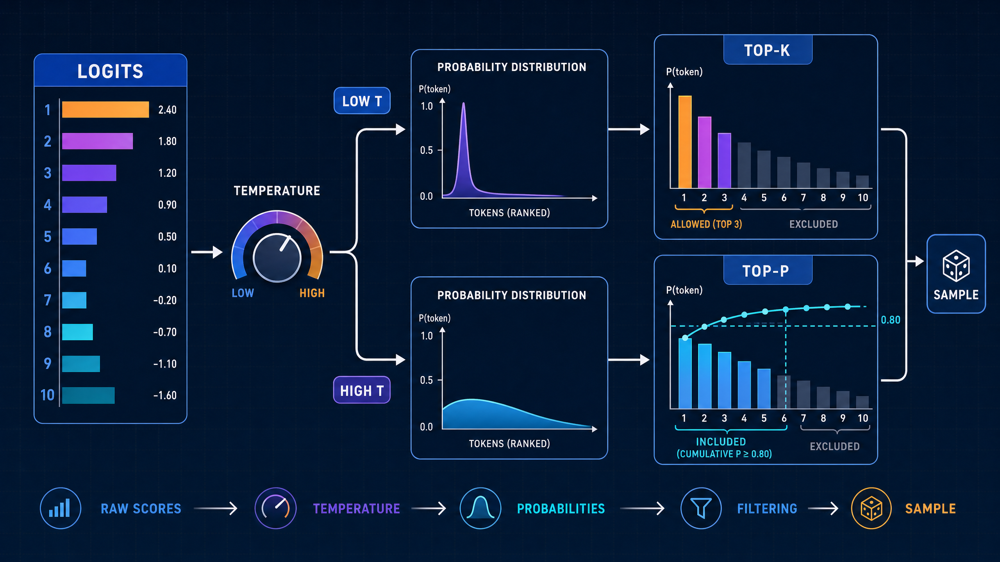
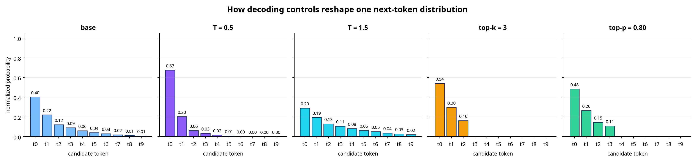
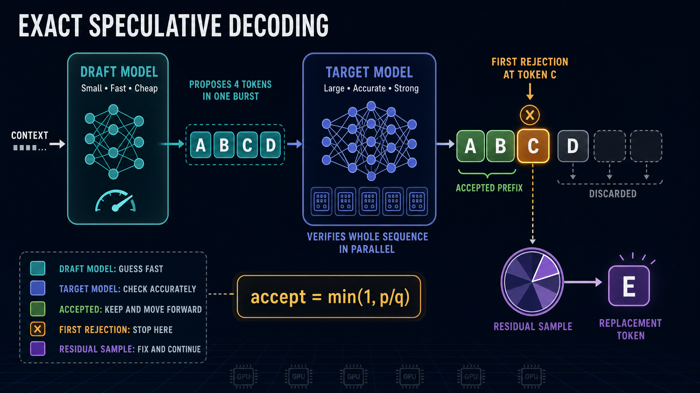
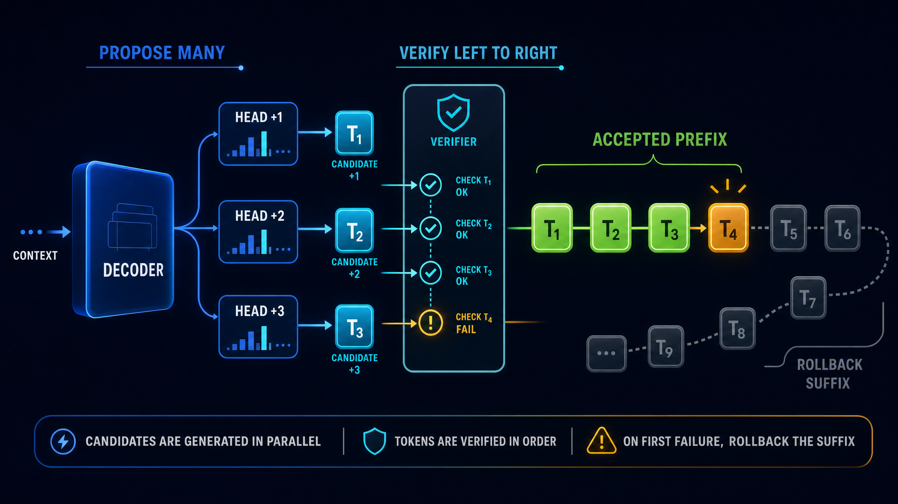
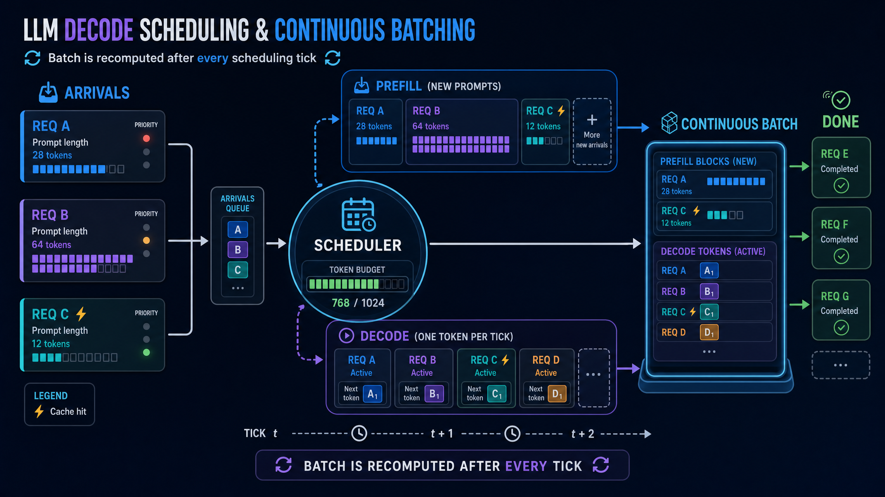
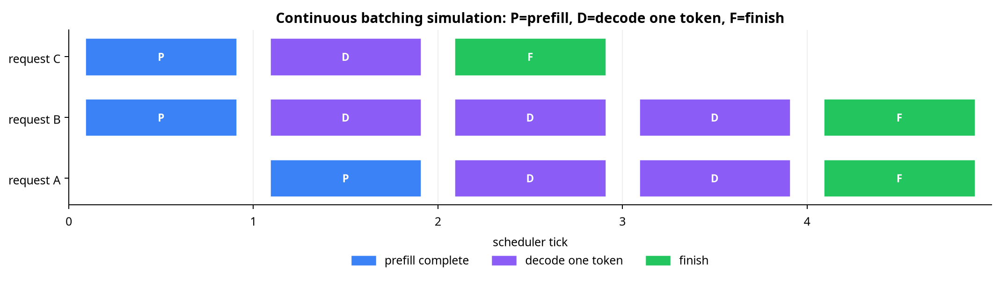

# 从采样到连续批处理：LLM 解码策略、推测解码、多 Token 解码与调度学习笔记

**定位**：这是一份面向 PyTorch 学习者的原创学习笔记。它以“如何把模型的下一个 token 预测，变成可控、可验证、可服务的生成系统”为主线，重新组织并扩展了 DataWhale 社区四篇 Notebook 教程中的问题意识与练习范围，而非逐段复述原教程。[\[1\]](https://github.com/datawhalechina/llm-algo-leetcode#readme) [\[2\]](https://github.com/datawhalechina/llm-algo-leetcode/blob/main/02_PyTorch_Algorithms/21_Decoding_Strategies.ipynb) [\[3\]](https://github.com/datawhalechina/llm-algo-leetcode/blob/main/02_PyTorch_Algorithms/23_Speculative_Decoding.ipynb) [\[4\]](https://github.com/datawhalechina/llm-algo-leetcode/blob/main/02_PyTorch_Algorithms/35_Multi_Token_Decoding.ipynb) [\[5\]](https://github.com/datawhalechina/llm-algo-leetcode/blob/main/02_PyTorch_Algorithms/36_Decode_Scheduling.ipynb)

| 项目 | 内容 |
| --- | --- |
| 原始教程社区 | [DataWhale 社区](https://datawhale.cn/) |
| 项目主页 | [datawhalechina/llm-algo-leetcode](https://github.com/datawhalechina/llm-algo-leetcode) |
| 在线教程 | [llm-algo-leetcode 在线阅读站](https://datawhalechina.github.io/llm-algo-leetcode/) |
| 本文覆盖 | 解码策略、推测解码、多 Token 解码、解码调度 |
| 运行环境 | Python 3.10+、PyTorch 2.1+、Matplotlib 3.7+；所有实验均可在 CPU 上运行 |
| 完整代码 | [`decoding_examples.py`](./decoding_examples.py)；本文的核心实现均有代码块，脚本额外提供可复现绘图入口 |
| 插图 | `assets/01` 至 `assets/04` 为 GPT-Image-2 原创教学图；`assets/05`、`assets/06` 由随附代码精确生成 |

## 0. 先建立一张地图：四个问题，四个层级

自回归语言模型在第 $`t`$ 步产生的是一个词表大小的 logit 向量 $`\mathbf z_t`$，而不是一个确定的词。**解码策略**决定如何从这个向量选出 token；**推测解码**尝试减少昂贵目标模型的顺序调用；**多 Token 解码**将“尽可能多推进几步”显式化为候选、验证和回退；**解码调度**则把视野从单个请求移到整批用户请求，决定 GPU 在每一个时刻运行什么。四篇源教程正好覆盖了这一条从概率控制到服务系统的路径。[\[2\]](https://github.com/datawhalechina/llm-algo-leetcode/blob/main/02_PyTorch_Algorithms/21_Decoding_Strategies.ipynb) [\[3\]](https://github.com/datawhalechina/llm-algo-leetcode/blob/main/02_PyTorch_Algorithms/23_Speculative_Decoding.ipynb) [\[4\]](https://github.com/datawhalechina/llm-algo-leetcode/blob/main/02_PyTorch_Algorithms/35_Multi_Token_Decoding.ipynb) [\[5\]](https://github.com/datawhalechina/llm-algo-leetcode/blob/main/02_PyTorch_Algorithms/36_Decode_Scheduling.ipynb)

| 层级 | 核心问题 | 最关键的约束 | 成功时得到的收益 |
| --- | --- | --- | --- |
| 单步采样 | 这一步从哪些 token 中、以什么随机性选？ | 质量、多样性、可控性 | 输出风格可调，避免低概率长尾干扰 |
| 推测解码 | 能否由轻量模型先猜、重模型一次验证？ | 输出分布必须保持目标模型语义 | 减少目标模型的顺序解码轮数 |
| 多 Token 解码 | 一轮能否接受连续多个候选 token？ | 前缀依赖，首次错误后后缀失效 | 增加每轮的有效推进长度 |
| 连续批调度 | 多请求同时到来，谁先占用一次模型前向？ | TTFT、TPOT、吞吐、公平性、显存 | 将闲置和碎片化调度转为稳定服务能力 |



**贯穿全文的判断标准**：不要只问“每次前向快了多少”，而应问“在既定质量约束下，每次昂贵前向平均推进了多少有效 token，以及这是否改善了用户看到的首 token 延迟（TTFT）和后续 token 间延迟（TPOT）”。

---

## 1. 共同基础：logits、条件概率、Prefill 与 Decode

给定历史 token $`x_{<t}`$，因果语言模型表示一个条件分布：

$$
p_\theta(x_t\mid x_{<t}) = \text{softmax}(\mathbf z_t)_{{x_t}},
\qquad
\text{softmax}(z_i)=\frac{e^{z_i}}{\sum_j e^{z_j}}.
$$

其中 $`\mathbf z_t\in\mathbb R^{|V|}`$ 是 logits；它们可以为任意实数，只有经过 softmax 才成为和为 1 的概率。下面两个阶段常被混淆，但它们的计算形态截然不同。

| 阶段 | 输入 | 计算特征 | 主要指标 | 常见优化 |
| --- | --- | --- | --- | --- |
| **Prefill** | 整段 prompt | 一次处理多 token，矩阵乘更饱和 | Time to First Token（TTFT） | prefix cache、chunked prefill、长上下文优化 |
| **Decode** | 已有 KV cache + 1 个新 token | 每轮通常只新增一个 token，频繁且更受带宽/调度影响 | Time Per Output Token（TPOT） | 采样、推测、多 token、continuous batching |

KV cache 让模型无需从头重算历史注意力，但不消除 **decode 的因果依赖**：第 $`t+1`$ 个 token 通常需要先知道第 $`t`$ 个 token。本文后三章的全部技巧，都是在不违反或不错误近似这个依赖的前提下，减少等待链的有效长度。

---

# 2. 解码策略：把 logits 改造成“可控的抽样空间”

源教程将 temperature、Top-k 与 Top-p 串成一个最小采样流程。[\[2\]](https://github.com/datawhalechina/llm-algo-leetcode/blob/main/02_PyTorch_Algorithms/21_Decoding_Strategies.ipynb) 我建议把它理解为两类不同操作：**温度改变分布形状**，而 **Top-k / Top-p 限制分布支持集**。最后才执行 softmax 重归一化与随机采样。

## 2.1 Temperature：调节“相信第一名”的程度

温度 $`T>0`$ 在 softmax 前缩放 logits：

$$
p_T(i)=\frac{\exp(z_i/T)}{\sum_j\exp(z_j/T)}.
$$

当 $`0<T<1`$ 时，logit 差距被放大，分布更尖锐；$`T>1`$ 时，分布被拉平。在极限意义上，$`T\to0^+`$ 接近贪心选择，但实践中不能直接除以零。温度不会改变 token 的排序；它改变的是不同排名 token 之间的相对概率比。

## 2.2 Top-k 与 Top-p：固定“个数”还是固定“概率质量”

Top-k 保留 logits 最大的 $`k`$ 个 token，其他位置设为 $`-\infty`$。这样 softmax 后被屏蔽位置恰为零概率。Top-p（nucleus sampling）按概率降序累加，只保留使累计质量刚刚达到阈值 $`p`$ 的最短前缀；分布尖锐时保留很少候选，分布平坦时自动保留更多候选。

| 方法 | 约束对象 | 长处 | 常见误区 |
| --- | --- | --- | --- |
| Greedy / argmax | 只取一个最大值 | 可重复、稳定、适合确定性评测 | 容易模式重复，不能表达多解任务 |
| Temperature | 整个分布的锐度 | 连续可调，保留排序 | 不能自行切掉极低概率尾部 |
| Top-k | 候选数 | 计算和行为直观 | 同一 $`k`$ 面对尖锐/平坦分布的意义不同 |
| Top-p | 概率质量 | 支持集自适应 | 必须保留“跨阈值的边界 token”，否则概率质量会不足 |


## 2.3 完整 PyTorch 实现：批量、安全、可组合

下面实现只处理“下一 token”分布，输入形状是 `[..., vocab_size]`，因此既可传单个 `[vocab_size]`，也可传批量 `[batch, vocab_size]`。代码刻意避免原地修改调用者的 tensor，便于调试一个采样管线中每一步的变化。

```python
import torch
import torch.nn.functional as F

def temperature_scale(logits: torch.Tensor, temperature: float) -> torch.Tensor:
    """将形状为 [..., vocab_size] 的 logits 按温度缩放。"""
    if temperature <= 0:
        raise ValueError("temperature must be positive")
    return logits / temperature

def filter_top_k(logits: torch.Tensor, k: int) -> torch.Tensor:
    """每一行只保留最大的 k 个 logit，其余置为 -inf。"""
    vocab_size = logits.size(-1)
    if k <= 0 or k >= vocab_size:
        return logits.clone()

    kept_indices = logits.topk(k, dim=-1).indices
    remove_mask = torch.ones_like(logits, dtype=torch.bool)
    remove_mask.scatter_(-1, kept_indices, False)
    return logits.masked_fill(remove_mask, -torch.inf)

def filter_top_p(
    logits: torch.Tensor,
    p: float,
    min_tokens_to_keep: int = 1,
) -> torch.Tensor:
    """按累计概率做 nucleus filtering，并至少保留指定数量 token。"""
    if not 0 < p <= 1:
        raise ValueError("p must lie in (0, 1]")
    if min_tokens_to_keep < 1:
        raise ValueError("min_tokens_to_keep must be at least 1")
    if p == 1:
        return logits.clone()

    sorted_logits, sorted_indices = logits.sort(dim=-1, descending=True)
    sorted_probs = F.softmax(sorted_logits, dim=-1)
    cumulative_probs = sorted_probs.cumsum(dim=-1)

    sorted_remove = cumulative_probs > p
    # 将 mask 向右移动一位，保留第一个使累计概率超过 p 的边界 token。
    sorted_remove[..., 1:] = sorted_remove[..., :-1].clone()
    sorted_remove[..., 0] = False
    sorted_remove[..., :min_tokens_to_keep] = False

    remove_mask = torch.zeros_like(sorted_remove).scatter(
        dim=-1, index=sorted_indices, src=sorted_remove
    )
    return logits.masked_fill(remove_mask, -torch.inf)

def sample_next_token(
    logits: torch.Tensor,
    *,
    temperature: float = 1.0,
    top_k: int | None = None,
    top_p: float | None = None,
    generator: torch.Generator | None = None,
) -> tuple[torch.Tensor, torch.Tensor]:
    """返回 token id（[batch, 1]）与最终 categorical 概率（[batch, vocab]）。"""
    work = temperature_scale(logits, temperature)
    if top_k is not None:
        work = filter_top_k(work, top_k)
    if top_p is not None:
        work = filter_top_p(work, top_p)

    final_probs = F.softmax(work, dim=-1)
    if not torch.isfinite(final_probs).all() or not torch.allclose(
        final_probs.sum(dim=-1), torch.ones_like(final_probs.sum(dim=-1))
    ):
        raise RuntimeError("filtering produced an invalid categorical distribution")
    token_ids = torch.multinomial(final_probs, num_samples=1, generator=generator)
    return token_ids, final_probs
```

这段实现有五个值得停下来看的细节。第一，`topk(...).indices` 得到的是 **索引**，再用 `scatter_` 构造布尔掩码；这比用“第 k 大阈值”更明确地表示“恰好保留 k 个”，也避免相同 logit 边界时候选数歧义。第二，Top-p 必须先排序才可做 `cumsum`，然后利用原索引 `scatter` 回写到词表原顺序。第三，`-torch.inf` 是正确的屏蔽值，因为 $`\exp(-\infty)=0`$。第四，top-p 的右移非常关键：若不右移，第一个超过 $`p`$ 的 token 也会被删除。第五，采样发生在**筛选后重新归一化**的分布上，`torch.multinomial` 接受的是概率而非 logits。

## 2.4 用精确图表验证直觉

下图不是模型基准，而是对固定十维 logits 的精确重算。它使两个常见误解变得直观：`T=0.5` 并不改变候选集合，却将第一名概率抬升；Top-p 也不等价于“保留 80% 的 token”，而是保留累计概率至少覆盖 0.8 的最短候选前缀。



生成这张图的完整脚本位于 [`decoding_examples.py`](./decoding_examples.py)。最小调用如下；固定随机数生成器可以让实验可复现。

```python
logits = torch.tensor([[2.4, 1.8, 1.2, 0.9, 0.5, 0.1, -0.2, -0.7, -1.1, -1.6]])
generator = torch.Generator().manual_seed(42)
token_ids, final_probs = sample_next_token(
    logits,
    temperature=0.7,
    top_k=5,
    top_p=0.9,
    generator=generator,
)
print(token_ids.item())
print(final_probs)
```

### 2.5 参数不应脱离任务讨论

| 场景 | 起点建议 | 为什么不是固定答案 |
| --- | --- | --- |
| 单元测试、结构化抽取、回归评测 | `temperature≈0` 或 greedy | 重点是可复现性，而非多样性 |
| 代码补全 | 低温度，适度 Top-p | 一处随机语法偏差会向后传播，但仍可能存在合理的多解 |
| 创意改写、头脑风暴 | 中高温度 + Top-p | 需要探索性，但应以 nucleus 截断限制长尾噪声 |
| 生产聊天 | 由产品、拒答策略、工具调用约束共同决定 | “更随机”不等于“更有帮助”；需要离线质量与在线指标一起调参 |

**我的思考**：Temperature、Top-k 与 Top-p 是“最后一公里”的控制器，不是模型能力的替代品。若模型对事实或指令已出现系统性偏差，降低温度只会更稳定地复现偏差；真正的工程流程应先评估模型和上下文质量，再为特定任务选择解码边界。

---

# 3. 推测解码：用接受—拒绝采样守住目标分布

推测解码的正确目标不是“让小模型代替大模型”，而是：**让小模型提出 $`K`$ 个候选，再让目标模型在一次较宽的前向中验证这些位置；在统计意义上，最终输出仍服从目标模型分布。**源教程聚焦于单 token 接受概率与首次拒绝的控制流。[\[3\]](https://github.com/datawhalechina/llm-algo-leetcode/blob/main/02_PyTorch_Algorithms/23_Speculative_Decoding.ipynb)



## 3.1 接受概率来自哪里？

记草稿模型在某一位置的分布为 $`q`$，目标模型分布为 $`p`$，草稿采出的候选 token 为 $`x`$。接受概率定义为：

$$
\alpha(x)=\min\left(1,\frac{p(x)}{q(x)}\right).
$$

当 $`p(x)\ge q(x)`$ 时，目标模型至少和草稿模型一样认可该 token，直接接受；当 $`p(x)<q(x)`$ 时，以 $`p(x)/q(x)`$ 的概率接受。**最关键、也最容易被省略的一步**是：一旦拒绝，不能任意让目标模型再采一个 token，而要从残差分布中采样：

$$
r(y)=\frac{\max(p(y)-q(y),0)}{\sum_v\max(p(v)-q(v),0)}.
$$

这个残差修正补回了草稿分布相对目标分布“欠采样”的那部分质量。只有把“接受规则 + 残差采样 + 首次拒绝停止”组合在一起，才能讨论分布严格等价；只检查 $`p/q`$ 然后直接停止，是很好的控制流练习，却不是完整的无偏采样器。

## 3.2 一轮精确推测解码的完整实现

为把张量形状讲清楚，以下 `draft_probs` 为 `[K, V]`，`target_probs` 为 `[K+1, V]`。目标模型多出的最后一行，服务于“若 K 个草稿均被接受，再额外补一个目标 token”的情形。真实推理中，这些概率来自模型前向与 KV cache；这里直接传入概率表，以便专注验证机制。

```python
from dataclasses import dataclass
from typing import Sequence
import torch

@dataclass(frozen=True)
class SpeculativeResult:
    output_tokens: list[int]
    accepted_prefix_length: int
    rejection_index: int | None
    repair_token: int
    events: list[str]

def normalise_distribution(distribution: torch.Tensor) -> torch.Tensor:
    """检查并规范化一维 categorical 分布。"""
    distribution = distribution.float().clamp_min(0)
    total = distribution.sum()
    if total <= 0:
        raise ValueError("a categorical distribution needs positive mass")
    return distribution / total

def residual_distribution(target: torch.Tensor, draft: torch.Tensor) -> torch.Tensor:
    """返回 max(target - draft, 0) 的归一化残差分布。"""
    target = normalise_distribution(target)
    draft = normalise_distribution(draft)
    residual = (target - draft).clamp_min(0)
    return normalise_distribution(residual) if residual.sum() > 1e-12 else target

def categorical_draw(probabilities: torch.Tensor, generator: torch.Generator) -> int:
    return int(torch.multinomial(normalise_distribution(probabilities), 1, generator=generator).item())

def speculative_round(
    draft_probs: torch.Tensor,
    target_probs: torch.Tensor,
    proposed_tokens: Sequence[int],
    *,
    generator: torch.Generator,
) -> SpeculativeResult:
    """执行一轮精确的 accept-reject speculative decoding。"""
    k = len(proposed_tokens)
    if draft_probs.shape[0] != k or target_probs.shape[0] != k + 1:
        raise ValueError("expected draft [K,V] and target [K+1,V] distributions")

    output, events = [], []
    for index, token_id in enumerate(proposed_tokens):
        q = normalise_distribution(draft_probs[index])
        p = normalise_distribution(target_probs[index])
        alpha = min(1.0, float(p[token_id] / q[token_id]))
        coin = float(torch.rand((), generator=generator))

        if coin <= alpha:
            output.append(int(token_id))
            events.append(f"position {index}: accepted, alpha={alpha:.3f}")
            continue

        replacement = categorical_draw(residual_distribution(p, q), generator)
        output.append(replacement)
        events.append(f"position {index}: rejected; residual sample -> {replacement}")
        return SpeculativeResult(output, index, index, replacement, events)

    extra = categorical_draw(target_probs[k], generator)
    output.append(extra)
    events.append(f"all {k} candidates accepted; extra target sample -> {extra}")
    return SpeculativeResult(output, k, None, extra, events)
```

每一轮验证都必须从左至右看候选。原因不是实现习惯，而是条件概率变了：若第 $`i`$ 个候选被拒绝，则原草稿序列第 $`i+1`$ 个 token 是在错误前缀下提出的，不能继续沿用。`residual_distribution` 使用 `clamp_min(0)` 实现公式中的 $`\max`$，而不是将 $`p-q`$ 直接归一化；后者可能产生负概率。

下面是一个稳定触发“接受第一个、拒绝第二个、残差修复”的玩具示例。它与真实模型质量无关，目的是暴露全部分支。

```python
draft = torch.tensor([
    [0.05, 0.55, 0.20, 0.20],
    [0.15, 0.20, 0.50, 0.15],
])
target = torch.tensor([
    [0.10, 0.60, 0.15, 0.15],
    [0.35, 0.15, 0.20, 0.30],
    [0.15, 0.15, 0.55, 0.15],  # K 个均通过时的 extra token 分布
])

result = speculative_round(
    draft_probs=draft,
    target_probs=target,
    proposed_tokens=[1, 2],
    generator=torch.Generator().manual_seed(42),
)
print(result)
# accepted_prefix_length=1；第二个草稿 token 被拒绝，输出改为从残差分布抽到的 token。
```

## 3.3 速度不是“凭空产生”的：接受率决定上限

若一轮草稿长度为 $`K`$，接受前缀长度为 $`A`$，则本轮至少推进 $`A+1`$ 个最终 token（`+1` 是拒绝时的修复 token，或全接受时的额外目标 token）。理想情况下目标模型一次前向能够同时验证这些位置；但实际加速比还会被草稿模型成本、目标模型批量验证开销、KV cache 读写和服务批处理策略折损。

| 观察量 | 它真正说明什么 | 低时应该先查什么 |
| --- | --- | --- |
| 平均接受长度 $`E[A]`$ | 草稿和目标在真实 prompt 分布上的一致程度 | 草稿模型是否过弱、采样参数是否不一致、候选 $`K`$ 是否过长 |
| 目标模型每步验证开销 | 能否把宽验证转化为较少的顺序轮数 | 硬件批处理效率、KV cache、算子实现 |
| 端到端 TPOT | 用户真正感受到的后续生成速度 | 草稿开销、调度等待、网络流式输出 |
| 质量等价性 | 是否保留目标模型分布 | 是否遗漏残差采样、是否在不一致的采样分布上比较 $`p`$ 与 $`q`$ |

**我的思考**：推测解码的核心 KPI 不是“草稿模型有多小”，而是“草稿模型以多低成本换来多长的可接受前缀”。一个稍大的草稿模型若显著提高接受率，完全可能优于极小但经常首 token 就被拒绝的草稿模型。因此，应在真实工作负载上联合扫 `K`、草稿规模、temperature / top-p 与批大小，而不是单独优化任一指标。

---

# 4. 多 Token 解码：候选可以并行，接受必须尊重前缀

多 Token 解码强调在一次解码轮内**提出多个未来位置的候选**，尽可能把连续通过验证的前缀写入输出。它与推测解码共享“提议—验证—回退”的运行时形态，但两者不是同义词：候选可能来自一个独立草稿模型、同一主干上的附加预测头，或其他 lookahead 结构。源教程用一个简化模拟器把候选截取、逐项验证、首次拒绝和后缀回退清楚拆开。[\[4\]](https://github.com/datawhalechina/llm-algo-leetcode/blob/main/02_PyTorch_Algorithms/35_Multi_Token_Decoding.ipynb)



## 4.1 一个必须分清的边界

下面的 `LookaheadVerifier` 用概率比阈值演示系统控制流。它**不是**第 3 章的精确接受—拒绝采样器，因而不保证输出分布严格等价于目标模型。这样的近似在教学和工程原型中很有价值，因为它让人看清“错误从哪里开始、哪些缓存或候选必须回滚”；但若任务要求严格保持目标模型采样分布，应采用上一章的残差校正逻辑或与具体方法相匹配的证明与验证规则。

| 概念 | 推测解码 | 本节的多 Token 观察器 |
| --- | --- | --- |
| 候选来源 | 常见为独立草稿模型 | 可来自草稿模型或同主干的多个预测头 |
| 接受规则 | $`\min(1,p/q)`$ + 残差采样，可分布等价 | 概率比阈值，仅用于解释性模拟 |
| 首次拒绝后 | 停止当前草稿后缀并执行修复采样 | 标出回退后缀，交回后续生成路径 |
| 关注点 | 无偏采样与速度 | 多步提议、前缀依赖、rollback 的系统语义 |

## 4.2 可解释模拟器：提议、验证与回退

```python
from dataclasses import dataclass
from typing import Sequence
import torch

@dataclass(frozen=True)
class LookaheadRound:
    proposed: list[int]
    accepted_prefix: list[int]
    first_rejected_at: int | None
    rollback_suffix: list[int]

class LookaheadVerifier:
    """用于展示 multi-token 控制流的教学模拟器，而非精确采样器。"""

    def __init__(self, max_lookahead: int = 4, min_probability_ratio: float = 0.70):
        if max_lookahead < 1:
            raise ValueError("max_lookahead must be positive")
        if not 0 < min_probability_ratio <= 1:
            raise ValueError("min_probability_ratio must lie in (0, 1]")
        self.max_lookahead = max_lookahead
        self.min_probability_ratio = min_probability_ratio

    def propose(self, candidates: Sequence[int]) -> list[int]:
        return list(candidates[: self.max_lookahead])

    def verify_prefix(
        self,
        draft_probs: torch.Tensor,
        target_probs: torch.Tensor,
        candidates: Sequence[int],
    ) -> LookaheadRound:
        proposed = self.propose(candidates)
        accepted = []

        for position, token_id in enumerate(proposed):
            q = float(normalise_distribution(draft_probs[position])[token_id])
            p = float(normalise_distribution(target_probs[position])[token_id])
            if q == 0 or p / q >= self.min_probability_ratio:
                accepted.append(int(token_id))
            else:
                return LookaheadRound(
                    proposed=proposed,
                    accepted_prefix=accepted,
                    first_rejected_at=position,
                    rollback_suffix=proposed[position:],
                )
        return LookaheadRound(proposed, accepted, None, [])
```

这里的 `propose` 只截取前 `max_lookahead` 个候选，使候选长度成为一个显式可调变量。`verify_prefix` 永远按位置顺序检查；一旦失败，`rollback_suffix` 从失败 token 本身开始，而不是从下一个 token 开始，因为失败 token 也未写入最终序列。`q == 0` 的分支避免除零，并将“草稿从未赋予质量、目标却有正质量”的边界情况单独暴露出来。

```python
verifier = LookaheadVerifier(max_lookahead=3, min_probability_ratio=0.75)
draft = torch.tensor([
    [0.1, 0.5, 0.2, 0.2],
    [0.1, 0.1, 0.6, 0.2],
    [0.1, 0.2, 0.2, 0.5],
])
target = torch.tensor([
    [0.1, 0.45, 0.25, 0.2],
    [0.1, 0.1, 0.55, 0.25],
    [0.4, 0.2, 0.2, 0.2],
])
round_info = verifier.verify_prefix(draft, target, candidates=[1, 2, 3, 0])
print(round_info)
# proposed=[1, 2, 3]；接受 [1, 2]；位置 2 首次拒绝；rollback_suffix=[3]。
```

## 4.3 训练端与推理端必须协同设计

多 Token 的收益并非只由推理端决定。若模型的 $`+2`$、$`+3`$ 位置预测头缺少足够准确的训练信号，候选长度加大反而会放大回滚。因此，训练目标、候选深度、验证规则、KV cache 写入与回滚策略应共同评估。

| 决策 | 太激进的后果 | 太保守的后果 | 更稳妥的做法 |
| --- | --- | --- | --- |
| Lookahead 长度 | 首次拒绝更早，计算和 cache 回滚浪费 | 每轮只多推进很少 token | 按任务和模型版本记录接受长度分布后调参 |
| 接受阈值 | 宽松时可能影响输出质量或偏离目标分布 | 严格时加速空间消失 | 明确质量约束；严格等价场景使用精确校正 |
| 预测头训练权重 | 过强可能损害主任务表征 | 过弱导致远期候选无用 | 报告主任务质量与每个 horizon 的准确性 |
| Cache 回滚实现 | 逻辑错误会污染后续前缀 | 过度复制会损失性能 | 将“已接受长度”作为唯一 commit 边界 |

**我的思考**：多 Token 解码暴露了一个更一般的系统原则：**并行地产生猜测很容易，安全地提交猜测很难。**真正的提交单位不是“本轮生成了多少 token”，而是“验证后有多少前缀 token 可以不可逆地写入状态”。这个原则同样适用于 KV cache、工具调用草稿、甚至多阶段 agent 工作流。

---

# 5. 解码调度：从单请求优化走向连续批处理

当服务同时处理多个用户请求时，系统同时面对刚到达的长 prompt、已经 prefill 完成的短 decode、cache 命中请求和不同业务优先级。源教程的调度器以请求状态、排序键、单步状态推进和循环运行构成了一个可运行最小闭环。[\[5\]](https://github.com/datawhalechina/llm-algo-leetcode/blob/main/02_PyTorch_Algorithms/36_Decode_Scheduling.ipynb)



## 5.1 不要只用 FIFO 想象推理服务

连续批处理（continuous batching）的关键不在“把所有请求凑成一个永不变化的大 batch”，而在每次模型前向后重新检查：谁结束了、谁进入 decode、谁刚到达、当前 token / KV cache 预算还能容纳谁。下表给出一个透明但简化的优先级框架。

$$
\text{rank}(r)=(\text{phase},\ \text{cache},\ -[\text{priority}+\text{aging}],\ \text{prompt\_tokens},\ \text{id}).
$$

排序元组越小越优先。这里将 decode 排在 prefill 前，以降低活跃流式请求的 TPOT；cache hit 获得优先权；`aging` 防止低优先级请求无限饥饿。不同产品可改变该策略，但必须明确自己交换了什么。

## 5.2 轻量但完整的连续批调度模拟器

下面的代码以两个预算表达服务约束：`max_batch_size` 限制一次前向可携带的请求数，`prefill_token_budget` 限制新 prompt 可占用的 token 量。为避免把 prompt 长度误当成生成目标，`max_new_tokens` 被独立保存。

```python
from dataclasses import dataclass
from typing import Literal

Phase = Literal["prefill", "decode", "finished"]

@dataclass
class Request:
    request_id: str
    prompt_tokens: int
    max_new_tokens: int
    priority: int = 0
    cache_hit: bool = False
    arrival_tick: int = 0
    phase: Phase = "prefill"
    generated_tokens: int = 0
    first_scheduled_tick: int | None = None

    @property
    def done(self) -> bool:
        return self.generated_tokens >= self.max_new_tokens

    @property
    def waiting_ticks(self) -> int:
        return getattr(self, "_waiting_ticks", 0)

@dataclass(frozen=True)
class ScheduleEvent:
    tick: int
    request_id: str
    phase: str
    action: str
    generated_tokens: int

class ContinuousBatchScheduler:
    """可检查的 continuous-batching 教学模拟器。"""

    def __init__(self, max_batch_size: int = 3, prefill_token_budget: int = 12):
        self.max_batch_size = max_batch_size
        self.prefill_token_budget = prefill_token_budget
        self.requests: list[Request] = []
        self.timeline: list[ScheduleEvent] = []
        self.tick = 0

    def submit(
        self,
        request_id: str,
        prompt_tokens: int,
        max_new_tokens: int,
        *,
        priority: int = 0,
        cache_hit: bool = False,
    ) -> None:
        if prompt_tokens < 1 or max_new_tokens < 1:
            raise ValueError("prompt_tokens and max_new_tokens must both be positive")
        self.requests.append(Request(
            request_id=request_id,
            prompt_tokens=prompt_tokens,
            max_new_tokens=max_new_tokens,
            priority=priority,
            cache_hit=cache_hit,
            arrival_tick=self.tick,
        ))

    def _rank(self, request: Request) -> tuple[int, int, int, int, str]:
        """较小 rank 优先；decode 优先以保护活跃流式请求。"""
        phase_rank = 0 if request.phase == "decode" else 1
        cache_rank = 0 if request.cache_hit else 1
        aging_bonus = request.waiting_ticks // 3
        return (
            phase_rank,
            cache_rank,
            -(request.priority + aging_bonus),
            request.prompt_tokens,
            request.request_id,
        )

    def pick_batch(self) -> list[Request]:
        active = [r for r in self.requests if r.phase != "finished"]
        for request in active:
            request._waiting_ticks = self.tick - request.arrival_tick

        decode_candidates = sorted(
            (r for r in active if r.phase == "decode"), key=self._rank
        )
        selected = decode_candidates[: self.max_batch_size]

        remaining_slots = self.max_batch_size - len(selected)
        used_prefill_tokens = 0
        prefill_candidates = sorted(
            (r for r in active if r.phase == "prefill"), key=self._rank
        )
        for request in prefill_candidates:
            if remaining_slots == 0:
                break
            effective_cost = 1 if request.cache_hit else request.prompt_tokens
            if used_prefill_tokens + effective_cost > self.prefill_token_budget:
                continue
            selected.append(request)
            used_prefill_tokens += effective_cost
            remaining_slots -= 1
        return selected

    def execute_tick(self) -> list[ScheduleEvent]:
        batch = self.pick_batch()
        if not batch:
            return []

        events = []
        for request in batch:
            if request.first_scheduled_tick is None:
                request.first_scheduled_tick = self.tick

            if request.phase == "prefill":
                request.phase = "decode"
                action = "prefill_complete"
            else:
                request.generated_tokens += 1
                if request.done:
                    request.phase = "finished"
                    action = "finish"
                else:
                    action = "decode_one_token"

            events.append(ScheduleEvent(
                tick=self.tick,
                request_id=request.request_id,
                phase=request.phase,
                action=action,
                generated_tokens=request.generated_tokens,
            ))
        self.timeline.extend(events)
        self.tick += 1
        return events

    def run(self, max_ticks: int = 50) -> list[ScheduleEvent]:
        while self.tick < max_ticks and any(not r.done for r in self.requests):
            self.execute_tick()
        return self.timeline
```

这里的 `pick_batch` 特意先抽取 active decode，再用剩余槽位安排 prefill。它体现的是一个用户体验优先的策略：已经开始流式返回的请求不应因新 prompt 到达而频繁停顿。`effective_cost = 1 if cache_hit else prompt_tokens` 并非真实 KV cache 成本模型，而是将“缓存命中更便宜”的判断显式放进可观察的调度决策中。

## 5.3 跑一个固定工作负载，并读懂时间线

```python
scheduler = ContinuousBatchScheduler(max_batch_size=3, prefill_token_budget=10)
scheduler.submit("A", prompt_tokens=7, max_new_tokens=3, priority=2, cache_hit=False)
scheduler.submit("B", prompt_tokens=3, max_new_tokens=4, priority=1, cache_hit=True)
scheduler.submit("C", prompt_tokens=5, max_new_tokens=2, priority=3, cache_hit=False)
events = scheduler.run()
for event in events:
    print(event)
```

随附脚本把事件画为下图。蓝色 `P` 表示 prefill 完成并入 decode，紫色 `D` 表示生成一个 token，绿色 `F` 表示请求结束。注意它不是一个“先 A 完成、再 B、再 C”的串行过程：B 和 C 在 `tick=0` 同时 prefill，A 在下一 tick 加入，然后三条请求随着 batch 空间和状态变化交错推进。



## 5.4 真正的服务系统还需要什么？

这个模拟器故意省略了模型前向与分页 KV cache，以使调度规则可读。将它扩展到生产系统时，至少还应将以下因素纳入状态和指标，而不应把这个教学代码直接当作线上实现。

| 缺失能力 | 为什么重要 | 一种扩展方向 |
| --- | --- | --- |
| KV cache 块分配与释放 | 长请求可能占满显存，且回收必须安全 | block manager、paged KV、抢占 / swap 策略 |
| Token-level 预算 | decode 与 prefill 的每个 token 成本差异巨大 | 使用 `num_batched_tokens` 而非仅按请求个数限额 |
| 到达过程与截止时间 | 静态队列掩盖了真实到达、取消和超时 | 在每个 tick 注入新请求并记录排队时间分位数 |
| 公平性 | decode-first 可能让超长 prefill 饥饿 | aging、配额、多队列或 SLO 感知策略 |
| Prefix / cache 感知 | 复用同前缀请求可显著改变成本 | 以共享前缀长度、cache residency 加入 rank |
| 可观测性 | 只看吞吐会掩盖尾延迟恶化 | 同时记录 TTFT、TPOT、P95 / P99、拒绝率、显存水位 |

**我的思考**：调度是所有单请求加速的“乘数”。推测解码提高一个请求的平均推进长度，多 Token 解码降低有效 decode 轮数；但如果 scheduler 让已激活请求在队列里等待，这些局部收益会被排队延迟吞没。因此，性能实验必须同时报告单请求 token 速率与多请求到达下的端到端延迟分布。

---

# 6. 把四章连起来：选择策略而不是堆叠术语

| 你的主要目标 | 第一优先级 | 可叠加手段 | 必须监控的风险 |
| --- | --- | --- | --- |
| 控制输出稳定性与多样性 | temperature、Top-p / Top-k | deterministic seed、结构化约束 | 长尾 token、重复、质量回归 |
| 降低单请求 decode 开销 | 推测解码 | 更好的草稿模型、合适的候选长度 | 接受率低、修正逻辑不完整、草稿成本 |
| 尽量一次推进多个 token | 多 Token 预测 / lookahead | 严格验证、可回滚 cache | 远期预测变差、后缀污染、质量偏差 |
| 提升多请求吞吐与尾延迟 | continuous batching | cache-aware、token budget、aging | 饥饿、TTFT/TPOT 失衡、KV cache OOM |

一个容易犯的错误是把所有方法都理解成“每秒 token 更高”。更完整的观点是：采样策略在**选择质量—多样性边界**；推测与多 token 在**压缩因果等待链**；调度在**分配共享硬件时间和缓存空间**。它们处在不同层级，指标也不同，应该在同一真实工作负载中联动而非孤立评估。

## 6.1 实战自检清单

在把任一方法接入真实推理系统前，可以用下面的顺序自检。它不是待办清单，而是一条因果链：先保证分布与语义，再确认局部性能，最后验证多租户体验。

1. **先定义质量契约。** 是否需要完全确定性？是否必须严格保持目标模型采样分布？是否允许近似候选验证？
2. **再固定采样配置。** 草稿与目标若在不同 temperature 或过滤后的分布上比较，`p/q` 的语义将被破坏。
3. **记录接受前缀长度，而非只看最大候选长度。** 后者代表潜在收益，前者才代表实际提交的进度。
4. **把缓存提交边界锁定在 accepted prefix。** 任何被拒绝 token 和其后缀都不应永久污染后续状态。
5. **在到达负载下测 TTFT、TPOT 和尾延迟。** 单请求 benchmark 很容易高估调度收益。
6. **为饥饿与 OOM 设置显式保护。** 这两类错误不是参数微调能自然解决的，而是状态机和预算机制要处理的安全条件。

---

# 7. 延伸练习：从“读懂”到“验证”

| 练习 | 验收条件 | 提示 |
| --- | --- | --- |
| 采样器单元测试 | 对随机 `[B,V]` logits，验证筛选后概率和为 1，Top-k 的非零 token 数不超过 k | 测 `k=1`、`k>=V`、`p=1` 和极端温度 |
| Top-p 边界实验 | 构造累计概率恰好等于 p 的例子 | 解释为何要保留边界 token，并比较右移与未右移掩码 |
| 推测解码蒙特卡洛验证 | 重复运行 toy distribution，比较输出频率与 target distribution | 分别运行“有残差修正”和“没有残差修正”，观察偏差 |
| 候选长度扫描 | 对不同 K 统计平均 accepted prefix length | 报告 $`E[A]`$、总草稿开销和端到端时间，而不是只报告 K |
| 调度策略比较 | 实现 FIFO、decode-first 与 aging 三种 rank | 在相同到达序列上比较平均 / P95 TTFT 和 TPOT |

---

# 8. 代码、图片与版权说明

本文的实现是为本学习笔记重新编写的教学代码，并非源 Notebook 的逐行复制。完整、可运行的原始代码文件见 [`decoding_examples.py`](./decoding_examples.py)；运行以下命令会生成文中的两张精确数值图。

```bash
python3 decoding_examples.py
```

四张概念图通过 GPT-Image-2 为本文原创生成，文件位于 `assets/01_sampling_control.png` 至 `assets/04_continuous_batching.png`。两张数据图由 `decoding_examples.py` 中的 Matplotlib 函数生成，分别位于 `assets/05_sampling_probability_comparison.png` 和 `assets/06_scheduler_timeline.png`。

**对 DataWhale 的致谢与许可提醒**：本文学习路径、主题选择和引用来源来自 DataWhale 社区的 `llm-algo-leetcode`。该仓库说明其 Notebook 中的文字、公式与图示说明采用 **CC BY 4.0**，代码单元采用 **Apache-2.0**；若继续转载、改编或将本文与源教程内容混合发布，请按对应内容类型保留署名并遵守原许可。[\[1\]](https://github.com/datawhalechina/llm-algo-leetcode#readme)

---

# 参考资料

[\[1\]](https://github.com/datawhalechina/llm-algo-leetcode#readme) [DataWhale 社区：llm-algo-leetcode 项目说明、在线阅读与混合内容许可](https://github.com/datawhalechina/llm-algo-leetcode#readme)

[\[2\]](https://github.com/datawhalechina/llm-algo-leetcode/blob/main/02_PyTorch_Algorithms/21_Decoding_Strategies.ipynb) [DataWhale：21. Decoding Strategies | 解码策略](https://github.com/datawhalechina/llm-algo-leetcode/blob/main/02_PyTorch_Algorithms/21_Decoding_Strategies.ipynb)

[\[3\]](https://github.com/datawhalechina/llm-algo-leetcode/blob/main/02_PyTorch_Algorithms/23_Speculative_Decoding.ipynb) [DataWhale：23. Speculative Decoding | 投机解码](https://github.com/datawhalechina/llm-algo-leetcode/blob/main/02_PyTorch_Algorithms/23_Speculative_Decoding.ipynb)

[\[4\]](https://github.com/datawhalechina/llm-algo-leetcode/blob/main/02_PyTorch_Algorithms/35_Multi_Token_Decoding.ipynb) [DataWhale：35. Multi-Token Decoding | 多 Token 解码](https://github.com/datawhalechina/llm-algo-leetcode/blob/main/02_PyTorch_Algorithms/35_Multi_Token_Decoding.ipynb)

[\[5\]](https://github.com/datawhalechina/llm-algo-leetcode/blob/main/02_PyTorch_Algorithms/36_Decode_Scheduling.ipynb) [DataWhale：36. Decode Scheduling | 解码调度](https://github.com/datawhalechina/llm-algo-leetcode/blob/main/02_PyTorch_Algorithms/36_Decode_Scheduling.ipynb)

[\[6\]](https://datawhalechina.github.io/llm-algo-leetcode/) [DataWhale：llm-algo-leetcode 在线教程](https://datawhalechina.github.io/llm-algo-leetcode/)
