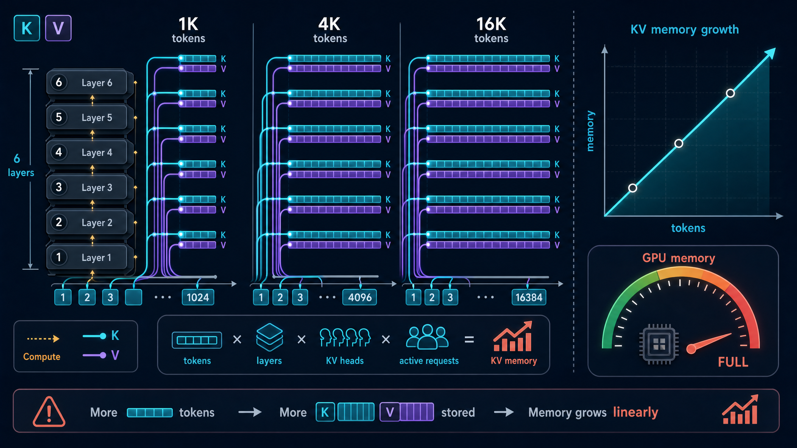
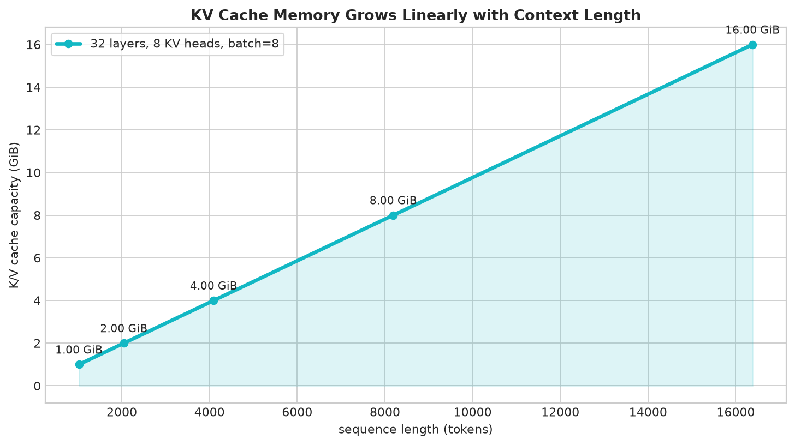
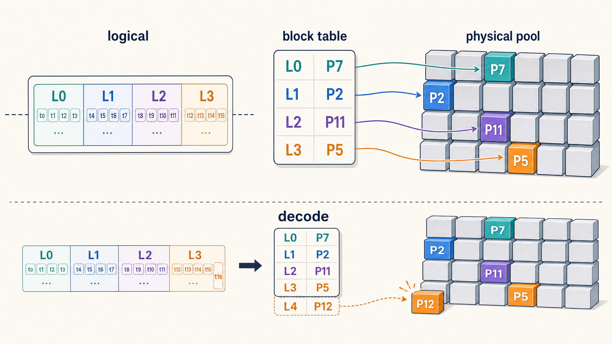
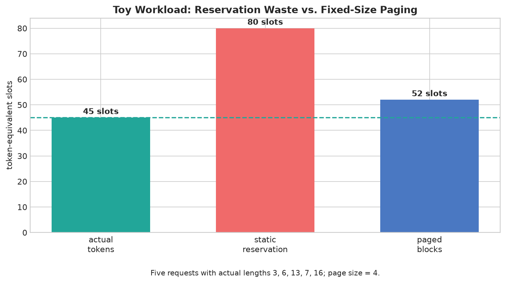
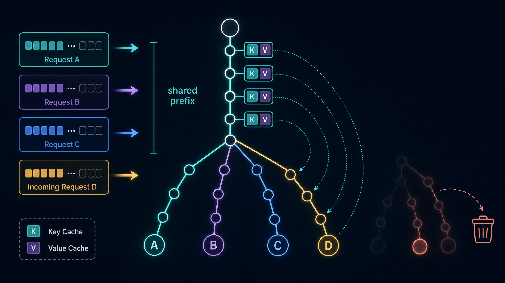
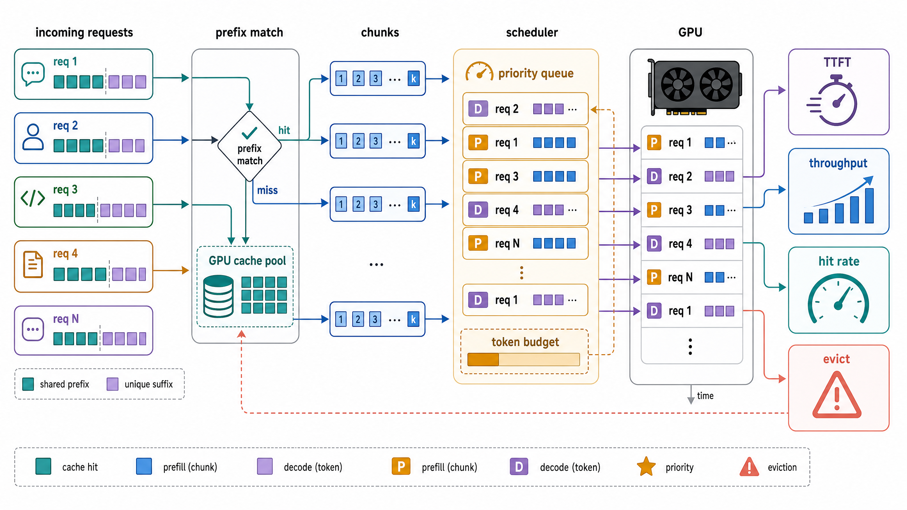
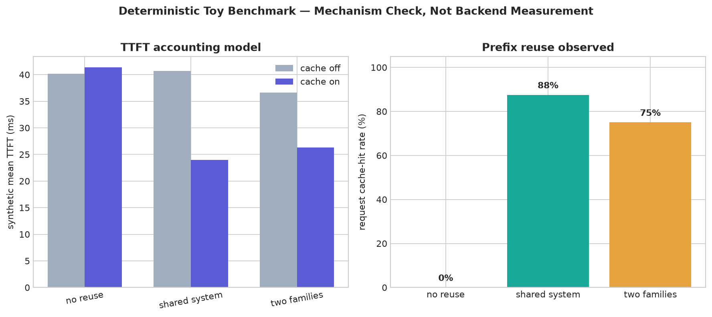

# 从“存得下”到“复用好”：KV Cache、PagedAttention、RadixAttention 与推理调度学习笔记

> **定位。** 本文是一份面向 LLM 推理工程学习者的原创学习笔记。它以“有限的 GPU KV Cache 应如何被**计量、分页、共享、调度与验证**”为主线，重新组织并扩展 DataWhale 社区六份 Notebook 的问题意识与练习范围，而非逐段复述原教程。文中的 Python 实验代码均为重新编写的教学实现；图 1–4 为 GPT-Image-2 原创概念图，图 5–7 则由随附脚本精确绘制。[1] [2] [3] [4] [5] [6]

| 项目 | 内容 |
| --- | --- |
| 原始教程社区 | [DataWhale 社区](https://datawhale.cn/) |
| 项目主页 | [datawhalechina/llm-algo-leetcode](https://github.com/datawhalechina/llm-algo-leetcode) |
| 在线阅读站 | [llm-algo-leetcode 在线教程](https://datawhalechina.github.io/llm-algo-leetcode/) |
| 本文覆盖 | KV Cache 增长、PagedAttention、RadixAttention、前缀缓存与分块 Prefill、KV Cache 调度、缓存基准 |
| 运行环境 | Python 3.10+、Matplotlib 3.7+；**CPU 即可运行** |
| 完整代码 | [`kv_cache_lab.py`](./kv_cache_lab.py)；运行后会执行断言并生成图 5–7 |
| 图像资源 | `assets/01`–`04` 为 GPT-Image-2 原创教学图；`assets/05`–`07` 由代码以确定性数据生成 |
| 关键边界 | 本文的容量计算与玩具基准用于解释机制；它们**不是** vLLM/SGLang 的后端性能复现实验 |

---

## 0. 先建立系统地图：KV Cache 不只是一个 Tensor

自回归模型在第 $t$ 步要让当前 Query 与全部历史 Key/Value 发生注意力计算。若每一步都重算历史 token 的 K/V 投影，计算会随生成过程反复发生；因此推理系统会把已完成 token 的 K/V 状态保存在 GPU 上，并让下一个 token 直接读取它们。这就是 **KV Cache** 的直接价值，也是长上下文、并发服务和前缀复用问题的共同起点。[1]

但“已经有 KV Cache”并不意味着系统问题自动消失。缓存首先会因序列长度、并发请求数和模型结构而增长；随后会面临物理显存如何碎片化分配、不同请求能否共享相同前缀、哪些条目值得驻留、以及某项优化是否真的改善 TTFT 的问题。下表给出本文的五层视角。

| 层级 | 要解决的核心问题 | 代表机制 | 读者应观察的量 |
| --- | --- | --- | --- |
| 容量账本 | 一段上下文究竟要多少显存？ | KV Cache 字节公式、MHA/GQA/MQA | bytes/token、最大并发、内存水位 |
| 物理布局 | 长短不一的请求怎样避免大块预留？ | PagedAttention、逻辑块与物理块表 | 块利用率、分配失败、尾块浪费 |
| 跨请求共享 | 相同 prompt 为什么还要重复 prefill？ | Radix tree、最长前缀匹配 | 命中长度、重算 suffix、共享块数 |
| 执行节奏 | 长 prompt 会不会挤压活跃流式请求？ | Chunked Prefill、连续批处理 | TTFT、TPOT、token 预算 |
| 驻留决策 | 显存有限时，谁留下、谁被驱逐？ | cache-aware scheduling、LRU/LFU/价值评分 | 命中率、驱逐率、尾延迟、公平性 |



**贯穿全文的判断标准**是：不要把“缓存命中率更高”或“每步前向更快”当成最终结论。一个可部署的推理优化需要同时回答四件事：是否减少了真实的重算 token，是否控制了缓存容量，是否改善用户可感知的首 token / 后续 token 延迟，以及是否在真实请求分布上仍然公平而稳定。

---

## 1. 从字节开始：KV Cache 为什么会线性增长？

### 1.1 一条必须会算的公式

设解码器模型有 $L$ 层、批内有 $B$ 条独立序列、每层有 $H_{kv}$ 个 KV head、每个 head 的维度是 $D$，数据类型每个元素占 $s$ 字节，当前每条序列缓存了 $S$ 个 token。忽略张量对齐、元数据和框架额外开销时，常规 K/V 缓存的容量近似为：

$$
M_{KV} = 2 \times L \times B \times H_{kv} \times D \times S \times s \quad \text{bytes}.
$$

其中的 $2$ 对应 Key 与 Value 两个张量。注意公式使用的是 **KV head 数**，而不是 Query head 数：这正是 GQA/MQA 能直接降低缓存体积的原因。[1]

| 变量 | 工程含义 | 增大一倍的直接后果 |
| --- | --- | --- |
| $S$ | 已处理的上下文 token 数 | 单请求 KV Cache 近似翻倍 |
| $B$ | 同时驻留的独立序列数 | 服务总 KV Cache 近似翻倍 |
| $L$ | Transformer 层数 | 每一层都要多存一份 K/V |
| $H_{kv}$ | Key/Value 头数 | 每 token 的缓存宽度按比例增大 |
| $D$ | 每头维度 | 每个 K/V 向量变宽 |
| $s$ | 数值精度的字节数 | FP32 相对 FP16/BF16 约翻倍 |

例如，令 $L=32$、$H_{kv}=8$、$D=128$、FP16/BF16（$s=2$ bytes）、批大小 $B=8$。此时上下文从 1,024 扩展到 16,384 token，KV Cache 从 **1 GiB** 线性增加到 **16 GiB**。这不是模型参数大小，而是运行时为历史状态支付的显存租金。



### 1.2 MHA、GQA、MQA：谁在改“每个 token 的缓存宽度”？

如果 Query head 的总数为 $H_q$，则经典 MHA 通常令 $H_{kv}=H_q$；GQA 将多个 Query head 归到一组而共享 K/V；MQA 则让全部 Query head 共用很少的 K/V head。它们会影响 attention 的表示方式，但从**缓存账本**看，最直接的杠杆就是 $H_{kv}$。[1]

| 注意力形式 | 常见关系 | 相对 MHA 的理论 KV 容量 | 直觉 |
| --- | --- | ---: | --- |
| MHA | $H_{kv}=H_q$ | $1\times$ | 每个 Query head 对应一组 K/V |
| GQA | $1 < H_{kv} < H_q$ | $H_{kv}/H_q$ | 以组为单位共享 K/V，折中表达与容量 |
| MQA | $H_{kv}$ 很小，极端时为 1 | $1/H_q$ | 最大程度共享 K/V |

> **一个常被混淆的边界：** GQA/MQA 是“让每 token 的 K/V 表示变窄”；PagedAttention 是“把既有 K/V 表示如何放进显存、如何按需寻址”的机制。前者直接缩小容量公式，后者主要降低碎片与预留浪费；二者可以叠加。[1] [9]

### 1.3 可运行代码：把容量估算写成可审计函数

下面的代码将公式封装为纯函数。重点不是调用本身，而是让每一个尺寸假设都显式出现，从而避免将 `num_attention_heads` 误当作 `num_key_value_heads`。

```python
from dataclasses import dataclass

@dataclass(frozen=True)
class ModelShape:
    layers: int
    kv_heads: int
    head_dim: int
    dtype_bytes: int = 2  # FP16/BF16


def kv_cache_bytes(
    shape: ModelShape,
    sequence_tokens: int,
    batch_size: int = 1,
) -> int:
    """返回独立 K、V 张量的近似总字节数。"""
    if sequence_tokens < 0 or batch_size < 1:
        raise ValueError("sequence_tokens must be non-negative and batch_size positive")
    return (
        2
        * shape.layers
        * batch_size
        * shape.kv_heads
        * shape.head_dim
        * sequence_tokens
        * shape.dtype_bytes
    )


def gibibytes(byte_count: int) -> float:
    return byte_count / (1024 ** 3)


shape = ModelShape(layers=32, kv_heads=8, head_dim=128, dtype_bytes=2)
for tokens in (1024, 2048, 4096, 8192, 16384):
    print(tokens, f"{gibibytes(kv_cache_bytes(shape, tokens, batch_size=8)):.2f} GiB")
```

`ModelShape` 把模型恒定参数冻结，避免在不同测算中漏传精度或 head 数。`kv_cache_bytes` 只负责字节账本，因此不应偷偷混入 allocator 对齐、块表、CUDA workspace 等值；要加入这些额外成本，应在调用端明确建立第二层模型。随附脚本的 `capacity_rows` 与 `plot_memory_growth` 正是基于这一原则生成图 5。

---

## 2. PagedAttention：将“连续逻辑序列”与“连续物理内存”解耦

### 2.1 从预留浪费到块表寻址

静态推理思路常为每个请求按最大可能长度预留一段连续 KV 空间。在线服务中这会很快变得不现实：请求会在不同时间到达、生成不同长度、结束后留下不可用洞；如果为不确定的未来一次性预留足够空间，则大量容量停留在未使用状态。vLLM 的 PagedAttention 以操作系统的分页思想管理 K/V：**逻辑上连续的 token 块，可以映射到物理池中不连续的固定大小 block。**[2] [9]



对于块大小 $P$，长度为 $S$ 的请求需要的块数是：

$$
N_{blocks} = \left\lceil \frac{S}{P} \right\rceil.
$$

Prefill 时一次性申请这些块；Decode 每生成一个 token 只更新长度，并且**仅在新 token 跨过块边界时**追加一个物理块。一次注意力读取时，内核可根据块表把逻辑块号转换为物理块号，再访问相应的 K/V 数据。vLLM 的官方设计文档特别指出，这里的 KV block 概念与 CUDA thread block 不同；前者是缓存分配单位，后者是 GPU 线程执行单位。[10]

| 对象 | 它是什么 | 它不是什么 |
| --- | --- | --- |
| logical block | 一条请求逻辑 token 序列中的第 $i$ 段 | 固定物理地址 |
| physical block | 共享 GPU KV 池中的一个可分配单元 | 某一请求永久独占的连续区间 |
| block table | `logical_block_id → physical_block_id` 映射 | K/V 数值本身 |
| tail block | 一个请求最后未填满的块 | 跨请求任意拼接的碎片 |

### 2.2 可运行代码：最小分页 KV 池

下面的实现刻意只模拟**控制面**：块如何分配、何时增长、如何从逻辑位置得到物理位置，以及请求结束怎样归还块。它不替代 CUDA PagedAttention kernel，也不计算真实 attention；把这两层分开，才能更清楚地定位 bug 属于内存管理还是数值计算。

```python
from collections import deque
from dataclasses import dataclass, field
from math import ceil

@dataclass
class PagedRequest:
    request_id: str
    token_count: int
    block_table: list[int] = field(default_factory=list)


class PagedKVPool:
    def __init__(self, total_blocks: int, block_size: int):
        if total_blocks < 1 or block_size < 1:
            raise ValueError("total_blocks and block_size must be positive")
        self.total_blocks = total_blocks
        self.block_size = block_size
        self._free = deque(range(total_blocks))
        self._live: dict[str, PagedRequest] = {}

    @property
    def free_block_count(self) -> int:
        return len(self._free)

    def _take_blocks(self, count: int) -> list[int]:
        if count > self.free_block_count:
            raise MemoryError(f"need {count} blocks but only {self.free_block_count} are free")
        return [self._free.popleft() for _ in range(count)]

    def admit_prompt(self, request_id: str, prompt_tokens: int) -> PagedRequest:
        if request_id in self._live:
            raise ValueError(f"duplicate request id: {request_id}")
        if prompt_tokens < 1:
            raise ValueError("a prompt must contain at least one token")
        needed = ceil(prompt_tokens / self.block_size)
        request = PagedRequest(request_id, prompt_tokens, self._take_blocks(needed))
        self._live[request_id] = request
        return request

    def append_one_token(self, request_id: str) -> None:
        request = self._live[request_id]
        if request.token_count % self.block_size == 0:
            request.block_table.extend(self._take_blocks(1))
        request.token_count += 1

    def physical_location(self, request_id: str, logical_token_index: int) -> tuple[int, int]:
        request = self._live[request_id]
        if not 0 <= logical_token_index < request.token_count:
            raise IndexError("logical token index lies outside the request")
        logical_block, offset = divmod(logical_token_index, self.block_size)
        return request.block_table[logical_block], offset

    def release(self, request_id: str) -> None:
        request = self._live.pop(request_id)
        self._free.extend(request.block_table)
```

`_free` 是空闲物理块队列；`block_table` 却属于每一个请求。`admit_prompt` 用 `ceil(prompt_tokens / block_size)` 分配 prompt 所需的最少块数。`append_one_token` 的判断放在长度增加**之前**：当旧长度正好是块大小的整数倍时，新增 token 会成为下一逻辑块的第一个 token，因此需要先申请块。`physical_location` 的 `divmod` 则表达了最关键的不变量：逻辑坐标 `(block, offset)` 经块表转换后，才成为物理坐标。

```python
pool = PagedKVPool(total_blocks=8, block_size=4)
r1 = pool.admit_prompt("r1", prompt_tokens=6)
print(r1.block_table)                 # 例如 [0, 1]，两块容纳 6 个 token

pool.append_one_token("r1")          # 变为 7：仍在第二块
pool.append_one_token("r1")          # 变为 8：仍在第二块
pool.append_one_token("r1")          # 变为 9：跨边界，申请第三块
print(r1.token_count, r1.block_table) # 9, [0, 1, 2]
print(pool.physical_location("r1", 8))  # (2, 0)
pool.release("r1")
```

### 2.3 小图表：分页缩小的是哪一种浪费？

下图固定五个请求的实际长度为 `3, 6, 13, 7, 16` token，假设静态方案为每条请求预留 16 个槽位，分页块大小为 4。实际 token 数为 45，静态预留 80，而按块向上取整后为 52。因而分页并不会神奇地让已写入的 45 个 token 消失；它主要避免为**尚未发生的未来长度**预留整段空间，只保留尾块的有限内部碎片。



| 方案 | 分配口径 | 本玩具工作负载的槽位数 | 正确解读 |
| --- | --- | ---: | --- |
| 实际需求 | 仅统计已存在 token | 45 | 物理下界，不包含对齐和元数据 |
| 静态预留 | 每条请求按 16 token 预留 | 80 | 长度不确定时的明显过度保留 |
| 固定分页 | 每条按 4-token block 向上取整 | 52 | 仍有尾块浪费，但明显更接近实际需求 |

**我的思考。** 块大小不是“越小越先进”。块过小会增加块表长度、分配器元数据与核函数寻址压力；块过大又会让尾块浪费上升。因此 $P$ 是一个依赖模型、请求长度分布、并发度和内核实现的系统参数，而不是仅根据单请求平均长度决定的常数。[2] [9]

---

## 3. RadixAttention：把共享 KV Cache 组织成可检索的前缀树

### 3.1 “分页”不等于“共享”

PagedAttention 让某条请求的 KV 存储从连续区间变成按块映射，但单独使用它并不自动找出两条请求的公共 prompt。若两个请求都有相同的系统提示词、few-shot 示例或多轮对话历史，理想系统应复用那段已计算过的 K/V，而不是仅仅把两份重复 K/V 放得更整齐。

SGLang 提出的 RadixAttention 将 token 序列作为键、KV Cache 作为值组织在 **radix tree（压缩前缀树）** 中。新 prompt 到来时，系统匹配最长的连续公共前缀；命中的 K/V 直接复用，未命中的后缀才需要 prefill 并被插入为新的分支。其公开技术说明还描述了利用 LRU 驱逐叶节点、并与 paged layout 和 continuous batching 兼容的设计。[3] [11]



令当前请求为 $x$、树中一条缓存路径为 $c_j$，最长可复用长度可以抽象为：

$$
H(x) = \max_j \operatorname{LCP}(x, c_j),
$$

其中 $\operatorname{LCP}$ 表示最长**公共前缀**的长度。这里的“前缀”有严格含义：中间出现的一段相同 token 不可直接复用，因为该 token 的 K/V 表示依赖此前全部上下文。

### 3.2 可运行代码：压缩边、分裂与最长前缀匹配

为了避免把 RadixAttention 简化成“把所有 prompt 放在列表里两两比较”，下面实现了压缩边：一条边可携带多个 token。插入新 prompt 与已有边部分重叠时，将边分裂为“公共段 + 原尾部 + 新尾部”，这就是 radix tree 与普通逐 token trie 的关键结构区别。

```python
from dataclasses import dataclass, field
from typing import Iterable

@dataclass
class RadixNode:
    edge_tokens: tuple[int, ...]
    parent: "RadixNode | None" = None
    children: list["RadixNode"] = field(default_factory=list)
    last_used: int = 0

@dataclass(frozen=True)
class PrefixResolution:
    hit_tokens: tuple[int, ...]
    miss_tokens: tuple[int, ...]

    @property
    def hit_length(self) -> int:
        return len(self.hit_tokens)

class RadixPrefixCache:
    def __init__(self) -> None:
        self.root = RadixNode(())
        self.clock = 0

    @staticmethod
    def _lcp(left: tuple[int, ...], right: tuple[int, ...]) -> int:
        matched = 0
        for a, b in zip(left, right):
            if a != b:
                break
            matched += 1
        return matched

    def match(self, prompt_tokens: Iterable[int]) -> PrefixResolution:
        prompt = tuple(prompt_tokens)
        node, offset = self.root, 0
        while offset < len(prompt):
            remainder = prompt[offset:]
            child, matched = max(
                ((candidate, self._lcp(candidate.edge_tokens, remainder))
                 for candidate in node.children),
                key=lambda pair: pair[1],
                default=(None, 0),
            )
            if child is None or matched != len(child.edge_tokens):
                offset += matched
                break
            self.clock += 1
            child.last_used = self.clock
            node = child
            offset += matched
        return PrefixResolution(prompt[:offset], prompt[offset:])

    def insert(self, prompt_tokens: Iterable[int]) -> None:
        prompt = tuple(prompt_tokens)
        if not prompt:
            return
        node, offset = self.root, 0
        while offset < len(prompt):
            remainder = prompt[offset:]
            child, overlap = max(
                ((candidate, self._lcp(candidate.edge_tokens, remainder))
                 for candidate in node.children),
                key=lambda pair: pair[1],
                default=(None, 0),
            )
            if child is None or overlap == 0:
                node.children.append(RadixNode(remainder, parent=node, last_used=self.clock))
                return
            if overlap == len(child.edge_tokens):
                node = child
                offset += overlap
                continue

            common = child.edge_tokens[:overlap]
            old_tail = child.edge_tokens[overlap:]
            split = RadixNode(common, parent=node, last_used=self.clock)
            child.edge_tokens = old_tail
            child.parent = split
            node.children[node.children.index(child)] = split
            split.children.append(child)
            incoming_tail = remainder[overlap:]
            if incoming_tail:
                split.children.append(RadixNode(incoming_tail, parent=split, last_used=self.clock))
            return

    def resolve_and_store(self, prompt_tokens: Iterable[int]) -> PrefixResolution:
        resolution = self.match(prompt_tokens)
        self.insert(tuple(prompt_tokens))
        return resolution
```

| 方法 / 状态 | 核心不变量 | 为什么重要 |
| --- | --- | --- |
| `_lcp` | 从第 0 个位置开始，一遇不等立即停止 | 防止将中间子串误计为可复用 K/V |
| `match` | 只有完整穿过一条压缩边才继续向下 | 命中必须对应有效的完整历史状态 |
| `insert` | 部分重叠时创建公共节点并保留两条尾部 | 后续请求才能真正共享公共段 |
| `last_used` | 只在完整命中路径时刷新 | 为之后的淘汰策略提供热度信号 |
| `resolve_and_store` | 先判断旧树命中，再存储完整新路径 | 分离“本次节省了什么”与“为未来留下什么” |

```python
tree = RadixPrefixCache()
tree.insert([1, 2, 3, 4, 5])
tree.insert([1, 2, 3, 9])

resolution = tree.match([1, 2, 3, 9, 10])
print(resolution.hit_tokens)   # (1, 2, 3, 9)
print(resolution.miss_tokens)  # (10,)
print(resolution.hit_length)   # 4
```

这段示例中，第一次插入形成一条边 `(1, 2, 3, 4, 5)`；第二次插入在前三个 token 处发生部分重叠，于是树中出现共享边 `(1, 2, 3)`，其子节点分别承载 `(4, 5)` 与 `(9)`。第三次请求可以完整走到 `(9)`，因此只需 prefill token `10`。

> **工程边界。** 教学实现中的树节点只存 token 路由和 `last_used`；真实运行时还要存 KV block 引用、引用计数、GPU/CPU 驻留位置、并发访问保护与节点淘汰规则。把这些附加状态全塞进“最长前缀匹配函数”会使代码难以验证，也会掩盖数据结构与内存管理是两类问题。[3] [11]

---

## 4. Prefix Caching 与 Chunked Prefill：减少重算与平滑执行不是同一件事

### 4.1 先复用，再计划剩余工作

Prefix cache 的输出不应只是一句“hit / miss”，而应是一个可执行拆分：

$$
\text{prompt} = \underbrace{\text{reused prefix}}_{H\ \text{tokens}} + \underbrace{\text{prefill suffix}}_{S-H\ \text{tokens}}.
$$

命中前缀意味着这些 token 的历史 K/V 已可复用；没有命中的 suffix 仍需模型前向。**Chunked Prefill** 将后者再按大小 $C$ 分割成小任务：

$$
\text{chunks} = [\text{suffix}_{0:C},\ \text{suffix}_{C:2C},\ \ldots].
$$

第一项优化的是**重复工作量**，第二项优化的是**工作进入调度器的粒度**。长 prompt 即使完全不命中，也可以分块执行，从而不必一次独占过多 token 预算；而高命中请求即使 suffix 很短，也仍需与活跃 decode 竞争服务资源。[4]



### 4.2 可运行代码：由匹配结果生成 Prefill 计划

```python
def chunk_tokens(tokens: Iterable[int], chunk_size: int) -> list[tuple[int, ...]]:
    normalized = tuple(tokens)
    if chunk_size < 1:
        raise ValueError("chunk_size must be positive")
    return [
        normalized[i : i + chunk_size]
        for i in range(0, len(normalized), chunk_size)
    ]


def prefill_plan(
    cache: RadixPrefixCache,
    prompt_tokens: Iterable[int],
    chunk_size: int,
) -> dict[str, object]:
    resolution = cache.resolve_and_store(prompt_tokens)
    return {
        "hit_length": resolution.hit_length,
        "reused_prefix": resolution.hit_tokens,
        "prefill_chunks": chunk_tokens(resolution.miss_tokens, chunk_size),
    }

plan = prefill_plan(tree, [1, 2, 3, 9, 10, 11, 12], chunk_size=2)
print(plan)
# {
#   'hit_length': 4,
#   'reused_prefix': (1, 2, 3, 9),
#   'prefill_chunks': [(10, 11), (12,)]
# }
```

`chunk_tokens` 接收的是 **miss suffix**，而不是整个 prompt。这一点决定了系统是否真的把复用收益落到执行计划上：若对完整 prompt 分块后再调度，即便缓存命中也可能错误地再次执行前缀。`prefill_plan` 先调用 `resolve_and_store`，因此返回的 `hit_length` 描述的是本次到达时已有的复用状态；随后整个 prompt 被写回树，为未来请求增加潜在命中机会。

| 情形 | 命中长度 $H$ | 需要 prefill 的 token | Chunked Prefill 的意义 |
| --- | ---: | ---: | --- |
| 完全冷启动 | $0$ | $S$ | 将长 prompt 切成可插队、可限额的执行单元 |
| 命中系统提示词 | $0 < H < S$ | $S-H$ | 只对独有后缀做分块 prefill |
| 完整命中 | $H=S$ | $0$ | 通常跳过 prefill，直接进入下一阶段 |
| 共享前缀很长但 suffix 也很长 | 较大 | 仍可能较大 | 复用与分块同时必要 |

**我的思考。** “命中率高”不一定代表“TTFT 一定低”。如果被命中的前缀很短，或者 cache hit 请求仍长期在队列中等待，其端到端收益会被稀释。比请求级 hit rate 更能解释收益的是**加权复用 token 数**（例如 $\sum_i H_i$）、复用前后真实 prefill token 数，以及相同到达负载下的 TTFT 分位数。[4] [6]

---

## 5. KV Cache Scheduling：有限显存下，缓存价值是动态的

### 5.1 为什么 LRU 本身不够？

一段高频复用、体积很小的系统提示词，通常比一段很大但只被访问过一次的 RAG 上下文更值得保留。LRU 只看最近访问时间，LFU 只看累计频率；KV Cache 的驻留决策还需要面对**容量成本**，以及正在被运行中请求引用的块不能随意回收这一安全约束。教程中的缓存调度练习以命中次数、最近使用时间和条目大小构造可解释的优先级；SGLang 的公开说明也描述了 radix tree 上的 LRU 叶节点驱逐与 cache-aware scheduling。[5] [11]

可把“保留价值”写成一个教学用而非唯一正确的分数：

$$
V(e)=0.70\frac{\log(1+\mathrm{hits}(e))}{\mathrm{blocks}(e)}+
0.25\frac{1}{1+\mathrm{age}(e)}+0.05\,\mathrm{active\_references}(e).
$$

该公式的第一项偏好每块能带来更多重用的条目，第二项保留近期热点，第三项使活跃引用条目更难被逐出。生产策略还可能加入租户配额、优先级、预测长度、请求 deadline 与多级存储，但所有策略都应当说明自己在交换哪一种收益。[5]

### 5.2 可运行代码：价值评分、懒删除与引用保护

```python
import heapq
from dataclasses import dataclass
from math import log1p

@dataclass
class CacheEntry:
    key: str
    blocks: int
    hits: int
    last_used: int
    version: int = 0
    active_references: int = 0

class CacheValueScheduler:
    def __init__(self, capacity_blocks: int):
        if capacity_blocks < 1:
            raise ValueError("capacity_blocks must be positive")
        self.capacity_blocks = capacity_blocks
        self.used_blocks = 0
        self.clock = 0
        self.entries: dict[str, CacheEntry] = {}
        self._eviction_heap: list[tuple[float, int, str]] = []
        self.events: list[str] = []

    def _value(self, entry: CacheEntry) -> float:
        age = self.clock - entry.last_used
        recency = 1.0 / (1.0 + age)
        reuse_density = log1p(entry.hits) / entry.blocks
        return 0.70 * reuse_density + 0.25 * recency + 0.05 * entry.active_references

    def _refresh(self, entry: CacheEntry) -> None:
        entry.version += 1
        heapq.heappush(self._eviction_heap, (self._value(entry), entry.version, entry.key))

    def _evict_one(self) -> str:
        deferred: list[tuple[float, int, str]] = []
        while self._eviction_heap:
            _, version, key = heapq.heappop(self._eviction_heap)
            entry = self.entries.get(key)
            if entry is None or version != entry.version:
                continue  # 历史堆项：条目已删除或优先级已刷新
            if entry.active_references:
                deferred.append((self._value(entry), entry.version, key))
                continue  # 活跃引用的 KV 不可驱逐
            self.used_blocks -= entry.blocks
            self.entries.pop(key)
            self.events.append(f"evict:{key}")
            for item in deferred:
                heapq.heappush(self._eviction_heap, item)
            return key
        for item in deferred:
            heapq.heappush(self._eviction_heap, item)
        raise MemoryError("all cached entries are actively referenced")

    def touch(self, key: str, blocks: int, active: bool = False) -> bool:
        if not 1 <= blocks <= self.capacity_blocks:
            raise ValueError("entry blocks must be within cache capacity")
        self.clock += 1
        if key in self.entries:
            entry = self.entries[key]
            entry.hits += 1
            entry.last_used = self.clock
            entry.active_references += int(active)
            self._refresh(entry)
            self.events.append(f"hit:{key}")
            return True

        while self.used_blocks + blocks > self.capacity_blocks:
            self._evict_one()
        entry = CacheEntry(key, blocks, hits=1, last_used=self.clock,
                           active_references=int(active))
        self.entries[key] = entry
        self.used_blocks += blocks
        self._refresh(entry)
        self.events.append(f"admit:{key}")
        return False
```

| 代码点 | 它处理的实际风险 | 若省略会怎样 |
| --- | --- | --- |
| `version` | 同一 key 多次访问后，堆中保留旧优先级记录 | 旧记录可能驱逐刚刚变热的条目 |
| 懒删除 | `heapq` 不支持按 key 原地更新 | 每次刷新都重建堆，开销与实现复杂度上升 |
| `active_references` | 正在被 decode 请求读取的 K/V 不能回收 | 状态被释放后仍被访问，导致内存安全或结果错误 |
| `reuse_density` | 仅偏好命中次数会让巨大条目长期霸占容量 | 小而热的共享前缀被不成比例地挤出 |
| `MemoryError` | 所有条目都活跃时没有安全的驱逐候选 | 不能把“随便逐出一个”伪装成成功 |

这段代码的特别之处不在分数系数，而在 **stale entry** 的处理。`_refresh` 并不从 heap 中搜出旧项并修改，而是压入携带新 `version` 的新项；`_evict_one` 弹出时再与当前条目版本核验。这样的懒删除模式也适用于优先级任务队列、定时器和许多流式调度器。

---

## 6. 怎样做对缓存优化的基准：从 `measure` 到 `compare` 再到 `decide`

### 6.1 先声明“什么没有被测量”

缓存基准最容易犯的错误，是把一个高 hit rate 当作性能结论。正确比较必须固定模型、精度、最大上下文、请求到达过程、prompt 复用模式、并发度、生成长度、预热状态和缓存策略；然后同时报告命中、重算量、TTFT、TPOT、吞吐、显存水位与驱逐代价。DataWhale 的项目型教程也将目标明确为以统一口径比较 hit rate、TTFT、维护开销，并给出 accept/tune/reject 的部署决策。[6]

本文随附的基准部分是一个**确定性的玩具 TTFT 账本**，目的是验证指标关系而不是声称任何真实框架的速度。它对每条请求明确设置固定调度开销、每 token 的 prefill 成本和 cache lookup 成本；这使图中每一毫秒的变化都能追溯到“少算了几个 token”。要报告 vLLM/SGLang 的真实性能，应将相同的工作负载驱动到真实服务端，并记录服务版本、GPU、启动参数与原始结果文件。[6] [9] [11]

### 6.2 可运行代码：可追溯的玩具工作负载与决策函数

```python
from dataclasses import dataclass

@dataclass(frozen=True)
class PromptRequest:
    prefix_key: str
    shared_prefix_tokens: int
    unique_suffix_tokens: int

@dataclass(frozen=True)
class BenchmarkSummary:
    name: str
    request_count: int
    hit_rate: float
    reused_tokens: int
    mean_ttft_ms: float
    mean_maintenance_ms: float


def simulate_prefix_workload(
    name: str,
    requests: list[PromptRequest],
    cache_enabled: bool,
) -> BenchmarkSummary:
    seen_prefixes: set[str] = set()
    ttfts, maintenance = [], []
    hit_count = reused_tokens = 0
    fixed_dispatch_ms = 12.0
    prefill_cost_ms_per_token = 0.080
    lookup_ms, insertion_ms = 1.2, 0.4

    for request in requests:
        is_hit = cache_enabled and request.prefix_key in seen_prefixes
        hit_tokens = request.shared_prefix_tokens if is_hit else 0
        recompute = request.shared_prefix_tokens + request.unique_suffix_tokens - hit_tokens
        ttfts.append(
            fixed_dispatch_ms + prefill_cost_ms_per_token * recompute
            + (lookup_ms if cache_enabled else 0.0)
        )
        maintenance.append(
            lookup_ms + (0.0 if is_hit else insertion_ms)
            if cache_enabled else 0.0
        )
        hit_count += int(is_hit)
        reused_tokens += hit_tokens
        if cache_enabled:
            seen_prefixes.add(request.prefix_key)

    return BenchmarkSummary(
        name=name,
        request_count=len(requests),
        hit_rate=hit_count / len(requests) if requests else 0.0,
        reused_tokens=reused_tokens,
        mean_ttft_ms=sum(ttfts) / len(ttfts) if ttfts else 0.0,
        mean_maintenance_ms=sum(maintenance) / len(maintenance) if maintenance else 0.0,
    )


def compare_to_baseline(
    baseline: BenchmarkSummary,
    candidate: BenchmarkSummary,
) -> dict[str, float]:
    return {
        "hit_rate_gain": candidate.hit_rate - baseline.hit_rate,
        "ttft_delta_ms": candidate.mean_ttft_ms - baseline.mean_ttft_ms,
        "maintenance_delta_ms": candidate.mean_maintenance_ms - baseline.mean_maintenance_ms,
        "reused_tokens_gain": candidate.reused_tokens - baseline.reused_tokens,
    }


def decide_prefix_cache(
    baseline: BenchmarkSummary,
    candidate: BenchmarkSummary,
) -> tuple[str, str]:
    delta = compare_to_baseline(baseline, candidate)
    if (candidate.hit_rate >= 0.50 and delta["ttft_delta_ms"] < -5.0
            and candidate.mean_maintenance_ms <= 2.0):
        return "accept", "在固定工作负载下，命中、TTFT 改善与维护成本同时达标。"
    if delta["ttft_delta_ms"] < 0.0 and candidate.hit_rate > 0.0:
        return "tune", "存在收益，但应先调整前缀聚类、分块粒度或淘汰策略。"
    return "reject", "当前复用模式不足以抵消缓存维护成本。"
```

| 工作负载 | 请求前缀模式 | cache-on 请求命中率 | 合理预期 |
| --- | --- | ---: | --- |
| `no reuse` | 每条请求一个独立前缀 | 0% | lookup 形成纯开销，TTFT 不应改善 |
| `shared system` | 8 条请求共享一个 256-token 系统前缀 | 87.5% | 第 1 条冷启动，后 7 条能复用公共前缀 |
| `two families` | 两个前缀家族各有 4 条请求 | 75% | 各家族第 1 条冷启动，其余命中 |



在 `no reuse` 条件下，打开缓存反而多出 lookup 开销；在 `shared system` 条件下，命中请求跳过 256 个公共 token 的重新 prefill，因而模型账本中的 TTFT 明显下降。这正是一个合格 benchmark 至少应呈现的**反例**：缓存不是默认总有益，收益依赖可重复的前缀结构。

### 6.3 真实后端实验的建议报告卡

| 维度 | 必须固定 / 记录的项目 | 原因 |
| --- | --- | --- |
| 软件与硬件 | 框架版本、模型版本、量化/精度、GPU 型号与数量 | 避免将版本或硬件变化误认为策略收益 |
| 工作负载 | 原始 token 序列、到达时间、共享前缀家族、输出长度 | hit rate 只有在请求分布稳定时才可解释 |
| 缓存策略 | block size、最大 GPU KV 容量、前缀索引、淘汰策略、是否预热 | 这些参数共同决定命中与 OOM 行为 |
| 端到端指标 | P50/P95/P99 TTFT、TPOT、请求吞吐、token 吞吐 | 平均值可能掩盖活跃会话被长 prefill 阻塞的问题 |
| 资源指标 | 实际块利用率、峰值显存、驱逐数、重算 token、CPU 索引开销 | 解释性能为何改善或为何退化 |
| 决策 | `accept` / `tune` / `reject` 与门槛 | 使基准从“画图”变成可复核的工程决定 |

---

## 7. 将六个主题串成一条设计链

这六份教程不是六个互不相干的名词。它们从容量约束出发，逐步把“一个请求”的 KV Cache 扩展为“一个服务”的共享、执行与治理问题。[1] [2] [3] [4] [5] [6]

| 如果你看到的症状 | 先用哪一层解释 | 可能的下一步 | 不应直接得出的结论 |
| --- | --- | --- | --- |
| 长上下文一来就 OOM | 容量公式、$H_{kv}$、并发上限 | GQA/MQA、KV 量化/压缩、分页与准入控制 | “换 PagedAttention 就一定少一半 bytes” |
| 显存看似足够却无法稳定接纳请求 | 物理布局与碎片 | block pool、按需分配、请求结束及时释放 | “CPU 端树索引能解决 GPU block 不足” |
| 多轮聊天 / Agent TTFT 偏高 | 最长前缀命中与重复 prefill | radix/prefix cache、工作负载聚类 | “所有相似文本都能复用” |
| 长 RAG prompt 令在线对话卡顿 | 执行粒度与 token 预算 | chunked prefill、decode 优先、连续批处理 | “拆 chunk 自动减少总 FLOPs” |
| 缓存越开越大、热点反而消失 | 驻留价值与驱逐策略 | LRU/LFU 混合、引用保护、租户配额 | “最高 hit rate 就是最优策略” |
| 演示很好、上线后指标无改善 | 基准方法而非单一算法 | 重放真实到达过程，报告尾延迟和资源指标 | “单请求吞吐提升必然改善用户体验” |

**我的综合思考。** KV Cache 优化的本质是“状态管理”，而不是仅仅“内存优化”。每多产生一个 token，系统不仅多了一段数值，还多了一个未来可以复用、需要定位、可能被引用、最终又必须安全回收的状态。PagedAttention 把状态地址虚拟化，RadixAttention 将状态按可复用前缀索引，Chunked Prefill 决定状态何时进入执行，Scheduler 决定哪些状态值得继续驻留，Benchmark 则检查这些局部合理性是否组成了端到端收益。

---

## 8. 从读懂到验证：建议练习

| 练习 | 验收标准 | 你会验证的核心概念 |
| --- | --- | --- |
| 容量敏感性表 | 固定 $L,D,s$，分别扫描 $S,B,H_{kv}$；每次只改变一个变量 | 线性容量账本与 GQA/MQA 杠杆 |
| PagedKVPool 边界测试 | 对 `S=P`、`S=P+1`、总块恰好耗尽、请求释放后重用分别断言 | 跨块分配、OOM、释放不变量 |
| Radix 插入可视化 | 依次插入两条部分重叠路径，打印所有叶子路由 | 压缩边分裂与最长连续前缀 |
| 命中加权指标 | 除 hit rate 外，报告 `sum(hit_length)` 和重算 token 减少量 | 避免将短命中与长命中等权混合 |
| 淘汰策略比较 | 在同一请求序列上对比纯 LRU、纯 LFU、`CacheValueScheduler` | 热度、大小、活跃引用的多目标权衡 |
| 真实服务重放 | 固定版本与数据，记录 P50/P95 TTFT、TPOT、块利用率、驱逐率 | 从机制玩具模型走向可复核系统结论 |

---

## 9. 如何运行本学习实验

完整脚本包含本文出现的全部 Python 实现、断言和三张精确数据图。它不下载模型、不启动推理服务，因此可在普通 CPU 环境执行。

```bash
cd Inference/task4
python3 kv_cache_lab.py
```

预期输出会首先显示 `All teaching-lab assertions passed.`，随后打印三类确定性工作负载的命中率、TTFT 差值与复用 token 数。脚本将覆盖生成以下文件：

| 文件 | 用途 |
| --- | --- |
| `assets/05_kv_memory_scaling.png` | 给定模型形状和批大小下的 KV Cache 容量曲线 |
| `assets/06_paging_capacity_toy_model.png` | 静态预留、实际 token 与固定块分页的容量对比 |
| `assets/07_prefix_cache_toy_benchmark.png` | 缓存开关在三类合成前缀分布下的可追溯指标演示 |

---

## 10. 代码与图像说明

本文的代码是为本学习笔记重新设计的 CPU-first 教学实现，并非对源 Notebook 的逐行复制。为了避免把概念图当成定量证据，图 1–4 用于说明结构关系；图 5–7 均由 `kv_cache_lab.py` 中的固定参数和确定性工作负载生成。任何真实后端结论都应在对应 GPU、框架版本和工作负载上重新测量。

| 资源 | 生成方式 | 用途 |
| --- | --- | --- |
| `01_kv_cache_memory_growth.png` | GPT-Image-2 原创图示 | 建立“每层、每 token 都会累积 K/V”的容量直觉 |
| `02_paged_attention_block_table.png` | GPT-Image-2 原创图示 | 解释逻辑块、块表、物理块池与跨块 decode |
| `03_radix_attention_reuse.png` | GPT-Image-2 原创图示 | 解释共享树干、独有后缀与淘汰叶节点 |
| `04_cache_aware_serving.png` | GPT-Image-2 原创图示 | 串联前缀命中、分块 prefill、调度与指标 |
| `kv_cache_lab.py` | 原创 Python 源码 | 可复现本文的数值图、状态机测试与玩具基准 |

---

## 参考资料

[1]: https://github.com/datawhalechina/llm-algo-leetcode/blob/main/01_Hardware_Math_and_Systems/11_KV_Cache_and_Memory_Growth.ipynb "DataWhale：KV Cache 与显存增长"
[2]: https://github.com/datawhalechina/llm-algo-leetcode/blob/main/02_PyTorch_Algorithms/22_vLLM_PagedAttention.ipynb "DataWhale：vLLM PagedAttention"
[3]: https://github.com/datawhalechina/llm-algo-leetcode/blob/main/02_PyTorch_Algorithms/24_SGLang_RadixAttention.ipynb "DataWhale：SGLang RadixAttention"
[4]: https://github.com/datawhalechina/llm-algo-leetcode/blob/main/02_PyTorch_Algorithms/34_Prefix_Caching_and_Chunked_Prefill.ipynb "DataWhale：Prefix Caching 与 Chunked Prefill"
[5]: https://github.com/datawhalechina/llm-algo-leetcode/blob/main/02_PyTorch_Algorithms/37_KV_Cache_Scheduling.ipynb "DataWhale：KV Cache Scheduling"
[6]: https://github.com/datawhalechina/llm-algo-leetcode/blob/main/02_PyTorch_Algorithms/69_Prefix_Caching_Benchmark.ipynb "DataWhale：Prefix Caching Benchmark"
[7]: https://datawhale.cn/ "DataWhale 社区"
[8]: https://datawhalechina.github.io/llm-algo-leetcode/ "llm-algo-leetcode 在线阅读站"
[9]: https://arxiv.org/abs/2309.06180 "Kwon et al., Efficient Memory Management for Large Language Model Serving with PagedAttention, SOSP 2023"
[10]: https://docs.vllm.ai/en/latest/design/paged_attention/ "vLLM 官方设计文档：Paged Attention"
[11]: https://www.lmsys.org/blog/2024-01-17-sglang/ "SGLang：Fast and Expressive LLM Inference with RadixAttention and SGLang"

---

<p align="center">由 <strong>Manus AI</strong> 整理与撰写。最后更新：2026-08-27。</p>
