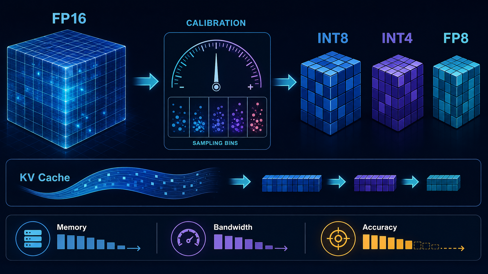
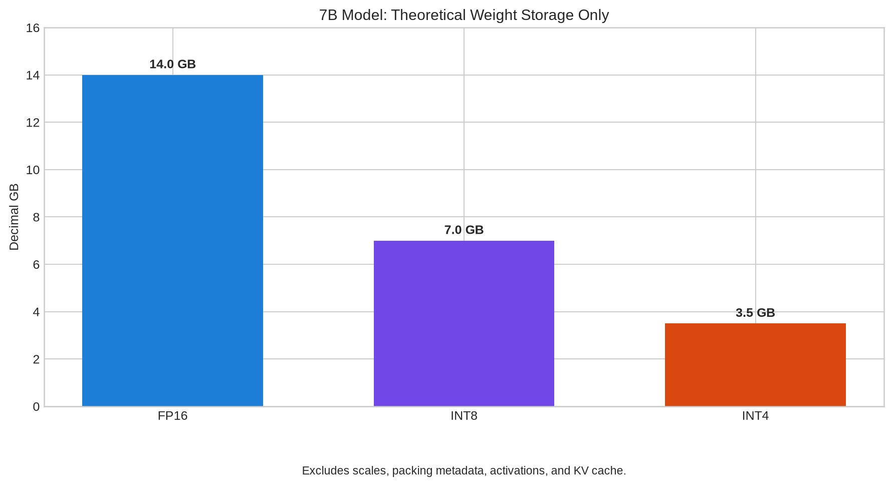
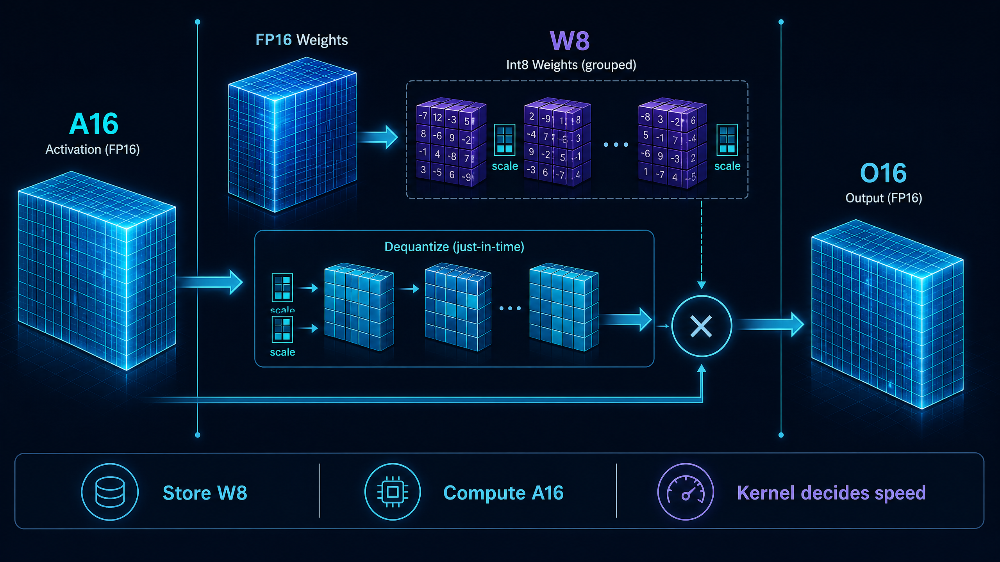
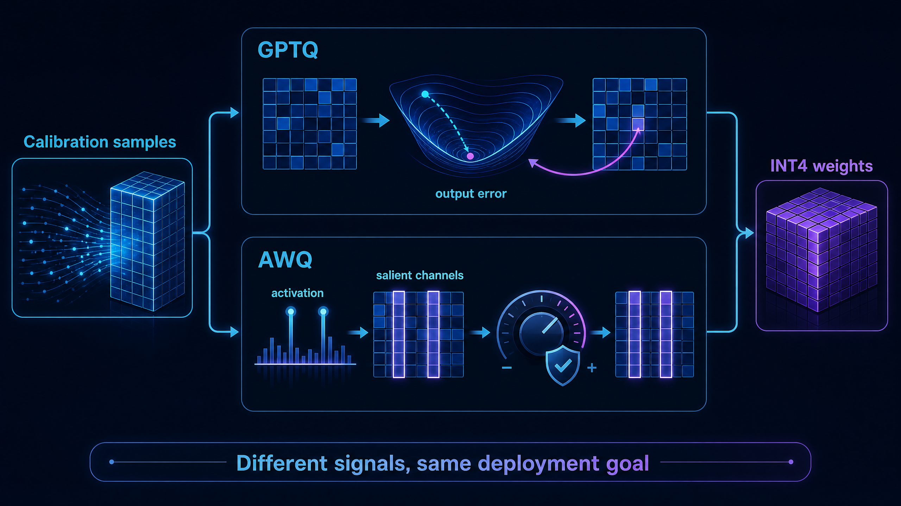
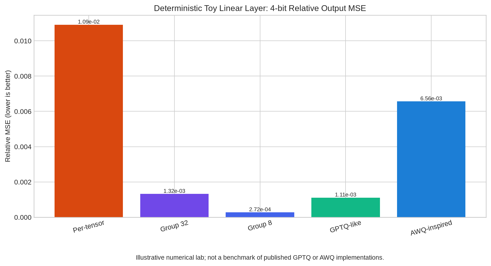
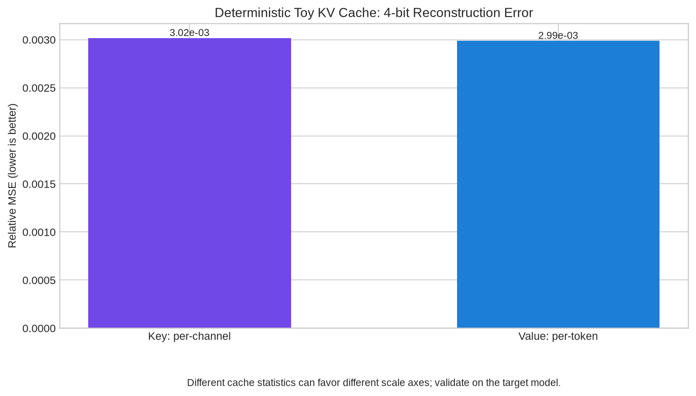
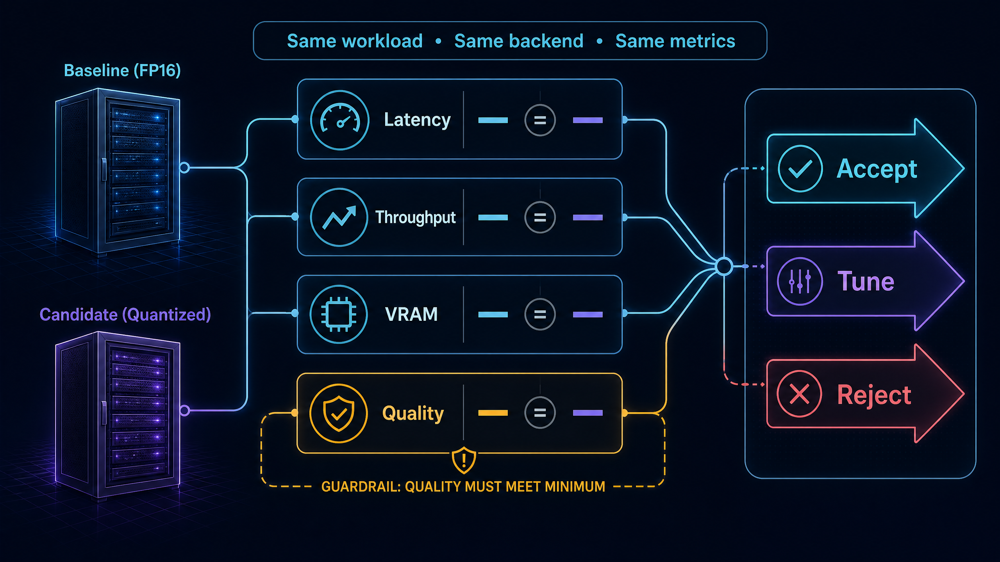

# Inference Task 5｜大模型量化：从数值映射到可部署推理

> **一句话主线：** 量化不是“把位宽调小”，而是把模型数值映射、尺度元数据、张量布局和硬件内核共同设计成一条可验证的推理路径。

本笔记基于 DataWhale 社区的五份量化教程重新组织叙事与实验，重点回答一个部署问题：**在目标工作负载、目标硬件和可接受质量预算都固定时，某个量化方案是否真的值得上线？** 文中的全部公式均采用原生代码样式，以避免依赖额外数学渲染器；全部可执行代码在 [`quantization_lab.py`](./quantization_lab.py) 中，并在文末完整附录。

| 学习范围 | 本笔记覆盖的核心问题 | 对应教程 |
| --- | --- | --- |
| 基础映射 | scale、zero point、INT8/INT4、粒度与误差 | [21](https://github.com/datawhalechina/llm-algo-leetcode/blob/main/01_Hardware_Math_and_Systems/21_Quantization_Theory_and_INT4_INT8.ipynb) |
| Weight-only | W8A16 的存储、反量化和算子边界 | [25](https://github.com/datawhalechina/llm-algo-leetcode/blob/main/02_PyTorch_Algorithms/25_Quantization_W8A16.ipynb) |
| 低比特权重 | GPTQ 与 AWQ 分别怎样利用校准信息 | [40](https://github.com/datawhalechina/llm-algo-leetcode/blob/main/02_PyTorch_Algorithms/40_GPTQ_and_AWQ_Weight_Quantization.ipynb) |
| 推理状态 | FP8 与 KV Cache 量化的对象和粒度 | [41](https://github.com/datawhalechina/llm-algo-leetcode/blob/main/02_PyTorch_Algorithms/41_FP8_and_KV_Cache_Quantization.ipynb) |
| 最终决策 | 如何以相同口径做量化推理部署评估 | [67](https://github.com/datawhalechina/llm-algo-leetcode/blob/main/02_PyTorch_Algorithms/67_Quantized_Inference_and_Deployment.ipynb) |

## 目录

1. [先建立量化系统地图](#1-先建立量化系统地图)
2. [量化理论：有限整数格如何近似连续张量](#2-量化理论有限整数格如何近似连续张量)
3. [W8A16：省下权重读取，不等于自动加速](#3-w8a16省下权重读取不等于自动加速)
4. [GPTQ 与 AWQ：量化时该听谁的信号](#4-gptq-与-awq量化时该听谁的信号)
5. [FP8 与 KV Cache：压缩动态推理状态](#5-fp8-与-kv-cache压缩动态推理状态)
6. [量化部署：让收益、质量与内核在同一张表里说话](#6-量化部署让收益质量与内核在同一张表里说话)
7. [完整实验代码与复现实验](#7-完整实验代码与复现实验)
8. [我的系统性思考](#8-我的系统性思考)
9. [参考资料](#参考资料)

---

## 1. 先建立量化系统地图

量化的输入不是一个孤立的浮点数，而是带有数据分布、张量结构、调用位置和服务目标的计算图节点。权重通常是静态的，适合离线校准、打包和复用；激活和 KV Cache 则会随请求、token 与上下文变化，量化时必须额外关心动态范围和恢复位置。[1](https://github.com/datawhalechina/llm-algo-leetcode/blob/main/01_Hardware_Math_and_Systems/21_Quantization_Theory_and_INT4_INT8.ipynb) [4](https://github.com/datawhalechina/llm-algo-leetcode/blob/main/02_PyTorch_Algorithms/41_FP8_and_KV_Cache_Quantization.ipynb)



上图的阅读顺序是从左到右、再向下：首先选择**要量化的对象**；然后用校准或运行时尺度把连续范围映射到有限格点；最后确认模型实际走的是不是匹配的低比特内核。若最后一步缺失，模型文件确实会变小，但端到端延迟不一定改善。

| 层次 | 关键问题 | 常见误解 | 正确的验收问题 |
| --- | --- | --- | --- |
| 数值层 | 如何把实数映射到有限码点？ | 位宽越低，误差一定越大到不可用 | 在本张量、该粒度和该校准集上，误差是多少？ |
| 存储层 | 低比特值和 scale 如何保存、打包？ | 4-bit 数值放进 `int8` 容器就节省了 4 倍 | 是否真正 nibble packing，scale 元数据占多少？ |
| 算子层 | GEMM/attention 是否有匹配内核？ | 一次反量化后调用 FP16 GEMM 也是 INT4 加速 | 是否执行量化 kernel，还是先恢复为高精度？ |
| 服务层 | 为何要量化、收益能否上线？ | 只要显存下降就应替换基线 | 同一 workload 下，质量、TTFT、吞吐和容量是否同时达标？ |

> **本笔记的边界。** `quantization_lab.py` 是可运行的 CPU 数值实验：它演示 scale、分组、校准与误差如何协作；它**不声称**复现真实 GPTQ/AWQ 搜索，不充当生产 FP8 kernel，也不以 CPU wall-clock 时间替代真实后端基准。

---

## 2. 量化理论：有限整数格如何近似连续张量

### 2.1 两条公式，解释绝大多数基础量化代码

对于浮点张量 `x`，最一般的仿射量化可以写成：

```text
q = clamp(round(x / scale) + zero_point, q_min, q_max)
x_hat = scale × (q - zero_point)
```

其中 `q` 是保存的整数，`x_hat` 是反量化后的近似值。`scale` 决定整数格点间距；`zero_point` 决定浮点零对应哪一个整数。对权重，常用简洁的**对称量化**，即 `zero_point = 0`，并可用：

```text
q_max = 2^(bits - 1) - 1
scale = max(abs(x)) / q_max
q = clamp(round(x / scale), -q_max, q_max)
```

这个链条揭示了一个关键事实：量化误差不是神秘的“精度损失”，而是每个值被投影到最近格点后的偏差。`scale` 太大时，格点间距粗，普通值损失细节；`scale` 太小时，离群值会饱和裁剪。教程 21 的重点正是将这条数值规则连接到显存与带宽成本。[1](https://github.com/datawhalechina/llm-algo-leetcode/blob/main/01_Hardware_Math_and_Systems/21_Quantization_Theory_and_INT4_INT8.ipynb)

### 2.2 位宽先决定理论容量，不保证时间收益

仅计算**权重值本身**，参数量为 `N`、位宽为 `b` 时，理论十进制存储是 `N × b / 8 / 1e9 GB`。对于 70 亿参数，这给出非常直观的容量账本。



| 权重格式 | 每个权重的理想字节数 | 7B 权重理论十进制容量 | 相对 FP16 | 需要补记的成本 |
| --- | ---: | ---: | ---: | --- |
| FP16/BF16 | 2 | 14.0 GB | 1.00× | 无额外量化 scale |
| INT8 | 1 | 7.0 GB | 0.50× | scale、可能的 zero point、打包与 kernel |
| INT4 | 0.5 | 3.5 GB | 0.25× | 更密集的 scale/packing 和更严格的 kernel 匹配 |

图中容量是严格由上述式子计算出来的，不是某张卡上的可用显存估计。真实部署还要加上权重元数据、激活、KV Cache、工作区、CUDA 图和运行时碎片。因此“INT4 权重 3.5 GB”不等于“7B 模型可在 4 GB 显存上服务”。

### 2.3 对称、非对称与粒度：谁共享一个 scale？

| 选择 | scale / zero point 的所有权 | 优点 | 风险或成本 | 常见对象 |
| --- | --- | --- | --- | --- |
| 对称量化 | 通常仅 `scale` | 数据路径简单，零点对齐 | 偏斜分布可能浪费编码范围 | 权重 |
| 非对称量化 | `scale` 与 `zero_point` | 可覆盖偏移明显的范围 | 元数据和计算分支更多 | 某些激活或后端格式 |
| Per-tensor | 整个张量一套 scale | 最少元数据 | 一个 outlier 可拉大所有格点 | 基线实验 |
| Per-channel | 每个通道一套 scale | 能适应通道范围差异 | 更多 scale 读取与布局要求 | 线性层权重、Key Cache |
| Per-group | 每一小组一套 scale | 精度与元数据的折中 | group size 需随后端共同选择 | INT4 权重、KV 分组 |

**可视化实验的第一条结论。** 在同一确定性玩具线性层里，per-tensor INT4 的相对输出 MSE 为 `1.09e-02`；每 32 列一组后为 `1.32e-03`；每 8 列一组后为 `2.72e-04`。这里不能外推成任何模型上的固定排名，但能看见它们共享的因果机制：让局部范围拥有自己的 scale，降低离群值支配整层范围的概率。

---

## 3. W8A16：省下权重读取，不等于自动加速

W8A16 描述的是**权重以 INT8 方式存储，激活保持较高精度**的推理路径。它常被称为 weight-only quantization：权重相对稳定、可离线压缩；激活随输入变化，先保留 FP16/BF16 通常是更稳妥的工程起点。[2](https://github.com/datawhalechina/llm-algo-leetcode/blob/main/02_PyTorch_Algorithms/25_Quantization_W8A16.ipynb)



### 3.1 三个必须分开的概念

| 过程 | 实验室中的做法 | 生产版本需要补充什么 | 能直接承诺的收益 |
| --- | --- | --- | --- |
| 数值量化 | 计算 absmax scale，得到 `int8` 值 | 目标格式、校准、溢出处理 | 值的精度/误差可评估 |
| 存储压缩 | `int8` 权重和 group scale 分别保存 | 连续 layout、对齐、序列化、量化格式元数据 | 权重值占用约从 FP16 的 2 bytes 降至 1 byte |
| 执行加速 | 为教学而反量化，再调用 `F.linear` | weight packing、融合反量化、INT8/INT4 GEMM、硬件调度 | 只有匹配 kernel 才可能带来端到端加速 |

`quantization_lab.py` 中的 `W8A16Linear` 故意选择最透明的教学实现：其 `qweight` 保存 groupwise INT8 值；`scales` 保存每个输出通道的每组尺度；`dequantized_weight()` 恢复近似权重；最后交给 `F.linear`。这样做能够验证输出误差，却不能证明低比特 GEMM 性能。

```python
w8a16 = W8A16Linear.from_float(weight, group_size=32)
output = w8a16(activations)
```

本实验的确定性结果中，W8A16 输出相对 MSE 是 `1.40e-06`。但是 CPU 上“先反量化、再 `F.linear`”的示例平均时间明显高于直接 FP32 `F.linear`。这不是 W8A16 无价值，而恰好说明了**存储格式和执行内核不是同一件事**：未融合的恢复工作可以吞掉理论带宽收益。

### 3.2 如何读 `quantize_groupwise_weights`

函数处理形状为 `[out_features, in_features]` 的线性层权重。它首先按 `group_size` 将每一行沿输入维度分组；每一个小组调用 `quantize_symmetric` 得到整数与 scale；然后把整数写入 `qweight`，把 scale 写入二维 `scales` 表。恢复函数按完全相同的边界切片，执行 `qweight × scale`。

这种“量化和恢复用同一坐标系统”的不变量比代码短小更重要。如果权重打包顺序、group size 或 scale index 任一处不一致，数值不会只出现一点误差，而是会系统性错位。

---

## 4. GPTQ 与 AWQ：量化时该听谁的信号

INT4 只有有限的量化格点。如果所有权重仅按全局绝对值平均处理，少量对模型输出更敏感的方向可能被过度扰动。GPTQ 与 AWQ 都属于后训练权重量化，但它们依赖校准信息的方式不同。[3](https://github.com/datawhalechina/llm-algo-leetcode/blob/main/02_PyTorch_Algorithms/40_GPTQ_and_AWQ_Weight_Quantization.ipynb)



| 方法 | 在问什么 | 发布方法的关键线索 | 不应把它误解成 |
| --- | --- | --- | --- |
| GPTQ | “怎样量化才能让本层输出变化最小？” | 使用近似二阶信息的一次性权重量化；量化时考虑重构误差与误差补偿。[9](https://arxiv.org/abs/2210.17323) | 只对权重做一次 `round` |
| AWQ | “哪些通道被真实激活放大，不能一视同仁？” | 以离线激活统计识别显著通道，并使用等价缩放来降低量化损伤。[10](https://arxiv.org/abs/2306.00978) | 简单把少数权重永远保存成混合精度 |
| 本笔记实验 | “分组与校准权重会怎样改变重构误差？” | `gptq_like_groupwise_quantize` 搜索小范围 scale；`awq_inspired_quantize` 演示等价变换 | 真实 GPTQ 或 AWQ 的复现与性能宣称 |

### 4.1 GPTQ：目标不是逐元素误差最小，而是输出扰动更小

一层线性层的近似问题不是仅比较 `W` 与 `W_hat`，而是关心校准输入 `X` 下 `XW` 与 `XW_hat` 的差异。GPTQ 的论文将近似二阶信息纳入一次性权重量化过程，以改善生成式模型中的低比特精度。[9](https://arxiv.org/abs/2210.17323)

实验里的 `gptq_like_groupwise_quantize` 没有假装实现 Hessian 或顺序误差补偿。它使用 `channel_rms(calibration_activations)` 生成每个输入通道的 RMS 重要性，再在少量 scale 候选中选择**加权重构误差**更低的候选。其价值是让代码中的目标函数可见：

```text
weighted_error = mean((w_hat - w)^2 × channel_importance^2)
```

因此脚本名刻意保留 `-like`。教育代码不应为简洁而抹去算法差异。

### 4.2 AWQ：用等价变换保护显著通道，而不是盲目混精度

AWQ 论文指出，不同权重的重要性并不相同；激活分布可以帮助识别显著通道，并通过等价缩放降低量化误差。[10](https://arxiv.org/abs/2306.00978) 对线性输出 `y = xW^T`，若某输入通道用因子 `c` 放大权重列，同时将输入的同一通道除以 `c`，未量化时的输出保持不变：

```text
y = (x / c) × (W × c)^T
```

脚本的 `awq_inspired_quantize` 恰好演示该恒等式：它以激活 RMS 建立 `channel_scale`，对权重列做变换后再 groupwise INT4；`awq_inspired_linear` 在前向时对激活施加逆变换。这是**机制演示**，不是论文中的完整 scale 搜索、packing 与内核路径。



这张图最值得学习的不是哪根柱子最低。数据结构被特意设置为存在两个显著激活通道，因此在这个玩具构造中，group size 与处理方式都会改变误差。换一个模型、校准集、层或后端，结果可能改变；真正的结论必须基于目标模型端到端质量指标，而不是这张教学图。

---

## 5. FP8 与 KV Cache：压缩动态推理状态

### 5.1 FP8 不是“INT8 换一个名字”

FP8 是 8 位**浮点**格式家族，而 INT8 是定点整数格式。经典 FP8 提案定义了 E4M3 与 E5M2 两种编码，分别在指数范围和尾数精度之间取舍。[11](https://arxiv.org/abs/2209.05433) 因此下面的区分很重要：

| 对象 | 数值编码 | 代表性取舍 | 实验室中做什么 |
| --- | --- | --- | --- |
| INT8 | 整数格点 + 显式 scale | 格点均匀，适合解释线性量化 | `quantize_symmetric` 返回 `int8` 与 scale |
| FP8 E4M3 | 浮点格式，指数 4 位、尾数 3 位 | 相对更多尾数精度，动态范围受限 | `quantize_fp8_e4m3` 使用 `torch.float8_e4m3fn` |
| FP8 E5M2 | 浮点格式，指数 5 位、尾数 2 位 | 更宽动态范围，尾数更粗 | 本笔记只解释，不虚构未运行的结果 |

`quantize_fp8_e4m3` 先计算 amax scale，再把缩放后的数值转换到真实的 `torch.float8_e4m3fn` 容器。这个实验只验证数值恢复，不能证明 CPU 会执行快速 FP8 GEMM；是否快仍由具体硬件与后端 kernel 决定。

### 5.2 KV Cache 为什么需要不同思维

权重是模型的静态资产，KV Cache 则是每个请求随 token 累积的动态状态。长上下文或高并发时，KV Cache 会成为容量与搬运开销的重要来源，所以只量化权重并不能结束推理内存问题。[4](https://github.com/datawhalechina/llm-algo-leetcode/blob/main/02_PyTorch_Algorithms/41_FP8_and_KV_Cache_Quantization.ipynb)

教程展示了沿最后一维分组保存 scale 的通用思路。更进一步，KIVI 的分析表明 Key 和 Value 的统计分布可能不同：该工作建议 Key 使用 per-channel，而 Value 使用 per-token 的量化维度，并以 2-bit 非对称量化作为研究对象。[12](https://arxiv.org/abs/2402.02750)

```text
Key  per-channel: 对每个 head_dim 通道，在 token 轴上共享一个 scale
Value per-token:  对每一个 token 向量，在 head_dim 轴上共享一个 scale
```

脚本用 `quantize_key_per_channel` 和 `quantize_value_per_token` 直接把这种坐标选择写成 `amax` 的维度选择：前者沿倒数第二维取范围，后者沿最后一维取范围。它们不是可替换的“代码风格”，而是对不同缓存统计结构的假设。



实验图中 Key per-channel 和 Value per-token 的相对 MSE 约为 `3.02e-03` 与 `2.99e-03`。这些几乎相近的数字只表明脚本的平滑玩具张量没有凸显强烈差异；它恰好提醒我们不要根据“某方案在 paper 或 demo 中更好”就跳过自己模型上的测量。

---

## 6. 量化部署：让收益、质量与内核在同一张表里说话

教程 67 的重要贡献不是再发明一种量化算法，而是建立**部署比较的统一口径**：固定模型、输入集、batch、序列长度、解码参数、后端和硬件，再把 latency、throughput、VRAM 与质量放入同一决策中。[5](https://github.com/datawhalechina/llm-algo-leetcode/blob/main/02_PyTorch_Algorithms/67_Quantized_Inference_and_Deployment.ipynb)



### 6.1 一份可审计的评测合同

| 必须固定的变量 | 为什么不能变 | 记录建议 |
| --- | --- | --- |
| 基座模型与权重版本 | 不同 checkpoint 的质量差异会伪装成量化误差 | model id、revision、量化格式 |
| 请求集与到达模式 | prompt 长度和并发改变预填充、KV Cache 与调度行为 | 固定样本、seed、并发曲线 |
| 生成设置 | `max_tokens`、采样策略影响 TTFT、TPS 与质量 | temperature、top-p、输出 token 数 |
| 后端与硬件 | kernel、packing 和显存管理决定真实性能 | engine 版本、GPU、driver、kernel 路径 |
| 质量指标与阈值 | 不先声明预算，事后任何结果都可被解释为“尚可” | ppl/任务分数、输出差异、人工审阅规则 |

### 6.2 接受、调优与拒绝的透明规则

`DeploymentMetrics` 保存一个候选方案的五类必要事实：延迟、吞吐、VRAM、质量误差、质量预算和 kernel 是否已支持。`deployment_decision` 的顺序体现了风险优先级：

1. 质量误差超过预算，直接 `reject`。
2. 质量和容量尚可但 kernel 未验证，得到 `tune`，而不是把纸面压缩率当作线上收益。
3. 容量下降，且延迟或吞吐至少一项在同口径下改善，才得到 `accept`。
4. 仅容量下降但速度没有改善，仍是 `tune`：要检查反量化、packing、对齐和后端。

| 结果 | 代表什么 | 下一步应做什么 |
| --- | --- | --- |
| `accept` | 质量不超预算，容量下降且至少一项性能指标变好 | 扩大回归、长上下文测试、线上灰度 |
| `tune` | 有潜力，但 kernel、粒度、校准或性能仍不确定 | 调 group size、校准集、packing 和后端版本 |
| `reject` | 质量超预算，或收益不足以抵消迁移成本 | 回退基线，重新设定量化对象或预算 |

### 6.3 不要把 toy time 当成生产 benchmark

实验脚本确实会测量两条 CPU 路径：直接 `F.linear` 与教学版 W8A16（按组恢复后再 `F.linear`）。后者通常更慢，因为它多做了 Python 循环和恢复工作。这个结果应该被解读为**反例**：如果实际部署没有匹配的 weight packing 与融合 kernel，“低比特权重”可能只降低离线存储或显存，而不能提升延迟。

可用于生产报告的结论应来自真实模型、真实 engine 与相同请求集。SGLang 和 Hugging Face TGI 的量化文档也都强调，不同量化格式需要对应加载与后端支持。[13](https://docs.sglang.ai/advanced_features/quantization.html) [14](https://huggingface.co/docs/text-generation-inference/en/conceptual/quantization)

---

## 7. 完整实验代码与复现实验

### 7.1 安装与运行

下面实验已在 CPU PyTorch 环境中执行并通过内置断言。它不下载模型、不需要 GPU，也不会对外部服务发请求。

```bash
pip install torch matplotlib
cd Inference/task5
python3 quantization_lab.py
```

运行后会创建以下文件。

| 文件 | 内容 | 如何正确解读 |
| --- | --- | --- |
| `assets/05_weight_memory_budget.png` | 7B 权重的理论容量图 | 不包含元数据、激活和 KV Cache |
| `assets/06_weight_error_granularity.png` | 确定性玩具线性层的 INT4 输出误差 | 不比较发布版 GPTQ/AWQ 的效果 |
| `assets/07_kv_cache_quantization_error.png` | 确定性玩具 KV Cache 的重构误差 | 不替代目标模型质量评估 |
| `results/quantization_lab_results.json` | 机器可读数值与部署示例 | 示例部署指标不是后端测量 |

### 7.2 代码导览：每一段负责什么

| 函数或类 | 核心输入/输出 | 学到的量化不变量 |
| --- | --- | --- |
| `qmax_for_bits` | bit width → 对称正向上界 | 4-bit 对称量化的正向格点上界为 7 |
| `quantize_symmetric` / `dequantize_symmetric` | float ↔ `int8` 容器与 scale | 编码和恢复必须使用同一 scale |
| `quantize_groupwise_weights` | 矩阵 → `qweight` 与 `scales` | group 边界决定 scale 的索引坐标 |
| `W8A16Linear` | 高精度权重 → W8 storage / 高精度运算 | 存储压缩与低比特 kernel 加速必须分开验证 |
| `channel_rms` | 校准激活 → 通道重要性 | 校准信息可使误差目标不再一视同仁 |
| `gptq_like_groupwise_quantize` | 权重与激活 → 加权 scale 搜索 | 教学近似应清楚标注，不冒充论文复现 |
| `awq_inspired_quantize` | 权重与激活 → 变换权重 / 通道 scale | 权重列缩放须与激活逆缩放配对 |
| `quantize_fp8_e4m3` | float → `float8_e4m3fn` 与 scale | FP8 是浮点编码，不能与 INT8 混为一谈 |
| `quantize_key_per_channel` / `quantize_value_per_token` | KV tensor → 整数与不同 shape 的 scale | scale 的轴选择是统计假设，不是语法细节 |
| `deployment_decision` | 指标 → accept/tune/reject | 质量预算优先于单项速度或容量收益 |

### 7.3 运行时最值得观察的数值

| 实验项 | 本次确定性结果 | 读法 |
| --- | ---: | --- |
| Per-tensor INT4 相对输出 MSE | `1.09104142e-02` | 一个全局 scale 容易受离群值影响 |
| Group-32 INT4 相对输出 MSE | `1.31809000e-03` | 局部 scale 显著改善该构造中的误差 |
| Group-8 INT4 相对输出 MSE | `2.71677100e-04` | 更细粒度进一步改善，但 scale 数量更多 |
| GPTQ-like INT4 相对输出 MSE | `1.10853510e-03` | 展示校准加权目标的机制，而非论文基准 |
| AWQ-inspired INT4 相对输出 MSE | `6.56224180e-03` | 结果依赖该玩具的 scale 规则与数据结构 |
| W8A16 相对输出 MSE | `1.4024e-06` | 8-bit 权重量化在本构造中很接近原输出 |
| FP8 E4M3 相对 MSE | `7.476830e-04` | 真实 float8 容器的数值恢复示例 |

> **完整代码。** 以下代码与 [`quantization_lab.py`](./quantization_lab.py) 完全对应。它保留注释、断言、图表生成和边界说明，便于在 GitHub 中直接阅读或复制运行。

```python
"""Task5 Quantization Lab — original CPU-first teaching implementation.

This file intentionally separates three different things that are often conflated:
1) a numerical quantizer, 2) storage packing / low-bit kernel execution, and
3) end-to-end production inference benchmarking.

It is a self-contained educational lab, not a drop-in replacement for GPTQ,
AWQ, a vendor FP8 kernel, KIVI, or an inference engine quantization backend.
Run: python3 quantization_lab.py
Outputs: assets/05_weight_memory_budget.png, assets/06_weight_error_granularity.png,
         assets/07_kv_cache_quantization_error.png, results/quantization_lab_results.json
"""

from __future__ import annotations

import json
import math
import time
from dataclasses import asdict, dataclass
from pathlib import Path
from typing import Callable

import matplotlib.pyplot as plt
import torch
import torch.nn.functional as F

ROOT = Path(__file__).resolve().parent
ASSET_DIR = ROOT / "assets"
RESULT_DIR = ROOT / "results"
EPS = 1e-8


def weight_storage_gb(parameter_count: int, bits_per_weight: int) -> float:
    """Return decimal GB needed by weights only; scales and packing metadata are excluded."""
    return parameter_count * bits_per_weight / 8 / 1_000_000_000


def qmax_for_bits(bits: int) -> int:
    """Return the positive integer endpoint of a signed symmetric quantizer."""
    if not 2 <= bits <= 8:
        raise ValueError("This teaching lab accepts integer bit widths from 2 through 8.")
    return (1 << (bits - 1)) - 1


def quantize_symmetric(x: torch.Tensor, bits: int = 8) -> tuple[torch.Tensor, torch.Tensor]:
    """Per-tensor signed symmetric quantization returning an int8 container and a scale.

    A 4-bit quantizer still uses an int8 container here. That preserves the numerical
    values -7 through 7 for clarity; a production implementation additionally packs
    two 4-bit values into one byte and dispatches a matching kernel.
    """
    qmax = qmax_for_bits(bits)
    x32 = x.detach().float()
    scale = x32.abs().amax().clamp_min(EPS) / qmax
    q = torch.clamp(torch.round(x32 / scale), -qmax, qmax).to(torch.int8)
    return q, scale


def dequantize_symmetric(q: torch.Tensor, scale: torch.Tensor) -> torch.Tensor:
    """Restore an approximate float32 tensor from signed integers and one scale."""
    return q.float() * scale.float()


def quantize_groupwise_weights(
    weight: torch.Tensor, bits: int = 4, group_size: int = 32
) -> tuple[torch.Tensor, torch.Tensor]:
    """Quantize an [out_features, in_features] matrix with one symmetric scale per group."""
    if weight.ndim != 2:
        raise ValueError("Expected a 2D linear weight matrix shaped [out_features, in_features].")
    if group_size <= 0:
        raise ValueError("group_size must be positive.")

    out_features, in_features = weight.shape
    groups = math.ceil(in_features / group_size)
    qweight = torch.zeros_like(weight, dtype=torch.int8)
    scales = torch.empty((out_features, groups), dtype=torch.float32, device=weight.device)

    for row in range(out_features):
        for group in range(groups):
            start = group * group_size
            end = min(start + group_size, in_features)
            q_group, scale = quantize_symmetric(weight[row, start:end], bits=bits)
            qweight[row, start:end] = q_group
            scales[row, group] = scale
    return qweight, scales


def dequantize_groupwise_weights(qweight: torch.Tensor, scales: torch.Tensor, group_size: int) -> torch.Tensor:
    """Restore a groupwise-quantized weight matrix to float32."""
    out_features, in_features = qweight.shape
    expected_groups = math.ceil(in_features / group_size)
    if tuple(scales.shape) != (out_features, expected_groups):
        raise ValueError("Scale shape does not match quantized weight shape and group_size.")

    restored = torch.empty_like(qweight, dtype=torch.float32)
    for row in range(out_features):
        for group in range(expected_groups):
            start = group * group_size
            end = min(start + group_size, in_features)
            restored[row, start:end] = qweight[row, start:end].float() * scales[row, group]
    return restored


@dataclass
class W8A16Linear:
    """A transparent weight-only layer: W8 storage, A16/FP32-style compute after dequantization.

    It deliberately uses floating-point F.linear after reconstructing the weight. This
    teaches the W8A16 storage and numerical pathway but does not claim a low-bit GEMM
    speedup. The latter requires packing plus a supported kernel.
    """

    qweight: torch.Tensor
    scales: torch.Tensor
    bias: torch.Tensor | None
    group_size: int

    @classmethod
    def from_float(cls, weight: torch.Tensor, bias: torch.Tensor | None = None, group_size: int = 32) -> "W8A16Linear":
        qweight, scales = quantize_groupwise_weights(weight, bits=8, group_size=group_size)
        stored_bias = None if bias is None else bias.detach().float().clone()
        return cls(qweight=qweight, scales=scales, bias=stored_bias, group_size=group_size)

    def dequantized_weight(self) -> torch.Tensor:
        return dequantize_groupwise_weights(self.qweight, self.scales, self.group_size)

    def __call__(self, activations: torch.Tensor) -> torch.Tensor:
        return F.linear(activations.float(), self.dequantized_weight(), self.bias)


def channel_rms(calibration_activations: torch.Tensor) -> torch.Tensor:
    """Calculate a diagonal second-order proxy: RMS activation magnitude per input channel."""
    if calibration_activations.ndim < 2:
        raise ValueError("Calibration activations need a final feature dimension and at least one sample axis.")
    reduce_dims = tuple(range(calibration_activations.ndim - 1))
    return calibration_activations.float().square().mean(dim=reduce_dims).sqrt().clamp_min(EPS)


def gptq_like_groupwise_quantize(
    weight: torch.Tensor,
    calibration_activations: torch.Tensor,
    bits: int = 4,
    group_size: int = 32,
) -> tuple[torch.Tensor, torch.Tensor]:
    """Teaching-only calibration-weighted scale search inspired by GPTQ's objective.

    GPTQ proper uses approximate second-order information and sequential error
    compensation. This small routine does neither. It searches a handful of scales
    for every group and minimizes diagonal, activation-weighted reconstruction error.
    The name contains '-like' to prevent equating it with the published algorithm.
    """
    if weight.ndim != 2:
        raise ValueError("Expected a 2D linear weight matrix.")
    importance = channel_rms(calibration_activations)
    if importance.numel() != weight.size(1):
        raise ValueError("Calibration feature dimension must match the number of input features.")

    out_features, in_features = weight.shape
    groups = math.ceil(in_features / group_size)
    qmax = qmax_for_bits(bits)
    candidates = (0.70, 0.82, 0.94, 1.00, 1.10, 1.24, 1.40)
    qweight = torch.zeros_like(weight, dtype=torch.int8)
    scales = torch.empty((out_features, groups), dtype=torch.float32)

    for row in range(out_features):
        for group in range(groups):
            start = group * group_size
            end = min(start + group_size, in_features)
            values = weight[row, start:end].float()
            weights = importance[start:end].square()
            base_scale = values.abs().amax().clamp_min(EPS) / qmax
            best_error = float("inf")
            best_q: torch.Tensor | None = None
            best_scale: torch.Tensor | None = None
            for multiplier in candidates:
                scale = base_scale * multiplier
                proposal_q = torch.clamp(torch.round(values / scale), -qmax, qmax).to(torch.int8)
                proposal = proposal_q.float() * scale
                weighted_error = ((proposal - values).square() * weights).mean().item()
                if weighted_error < best_error:
                    best_error = weighted_error
                    best_q, best_scale = proposal_q, scale
            assert best_q is not None and best_scale is not None
            qweight[row, start:end] = best_q
            scales[row, group] = best_scale
    return qweight, scales


def awq_inspired_quantize(
    weight: torch.Tensor,
    calibration_activations: torch.Tensor,
    bits: int = 4,
    group_size: int = 32,
) -> tuple[torch.Tensor, torch.Tensor, torch.Tensor]:
    """Teaching-only activation-aware equivalent transform followed by groupwise quantization.

    For output y = x W^T, scale each input channel by an inverse factor in x and the
    matching direct factor in W. The full-precision output is unchanged before
    quantization. Larger calibration RMS produces a larger channel factor, which can
    reduce relative quantization damage for salient channels. Production AWQ searches
    its scales more carefully and uses packed kernels; this is only its core intuition.
    """
    importance = channel_rms(calibration_activations)
    if importance.numel() != weight.size(1):
        raise ValueError("Calibration feature dimension must match the number of input features.")
    channel_scale = (importance / importance.mean()).clamp(0.5, 2.0).sqrt()
    transformed_weight = weight.float() * channel_scale.unsqueeze(0)
    qweight, scales = quantize_groupwise_weights(transformed_weight, bits=bits, group_size=group_size)
    return qweight, scales, channel_scale


def awq_inspired_linear(
    activations: torch.Tensor,
    qweight: torch.Tensor,
    scales: torch.Tensor,
    channel_scale: torch.Tensor,
    group_size: int,
    bias: torch.Tensor | None = None,
) -> torch.Tensor:
    """Run the inverse activation scale and reconstructed transformed weight through F.linear."""
    restored_weight = dequantize_groupwise_weights(qweight, scales, group_size)
    return F.linear(activations.float() / channel_scale, restored_weight, bias)


@dataclass
class FP8Tensor:
    """Scaled real E4M3 float8 storage plus the factor required for restoration."""

    encoded: torch.Tensor
    scale: torch.Tensor

    def dequantize(self) -> torch.Tensor:
        return self.encoded.float() * self.scale.float()


def quantize_fp8_e4m3(x: torch.Tensor) -> FP8Tensor:
    """Use PyTorch's real E4M3 storage dtype with an amax scale, when available.

    This is materially different from putting integer quantization values into int8.
    It is still a numerical experiment, not a claim that the current CPU dispatches
    an optimized FP8 GEMM.
    """
    dtype = getattr(torch, "float8_e4m3fn", None)
    if dtype is None:
        raise RuntimeError("This PyTorch build does not expose torch.float8_e4m3fn.")
    x32 = x.detach().float()
    finite_max = torch.finfo(dtype).max
    scale = x32.abs().amax().clamp_min(EPS) / finite_max
    encoded = (x32 / scale).to(dtype)
    return FP8Tensor(encoded=encoded, scale=scale)


def quantize_key_per_channel(key: torch.Tensor, bits: int = 4) -> tuple[torch.Tensor, torch.Tensor]:
    """Quantize key cache along the token axis, yielding one scale per channel.

    Expected shape is [..., tokens, head_dim]. The returned scale has shape
    [..., 1, head_dim], so each channel shares a scale across positions.
    """
    if key.ndim < 2:
        raise ValueError("Key cache needs at least [tokens, head_dim].")
    qmax = qmax_for_bits(bits)
    scale = key.float().abs().amax(dim=-2, keepdim=True).clamp_min(EPS) / qmax
    qkey = torch.clamp(torch.round(key.float() / scale), -qmax, qmax).to(torch.int8)
    return qkey, scale


def quantize_value_per_token(value: torch.Tensor, bits: int = 4) -> tuple[torch.Tensor, torch.Tensor]:
    """Quantize value cache along head_dim, yielding one scale per token vector."""
    if value.ndim < 1:
        raise ValueError("Value cache cannot be scalar.")
    qmax = qmax_for_bits(bits)
    scale = value.float().abs().amax(dim=-1, keepdim=True).clamp_min(EPS) / qmax
    qvalue = torch.clamp(torch.round(value.float() / scale), -qmax, qmax).to(torch.int8)
    return qvalue, scale


def relative_mse(reference: torch.Tensor, approximation: torch.Tensor) -> float:
    """Return MSE divided by reference energy, which is comparable across tensors."""
    numerator = (reference.float() - approximation.float()).square().mean()
    denominator = reference.float().square().mean().clamp_min(EPS)
    return float((numerator / denominator).item())


@dataclass
class DeploymentMetrics:
    name: str
    latency_ms: float
    throughput_tokens_s: float
    vram_mb: float
    quality_error: float
    quality_budget: float
    kernel_supported: bool


def deployment_decision(metrics: DeploymentMetrics, baseline: DeploymentMetrics) -> tuple[str, str]:
    """Make a transparent accept/tune/reject decision from equal-workload metrics."""
    if metrics.quality_error > metrics.quality_budget:
        return "reject", "质量误差超过预先声明的预算。"
    if not metrics.kernel_supported:
        return "tune", "质量与容量可接受，但应先验证匹配的量化 kernel 和打包格式。"

    lower_latency = metrics.latency_ms < baseline.latency_ms
    higher_throughput = metrics.throughput_tokens_s > baseline.throughput_tokens_s
    lower_vram = metrics.vram_mb < baseline.vram_mb
    if lower_vram and (lower_latency or higher_throughput):
        return "accept", "容量收益成立，且同一工作负载下至少一个性能指标改善。"
    if lower_vram:
        return "tune", "容量收益成立，但端到端速度未改善；检查反量化和 kernel 路径。"
    return "reject", "容量或性能收益不足以覆盖部署切换成本。"


def benchmark_ms(function: Callable[[], torch.Tensor], warmup: int = 10, iterations: int = 100) -> float:
    """Measure a CPU wall-clock mean for a demonstration only, not a production benchmark."""
    for _ in range(warmup):
        function()
    start = time.perf_counter()
    for _ in range(iterations):
        function()
    return (time.perf_counter() - start) * 1000 / iterations


def deterministic_tensors() -> tuple[torch.Tensor, torch.Tensor, torch.Tensor]:
    """Create deterministic, non-random tensors with smooth structure and known outliers."""
    index = torch.arange(8 * 128, dtype=torch.float32).reshape(8, 128)
    weight = 0.45 * torch.sin(index / 13.0) + 0.18 * torch.cos(index / 7.0)
    weight[1, 17] = 2.8
    weight[6, 96] = -2.4

    calibration_index = torch.arange(64 * 128, dtype=torch.float32).reshape(64, 128)
    calibration = 0.7 * torch.sin(calibration_index / 19.0) + 0.15 * torch.cos(calibration_index / 5.0)
    calibration[:, 17] *= 4.0
    calibration[:, 96] *= 3.0

    evaluation_index = torch.arange(12 * 128, dtype=torch.float32).reshape(12, 128)
    evaluation = 0.65 * torch.cos(evaluation_index / 17.0) + 0.20 * torch.sin(evaluation_index / 9.0)
    evaluation[:, 17] *= 3.5
    evaluation[:, 96] *= 2.5
    return weight, calibration, evaluation


def build_charts(results: dict[str, float]) -> None:
    """Render precise charts from deterministic lab values; all figures are labelled as toy-lab outputs."""
    ASSET_DIR.mkdir(parents=True, exist_ok=True)
    plt.style.use("seaborn-v0_8-whitegrid")

    formats = ["FP16", "INT8", "INT4"]
    bits = [16, 8, 4]
    memory = [weight_storage_gb(7_000_000_000, item) for item in bits]
    colors = ["#1c7ed6", "#7048e8", "#d9480f"]
    fig, axis = plt.subplots(figsize=(10, 5.5), dpi=180)
    bars = axis.bar(formats, memory, color=colors, width=0.62)
    axis.set_title("7B Model: Theoretical Weight Storage Only")
    axis.set_ylabel("Decimal GB")
    axis.set_ylim(0, 16)
    for bar, value in zip(bars, memory):
        axis.text(bar.get_x() + bar.get_width() / 2, value + 0.28, f"{value:.1f} GB", ha="center", fontweight="bold")
    axis.text(0.5, -0.18, "Excludes scales, packing metadata, activations, and KV cache.", transform=axis.transAxes, ha="center", fontsize=9)
    fig.tight_layout()
    fig.savefig(ASSET_DIR / "05_weight_memory_budget.png", bbox_inches="tight")
    plt.close(fig)

    labels = ["Per-tensor", "Group 32", "Group 8", "GPTQ-like", "AWQ-inspired"]
    values = [results["per_tensor_output_mse"], results["group32_output_mse"], results["group8_output_mse"], results["gptq_like_output_mse"], results["awq_inspired_output_mse"]]
    fig, axis = plt.subplots(figsize=(10, 5.5), dpi=180)
    bars = axis.bar(labels, values, color=["#d9480f", "#7048e8", "#4263eb", "#12b886", "#1c7ed6"])
    axis.set_title("Deterministic Toy Linear Layer: 4-bit Relative Output MSE")
    axis.set_ylabel("Relative MSE (lower is better)")
    axis.tick_params(axis="x", rotation=15)
    for bar, value in zip(bars, values):
        axis.text(bar.get_x() + bar.get_width() / 2, value, f"{value:.2e}", ha="center", va="bottom", fontsize=8)
    axis.text(0.5, -0.21, "Illustrative numerical lab; not a benchmark of published GPTQ or AWQ implementations.", transform=axis.transAxes, ha="center", fontsize=9)
    fig.tight_layout()
    fig.savefig(ASSET_DIR / "06_weight_error_granularity.png", bbox_inches="tight")
    plt.close(fig)

    labels = ["Key: per-channel", "Value: per-token"]
    values = [results["key_4bit_relative_mse"], results["value_4bit_relative_mse"]]
    fig, axis = plt.subplots(figsize=(9, 5.2), dpi=180)
    bars = axis.bar(labels, values, color=["#7048e8", "#1c7ed6"], width=0.55)
    axis.set_title("Deterministic Toy KV Cache: 4-bit Reconstruction Error")
    axis.set_ylabel("Relative MSE (lower is better)")
    for bar, value in zip(bars, values):
        axis.text(bar.get_x() + bar.get_width() / 2, value, f"{value:.2e}", ha="center", va="bottom", fontsize=9)
    axis.text(0.5, -0.19, "Different cache statistics can favor different scale axes; validate on the target model.", transform=axis.transAxes, ha="center", fontsize=9)
    fig.tight_layout()
    fig.savefig(ASSET_DIR / "07_kv_cache_quantization_error.png", bbox_inches="tight")
    plt.close(fig)


def run_lab() -> dict[str, float]:
    """Run all numerical examples, assertions, CPU timing, and figure generation."""
    torch.set_num_threads(1)
    weight, calibration, evaluation = deterministic_tensors()
    reference_output = F.linear(evaluation, weight)

    per_tensor_q, per_tensor_s = quantize_symmetric(weight, bits=4)
    per_tensor_output = F.linear(evaluation, dequantize_symmetric(per_tensor_q, per_tensor_s))

    group32_q, group32_s = quantize_groupwise_weights(weight, bits=4, group_size=32)
    group32_output = F.linear(evaluation, dequantize_groupwise_weights(group32_q, group32_s, group_size=32))

    group8_q, group8_s = quantize_groupwise_weights(weight, bits=4, group_size=8)
    group8_output = F.linear(evaluation, dequantize_groupwise_weights(group8_q, group8_s, group_size=8))

    gptq_q, gptq_s = gptq_like_groupwise_quantize(weight, calibration, bits=4, group_size=32)
    gptq_output = F.linear(evaluation, dequantize_groupwise_weights(gptq_q, gptq_s, group_size=32))

    awq_q, awq_s, channel_scale = awq_inspired_quantize(weight, calibration, bits=4, group_size=32)
    awq_output = awq_inspired_linear(evaluation, awq_q, awq_s, channel_scale, group_size=32)

    w8a16 = W8A16Linear.from_float(weight, group_size=32)
    w8a16_output = w8a16(evaluation)

    fp8_state = quantize_fp8_e4m3(evaluation)
    fp8_restored = fp8_state.dequantize()

    token_index = torch.arange(1 * 2 * 16 * 32, dtype=torch.float32).reshape(1, 2, 16, 32)
    key = 0.8 * torch.sin(token_index / 11.0)
    value = 0.6 * torch.cos(token_index / 13.0)
    qkey, key_scale = quantize_key_per_channel(key, bits=4)
    qvalue, value_scale = quantize_value_per_token(value, bits=4)
    restored_key = dequantize_symmetric(qkey, key_scale)
    restored_value = dequantize_symmetric(qvalue, value_scale)

    # Verify numerical states rather than pretending an int8 container is physically packed int4.
    assert per_tensor_q.dtype == torch.int8
    assert tuple(group32_s.shape) == (8, 4)
    assert w8a16.qweight.dtype == torch.int8
    assert fp8_state.encoded.dtype == torch.float8_e4m3fn
    assert restored_key.shape == key.shape and restored_value.shape == value.shape
    assert torch.isfinite(awq_output).all()

    fp16_cpu_ms = benchmark_ms(lambda: F.linear(evaluation, weight))
    fake_w8a16_cpu_ms = benchmark_ms(lambda: w8a16(evaluation))

    results: dict[str, float] = {
        "per_tensor_output_mse": relative_mse(reference_output, per_tensor_output),
        "group32_output_mse": relative_mse(reference_output, group32_output),
        "group8_output_mse": relative_mse(reference_output, group8_output),
        "gptq_like_output_mse": relative_mse(reference_output, gptq_output),
        "awq_inspired_output_mse": relative_mse(reference_output, awq_output),
        "w8a16_output_mse": relative_mse(reference_output, w8a16_output),
        "fp8_e4m3_relative_mse": relative_mse(evaluation, fp8_restored),
        "key_4bit_relative_mse": relative_mse(key, restored_key),
        "value_4bit_relative_mse": relative_mse(value, restored_value),
        "fp16_cpu_ms": fp16_cpu_ms,
        "fake_w8a16_cpu_ms": fake_w8a16_cpu_ms,
        "fp16_7b_weight_gb": weight_storage_gb(7_000_000_000, 16),
        "int8_7b_weight_gb": weight_storage_gb(7_000_000_000, 8),
        "int4_7b_weight_gb": weight_storage_gb(7_000_000_000, 4),
    }

    baseline = DeploymentMetrics("FP16 baseline", 42.0, 100.0, 14_000.0, 0.0, 0.02, True)
    candidate = DeploymentMetrics("INT4 candidate", 39.0, 118.0, 4_200.0, results["awq_inspired_output_mse"], 0.02, True)
    decision, reason = deployment_decision(candidate, baseline)
    assert decision in {"accept", "tune", "reject"}

    RESULT_DIR.mkdir(parents=True, exist_ok=True)
    full_result = {
        "lab_results": {key: round(value, 10) for key, value in results.items()},
        "deployment_example": {
            "baseline": asdict(baseline),
            "candidate": asdict(candidate),
            "decision": decision,
            "reason": reason,
            "warning": "These deployment numbers are deliberately illustrative policy inputs, not backend measurements.",
        },
    }
    (RESULT_DIR / "quantization_lab_results.json").write_text(json.dumps(full_result, indent=2, ensure_ascii=False), encoding="utf-8")
    build_charts(results)

    print("Quantization lab checks passed.")
    print(json.dumps(full_result, indent=2, ensure_ascii=False))
    return results


if __name__ == "__main__":
    run_lab()

```

---

## 8. 我的系统性思考

### 8.1 量化的单位不该是“bit”，而应是“可释放的瓶颈”

把 FP16 换成 INT4 是格式描述，不是系统结论。如果显存容量是瓶颈，weight-only INT4 可能直接释放并发或容纳更大模型；如果 decode 阶段主要被 KV Cache 限制，则权重量化本身可能无法解决服务容量；如果算子没有低比特 kernel，量化甚至可能增加恢复开销。因此设计前应先问：**当前瓶颈是权重常驻、动态缓存、内存带宽、还是算子吞吐？**

### 8.2 校准集是量化方案的一部分，而不是离线前处理的边角料

GPTQ 与 AWQ 的共同启示是：量化误差要通过输入分布理解。代码、数学、长上下文、多轮 agent 和多语言请求可能具有不同的激活统计。一个只覆盖短通用文本的校准集，可能让离线 MSE 很漂亮，却在目标生产分布上失败。校准集应当像基准集一样被版本化、记录覆盖面，并在回归测试中保留。

### 8.3 “一层一个最佳设置”未必等于“服务最佳设置”

更小 group 往往改善单层数值误差，但会增加 scale 元数据、读取次数和 kernel 索引工作。个别层的更优 MSE 也可能换来全模型更差的吞吐。因此 group size、per-channel/per-token 轴、packing 方式和 kernel 应作为一个组合优化。先从后端支持的合法组合中筛选，再比较端到端质量与服务指标，通常比从理想数值误差倒推工程格式更稳妥。

### 8.4 质量护栏必须在性能护栏之前

量化的风险不是“模型偶尔有点不准”这么轻。推理输出会累积在代理规划、代码生成、检索判断和长文本任务中；KV Cache 误差还会沿 token 序列传播。因此部署系统应先定义不允许突破的质量预算，再讨论吞吐和成本。图 04 中把 Quality 画成独立的黄色护栏，不是设计装饰，而是决策顺序。

---

## 参考资料

1. [DataWhale：量化理论与 INT4/INT8](https://github.com/datawhalechina/llm-algo-leetcode/blob/main/01_Hardware_Math_and_Systems/21_Quantization_Theory_and_INT4_INT8.ipynb)
2. [DataWhale：W8A16 量化](https://github.com/datawhalechina/llm-algo-leetcode/blob/main/02_PyTorch_Algorithms/25_Quantization_W8A16.ipynb)
3. [DataWhale：GPTQ 与 AWQ 权重量化](https://github.com/datawhalechina/llm-algo-leetcode/blob/main/02_PyTorch_Algorithms/40_GPTQ_and_AWQ_Weight_Quantization.ipynb)
4. [DataWhale：FP8 与 KV Cache 量化](https://github.com/datawhalechina/llm-algo-leetcode/blob/main/02_PyTorch_Algorithms/41_FP8_and_KV_Cache_Quantization.ipynb)
5. [DataWhale：量化推理与部署](https://github.com/datawhalechina/llm-algo-leetcode/blob/main/02_PyTorch_Algorithms/67_Quantized_Inference_and_Deployment.ipynb)
6. [DataWhale 社区](https://datawhale.cn/)
7. [llm-algo-leetcode 在线阅读站](https://datawhalechina.github.io/llm-algo-leetcode/)
8. [Frantar et al.：GPTQ — Accurate Post-Training Quantization for Generative Pre-trained Transformers](https://arxiv.org/abs/2210.17323)
9. [Lin et al.：AWQ — Activation-aware Weight Quantization for LLM Compression and Acceleration](https://arxiv.org/abs/2306.00978)
10. [Micikevicius et al.：FP8 Formats for Deep Learning](https://arxiv.org/abs/2209.05433)
11. [Liu et al.：KIVI — A Tuning-Free Asymmetric 2bit Quantization for KV Cache](https://arxiv.org/abs/2402.02750)
12. [SGLang 文档：Quantization](https://docs.sglang.ai/advanced_features/quantization.html)
13. [Hugging Face TGI 文档：Quantization](https://huggingface.co/docs/text-generation-inference/en/conceptual/quantization)
