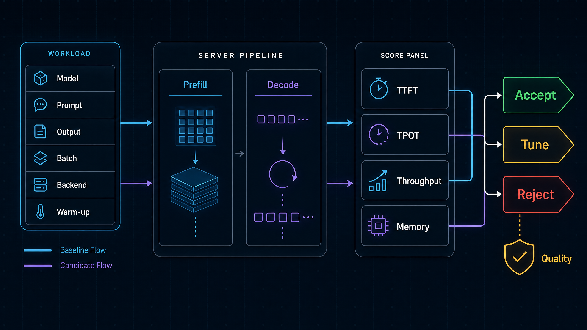
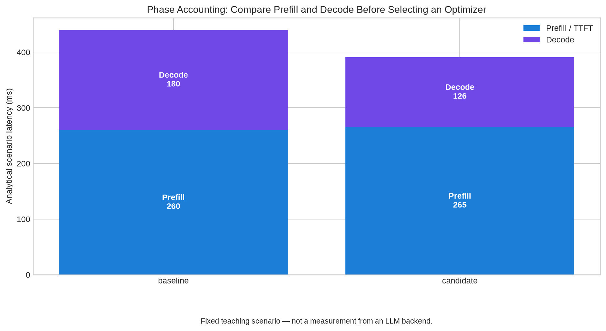
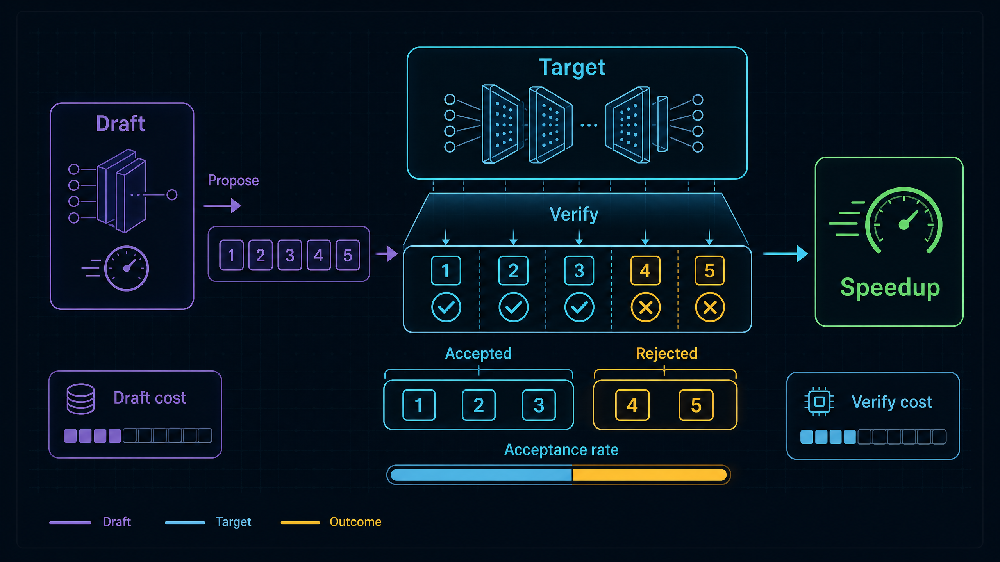
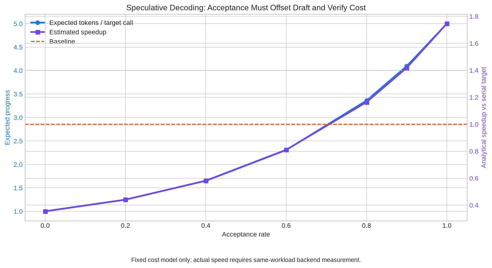
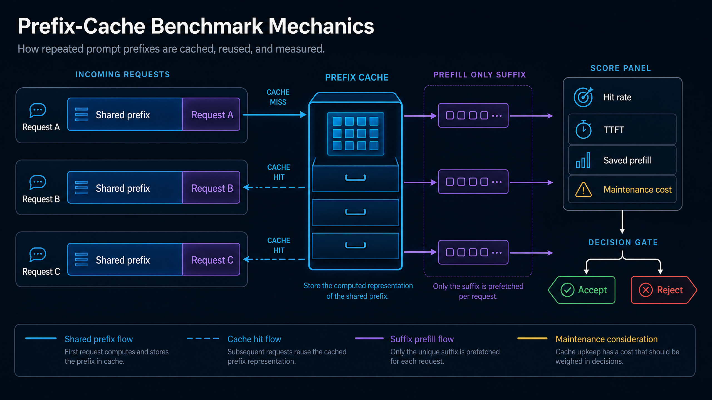
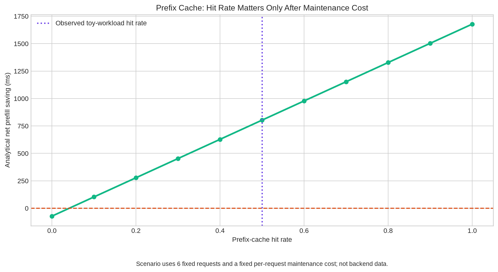
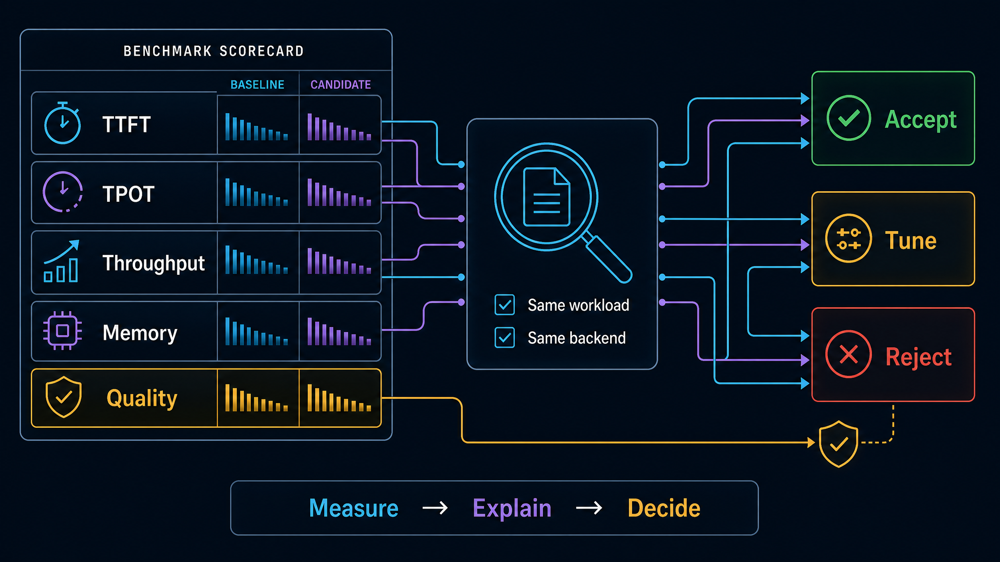

# Inference Task 6｜推理基准：从一次测时到可解释的系统决策

> **一句话主线：** 推理优化不是寻找“最快的技术名词”，而是在固定工作负载下拆解 prefill、decode、缓存复用与验证成本，再依据质量护栏作出可复核的 `accept / tune / reject` 决策。

本笔记基于 DataWhale 社区的三份教程重新组织：推理性能对比、投机解码基准与前缀缓存基准。它不直接复述 Notebook，而是将三者收束为一份面向真实工程的基准方法论和可运行实验室。所有公式都使用普通文本与行内代码，避免依赖数学渲染器；完整代码已提供在 [`inference_benchmark_lab.py`](./inference_benchmark_lab.py)，并在文末原样附录。

| 学习主题 | 核心问题 | 原始教程 |
| --- | --- | --- |
| 通用性能比较 | 如何让 baseline 和 candidate 真正可比？ | [66：Inference Performance Comparison](https://github.com/datawhalechina/llm-algo-leetcode/blob/main/02_PyTorch_Algorithms/66_Inference_Performance_Comparison.ipynb) |
| 投机解码 | 接受率高是否必然代表端到端更快？ | [68：Speculative Decoding Benchmark](https://github.com/datawhalechina/llm-algo-leetcode/blob/main/02_PyTorch_Algorithms/68_Speculative_Decoding_Benchmark.ipynb) |
| 前缀缓存 | 命中率、预填充节省和维护成本如何共同决定收益？ | [69：Prefix Caching Benchmark](https://github.com/datawhalechina/llm-algo-leetcode/blob/main/02_PyTorch_Algorithms/69_Prefix_Caching_Benchmark.ipynb) |

## 目录

1. [评测前先确定问题：优化谁的体验](#1-评测前先确定问题优化谁的体验)
2. [统一评测合同：让两个数字具备可比性](#2-统一评测合同让两个数字具备可比性)
3. [通用推理性能比较：把总延迟拆回 prefill 与 decode](#3-通用推理性能比较把总延迟拆回-prefill-与-decode)
4. [投机解码基准：接受率必须抵消 draft 与 verify 成本](#4-投机解码基准接受率必须抵消-draft-与-verify-成本)
5. [前缀缓存基准：命中不等于净收益](#5-前缀缓存基准命中不等于净收益)
6. [统一决策：接受、调优或拒绝](#6-统一决策接受调优或拒绝)
7. [完整实验代码与复现](#7-完整实验代码与复现)
8. [我的系统性思考](#8-我的系统性思考)
9. [参考资料](#参考资料)

---

## 1. 评测前先确定问题：优化谁的体验

“模型每秒生成多少 token”是一个很有吸引力的数字，却不是完整的用户体验。交互式对话通常先感知**何时出现第一个 token**；长答案生成随后感知**相邻 token 的间隔**；批量离线任务关心总体完成率；高并发服务还必须受峰值显存和排队影响约束。DataWhale 的性能对比教程将这一点落为同一 workload 下的 TTFT、TPOT、throughput、total latency 与 peak memory 账本。[1](https://github.com/datawhalechina/llm-algo-leetcode/blob/main/02_PyTorch_Algorithms/66_Inference_Performance_Comparison.ipynb)



| 业务目标 | 首先应看的指标 | 典型瓶颈假设 | 不能忽略的副作用 |
| --- | --- | --- | --- |
| 对话首响应 | TTFT P50/P95 | 长 prompt 的 prefill，排队，缓存未命中 | 吞吐提高可能增加等候时间 |
| 长文本生成 | TPOT 与 E2E latency | 每 token decode、KV 读取、调度 | TTFT 正常不代表生成过程流畅 |
| 离线批处理 | aggregate throughput、makespan | batch 填充率、持续批处理 | 用户级延迟会明显变差 |
| 长上下文 / RAG | peak memory、TTFT、cache hit rate | KV Cache、重复前缀 prefill | 命中率未必超过维护成本 |
| 代码或 agent 工作流 | 质量约束、E2E、尾延迟 | 结构化前缀复用、请求分布变化 | 少量失败或漂移会放大为任务失败 |

基准实验的任务不是“证明某项优化能运行”，而是回答带条件的问题：**在给定模型、硬件、后端、请求分布和质量预算下，这项改动为哪一种工作负载创造了什么净收益？** 如果这个条件句没有写清楚，任何性能数字都缺少决策意义。

---

## 2. 统一评测合同：让两个数字具备可比性

### 2.1 先固定，再测量

同一张表中，baseline 和 candidate 至少要共享模型权重、后端版本、硬件、prompt 分布、输出长度上限、batch、并发、解码参数、dtype、缓存策略以外的变量、warm-up 和统计方法。教程 66 的核心正是把这些条件显式构造成 workload config，再在相同口径下做比较。[1](https://github.com/datawhalechina/llm-algo-leetcode/blob/main/02_PyTorch_Algorithms/66_Inference_Performance_Comparison.ipynb)

| 合同字段 | 为什么必须固定 | 常见的无效比较 |
| --- | --- | --- |
| 模型与 tokenizer | 权重、词表和模板本身改变质量与 token 数 | 用不同 checkpoint 比较“后端速度” |
| prompt / output 分布 | 长度决定 prefill、decode 和 KV Cache 压力 | 一个方案跑短问答，另一个方案跑长 RAG |
| batch 与并发 | 影响排队、批处理增益和显存占用 | 用 batch 1 的 TTFT 对比 batch 32 的吞吐 |
| 后端、版本和启动参数 | kernel、packing、scheduler 与缓存实现都可能不同 | 把不同 engine 的默认参数混为技术收益 |
| dtype 与 cache policy | 改变算子、显存和数值路径 | 同时改量化、KV policy 和 batch，却归功于一个改动 |
| warm-up 与统计口径 | 首轮编译、显存分配或权重装载会扭曲结果 | 用一次冷启动时间宣布延迟结论 |

> **一个实用规则：** 每轮对比只改变一个可解释变量。如果必须联动多个变量，应把实验命名为“组合候选”，而不是假装能从结果中分离每个因素的贡献。

### 2.2 让指标具备明确的方向

本笔记的实验室采用下列约定。`TTFT` 近似为 prefill 时间；`TPOT` 是 `decode_ms / generated_tokens`；整个 batch 的生成吞吐是 `batch_size × generated_tokens × 1000 / total_ms`。候选相对于 baseline 的 `TTFT improvement`、`TPOT improvement`、总延迟改善和显存节省全部定义为 `baseline - candidate`，因此**正数均代表候选在该指标上更好**。吞吐增益定义为 `candidate_throughput / baseline_throughput - 1`。

| 指标 | 计算口径 | 小 / 大哪个更好 | 它真正回答的问题 |
| --- | --- | --- | --- |
| TTFT | 从提交到第一 token 的时长 | 小 | 用户多久开始看到回答？ |
| TPOT | decode 总时长除以生成 token 数 | 小 | 生成过程每步有多快？ |
| E2E / total | prefill 加 decode，加上需要时的排队 | 小 | 一次请求总体多久完成？ |
| Throughput | 时间窗口内完成的输出 token | 大 | 系统能稳定产出多少工作？ |
| Peak memory | 请求或实验期间峰值内存 | 小 | 是否还能提高并发 / 上下文？ |
| Quality | 预先声明的任务正确性或回归测试 | 达标 | 性能优化是否仍可用？ |

### 2.3 为什么质量是硬护栏

较低 TTFT 或更高吞吐都不能补偿质量越界。对于投机解码，需要验证目标模型的采样语义与实现是否保持一致；对于前缀缓存，需要确保复用键、tokenizer、模板和缓存失效策略不会错误复用状态。投机解码的原始工作强调可在特定算法设置下保持目标模型输出分布，而不是声称任意 draft/target 拼接都自动正确。[6](https://arxiv.org/abs/2211.17192)

---

## 3. 通用推理性能比较：把总延迟拆回 prefill 与 decode

Prefill 读取整段 prompt 并构建初始 KV Cache，通常强烈受 prompt 长度、attention 算法、批处理与前缀复用影响；decode 则逐 token 生成，往往更受 KV 访问、每步调度、采样与串行依赖影响。将二者相加后只保留一个“latency”，会掩盖优化为何有效，也掩盖它对交互体验造成的代价。[1](https://github.com/datawhalechina/llm-algo-leetcode/blob/main/02_PyTorch_Algorithms/66_Inference_Performance_Comparison.ipynb)



上图是 `inference_benchmark_lab.py` 的**确定性教学情景**，不是对真实模型或后端的测量。baseline 的 prefill / decode 是 `260 / 180 ms`；candidate 是 `265 / 126 ms`。因此 candidate 的总时延由 `440 ms` 降为 `391 ms`，而 TTFT 轻微退化 `5 ms`。它训练的是读图习惯：总时延改善不代表每一项都改善，任何结论都应把阶段账本写出来。

### 3.1 诊断顺序：先容量，再阶段

实验室的 `diagnose_bottleneck` 按以下优先级分类：如果峰值显存达到预算的 90% 以上，先判为 `memory-bound`；否则当 prefill 或 decode 占比达到 60% 时，分别归为 `prefill-bound` 或 `decode-bound`；均不突出时归为 `balanced`。显存被置于最前并非说它总是最慢，而是因为它是硬约束：容量不足时，系统无法把理想 batch 或上下文放进运行时。

| 诊断 | 可观测信号 | 候选方向 | 需要反证的风险 |
| --- | --- | --- | --- |
| `memory-bound` | peak memory 接近预算，batch 难以提升 | PagedAttention、KV 量化、GQA/MQA、cache eviction | 节省空间但造成严重 TPOT 回归 |
| `prefill-bound` | 长 prompt 时 TTFT / prefill 占比明显上升 | FlashAttention、chunked prefill、prefix cache、prompt 优化 | 只在短 prompt 上测试，误以为已解决 |
| `decode-bound` | TPOT 高、输出越长 E2E 增长越快 | speculative decoding、decode scheduling、multi-token decoding | acceptance 或 verify 成本抵消收益 |
| `balanced` | 三类压力不突出 | profiling、小步测试 | 盲目引入高复杂度运行时 |

### 3.2 一张报告应怎样写结论

好的结论不是“candidate 更快”。它应明确说出：**在何种固定 workload 下，candidate 让哪一个阶段改变了多少；其换来的代价是什么；它还剩下什么瓶颈；为什么接受、继续调优或拒绝。** 这种写法使下一个人能够复跑，也使未来的流量分布变化时能够判断结论是否仍然适用。

---

## 4. 投机解码基准：接受率必须抵消 draft 与 verify 成本

投机解码让小型 draft model 先一次提出多枚 token，再由目标模型批量验证。真正的收益来自一次目标模型验证能推进多枚 token；代价则是 draft 生成与目标模型验证本身。原始研究指出，在其算法与实验设定下，这一机制可以并行验证多个候选 token，同时保持目标模型输出分布；这不是“任何小模型加在大模型前面都会更快”的保证。[6](https://arxiv.org/abs/2211.17192)



### 4.1 接受率是因果变量，但不是最终 KPI

设 draft 一次提议 `k` 个 token，单个候选被接受的独立概率为 `a`。作为便于思考的教学模型，一次 target 调用的期望推进 token 数可写成：

```text
expected_progress = 1 + a + a² + ... + a^k
```

`1` 表示目标模型至少会产出一个位置的结果；连续被接受的 draft token 使进度继续增加。真实系统的接受相关性、采样方式、候选长度和实现细节更复杂，但这个式子保留了核心直觉：当 `a` 偏低时，提议块不会带来足够的串行步骤减少。

为使成本也可见，实验室的解析模型使用：

```text
baseline_cost = output_tokens × target_step_cost
speculative_cost = target_calls × (draft_tokens × draft_step_cost + verify_call_cost)
estimated_speedup = baseline_cost / speculative_cost
```



图中固定 `4` 枚 draft token、目标单步成本 `1.0 ms`、draft 单步成本 `0.08 ms`、一次验证成本 `2.5 ms`。当接受率为 `0.8` 时，该模型推得期望每次 target 调用推进 `3.3616` 枚 token，解析速度比约 `1.1638`。当接受率较低时，即使“有 draft”，verify 调用次数与额外开销仍可使速度低于串行基线。该图的数值只用于教学，不应被当成任何模型、GPU 或后端的性能承诺。

### 4.2 投机基准的最小报告

教程 68 要求同时记录 baseline、candidate、acceptance rate、draft cost、verify cost 与最终吞吐，正是为了防止单看某一个漂亮指标。[2](https://github.com/datawhalechina/llm-algo-leetcode/blob/main/02_PyTorch_Algorithms/68_Speculative_Decoding_Benchmark.ipynb)

| 字段 | 为什么不可省略 | 解释错误时会发生什么 |
| --- | --- | --- |
| target 与 draft 标识 | 不同模型对质量和成本的影响不同 | 无法复现实验，也无法诊断 draft 是否过大 |
| proposal length | 决定潜在并行度和拒绝损失 | 将失败归因于模型，却忽略候选块长度 |
| acceptance rate | 衡量提议是否与 target 对齐 | 只报吞吐，掩盖工作负载偶然性 |
| draft cost | 小模型并非免费 | 忽略 draft 造成的额外计算和 KV 压力 |
| verify cost | target 验证不等于一次免费调用 | 高接受率却没有端到端收益 |
| TTFT、TPOT、throughput | 在用户体验和系统产出之间取平衡 | 在线交互退化被平均吞吐掩盖 |
| quality guardrail | 防止错误实现或近似策略偷走速度 | “更快”的结果不再可用 |

实验室的 `speculative_decision` 用两个透明门槛做初筛：接受率低于 `0.60` 直接拒绝；接受率足够但解析速度没有超过 `1.05`，进入 `tune`；二者都通过才进入 `accept`。真正上线前仍必须执行真实 backend 的相同请求集测量。

---

## 5. 前缀缓存基准：命中不等于净收益

前缀缓存的机会来自许多请求共享了相同的开头，例如系统提示词、RAG 文档、few-shot 示例或多轮对话历史。第一次请求计算并存储共享前缀对应的状态，后续请求命中时只需处理独有后缀。vLLM 的 PagedAttention 工作和 SGLang 的 RadixAttention 工作都将 KV Cache 的高效分配与复用视为服务吞吐的重要组成部分；具体收益取决于请求结构和运行时实现。[7](https://arxiv.org/abs/2309.06180) [8](https://arxiv.org/abs/2312.07104)



### 5.1 请求分布比缓存开关更重要

如果测试请求是独立随机的问题，任何前缀缓存都难以命中；如果测试集故意让所有请求共享超长提示，命中率又可能高得不具生产代表性。因此教程 69 首先要求固定 prompt 分布、重用模式、chunk 策略和 cache policy，再报告 hit rate、TTFT、prefill 节省与维护开销。[3](https://github.com/datawhalechina/llm-algo-leetcode/blob/main/02_PyTorch_Algorithms/69_Prefix_Caching_Benchmark.ipynb)

| 缓存事件 | 该记录应包含什么 | 为什么它改变解释 |
| --- | --- | --- |
| Cache miss | prefix key、首次 prefill token、写入时间 | miss 并非失败，它是将来复用的投资 |
| Cache hit | 命中 key、复用 token、剩余 suffix token | 命中只节省共享部分，suffix 仍需计算 |
| Eviction / invalidation | 原因、释放量、受影响 key | 缓存容量有限，失效策略改变未来 hit rate |
| Maintenance | 查找、引用计数、写入、回收与调度开销 | 高 hit rate 仍可能没有净时延收益 |

### 5.2 将命中翻译成经济账本

命中率本身只说明“多少请求复用了某个前缀”，没有说明复用了多少 token 或节省了多少时间。实验室把每次 hit 的 `saved_prefill_tokens` 相加，并计算：

```text
gross_saved_ms = saved_prefill_tokens × prefill_ms_per_token
maintenance_ms = request_count × maintenance_ms_per_request
net_saved_ms = gross_saved_ms - maintenance_ms
```

六条固定教学请求中，`policy-v1` 与 `product-doc-a` 两个前缀各出现多次，模拟得到 `3 / 6` 的 hit rate，即 `0.5`；累计复用 `2500` 个 prefill token。按固定 `0.35 ms/token` 和每请求 `12 ms` 维护成本，得到 `875 ms` 毛节省、`72 ms` 维护成本、`803 ms` 净节省。它们是代码可复现的**解析教学情景**，不是某个 runtime 的实测值。



图中的绿色曲线体现一个容易被忽视的事实：当命中率接近零，维护成本使净收益为负；越过零线后，才可以讨论缓存的性能价值。图中的紫色虚线标记该玩具 workload 的 `0.5` 命中率。真实系统还必须增加 cache 容量、淘汰、并发竞争和 TTFT 分位数等测量。

---

## 6. 统一决策：接受、调优或拒绝

无论是常规推理 candidate、投机解码还是前缀缓存，最终都应从“指标集合”收敛为可执行决定。核心不是定义一套神奇阈值，而是让阈值在实验前被声明、方向在代码中固定、质量在性能之前被检查。



| 结论 | 触发条件 | 正确的下一步 |
| --- | --- | --- |
| `accept` | 质量通过，且预先声明的主要收益达到门槛；例如吞吐显著提升且 TTFT 回归可接受 | 扩大 workload、增加尾延迟与长期稳定性回归，进入灰度评估 |
| `tune` | 有局部收益，但仍保留主瓶颈；例如省显存但 decode 更慢、命中但维护开销偏高 | 针对诊断调参：grouping、proposal length、chunk、eviction、batch 或 scheduler |
| `reject` | 质量失败，或无法证明容量/性能净收益 | 回退 baseline，记录反例与失败条件，避免同类试验重复消耗 |

### 6.1 代码中的 general decision rule

`benchmark_decision` 强制先检查 `quality_passed`。随后它要求吞吐增益至少达到 `0.10`，并且 TTFT 回归不超过 `20 ms` 才 `accept`；如果速度或内存至少有一个局部收益，则给出 `tune` 并附上瓶颈类型；否则 `reject`。这不是行业标准，它的目的在于把“我觉得还不错”变成审计友好的、可改的规则。

### 6.2 三类基准的共同反模式

| 反模式 | 为什么误导 | 应替换为 |
| --- | --- | --- |
| 只展示最佳吞吐 | 掩盖 TTFT、TPOT、排队与质量回归 | 同时报 P50/P95、阶段账本和质量门槛 |
| 使用不同请求集 | workload 变化可能大于优化效果 | 冻结 request trace，或明确分层报告 |
| 以冷启动替代稳态 | 编译、加载和分配污染服务时延 | 记录 warm-up，分别报告 cold / steady state |
| 只报 acceptance rate | 接受并不包含 draft/verify 成本 | 联合报告接受、成本、TTFT 和 E2E |
| 只报 prefix hit rate | hit 不代表节省了足够计算 | 记录复用 token、TTFT 与维护成本 |
| 把解析模型当真实性能 | 固定成本或玩具请求无法覆盖真实后端 | 用它解释机制，再以真实 engine 复验 |

---

## 7. 完整实验代码与复现

### 7.1 运行方式

实验只依赖 Python 与 Matplotlib，不下载模型、不启动 server，也不访问外部服务。结果可在任意普通 CPU 环境复现。

```bash
pip install matplotlib
cd Inference/task6
python3 inference_benchmark_lab.py
```

| 产物 | 内容 | 正确解读 |
| --- | --- | --- |
| `results/inference_benchmark_lab_results.json` | 所有固定教学情景及其决策 | 可重算的机制示例，不是 engine benchmark |
| `assets/05_phase_accounting_scenario.png` | baseline / candidate 阶段账本 | 训练将总延迟拆回 prefill 与 decode |
| `assets/06_speculative_acceptance_frontier.png` | 接受率与解析速度模型 | 说明何时需要做真实端到端测量 |
| `assets/07_prefix_cache_payoff_scenario.png` | 命中率与净 prefill 节省模型 | 展示维护成本如何创造零收益阈值 |

### 7.2 完整代码导览

| 函数或类 | 输入到输出 | 关键不变量 |
| --- | --- | --- |
| `Workload` | 固定一次比较的全部条件 | 一张对比表只能共享一个 workload contract |
| `RunMetrics.summary` | prefill / decode 时间到 TTFT、TPOT、吞吐 | phase 与指标必须来自同一运行 |
| `diagnose_bottleneck` | 指标与显存预算到瓶颈分类 | memory 是硬约束，应优先诊断 |
| `compare_runs` | baseline、candidate 到统一方向的 delta | 正数始终代表 candidate 的改善 |
| `benchmark_decision` | 对比与诊断到三态决策 | 质量检查优先于任何性能收益 |
| `expected_tokens_per_target_call` | 接受率与 proposal length 到期望进度 | 这是独立接受率教学模型，不是 runtime 采样器 |
| `speculative_cost_model` | draft / target / verify 成本到解析速度比 | 必须同时计入 draft 和 verify |
| `simulate_prefix_cache` | 固定请求序列到 hit/miss 事件 | 首次出现必 miss，后续同 key 命中 |
| `prefix_cache_economics` | 事件与单位成本到净节省 | hit rate 必须转换成 token 与维护成本 |
| `make_figures` | 解析结果到图表 | 每张图显式标记为 scenario，避免伪装实测 |

### 7.3 可复现结果快照

| 教学情景 | 关键数值 | 脚本给出的结论 | 应学到什么 |
| --- | --- | --- | --- |
| 通用性能比较 | throughput gain `12.53%`；TTFT 改善 `-5 ms`；总时延改善 `49 ms` | `accept` | 总时延改善也可能伴随首 token 轻微退化 |
| 投机解码 | 接受率 `0.8`；期望进度 `3.3616`；解析速度比 `1.1638` | `accept` | 接受率必须与 draft/verify 成本共同抵消 |
| 前缀缓存 | hit rate `0.5`；复用 `2500` token；净节省 `803 ms` | `accept` | 命中应翻译成可扣除维护成本的净收益 |

> **完整代码。** 以下源码与 [`inference_benchmark_lab.py`](./inference_benchmark_lab.py) 完全一致，包含注释、断言、图表生成和明确的“非真实后端测量”边界。

```python
"""Task6 Inference Benchmark Lab — original deterministic teaching implementation.

The lab models the accounting and decision logic of three benchmark designs:
- general inference comparison (TTFT, TPOT, throughput, memory),
- speculative decoding (acceptance, draft cost, verify cost), and
- prefix caching (reuse, saved prefill work, maintenance cost).

It deliberately does NOT execute an LLM server or claim real vLLM/SGLang results.
All profiles are fixed analytical scenarios so the calculations are reproducible.
Run: python3 inference_benchmark_lab.py
"""

from __future__ import annotations

import json
import math
from dataclasses import asdict, dataclass
from pathlib import Path
from typing import Iterable

import matplotlib.pyplot as plt

ROOT = Path(__file__).resolve().parent
ASSET_DIR = ROOT / "assets"
RESULT_DIR = ROOT / "results"


@dataclass(frozen=True)
class Workload:
    """All conditions that must remain fixed in one fair benchmark comparison."""

    name: str
    model: str
    backend: str
    batch_size: int
    prompt_tokens: int
    generated_tokens: int
    dtype: str
    cache_policy: str
    warmup_runs: int

    @property
    def total_tokens(self) -> int:
        return self.prompt_tokens + self.generated_tokens


@dataclass(frozen=True)
class RunMetrics:
    """A measured or scenario-provided result under one explicit workload contract."""

    label: str
    prefill_ms: float
    decode_ms: float
    peak_memory_mb: float
    quality_passed: bool

    def summary(self, workload: Workload) -> dict[str, float | bool | str]:
        """Calculate user-facing latency and throughput metrics from phase timing."""
        if self.prefill_ms < 0 or self.decode_ms < 0:
            raise ValueError("Timing must be non-negative.")
        total_ms = self.prefill_ms + self.decode_ms
        output_tokens = workload.batch_size * workload.generated_tokens
        tpot_ms = self.decode_ms / workload.generated_tokens if workload.generated_tokens else 0.0
        throughput = output_tokens * 1000.0 / total_ms if total_ms else 0.0
        return {
            "label": self.label,
            "ttft_ms": round(self.prefill_ms, 3),
            "tpot_ms": round(tpot_ms, 3),
            "total_ms": round(total_ms, 3),
            "throughput_tokens_s": round(throughput, 3),
            "prefill_share": round(self.prefill_ms / total_ms, 4) if total_ms else 0.0,
            "decode_share": round(self.decode_ms / total_ms, 4) if total_ms else 0.0,
            "peak_memory_mb": round(self.peak_memory_mb, 3),
            "quality_passed": self.quality_passed,
        }


def diagnose_bottleneck(summary: dict[str, float | bool | str], memory_budget_mb: float) -> dict[str, str]:
    """Classify the dominant constraint with memory as the hard constraint."""
    if memory_budget_mb <= 0:
        raise ValueError("memory_budget_mb must be positive.")
    memory_pressure = float(summary["peak_memory_mb"]) / memory_budget_mb
    if memory_pressure >= 0.90:
        return {
            "bottleneck": "memory-bound",
            "reason": "峰值显存已达到预算的 90% 以上；先处理 KV Cache、并发或容量问题。",
        }
    if float(summary["prefill_share"]) >= 0.60:
        return {
            "bottleneck": "prefill-bound",
            "reason": "Prefill 占总时延的 60% 以上；优先检查 prompt 复用、attention 和预填充批处理。",
        }
    if float(summary["decode_share"]) >= 0.60:
        return {
            "bottleneck": "decode-bound",
            "reason": "Decode 占总时延的 60% 以上；优先检查每 token 调度、KV 读取和投机解码。",
        }
    return {
        "bottleneck": "balanced",
        "reason": "三类压力均未显著主导；应以更细粒度 profiling 而非直接更换技术栈推进。",
    }


def compare_runs(baseline: dict[str, float | bool | str], candidate: dict[str, float | bool | str]) -> dict[str, float | bool]:
    """Use one sign convention: positive deltas mean the candidate improves that metric."""
    baseline_throughput = float(baseline["throughput_tokens_s"])
    candidate_throughput = float(candidate["throughput_tokens_s"])
    return {
        "ttft_improvement_ms": round(float(baseline["ttft_ms"]) - float(candidate["ttft_ms"]), 3),
        "tpot_improvement_ms": round(float(baseline["tpot_ms"]) - float(candidate["tpot_ms"]), 3),
        "total_latency_improvement_ms": round(float(baseline["total_ms"]) - float(candidate["total_ms"]), 3),
        "memory_saved_mb": round(float(baseline["peak_memory_mb"]) - float(candidate["peak_memory_mb"]), 3),
        "throughput_gain": round(candidate_throughput / baseline_throughput - 1.0, 4) if baseline_throughput else 0.0,
        "quality_passed": bool(candidate["quality_passed"]),
    }


def benchmark_decision(
    comparison: dict[str, float | bool],
    diagnosis: dict[str, str],
    min_throughput_gain: float = 0.10,
    max_ttft_regression_ms: float = 20.0,
) -> dict[str, str]:
    """Return accept/tune/reject after enforcing the quality guardrail first."""
    if not bool(comparison["quality_passed"]):
        return {"decision": "reject", "reason": "质量约束未通过；性能收益不能抵消质量回归。"}

    ttft_regression = -float(comparison["ttft_improvement_ms"])
    if float(comparison["throughput_gain"]) >= min_throughput_gain and ttft_regression <= max_ttft_regression_ms:
        return {"decision": "accept", "reason": "吞吐提升达标，且 TTFT 回归仍在预先声明的交互预算内。"}
    if float(comparison["throughput_gain"]) > 0 or float(comparison["memory_saved_mb"]) > 0:
        target = diagnosis["bottleneck"]
        return {"decision": "tune", "reason": f"候选有局部收益，但仍应围绕 {target} 做下一轮调优。"}
    return {"decision": "reject", "reason": "候选没有可证明的容量或性能收益。"}


def expected_tokens_per_target_call(acceptance_rate: float, draft_tokens: int) -> float:
    """Compute an independent-acceptance teaching model for speculative progress.

    A target verification call emits at least one token. If the first proposed token is
    accepted, progress grows by another token; this continues through `draft_tokens`.
    Thus the expectation is 1 + a + a² + ... + a^draft_tokens. It is an analytical
    model, not an estimate of a particular engine's sampling path.
    """
    if not 0.0 <= acceptance_rate <= 1.0:
        raise ValueError("acceptance_rate must lie in [0, 1].")
    if draft_tokens < 1:
        raise ValueError("draft_tokens must be at least one.")
    return sum(acceptance_rate**power for power in range(draft_tokens + 1))


def speculative_cost_model(
    output_tokens: int,
    acceptance_rate: float,
    draft_tokens: int,
    target_step_ms: float,
    draft_step_ms: float,
    verify_call_ms: float,
) -> dict[str, float]:
    """Compare serial target decoding with a transparent speculative cost model.

    `verify_call_ms` represents one batched target verification cost. A production
    system must measure it, because it changes with model, batch, sequence length,
    hardware and kernel selection.
    """
    if min(output_tokens, target_step_ms, draft_step_ms, verify_call_ms) <= 0:
        raise ValueError("All costs and output_tokens must be positive.")
    progress = expected_tokens_per_target_call(acceptance_rate, draft_tokens)
    target_calls = math.ceil(output_tokens / progress)
    baseline_ms = output_tokens * target_step_ms
    speculative_ms = target_calls * (draft_tokens * draft_step_ms + verify_call_ms)
    return {
        "acceptance_rate": round(acceptance_rate, 4),
        "draft_tokens": float(draft_tokens),
        "expected_tokens_per_target_call": round(progress, 4),
        "estimated_target_calls": float(target_calls),
        "baseline_ms": round(baseline_ms, 4),
        "speculative_ms": round(speculative_ms, 4),
        "estimated_speedup": round(baseline_ms / speculative_ms, 4),
        "draft_cost_share": round(draft_tokens * draft_step_ms / (draft_tokens * draft_step_ms + verify_call_ms), 4),
        "verify_cost_share": round(verify_call_ms / (draft_tokens * draft_step_ms + verify_call_ms), 4),
    }


def speculative_decision(
    result: dict[str, float],
    min_acceptance_rate: float = 0.60,
    min_speedup: float = 1.05,
) -> dict[str, str]:
    """Screen a speculative setup without hiding either acceptance or verification cost."""
    if float(result["acceptance_rate"]) < min_acceptance_rate:
        return {"decision": "reject", "reason": "接受率未达门槛；继续支付 draft 与 verify 开销缺乏依据。"}
    if float(result["estimated_speedup"]) >= min_speedup:
        return {"decision": "accept", "reason": "在该成本模型中，接受率与端到端速度模型均达到阈值。"}
    return {"decision": "tune", "reason": "接受率可用但预估速度收益不足；调整 draft 大小、proposal 长度或 verify 路径。"}


@dataclass(frozen=True)
class PrefixRequest:
    """A deterministic request representation for a prefix reuse exercise."""

    request_id: str
    prefix_key: str
    prefix_tokens: int
    suffix_tokens: int


def simulate_prefix_cache(requests: Iterable[PrefixRequest]) -> list[dict[str, float | str | bool]]:
    """Model first-use miss and later reuse hit with no eviction; record per-request savings."""
    seen: set[str] = set()
    events: list[dict[str, float | str | bool]] = []
    for request in requests:
        hit = request.prefix_key in seen
        saved_tokens = request.prefix_tokens if hit else 0
        events.append(
            {
                "request_id": request.request_id,
                "prefix_key": request.prefix_key,
                "cache_hit": hit,
                "prompt_tokens": request.prefix_tokens + request.suffix_tokens,
                "saved_prefill_tokens": saved_tokens,
            }
        )
        seen.add(request.prefix_key)
    return events


def prefix_cache_economics(
    events: Iterable[dict[str, float | str | bool]],
    prefill_ms_per_token: float,
    maintenance_ms_per_request: float,
) -> dict[str, float]:
    """Turn prefix hits into saved prefill time and subtract cache maintenance cost."""
    items = list(events)
    if not items:
        raise ValueError("At least one request is required.")
    if min(prefill_ms_per_token, maintenance_ms_per_request) < 0:
        raise ValueError("Cost inputs cannot be negative.")
    hit_count = sum(bool(item["cache_hit"]) for item in items)
    saved_tokens = sum(float(item["saved_prefill_tokens"]) for item in items)
    gross_saved_ms = saved_tokens * prefill_ms_per_token
    maintenance_ms = len(items) * maintenance_ms_per_request
    return {
        "request_count": float(len(items)),
        "cache_hits": float(hit_count),
        "hit_rate": round(hit_count / len(items), 4),
        "saved_prefill_tokens": float(saved_tokens),
        "gross_saved_ms": round(gross_saved_ms, 4),
        "maintenance_ms": round(maintenance_ms, 4),
        "net_saved_ms": round(gross_saved_ms - maintenance_ms, 4),
    }


def prefix_cache_decision(result: dict[str, float], min_hit_rate: float = 0.50) -> dict[str, str]:
    """Decide whether a cache helps the observed reuse distribution after maintenance."""
    if float(result["net_saved_ms"]) <= 0:
        return {"decision": "reject", "reason": "缓存维护成本已超过重复 prefill 的节省。"}
    if float(result["hit_rate"]) >= min_hit_rate:
        return {"decision": "accept", "reason": "命中率与净 prefill 节省均为正，值得进入真实服务评估。"}
    return {"decision": "tune", "reason": "已有净节省但命中率偏低；优先优化路由、chunk 粒度或缓存失效策略。"}


def make_figures(general: dict[str, object], speculative_rows: list[dict[str, float]], prefix: dict[str, float]) -> None:
    """Create exact visualizations from analytical models; figures are not backend measurements."""
    ASSET_DIR.mkdir(parents=True, exist_ok=True)
    plt.style.use("seaborn-v0_8-whitegrid")

    baseline = general["baseline"]
    candidate = general["candidate"]
    labels = [str(baseline["label"]), str(candidate["label"])]
    prefill = [float(baseline["ttft_ms"]), float(candidate["ttft_ms"])]
    decode = [float(baseline["total_ms"]) - float(baseline["ttft_ms"]), float(candidate["total_ms"]) - float(candidate["ttft_ms"])]
    fig, axis = plt.subplots(figsize=(10.5, 5.8), dpi=180)
    axis.bar(labels, prefill, label="Prefill / TTFT", color="#1c7ed6")
    axis.bar(labels, decode, bottom=prefill, label="Decode", color="#7048e8")
    axis.set_ylabel("Analytical scenario latency (ms)")
    axis.set_title("Phase Accounting: Compare Prefill and Decode Before Selecting an Optimizer")
    axis.legend(loc="upper right")
    for index, (first, second) in enumerate(zip(prefill, decode)):
        axis.text(index, first / 2, f"Prefill\n{first:.0f}", ha="center", va="center", color="white", fontweight="bold")
        axis.text(index, first + second / 2, f"Decode\n{second:.0f}", ha="center", va="center", color="white", fontweight="bold")
    axis.text(0.5, -0.19, "Fixed teaching scenario — not a measurement from an LLM backend.", transform=axis.transAxes, ha="center", fontsize=9)
    fig.tight_layout()
    fig.savefig(ASSET_DIR / "05_phase_accounting_scenario.png", bbox_inches="tight")
    plt.close(fig)

    acceptance = [row["acceptance_rate"] for row in speculative_rows]
    progress = [row["expected_tokens_per_target_call"] for row in speculative_rows]
    speedup = [row["estimated_speedup"] for row in speculative_rows]
    fig, left_axis = plt.subplots(figsize=(10.5, 5.8), dpi=180)
    left_axis.plot(acceptance, progress, marker="o", color="#1c7ed6", linewidth=2.5, label="Expected tokens / target call")
    left_axis.set_xlabel("Acceptance rate")
    left_axis.set_ylabel("Expected progress", color="#1c7ed6")
    left_axis.tick_params(axis="y", labelcolor="#1c7ed6")
    left_axis.set_title("Speculative Decoding: Acceptance Must Offset Draft and Verify Cost")
    right_axis = left_axis.twinx()
    right_axis.plot(acceptance, speedup, marker="s", color="#7048e8", linewidth=2.5, label="Estimated speedup")
    right_axis.axhline(1.0, color="#d9480f", linestyle="--", linewidth=1.5, label="Baseline")
    right_axis.set_ylabel("Analytical speedup vs serial target", color="#7048e8")
    right_axis.tick_params(axis="y", labelcolor="#7048e8")
    lines, names = left_axis.get_legend_handles_labels()
    lines2, names2 = right_axis.get_legend_handles_labels()
    left_axis.legend(lines + lines2, names + names2, loc="upper left")
    left_axis.text(0.5, -0.20, "Fixed cost model only; actual speed requires same-workload backend measurement.", transform=left_axis.transAxes, ha="center", fontsize=9)
    fig.tight_layout()
    fig.savefig(ASSET_DIR / "06_speculative_acceptance_frontier.png", bbox_inches="tight")
    plt.close(fig)

    hit_rates = [round(step / 10, 1) for step in range(11)]
    request_count = float(prefix["request_count"])
    potential_saved_ms = float(prefix["saved_prefill_tokens"]) / max(float(prefix["hit_rate"]), 1e-9) * 0.35
    maintenance = float(prefix["maintenance_ms"])
    net_savings = [rate * potential_saved_ms - maintenance for rate in hit_rates]
    fig, axis = plt.subplots(figsize=(10.5, 5.8), dpi=180)
    axis.plot(hit_rates, net_savings, marker="o", color="#12b886", linewidth=2.5)
    axis.axhline(0.0, color="#d9480f", linestyle="--", linewidth=1.5)
    axis.axvline(float(prefix["hit_rate"]), color="#7048e8", linestyle=":", linewidth=2, label="Observed toy-workload hit rate")
    axis.set_xlabel("Prefix-cache hit rate")
    axis.set_ylabel("Analytical net prefill saving (ms)")
    axis.set_title("Prefix Cache: Hit Rate Matters Only After Maintenance Cost")
    axis.legend(loc="upper left")
    axis.text(0.5, -0.19, f"Scenario uses {int(request_count)} fixed requests and a fixed per-request maintenance cost; not backend data.", transform=axis.transAxes, ha="center", fontsize=9)
    fig.tight_layout()
    fig.savefig(ASSET_DIR / "07_prefix_cache_payoff_scenario.png", bbox_inches="tight")
    plt.close(fig)


def run_lab() -> dict[str, object]:
    """Run the complete deterministic lab, assertions, JSON record and visualizations."""
    workload = Workload(
        name="long-context interactive scenario",
        model="illustrative-7b",
        backend="same-backend-for-comparison",
        batch_size=2,
        prompt_tokens=2048,
        generated_tokens=128,
        dtype="bf16",
        cache_policy="baseline-none",
        warmup_runs=5,
    )
    baseline = RunMetrics("baseline", prefill_ms=260.0, decode_ms=180.0, peak_memory_mb=10_800.0, quality_passed=True).summary(workload)
    candidate = RunMetrics("candidate", prefill_ms=265.0, decode_ms=126.0, peak_memory_mb=9_900.0, quality_passed=True).summary(workload)
    comparison = compare_runs(baseline, candidate)
    diagnosis = diagnose_bottleneck(candidate, memory_budget_mb=16_000.0)
    general_decision = benchmark_decision(comparison, diagnosis)

    speculative_rows = [
        speculative_cost_model(128, acceptance, draft_tokens=4, target_step_ms=1.0, draft_step_ms=0.08, verify_call_ms=2.5)
        for acceptance in (0.0, 0.2, 0.4, 0.6, 0.8, 0.9, 1.0)
    ]
    speculative_selected = speculative_cost_model(128, acceptance_rate=0.8, draft_tokens=4, target_step_ms=1.0, draft_step_ms=0.08, verify_call_ms=2.5)
    speculative_verdict = speculative_decision(speculative_selected)

    requests = [
        PrefixRequest("r1", "policy-v1", 900, 120),
        PrefixRequest("r2", "policy-v1", 900, 140),
        PrefixRequest("r3", "product-doc-a", 700, 160),
        PrefixRequest("r4", "policy-v1", 900, 100),
        PrefixRequest("r5", "product-doc-a", 700, 130),
        PrefixRequest("r6", "one-off", 500, 110),
    ]
    events = simulate_prefix_cache(requests)
    prefix_result = prefix_cache_economics(events, prefill_ms_per_token=0.35, maintenance_ms_per_request=12.0)
    prefix_verdict = prefix_cache_decision(prefix_result)

    # Assertions encode mechanics, not a claim about production performance.
    assert workload.total_tokens == 2176
    assert baseline["ttft_ms"] == 260.0
    assert candidate["tpot_ms"] == round(126.0 / 128.0, 3)
    assert diagnosis["bottleneck"] == "prefill-bound"
    assert comparison["throughput_gain"] > 0
    assert expected_tokens_per_target_call(0.0, 4) == 1.0
    assert expected_tokens_per_target_call(1.0, 4) == 5.0
    assert speculative_selected["estimated_speedup"] > 1.0
    assert sum(bool(item["cache_hit"]) for item in events) == 3
    assert prefix_result["hit_rate"] == 0.5
    assert prefix_result["net_saved_ms"] > 0

    report: dict[str, object] = {
        "notice": "All values are deterministic teaching scenarios, not LLM or serving-backend measurements.",
        "workload_contract": asdict(workload),
        "general_benchmark": {
            "baseline": baseline,
            "candidate": candidate,
            "comparison": comparison,
            "candidate_diagnosis": diagnosis,
            "decision": general_decision,
        },
        "speculative_scenario": {
            "selected": speculative_selected,
            "decision": speculative_verdict,
            "acceptance_frontier": speculative_rows,
        },
        "prefix_cache_scenario": {
            "events": events,
            "summary": prefix_result,
            "decision": prefix_verdict,
        },
    }
    RESULT_DIR.mkdir(parents=True, exist_ok=True)
    (RESULT_DIR / "inference_benchmark_lab_results.json").write_text(json.dumps(report, indent=2, ensure_ascii=False), encoding="utf-8")
    make_figures(report["general_benchmark"], speculative_rows, prefix_result)
    print("Inference benchmark lab checks passed.")
    print(json.dumps(report, indent=2, ensure_ascii=False))
    return report


if __name__ == "__main__":
    run_lab()

```

---

## 8. 我的系统性思考

### 8.1 基准的最小单位不是模型，而是“请求分布 × 服务契约”

同一个模型在短聊天、长 RAG、工具调用、批量摘要和多轮 agent 中会呈现完全不同的 prefill/decode 比例与前缀结构。将某项优化从一个 workload 的结果直接命名为“模型更快”，往往是系统决策中最昂贵的误读。一个可持续的性能仓库应版本化 request trace、系统提示词、输出截断规则、并发到达过程和质量门槛，而不仅仅版本化模型名称。

### 8.2 投机解码与前缀缓存解决的是两种不同的重复

投机解码试图削减**未来生成步骤**中的目标模型串行调用：draft 与 target 对齐越好，单次验证推进越多。前缀缓存消除的是**已经出现的输入工作**：相同前缀越多，重复 prefill 越少。二者可以组合，但不应共享同一套单指标 KPI。前者的因果核心是接受与验证成本，后者是共享 token 与缓存维护；把两者都叫“吞吐优化”会丢掉调参方向。

### 8.3 先寻找负例，常比先追求最高分更有价值

一个稳健的基准应主动包含：低前缀复用的请求、长尾 prompt、短输出、长输出、低接受率的 prompt 子集、突发并发和接近容量边界的情况。它们不保证 candidate 好看，却能告诉我们候选方案何时不应该被启用。对于路由系统而言，“知道何时回退 baseline”通常比“在平均数上再高一点”更重要。

### 8.4 把 `tune` 视为知识产出，而不是失败

许多优化在首轮实验中不应被接受，也不应被直接抛弃。若性能账本表明 prefix hit 高但维护代价高，`tune` 明确指出应调 chunk、索引或 eviction；若投机接受足够但速度不够，`tune` 指向 draft 大小、proposal length 或 verify kernel；若显存压力过高，`tune` 引导回 KV policy 与并发。一个能产生下一轮假设的 `tune` 结论，比没有解释的 `accept` 更有工程价值。

---

## 参考资料

1. [DataWhale：Inference Performance Comparison](https://github.com/datawhalechina/llm-algo-leetcode/blob/main/02_PyTorch_Algorithms/66_Inference_Performance_Comparison.ipynb)
2. [DataWhale：Speculative Decoding Benchmark](https://github.com/datawhalechina/llm-algo-leetcode/blob/main/02_PyTorch_Algorithms/68_Speculative_Decoding_Benchmark.ipynb)
3. [DataWhale：Prefix Caching Benchmark](https://github.com/datawhalechina/llm-algo-leetcode/blob/main/02_PyTorch_Algorithms/69_Prefix_Caching_Benchmark.ipynb)
4. [DataWhale 社区](https://datawhale.cn/)
5. [llm-algo-leetcode 在线阅读站](https://datawhalechina.github.io/llm-algo-leetcode/)
6. [Leviathan, Kalman, Matias：Fast Inference from Transformers via Speculative Decoding](https://arxiv.org/abs/2211.17192)
7. [Kwon et al.：Efficient Memory Management for Large Language Model Serving with PagedAttention](https://arxiv.org/abs/2309.06180)
8. [Zheng et al.：SGLang — Efficient Execution of Structured Language Model Programs](https://arxiv.org/abs/2312.07104)
