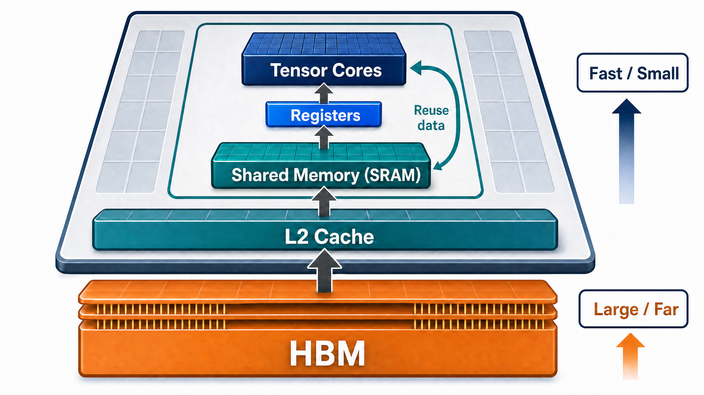
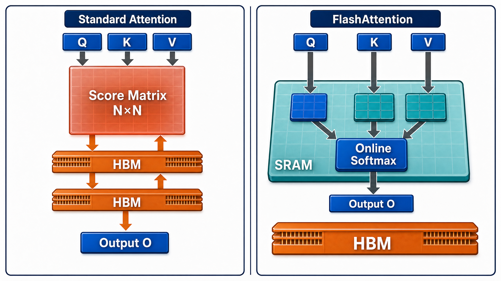
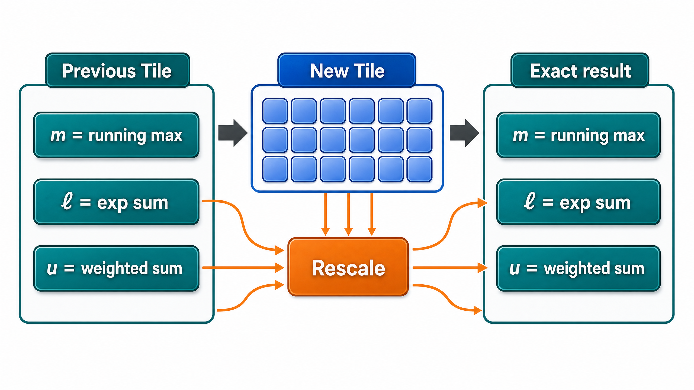
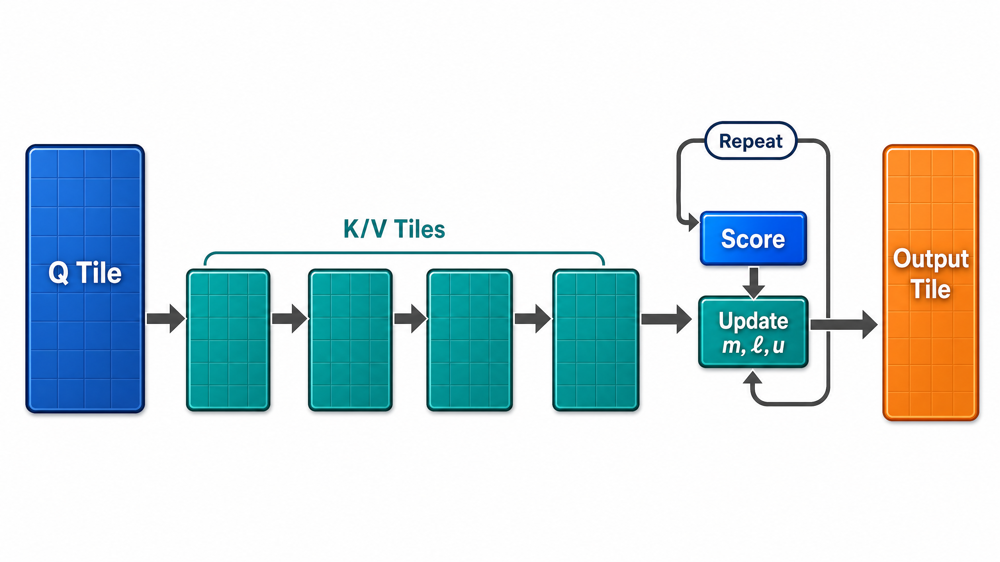

# 从 GPU 存储层级到 FlashAttention：一份以数据搬运为主线的学习笔记

> **一句话主线：** FlashAttention 没有让注意力的核心矩阵乘法凭空消失；它重新安排了中间结果的生命周期，使大量本不必写入 HBM 的 `N×N` 分数与概率不再离开片上高速存储。

| 文档信息 | 内容 |
| --- | --- |
| 面向读者 | 已了解 Transformer 自注意力、希望进一步理解 GPU/推理优化的学习者 |
| 阅读前提 | 矩阵乘法、稳定 Softmax、PyTorch 张量形状 |
| 本文重点 | GPU 存储层级、访存受限、Online Softmax、Tiling、可验证的流式 Attention 模拟 |
| 配套代码 | [`flashattention_learning_lab.py`](./flashattention_learning_lab.py) |
| 配套插图 | [`figures/`](./figures/) 中的 4 幅原创教学图 |
| 资料基础 | DataWhale 指定教程、FlashAttention 原始论文与 NVIDIA 官方资料，均列于文末 |

---

## 0. 致谢、来源与学习路线

本文是围绕 **DataWhale** 两份学习材料重新编排的原创学习笔记。DataWhale 通过开源学习模式提供 AI 学习路线、课程与社群连接；如果你希望系统学习相关主题，可以从其[官方网站][1]和 [GitHub 组织页][2]进入。本文特别参考了《GPU 物理架构与内存层级》和《FlashAttention 模拟》两份教程的主题选择与练习方向，但**未按原教程段落或 TODO 顺序复写**；所有图示、文字组织、公式推导、代码接口和实验叙事均为本笔记的独立教学整理。[3] [4]

建议按照“**看图建立直觉 → 用公式守住不变量 → 跑代码验证等价性 → 再回到硬件审视 IO**”的顺序学习。这样可以避免把 FlashAttention 误解为某个神秘的 API，或者误解成把 attention 的二次计算复杂度直接改成了线性。

| 学完后应能回答的问题 | 本文位置 |
| --- | --- |
| 为什么算力很高的 GPU 仍会被内存拖慢？ | 第 1 章 |
| 标准 Attention 的 `N²` 痛点具体落在什么张量上？ | 第 2 章 |
| 不保留完整 score，Softmax 为什么仍能精确？ | 第 3 章 |
| 怎样用 PyTorch 写出数值等价的流式实现？ | 第 4 章 |
| 为什么这个 Python 程序不等于生产级 FlashAttention kernel？ | 第 5 章 |

---

## 1. 先建立硬件直觉：GPU 是一座“搬运距离决定效率”的工厂

GPU 的高吞吐来自大量并行计算单元，尤其是适合矩阵乘加（MMA）的 Tensor Core。但计算单元能否持续工作，不只取决于峰值 FLOPs，还取决于数据能否以足够快的速度送到它附近。V100 引入 Tensor Core 后，GPU 架构持续围绕混合精度矩阵计算、片上数据复用、显存带宽与设备互连演进；Hopper 进一步提供 Tensor Memory Accelerator（TMA）、线程块簇以及异步数据搬运机制。[3] [7]



> **看图要点：** 这张图的重点不是某个精确的纳秒数字，而是数据移动的方向。越靠近 Tensor Cores 的层级，容量越稀缺、可复用的价值越高；越远离计算单元，容量越大，但每一次往返都更应该“物有所值”。

### 1.1 四层存储：谁负责什么？

| 层级 | 可把它想成什么 | 典型作用 | 对 kernel 设计的启示 |
| --- | --- | --- | --- |
| **寄存器（Registers）** | 每个线程手边的便签 | 暂存标量、累积器与局部变量 | 极快但极少；寄存器压力过大可能降低并发，甚至触发 spilling。 |
| **共享内存（Shared Memory / SRAM）** | 同一线程块共用的白板 | 让线程块协作加载、重用一个 tile | 适合将会被多次使用的小块输入暂驻片上。 |
| **L2 Cache** | 多个 SM 共用的缓冲区 | 缓冲重复的全局内存访问 | 有帮助但通常不能成为算法正确性的假设；访问局部性仍然重要。 |
| **HBM / Global Memory** | 大仓库 | 保存模型权重、输入输出和大规模张量 | 容量、带宽都很强，但相对 Tensor Core 的吞吐仍可能不够。 |

H100 SXM 的官方规格列出 3.35 TB/s 的 GPU 内存带宽和 900 GB/s 的 NVLink 互连带宽；这些高数字并不等于任意算子都能“免费访问”数据，反而说明持续增长的矩阵计算吞吐会更迫切地要求片上复用。[6] 例如，若多个逐元素算子都分别从 HBM 读取同一个大张量、处理后再写回，程序可能主要花时间在搬数据而非运算。

### 1.2 用算术强度而不是“算子名称”判断瓶颈

一个很有用的第一近似是**算术强度**：

\[
\operatorname{Arithmetic\ Intensity}=\frac{\text{FLOPs}}{\text{Bytes moved to/from main memory}}.
\]

当分子很小或分母很大时，算子更可能是 **memory-bound**：算力等数据；当这个比值足够高时，算子才更可能接近 **compute-bound**：数据已经到位，计算单元成为限制。这个概念不是对每个 kernel 的精确诊断，却能直接解释两个实践经验：**融合算子**可以减少中间张量的 HBM 往返；**分块（tiling）**可以提升一次加载后的复用次数。

| 常见现象 | 更值得怀疑的第一原因 | 优先追问 |
| --- | --- | --- |
| 多个轻量逐元素操作串联却很慢 | 中间结果反复读写 HBM | 能否融合？同一数据能否在片上多用几次？ |
| GEMM 很大且 Tensor Core 利用率低 | 布局、维度、供数或调度问题 | 是否满足合适的数据类型、对齐与 tile 形状？ |
| 多卡扩展效率低 | 通信处于关键路径 | 拓扑是 PCIe、NVLink 还是跨节点网络？能否重叠通信与计算？ |

### 1.3 一个重要的澄清：带宽 ≠ 延迟 ≠ 总性能

带宽衡量持续传输大量数据的能力；延迟描述一次小访问等待多久；总性能还受并发度、访问合并、缓存命中、寄存器使用、线程块调度及同步开销影响。因而不应从“共享内存快”跳到“所有数据都应放共享内存”的结论。片上空间有限，优秀 kernel 的本质是选择**哪一块数据最值得暂驻**。

---

## 2. 标准 Attention 的 IO 账本：问题从哪里突然变成 `N²`？

先考察单个 attention head。设序列长度为 \(N\)，head dimension 为 \(d\)，则

\[
Q,K,V\in\mathbb{R}^{N\times d},\qquad
S=\frac{QK^\top}{\sqrt d}\in\mathbb{R}^{N\times N},\qquad
O=\operatorname{softmax}(S)V.
\]

计算 `Q @ K.T` 的 FLOPs 随 \(N^2d\) 增长，这是 attention 的计算成本；但朴素实现若显式保存 `S`，就会同时制造一个 \(N\times N\) 的大中间量。若还将 Softmax 概率 `P` 单独物化，就又增加一个同形状张量。



> **看图要点：** 左图的问题不是 `QK^T` 这次乘法“非法”，而是 `Score Matrix N×N` 被写出去、再读回来、再产生概率矩阵。右图的策略则是让一个局部 score tile 在 SRAM 内快速经历“求最大值—指数化—和 V 相乘—合并状态”，然后消失。

### 2.1 用形状而不是直觉估算显存

下面的表按 **一个 batch 中所有 heads** 粗略统计前向激活；为凸显趋势，暂不纳入 batch、mask、dropout 和反向传播保存项。若元素类型为 FP16/BF16（2 bytes），则 score 与概率矩阵各占 \(2HN^2\) bytes，其中 \(H\) 是 head 数。

| 张量 | 形状 | 元素数 | 增长阶 |
| --- | --- | --- | --- |
| Q、K、V | 各为 \(N\times H\times d\) | \(3NHd\) | \(O(N)\) |
| score `S` | \(H\times N\times N\) | \(HN^2\) | \(O(N^2)\) |
| 概率 `P` | \(H\times N\times N\) | \(HN^2\) | \(O(N^2)\) |
| 输出 `O` | \(N\times H\times d\) | \(NHd\) | \(O(N)\) |

在配套代码的设定中，`H=32`、`d=128`、FP16/BF16。`N=4096` 时，单独的 score 张量就约为 **1024 MiB**，score 与概率合计约为 **2048 MiB**；当 `N` 加倍时，这两项约增至四倍。真实训练的峰值还要叠加反向传播、框架临时张量和模型其余层，因此表格是“看清 N² 来源”的下界式教学估算，而不是部署预算。[3] [4]

### 2.2 先分清三种复杂度，避免过度宣传

| 维度 | 标准实现 | FlashAttention / 流式精确 attention 的核心变化 |
| --- | --- | --- |
| 数学结果 | 精确 attention | 仍是精确 attention，不是近似替代品。 |
| 主导计算量 | `QKᵀ` 和 `PV` 仍为二次量级 | 没有神奇消除主要矩阵乘法 FLOPs。 |
| 大型中间激活 | 会显式持有 `N×N` score/probability | 不物化完整 score/probability，额外行级状态保持线性规模。 |
| HBM IO | 中间量可能多次写出、读回 | 以 tiling 减少 HBM 与片上 SRAM 间的读写。[5] |

FlashAttention 原论文将此视作 **IO-aware exact attention**：优化目标不只是做更少的算术，而是显式考虑 HBM 与片上 SRAM 之间的访问。[5] 这也说明它比“把 softmax 换成别的近似函数”更贴近系统优化的本质。

---

## 3. Online Softmax：只带着三个状态，也能得到完整 Softmax

这是整件事最容易被误解、也最有价值的数学部分。标准稳定 Softmax 对一行分数向量 \(x\) 写作

\[
\operatorname{softmax}(x)_j=
\frac{e^{x_j-m}}{\sum_t e^{x_t-m}},\qquad m=\max_t x_t.
\]

如果把一行 keys 按 tile 分成 \(B_1,B_2,\ldots\)，看似必须先看完所有 score 才知道全局最大值 \(m\)。Online Softmax 的关键发现是：历史数据不需要逐元素保留；对每个 query 行，只需保留足够的**可合并状态**。



### 3.1 三个状态是什么？

对已经处理的 key 集合 \(A\)，定义

\[
m_A=\max_{j\in A}s_j,\qquad
\ell_A=\sum_{j\in A}e^{s_j-m_A},\qquad
u_A=\sum_{j\in A}e^{s_j-m_A}v_j.
\]

最终的 attention 输出并不是 \(\nu_A\) 本身，而是 \(o_A=\nu_A/\ell_A\)。这里将 \(\nu\) 称作“未归一化的加权分子”。与每个 tile 都直接更新归一化输出相比，把分子与分母分开保存有一个教学上的优点：我们能清楚看见，所谓的“修正旧输出”实际上是**对历史分子与历史分母施加同一个指数重标定**。

| 状态 | 每个 query 行的形状 | 含义 | 初始化 |
| --- | --- | --- | --- |
| \(m\) | `1` | 到目前为止看过的最大 score | \(-\infty\) |
| \(\ell\) | `1` | 以当前最大值为基准的指数质量 | `0` |
| \(\nu\) | `d` | 以当前最大值为基准的 value 加权分子 | 全零向量 |

### 3.2 新 tile 到来时怎样合并？

设新 tile 为 \(B\)，它自己的局部最大值为 \(m_B\)。新旧两部分统一到一个共同的数值稳定基准：

\[
m' = \max(m_A,m_B).
\]

旧状态本来按 \(m_A\) 缩放；现在基准改成 \(m'\)，所以历史部分需要乘修正系数

\[
\alpha=e^{m_A-m'}.
\]

新 tile 自己的权重为

\[
W_B=e^{S_B-m'},
\]

其中减法按行广播。于是合并式为

\[
\ell'=\alpha\ell_A+\sum_j(W_B)_j,
\]

\[
\nu'=\alpha\nu_A+W_BV_B,
\]

\[
o'=\frac{\nu'}{\ell'}.
\]

这就是 Online Softmax 的不变量：在处理任意数量的 tile 后，`m` 始终是已见 score 的最大值，`ℓ` 与 `ν` 始终是围绕该最大值重标定过的完整历史归约。因而在最后一个 tile 后，`ν / ℓ` 与一次性对整行做稳定 Softmax 完全一致。

> **数值稳定性的关键不是“总要减最大值”，而是“旧的基准变了以后，历史项也必须变到同一个基准”。** 忘掉 \(e^{m_A-m'}\) 这一步，分块程序通常仍能运行，却不再等价于正确 Softmax。

### 3.3 一个两块的微型心算例子

假设第一块的最大 score 为 `2`，第二块的最大 score 为 `5`。当第二块到来时，新的基准是 `5`，第一块的所有已累积指数项必须乘 `exp(2 - 5)=exp(-3)`。这并不是丢失第一块；相反，这是把“以 2 为零点”的历史指数换算为“以 5 为零点”的同一批真实数值。用有限状态保存历史并进行基准转换，是流式算法能保持精确性的原因。

---

## 4. 从公式到程序：一个可验证的 Tiled Streaming Attention

下面的实现只处理形状为 `[sequence_length, head_dim]` 的单头 Q/K/V，故意省略 batch/head 维度，以便把注意力放在 Online Softmax 状态而不是张量维度操作上。它是一个**算法模拟器**：代码使用 Python 循环来展示 tile 的生命期，因而不应期待在 CPU 或普通 eager PyTorch 下比内置 Attention 更快。



### 4.1 先写一个密集基线：它就是数值真值

```python
import math
import torch


def dense_attention_reference(q: torch.Tensor, k: torch.Tensor, v: torch.Tensor) -> torch.Tensor:
    """显式创建完整 score 矩阵的 scaled dot-product attention。"""
    if q.ndim != 2 or q.shape != k.shape or q.shape != v.shape:
        raise ValueError("q、k、v 必须是同形状的二维张量 [sequence_length, head_dim]。")

    scores = (q @ k.transpose(0, 1)) / math.sqrt(q.shape[1])
    probabilities = torch.softmax(scores, dim=-1)
    return probabilities @ v
```

这里的 `scores` 是最重要的对照对象。它完整存在，便于解释，却正是长上下文里希望避免物化的 `N×N` 张量。代码没有任何错误；在适合的形状和 kernel 下，它也可能很快。优化的契机来自更长的序列和更紧的激活/IO 预算。

### 4.2 流式内核：每次只持有一个 score tile

```python
def streaming_attention_exact(
    q: torch.Tensor,
    k: torch.Tensor,
    v: torch.Tensor,
    tile_size: int,
) -> torch.Tensor:
    """以 Online Softmax 逐块扫描 K/V 的精确 attention 前向模拟。"""
    if tile_size <= 0:
        raise ValueError("tile_size 必须为正整数。")
    if q.ndim != 2 or q.shape != k.shape or q.shape != v.shape:
        raise ValueError("q、k、v 必须是同形状的二维张量 [sequence_length, head_dim]。")

    sequence_length, head_dim = q.shape
    scale = 1.0 / math.sqrt(head_dim)
    output = torch.empty_like(q)

    for q_start in range(0, sequence_length, tile_size):
        q_stop = min(q_start + tile_size, sequence_length)
        q_tile = q[q_start:q_stop]
        rows = q_tile.shape[0]

        running_max = torch.full((rows, 1), -torch.inf, dtype=q.dtype, device=q.device)
        running_mass = torch.zeros((rows, 1), dtype=q.dtype, device=q.device)
        numerator = torch.zeros((rows, head_dim), dtype=q.dtype, device=q.device)

        for kv_start in range(0, sequence_length, tile_size):
            kv_stop = min(kv_start + tile_size, sequence_length)
            k_tile = k[kv_start:kv_stop]
            v_tile = v[kv_start:kv_stop]

            score_tile = (q_tile @ k_tile.transpose(0, 1)) * scale
            tile_max = score_tile.max(dim=-1, keepdim=True).values
            next_max = torch.maximum(running_max, tile_max)

            old_rescale = torch.exp(running_max - next_max)
            tile_weights = torch.exp(score_tile - next_max)
            next_mass = old_rescale * running_mass + tile_weights.sum(dim=-1, keepdim=True)
            next_numerator = old_rescale * numerator + tile_weights @ v_tile

            running_max = next_max
            running_mass = next_mass
            numerator = next_numerator

        output[q_start:q_stop] = numerator / running_mass

    return output
```

这段函数中，`q_tile` 在内层 `K/V` 扫描期间保持不变。`score_tile` 的尺寸至多为 `tile_size × tile_size`，用完即被下一个 tile 覆盖。真正跨循环保存的只有三组行级状态：`running_max`、`running_mass` 和 `numerator`。

| 代码行或变量 | 对应数学对象 | 容易犯的错误 | 为什么这样写 |
| --- | --- | --- | --- |
| `running_max = -inf` | \(m\) | 初始化成零 | score 可为负；负无穷可保证第一块一定接管最大值。 |
| `running_mass = 0` | \(\ell\) | 忘记保留列维度 | `shape=[rows,1]` 才能沿 head dimension 正确广播。 |
| `score_tile` | \(S_B\) | 先把所有块拼成全局 score | 只创建当前 Q/K 组合的局部块。 |
| `old_rescale` | \(e^{m_A-m'}\) | 只修正分母、不修正分子 | 分子与分母都必须切换到相同指数基准。 |
| `numerator / running_mass` | \(\nu/\ell\) | 每一步误以为一定要保留归一化输出 | 分子与分母分开累积，最后相除更直观。 |

### 4.3 用测试而不是肉眼确认“看起来对”

```python
def verify_exactness() -> None:
    cases = [(7, 5, 3, 11), (13, 8, 4, 29), (17, 6, 5, 47)]
    for sequence_length, head_dim, tile_size, seed in cases:
        generator = torch.Generator().manual_seed(seed)
        q = torch.randn(sequence_length, head_dim, dtype=torch.float64, generator=generator)
        k = torch.randn(sequence_length, head_dim, dtype=torch.float64, generator=generator)
        v = torch.randn(sequence_length, head_dim, dtype=torch.float64, generator=generator)

        reference = dense_attention_reference(q, k, v)
        streamed = streaming_attention_exact(q, k, v, tile_size=tile_size)
        max_error = (reference - streamed).abs().max().item()
        print(f"N={sequence_length}, d={head_dim}, tile={tile_size}, error={max_error:.3e}")
        torch.testing.assert_close(reference, streamed, rtol=1e-12, atol=1e-12)
```

本笔记已在 CPU 版 PyTorch 上执行配套完整代码，三组不规则大小的测试所得最大绝对误差分别约为 `3.331e-16`、`2.220e-16` 与 `3.331e-16`。测试特意包含无法被 tile size 整除的序列长度，防止“只有齐整切块才正确”的假象。浮点误差阈值会受 dtype、设备和运行路径影响；这里使用 `float64` 的目的只是让教学验证更严格，不代表实际 GPU kernel 采用 FP64。

```text
=== Dense Attention 的中间激活增长（32 heads, head_dim=128, BF16/FP16）===
       N |        score |      score+P |  dense total | stream state
     512 |       16.0 MiB |       32.0 MiB |       48.0 MiB |        8.1 MiB
    4096 |     1024.0 MiB |     2048.0 MiB |     2176.0 MiB |       65.0 MiB
   16384 |    16384.0 MiB |    32768.0 MiB |    33280.0 MiB |      260.0 MiB
  131072 |  1048576.0 MiB |  2097152.0 MiB |  2101248.0 MiB |     2080.0 MiB

=== 数值等价性验证 ===
N= 7, d= 5, tile=3: max_abs_error=3.331e-16
N=13, d= 8, tile=4: max_abs_error=2.220e-16
N=17, d= 6, tile=5: max_abs_error=3.331e-16
```

### 4.4 运行方式与完整代码

安装 PyTorch 后，可在本笔记所在目录执行下列命令。完整可运行实现还附有 `attention_activation_report`、单行状态追踪和格式化报告，位于[配套源码](./flashattention_learning_lab.py)。

```bash
python3 flashattention_learning_lab.py
```

> **实验边界：** 这个程序验证的是“分块 Online Softmax 的**数学等价性**”与“显式 `N²` 中间激活的规模直觉”。它没有把 Python 循环编译为融合 GPU kernel，因此不能用其运行时间证明 FlashAttention 的真实性能优势。

---

## 5. 从这个模拟器走向生产 Kernel：还缺少什么？

生产级 FlashAttention 不是把上面的双层 `for` 循环搬到 GPU 就结束了。真正的 kernel 需要让 tile 在合适的 SM 上执行、让数据从 HBM 有序进入共享内存/寄存器、让矩阵乘法走高吞吐路径，并将软最大值归约、mask、dropout（训练时）与 `PV` 尽可能融合到少量 kernel 中。原始 FlashAttention 论文正是以减少 HBM 与 SRAM 间访问为中心设计这一过程。[5]

| 教学模拟器中的对象 | 真实 kernel 中的对应问题 | 需要的工程能力 |
| --- | --- | --- |
| Python 外层 Q tile 循环 | 哪些 Q tiles 由哪些 thread blocks / warps 负责 | 并行 work partitioning 与 occupancy 设计 |
| Python 内层 K/V tile 循环 | 如何分阶段载入 K/V，避免计算等待内存 | Shared memory layout、流水线与异步 copy |
| `q_tile @ k_tile.T` | 如何高效发射矩阵乘加 | Tensor Core 友好的形状、数据类型、布局与指令选择 |
| `max/sum/exp` | 如何降低非矩阵部分的开销 | warp 级归约、向量化、算子融合 |
| `output = numerator / mass` | 如何减少额外读写 | 在寄存器中保留累积器，仅写回最终输出 |

Hopper 的 TMA 能在全局内存与共享内存间高效搬运大块数据，异步执行与线程块簇则给“搬运、计算、同步重叠”提供了更丰富的硬件表达方式。[7] 这正是 FlashAttention 的硬件含义：不是让算法脱离硬件，而是让算法的中间状态规模和搬运顺序更符合硬件层级。

### 5.1 关于 FlashAttention 版本演进的正确打开方式

版本名不应成为死记硬背题。更可靠的理解方式是用同一张问题清单观察改进：**是否减少了非矩阵部分？是否改善了线程块工作划分？是否更好重叠数据搬运和 Tensor Core 计算？是否针对新架构增加了可利用的异步路径？** DataWhale 的模拟教程将 V1 的 tiling/online softmax、V2 的工作划分优化，以及面向 Hopper 的异步特性放在同一条演进线上；学习时更应抓住这组可迁移的问题，而不是把实现细节当作不变结论。[4]

---

## 6. 一个可迁移的性能分析框架

### 6.1 Tile size 不是越大越好

较大的 tile 可能提升局部复用与矩阵乘法效率，却会占用更多共享内存和寄存器，导致同一 SM 可并发的线程块减少；较小 tile 留出更多并发空间，却增加循环、同步与边界处理次数。好的 tile 大小由硬件资源、head dimension、数据类型、因果 mask、序列长度和 kernel 实现共同决定，不能直接从 Python 演示中的 `tile_size=128` 推导出生产最佳值。

| 选择 | 潜在好处 | 潜在代价 | 应验证的指标 |
| --- | --- | --- | --- |
| 更大的 tile | 一次加载后复用更多，矩阵块更饱满 | shared memory / registers 压力上升 | occupancy、寄存器溢出、实际吞吐 |
| 更小的 tile | 更灵活，资源占用较低 | 循环与同步开销增加，算术强度可能降低 | kernel launch / loop 开销、Tensor Core 利用率 |
| 更多融合 | 少落地中间张量 | kernel 复杂度和寄存器压力上升 | HBM 读写、编译后资源使用 |
| 更低精度 | 数据更小、矩阵吞吐更高 | 数值范围与误差控制更难 | 精度、溢出、训练/推理质量 |

### 6.2 单卡 IO 优化以后，瓶颈会迁移

当单卡 attention 的 HBM IO 被优化，端到端系统不一定就自动变快。大模型可能在 KV Cache、权重带宽、跨 GPU All-Reduce/All-Gather 或网络通信上受限。节点内 NVLink 与 PCIe 的带宽差异会影响跨卡数据移动，H100 SXM 的官方规格列出 900 GB/s NVLink；但是否能接近这个数仍取决于拓扑、通信库、数据规模和计算通信重叠。[6]

> **自己的判断顺序：** 先问“瓶颈是计算、HBM、还是通信”；再问“这个瓶颈是否处在关键路径”；最后才决定应该改算法、改 kernel、改并行策略还是改系统拓扑。仅凭某个名词“FlashAttention”“NVLink”“Tensor Core”无法替代测量。

### 6.3 常见误解校正

| 误解 | 更准确的说法 |
| --- | --- |
| “FlashAttention 把 attention 的计算量降为 O(N)” | 它主要避免物化 `N²` 中间矩阵并减少相关 IO；精确 dense attention 的主导矩阵乘法仍是二次量级。 |
| “只要有 HBM，访问就不可能慢” | HBM 很快，但相对大量 Tensor Core 的需求，低算术强度或反复中间写回仍会成为限制。 |
| “Online Softmax 是近似” | 正确维护最大值、指数质量与加权分子时，它与稳定 Softmax 精确等价。 |
| “本节 Python 循环就是 FlashAttention” | 它复现算法不变量，不复现 GPU 并行调度、SRAM 访问和融合 kernel 的性能路径。 |
| “GPU 互连带宽高，分布式一定扩展好” | 通信只有在处于关键路径且被合理调度时才会决定收益；拓扑与重叠同样重要。 |

---

## 7. 自检练习：把知识变成判断能力

**练习一：** 将配套脚本中的 `sequence_lengths` 改为 `2048, 8192, 32768`，手算 score 规模在序列长度翻倍时的倍率，并和程序输出对照。然后把 `num_heads` 从 `32` 改为 `16`，判断改变 heads 与改变 sequence length 哪一个对 score 矩阵影响更剧烈。

**练习二：** 在 `trace_one_query_row` 中观察 `running_max`。尝试寻找一个随机种子，使它在第二个或第三个 tile 才升高。解释一旦最大值升高，为什么 `running_mass` 不能简单累加。

**练习三：** 为 `streaming_attention_exact` 加入因果掩码。提示：对当前 Q tile 与 K tile 生成全局位置索引，当 key 位置晚于 query 位置时，把对应 score 设置为 `-inf`。实现后应将密集基线也加入同一 mask，并继续通过数值等价性测试。

**练习四：** 不写代码，只画出一个“Prefill 与 Decode 的瓶颈对比”表。思考：长 prompt 的 prefill 为什么更接近本笔记的矩阵/IO 问题，而逐 token decode 为什么常被 KV Cache 读取与批处理策略主导？这个问题将帮助你把单个 attention kernel 放回完整 LLM 推理系统。

---

## 8. 结语：把 FlashAttention 记成一个通用范式

FlashAttention 最值得迁移的思想是：当一个大计算由大量中间结果的“生成—存储—再读取—归约”构成时，不应先问能否把数学算得更少，而应问：**历史是否可由有限状态概括？新的数据到来时，历史状态能否在一个共同基准上精确合并？**

Online Softmax 的答案是肯定的。`m`、`ℓ` 和 `ν` 是足够状态；`exp(m_old - m_new)` 是在基准变化时保持精确性的桥梁；tiling 则把这个数学结构映射到 GPU 的 SRAM/HBM 层级。最终，我们得到的不是一个减少计算正确性的近似，而是一条更少暴露大型中间张量、更符合硬件数据路径的精确计算路线。

---

## 参考资料

[1]: https://www.datawhale.cn/ "DataWhale 官方网站"
[2]: https://github.com/datawhalechina "DataWhale GitHub 组织"
[3]: https://github.com/datawhalechina/llm-algo-leetcode/blob/main/01_Hardware_Math_and_Systems/03_GPU_Architecture_and_Memory.ipynb "DataWhale：GPU 物理架构与内存层级"
[4]: https://github.com/datawhalechina/llm-algo-leetcode/blob/main/02_PyTorch_Algorithms/20_FlashAttention_Sim.ipynb "DataWhale：FlashAttention 模拟"
[5]: https://arxiv.org/abs/2205.14135 "Dao et al. FlashAttention: Fast and Memory-Efficient Exact Attention with IO-Awareness, 2022"
[6]: https://www.nvidia.com/en-us/data-center/h100/ "NVIDIA H100 GPU 官方规格"
[7]: https://developer.nvidia.com/blog/nvidia-hopper-architecture-in-depth/ "NVIDIA Hopper Architecture In-Depth"

> **使用提示：** 本文的配图用于解释概念和数据流，不是硬件规格图或真实性能基准。将任何 tile、精度或版本结论用于真实训练/推理前，请针对目标 GPU、模型形状与软件栈进行 profiling。
