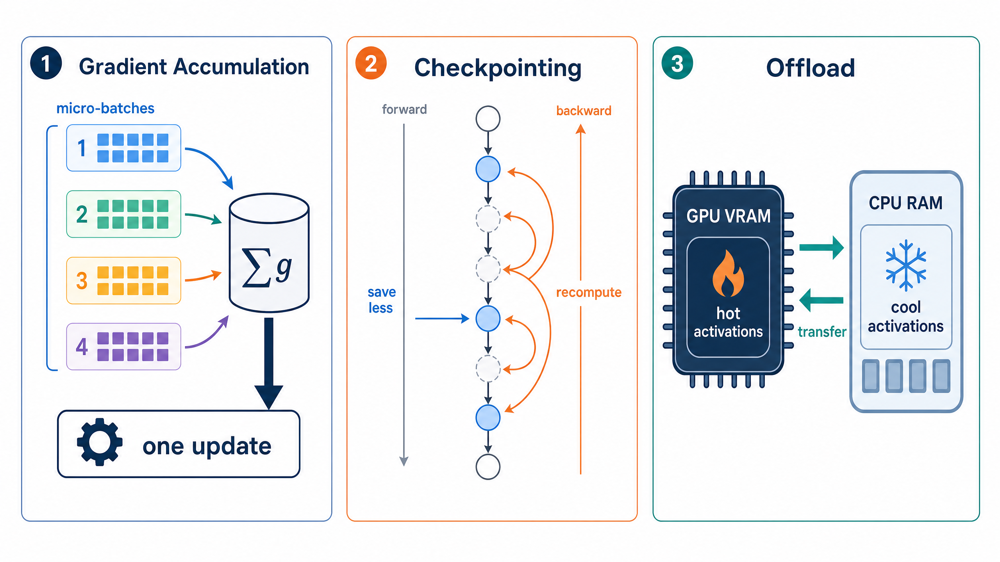
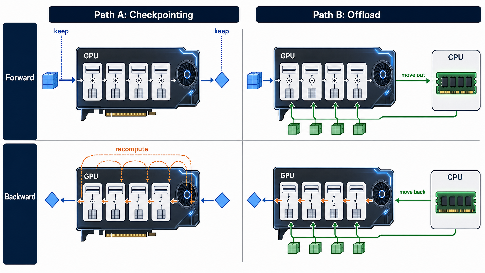

# PyTorch 训练显存优化：从梯度累积到 Activation Checkpointing 与 Activation Offload

> **一句话总览：** 当显存不足时，梯度累积通过“**拆小 batch、攒一次梯度**”降低单次计算的激活峰值；激活检查点通过“**少存、需要时重算**”减少反向传播依赖的中间状态；激活卸载通过“**先搬到 CPU、反向再取回**”把 GPU 显存压力转移为主机内存与传输压力。三者解决的是同一张训练显存账本中的不同部分，因此通常可以组合，而不应被视为互斥开关。

| 项目 | 内容 |
| --- | --- |
| 适读人群 | 已会写基本 PyTorch 训练循环，希望理解大模型训练显存优化的学习者与工程实践者。 |
| 覆盖主题 | 梯度累积、激活值、激活检查点、CPU 激活卸载、基准测量、策略组合。 |
| 对应教程 | Datawhale `12_Gradient_Accumulation`、`19_Activation_Checkpointing_and_Activation_Offload`、`42_Activation_Offload`。 |
| 配套实验 | [`code/memory_optimization_lab.py`](code/memory_optimization_lab.py)，包含可运行的正确性测试、offload 计划器和可选 CUDA 基准。 |
| 配套图片 | 本文两张原创概念图由 **GPT Image 2** 生成；数值图由实验脚本在真实 CUDA 环境中测量后绘制。 |

---

## 目录

1. [学习目标与来源](#1-学习目标与来源)
2. [先建立一张训练显存账本](#2-先建立一张训练显存账本)
3. [三条路线的全景对照](#3-三条路线的全景对照)
4. [路线一：梯度累积](#4-路线一梯度累积)
5. [路线二：Activation Checkpointing](#5-路线二activation-checkpointing)
6. [路线三：Activation Offload](#6-路线三activation-offload)
7. [把三条路线放进同一个决策框架](#7-把三条路线放进同一个决策框架)
8. [可复现实验、可视化与验证结果](#8-可复现实验可视化与验证结果)
9. [常见误区与个人思考](#9-常见误区与个人思考)
10. [引用与延伸阅读](#10-引用与延伸阅读)

---

## 1. 学习目标与来源

这不是对原教程的逐段转写，而是一份围绕“**为什么显存会满、每种策略究竟改变了什么、怎样验证它没有改坏训练语义**”重新组织的学习笔记。原教程将梯度累积、检查点与卸载拆成三项独立练习；本文则把它们放入同一张显存账本中，通过一套完整脚本把概念、代码正确性与实际性能测量连起来。

Datawhale 以开源学习模式提供课程、学习路线与实践资源，[\[1\]][1] 本文选取的三份 Notebook 分别对应梯度累积、激活检查点与激活卸载。[\[2\]][2] [\[3\]][3] [\[4\]][4] 强烈建议在读完本笔记后回到原教程完成其中的练习，再运行本文的整合实验做对照。

| 学完后应能回答的问题 | 对应章节 |
| --- | --- |
| 为什么 `loss / accum_steps` 有时对、有时不够严谨？ | [梯度累积的严格等价性](#42-严格等价性与损失缩放) |
| 有效 batch size 与真实显存峰值是什么关系？ | [梯度累积的边界](#45-梯度累积不能解决什么) |
| Checkpoint 到底保存什么、反向时又重算什么？ | [机制与 PyTorch 接口](#52-机制与-pytorch-接口) |
| Offload 是否等于“把整个模型搬到 CPU”？ | [真正被搬运的对象](#62-真正被搬运的对象) |
| 如何用自己的 GPU 得到可信的显存—时间曲线？ | [可复现实验](#8-可复现实验可视化与验证结果) |

---

## 2. 先建立一张训练显存账本

推理通常只需一次前向传播；而训练还要构建并保留 Autograd 为反向传播所需的中间信息。更准确地说，计算图本身未必复制大量张量，但图会持有某些张量的引用；这些供 backward 使用的张量称为 **saved tensors**。[\[6\]][6] 在 eager 训练中，随着前向传播走深，待反向使用的激活逐步积累，峰值通常出现在反向刚开始之前。[\[7\]][7]

因此，下面的分解并不是精确的硬件模型，却是十分实用的调试起点：

$$
M_{\text{train}} \approx M_{\text{params}} + M_{\text{grads}} + M_{\text{optimizer}} + M_{\text{activations}} + M_{\text{temporary}}.
$$

| 分量 | 直观含义 | 最直接的影响因素 | 本文策略是否直接减少它 |
| --- | --- | --- | --- |
| `params` | 模型权重 | 参数量、dtype、模型并行 | 三者都**不直接**减少。 |
| `grads` | 参数梯度 | 可训练参数量、dtype | 三者都**不直接**减少。 |
| `optimizer` | Adam 一阶/二阶矩等状态 | 优化器类型、可训练参数量 | 三者都**不直接**减少。 |
| `activations` | 为 backward 保存的中间结果 | micro-batch、序列长、隐藏维、层数、算子实现 | 三者都以不同机制作用于它。 |
| `temporary` | 临时工作区、通信缓冲、碎片等 | 内核、编译器、分配器、通信 | 可能间接受影响，但不应把它当作保证。 |

> **判断 OOM 的第一问不应是“要不要开 checkpoint”，而应是“当前 OOM 的主导分量是什么”。** 如果权重、梯度或 Adam 状态已经占满显存，只改 activation 策略可能效果有限；如果 OOM 随着序列长度、micro-batch 或层数明显恶化，激活值通常才是优先排查对象。

---

## 3. 三条路线的全景对照



上图强调了一个容易混淆的事实：三条路线的“节省对象”和“付出代价”不同。梯度累积让单次 forward/backward 只处理小块数据；checkpoint 让一部分中间激活不在前向阶段常驻；offload 则让部分激活离开 GPU、在需要时返回。前两者主要分别用更多小循环与更多计算换空间，后者主要用传输和主机内存换 GPU 空间。

| 策略 | 前向阶段做的改变 | 反向阶段的代价 | 最适合缓解的压力 | 不会直接减少的部分 |
| --- | --- | --- | --- | --- |
| 梯度累积 | 一次仅处理一个 micro-batch。 | 多次 `backward()`，但一个逻辑 batch 只更新一次。 | 单个 batch 的激活峰值。 | 参数、梯度、优化器状态。 |
| 激活检查点 | 指定区域只保留边界输入等必要信息，不保存区域内所有中间激活。 | 为恢复所需激活而重新执行该区域的一部分前向。 | 深网络、长序列导致的激活常驻。 | 参数、梯度、优化器状态。 |
| 激活卸载 | 将某些 saved tensors 从 GPU 停放到 CPU 主机内存。 | 在 backward 使用前传回目标设备。 | GPU 显存是硬上限且主机侧容量充足的场景。 | 总激活字节数，只是改变存放位置。 |

---

## 4. 路线一：梯度累积

### 4.1 它究竟模拟了什么

假设一个逻辑 batch 有 $N$ 个样本，被拆为 $K$ 个 micro-batch，第 $j$ 个 micro-batch 有 $n_j$ 个样本。若单样本损失为 $\ell_i$，完整 batch 的均值损失为：

$$
L = \frac{1}{N}\sum_{i=1}^{N}\ell_i, \qquad N=\sum_{j=1}^{K}n_j.
$$

只要参数在这 $K$ 次前向/反向期间保持不更新，目标梯度就是：

$$
\nabla L = \frac{1}{N}\sum_{j=1}^{K}\nabla\left(\sum_{i\in \mathcal{B}_j}\ell_i\right).
$$

这解释了“多次 backward、一次 step”的必要性：一旦在中途 `optimizer.step()`，后一个 micro-batch 用的已是新参数，数学上就不再等价于同一个完整 batch。

### 4.2 严格等价性与损失缩放

在 **每个 micro-batch 大小完全相同**、损失采用 `reduction='mean'` 的常见情形中，下面两种写法等价：对每次均值损失除以 `accum_steps` 再 backward，或累积梯度后在 step 前除以总样本数。[\[2\]][2]

不过，最后一个 micro-batch 往往较小。此时机械地执行 `loss_mean / accum_steps` 会让每个 micro-batch 获得同等权重，而非每个**样本**获得同等权重。为了在不丢弃尾部样本时保持严格的 full-batch mean 等价性，下面的实现使用 `reduction='sum'` 累加所有样本梯度，再在一次更新前统一除以 `N`。

```python
import torch
import torch.nn as nn
import torch.nn.functional as F


class TinyClassifier(nn.Module):
    def __init__(self, in_features: int = 8, classes: int = 4) -> None:
        super().__init__()
        self.layers = nn.Sequential(
            nn.Linear(in_features, 32),
            nn.GELU(),
            nn.Linear(32, classes),
        )

    def forward(self, x: torch.Tensor) -> torch.Tensor:
        return self.layers(x)


def iter_micro_batches(batch: dict[str, torch.Tensor], micro_batch_size: int):
    """沿第 0 维同步切分 batch 中的每一个张量。"""
    if micro_batch_size <= 0:
        raise ValueError("micro_batch_size must be positive")
    sizes = {value.size(0) for value in batch.values()}
    if len(sizes) != 1:
        raise ValueError("all tensors in batch must share dimension 0")
    batch_size = sizes.pop()
    for start in range(0, batch_size, micro_batch_size):
        stop = min(start + micro_batch_size, batch_size)
        yield {name: value[start:stop] for name, value in batch.items()}


def accumulated_step(
    model: nn.Module,
    optimizer: torch.optim.Optimizer,
    batch: dict[str, torch.Tensor],
    micro_batch_size: int,
    max_grad_norm: float | None = None,
) -> float:
    """用多个 micro-batch 完成一次严格的逻辑 batch 更新。"""
    model.train()
    optimizer.zero_grad(set_to_none=True)
    num_samples = batch["labels"].size(0)
    total_loss_sum = 0.0

    for micro_batch in iter_micro_batches(batch, micro_batch_size):
        logits = model(micro_batch["features"])
        # 对样本求和而非求均值，避免最后小 micro-batch 被错误放大。
        micro_loss_sum = F.cross_entropy(
            logits, micro_batch["labels"], reduction="sum"
        )
        micro_loss_sum.backward()
        total_loss_sum += micro_loss_sum.detach().item()

    # 将“总损失梯度”变回“逻辑 batch 均值损失的梯度”。
    for parameter in model.parameters():
        if parameter.grad is not None:
            parameter.grad.div_(num_samples)

    # 梯度裁剪也应只在完整的累积梯度形成后做一次。
    if max_grad_norm is not None:
        torch.nn.utils.clip_grad_norm_(model.parameters(), max_grad_norm)

    optimizer.step()
    return total_loss_sum / num_samples
```

这段代码有四个值得逐行把握的点。第一，`iter_micro_batches` 对字典中的每一个张量使用同一段 `[start:stop]`，这对应真实 SFT batch 中 `input_ids`、`attention_mask`、`labels` 必须同步切分的要求。[\[2\]][2] 第二，`zero_grad` 只能在逻辑更新开始时调用，否则会抹掉前面 micro-batch 已积累的梯度。第三，`backward()` 在每轮 micro-batch 后立即执行，使该 micro-batch 的计算图可以释放，因而峰值激活显存接近 micro-batch 而不是完整 batch。第四，`optimizer.step()` 只出现一次，保持这次更新的参数语义与完整 batch 对齐。

### 4.3 有效 batch、调度器与 AMP

单卡时常用近似关系为：

$$
\text{effective batch} = \text{micro batch} \times \text{accumulation steps}.
$$

在数据并行训练里，还要乘以 `world_size`。更重要的是，学习率调度器、全局 step 日志和模型 checkpoint 通常应以 **optimizer update** 而不是 dataloader iteration 计数。也就是说，累积 8 次才发生一次 `optimizer.step()`，调度器一般也应只走一步。

混合精度时的顺序也不能随意交换。缩放器应缩放每个 micro-batch 的损失；累积完成后再 `unscale_`、裁剪、`step` 和 `update`。下面是可直接嵌入训练循环的 AMP 版本；它与前一节的 sample-weighted 思路相同。

```python
from torch.amp import GradScaler, autocast

scaler = GradScaler("cuda")
optimizer.zero_grad(set_to_none=True)
logical_batch_size = batch["labels"].size(0)

for micro_batch in iter_micro_batches(batch, micro_batch_size=4):
    with autocast(device_type="cuda", dtype=torch.float16):
        logits = model(micro_batch["features"])
        loss_sum = F.cross_entropy(
            logits, micro_batch["labels"], reduction="sum"
        )
    scaler.scale(loss_sum).backward()

# 先将累积的“总和梯度”转换为逻辑 batch 的“均值梯度”。
for parameter in model.parameters():
    if parameter.grad is not None:
        parameter.grad.div_(logical_batch_size)

scaler.unscale_(optimizer)
torch.nn.utils.clip_grad_norm_(model.parameters(), max_norm=1.0)
scaler.step(optimizer)
scaler.update()
optimizer.zero_grad(set_to_none=True)
```

### 4.4 如何用一次测试证明实现没悄悄变义

验证的核心不是“loss 看起来在下降”，而是从相同初始参数出发，分别走一次 full batch 和梯度累积，然后逐个对比参数。配套脚本中使用 13 个样本、`micro_batch_size=3`，故意包含不完整尾 batch；CPU 实测的最大参数绝对差为 `7.45e-09`，说明上述写法在浮点误差范围内对齐。

```python
import copy

# batch、TinyClassifier 和 accumulated_step 已如上定义。
torch.manual_seed(7)
batch = {
    "features": torch.randn(13, 8),
    "labels": torch.randint(0, 4, (13,)),
}
initial = TinyClassifier()
full_model = copy.deepcopy(initial)
accum_model = copy.deepcopy(initial)

full_optimizer = torch.optim.SGD(full_model.parameters(), lr=0.05)
accum_optimizer = torch.optim.SGD(accum_model.parameters(), lr=0.05)

full_optimizer.zero_grad(set_to_none=True)
full_loss = F.cross_entropy(full_model(batch["features"]), batch["labels"])
full_loss.backward()
full_optimizer.step()

accumulated_step(accum_model, accum_optimizer, batch, micro_batch_size=3)
max_difference = max(
    (a - b).abs().max().item()
    for a, b in zip(full_model.parameters(), accum_model.parameters())
)
assert max_difference < 1e-6
print(f"max parameter difference: {max_difference:.2e}")
```

### 4.5 梯度累积不能解决什么

梯度累积降低的是每次 forward/backward 所需的 activation 峰值，不会让模型权重、梯度或优化器状态凭空变小。[\[2\]][2] 此外，它并不等价于“训练速度一定不变”：更小的 micro-batch 可能降低 GPU 利用率，更多 Python 循环、通信时机和 kernel launch 也可能改变吞吐。因此，梯度累积的正确定位是 **让有效 batch 在较小的单步激活峰值下可实现**，而不是通用的显存压缩术。

---

## 5. 路线二：Activation Checkpointing

### 5.1 从“保存”切换为“重算”

激活检查点的基本思想是：将某一段前向包进 checkpoint 区域后，前向阶段不为该区域中的每个操作保存全部中间张量；反向需要这些张量时，再重新运行这一段前向来恢复它们。[\[5\]][5] [\[7\]][7] 因此，它显式地将一部分计算时间换成激活显存空间。



上图左半部分的蓝色边界节点是 checkpoint 的直觉：不是整个网络都遗忘，而是保留足以重新开始局部前向的边界状态；虚线中间态不长期保留，反向时沿橙色路径再次计算。实践中最常见、最易推理的粒度是 Transformer block 级别，而不是把每一个很小的算子各自包一层。

### 5.2 机制与 PyTorch 接口

下面给出一个可运行的残差 MLP stack。`mode="checkpoint"` 时，`checkpoint(block, x, use_reentrant=False)` 将完整 block 作为重算边界。`use_reentrant=False` 是当前 API 中应明确指定的现代路径；更细的语义、RNG 状态与限制应以 PyTorch 官方文档为准。[\[5\]][5]

```python
import copy
import torch
import torch.nn as nn
import torch.nn.functional as F
from torch.utils.checkpoint import checkpoint


class ResidualMLPBlock(nn.Module):
    def __init__(self, dim: int) -> None:
        super().__init__()
        self.norm = nn.LayerNorm(dim)
        self.ffn = nn.Sequential(
            nn.Linear(dim, dim * 4),
            nn.GELU(),
            nn.Linear(dim * 4, dim),
        )

    def forward(self, x: torch.Tensor) -> torch.Tensor:
        return x + self.ffn(self.norm(x))


class BlockStack(nn.Module):
    def __init__(self, dim: int, depth: int, mode: str = "baseline") -> None:
        super().__init__()
        self.blocks = nn.ModuleList(ResidualMLPBlock(dim) for _ in range(depth))
        self.mode = mode

    def forward(self, x: torch.Tensor) -> torch.Tensor:
        for block in self.blocks:
            if self.mode == "checkpoint":
                x = checkpoint(block, x, use_reentrant=False)
            else:
                x = block(x)
        return x


# 同一组参数、同一输入下，检查点只应改变存储/重算路径，而不改变数值结果。
torch.manual_seed(11)
normal = BlockStack(dim=16, depth=3, mode="baseline")
checkpointed = copy.deepcopy(normal)
checkpointed.mode = "checkpoint"
x_a = torch.randn(2, 5, 16, requires_grad=True)
x_b = x_a.detach().clone().requires_grad_(True)
target = torch.randn(2, 5, 16)

loss_a = F.mse_loss(normal(x_a), target)
loss_b = F.mse_loss(checkpointed(x_b), target)
loss_a.backward()
loss_b.backward()

assert torch.allclose(loss_a, loss_b, atol=1e-6)
assert torch.allclose(x_a.grad, x_b.grad, atol=1e-6)
for parameter_a, parameter_b in zip(normal.parameters(), checkpointed.parameters()):
    assert torch.allclose(parameter_a.grad, parameter_b.grad, atol=1e-6)
```

这段测试校验了两件事。第一，`loss_a` 和 `loss_b` 对齐，意味着前向输出一致。第二，输入梯度和每个参数梯度也对齐，意味着 checkpoint 没有改变优化器将要看到的梯度。配套脚本在 CPU 环境已通过上述断言；真正的显存收益则必须在 CUDA 环境中测量，而不应靠模型规模之外的固定百分比承诺。

### 5.3 粒度是一个可调旋钮，而不是二元选择

checkpoint 的“开或关”太粗糙。将一整个 block 作为单位通常容易维护；只 checkpoint 某些层或某些区域，则可以在峰值显存和重算时间之间精细调节。PyTorch 也提供了更细粒度的 selective checkpointing 思路，用策略决定哪些操作应保存、哪些应倾向重算。[\[7\]][7]

| 粒度方案 | 内存倾向 | 时间倾向 | 适合先尝试的场景 |
| --- | --- | --- | --- |
| 不使用 checkpoint | 最高 | 最快的基线 | 显存充足，需要建立可信基线。 |
| 每个 Transformer block | 较低 | 重算更明显 | 大多数训练代码的第一选择。 |
| 每隔若干 block | 中等 | 中等 | 需要在既定显存预算内收敛调参。 |
| 选择性保存高代价操作 | 可精细控制 | 避免重算昂贵操作 | 已有 profiler 证据、模型结构稳定的进阶场景。 |

需要特别注意的是，checkpoint 会再次执行被包裹的前向逻辑。因此区域内若有状态更新、与随机数有关的行为、不可重放的副作用或依赖外部状态的逻辑，应先阅读 API 文档并做梯度正确性测试。不要把“输出看上去能跑”误当作“训练语义正确”。

---

## 6. 路线三：Activation Offload

### 6.1 从“重算”切换为“搬运”

checkpoint 的答案是“我不留，之后再算”；offload 的答案是“我仍然留，但不留在 GPU”。保存到 CPU 的激活需要在 backward 使用时回到计算设备，因此真正的工程约束从 GPU 容量转向了 **CPU 内存容量、主机—设备互连带宽、传输调度和同步开销**。原教程用一个简化计划器把“节省字节数”和“搬运时间”放到同一张账上，这个抽象非常适合建立直觉。[\[4\]][4]

### 6.2 真正被搬运的对象

一个重要澄清：使用 `torch.autograd.graph.save_on_cpu` 时，目标是 Autograd 为 backward 保存的张量，并不等价于把模型参数、当前输出或整个 `nn.Module` 全部搬到 CPU。PyTorch 的 saved tensor hooks 允许开发者控制张量被保存时的 pack 与需要时的 unpack；官方教程也展示了将 saved tensors 保存到 CPU，并在需要时移回原设备的模式。[\[6\]][6]

下面的包装器把某个模块的 saved tensors 放入 CPU。若在 CUDA 环境中可用，`pin_memory=True` 使主机端张量可以使用页锁定内存；它可能有助于传输，但并不保证收益，仍须测量。

```python
import torch
import torch.nn as nn


class SaveActivationsOnCPU(nn.Module):
    """包装模块；只改变其 saved-for-backward 张量的保存位置。"""
    def __init__(self, module: nn.Module, pin_memory: bool = True) -> None:
        super().__init__()
        self.module = module
        self.pin_memory = pin_memory

    def forward(self, *args, **kwargs):
        with torch.autograd.graph.save_on_cpu(
            pin_memory=self.pin_memory and torch.cuda.is_available(),
            device_type="cuda",
        ):
            return self.module(*args, **kwargs)


# 使用示例：只包装希望卸载激活的区域，而不是无差别地包住整个模型。
model = nn.Sequential(
    nn.Linear(16, 64),
    nn.GELU(),
    SaveActivationsOnCPU(nn.Linear(64, 64)),
    nn.GELU(),
    nn.Linear(64, 4),
).cuda()
inputs = torch.randn(8, 16, device="cuda")
labels = torch.randint(0, 4, (8,), device="cuda")
loss = torch.nn.functional.cross_entropy(model(inputs), labels)
loss.backward()
```

上面的 demo 明确要求 CUDA；CPU 环境不应伪造“GPU offload 已验证”的结论。实际工程里，应先在一个或几个经过 profiler 确认的高激活区域上做选择性包裹，再观察峰值显存、端到端 step time 和 CPU RAM。无差别地卸载所有区域很可能会让带宽或同步成为新的瓶颈。

### 6.3 一个可审计的最小计划器

在做真实 Hook 之前，先用“激活块”建立决策草图很有价值。设需离开 GPU 的激活总量为 $A_{\text{offload}}$，可用单向带宽为 $bw$ GiB/s，则理想单向传输时间近似为：

$$
t_{\text{one-way}}(\mathrm{ms}) \approx 1000\cdot\frac{A_{\text{offload}}}{bw\cdot 2^{30}}.
$$

一次训练 step 往往至少涉及一次 GPU→CPU 与一次 CPU→GPU，因此仅把该估计乘以二才接近**传输量级**，但仍没有包含同步、争用和运行时调度。下面的计划器按 `keep_score` 从低到高卸载，目的是提供可解释的启发式，而不是假装替代真实性能分析。

```python
from dataclasses import dataclass
from typing import Iterable


@dataclass(frozen=True)
class ActivationChunk:
    name: str
    bytes_: int
    keep_score: float
    offloadable: bool = True


@dataclass(frozen=True)
class OffloadPlan:
    total_bytes: int
    kept_bytes: int
    offloaded_bytes: int
    gpu_budget_bytes: int
    transfer_ms_one_way: float
    saved_ratio: float
    offloaded_names: tuple[str, ...]


def plan_activation_offload(
    chunks: Iterable[ActivationChunk],
    gpu_budget_bytes: int,
    bandwidth_gbps: float,
) -> OffloadPlan:
    if gpu_budget_bytes <= 0 or bandwidth_gbps <= 0:
        raise ValueError("budget and bandwidth must both be positive")

    chunks = tuple(chunks)
    total = sum(chunk.bytes_ for chunk in chunks)
    kept = total
    offloaded: list[str] = []

    candidates = sorted(
        (chunk for chunk in chunks if chunk.offloadable),
        key=lambda chunk: (chunk.keep_score, chunk.bytes_, chunk.name),
    )
    for chunk in candidates:
        if kept <= gpu_budget_bytes:
            break
        kept -= chunk.bytes_
        offloaded.append(chunk.name)

    offloaded_bytes = total - kept
    one_way_ms = 1000.0 * offloaded_bytes / (bandwidth_gbps * 1024**3)
    return OffloadPlan(
        total_bytes=total,
        kept_bytes=kept,
        offloaded_bytes=offloaded_bytes,
        gpu_budget_bytes=gpu_budget_bytes,
        transfer_ms_one_way=one_way_ms,
        saved_ratio=(offloaded_bytes / total) if total else 0.0,
        offloaded_names=tuple(offloaded),
    )


mib = 1024**2
chunks = [
    ActivationChunk("embedding", 256 * mib, keep_score=0.95),
    ActivationChunk("block_01", 192 * mib, keep_score=0.25),
    ActivationChunk("block_02", 160 * mib, keep_score=0.10),
    ActivationChunk("logits", 128 * mib, keep_score=0.80),
]
plan = plan_activation_offload(
    chunks, gpu_budget_bytes=384 * mib, bandwidth_gbps=8.0
)
assert plan.kept_bytes == 384 * mib
assert plan.offloaded_names == ("block_02", "block_01")
print(f"saved={plan.saved_ratio:.1%}")
print(f"ideal one-way transfer={plan.transfer_ms_one_way:.2f} ms")
print(f"ideal round-trip≈{2 * plan.transfer_ms_one_way:.2f} ms")
```

在配套脚本的这组规格里，计划器选择卸载 `block_02` 和 `block_01`，将留在 GPU 的激活压到 `384 MiB`，激活节省比例为约 `47.8%`。若假定带宽为 `8 GiB/s`，它的理想单向传输估计为约 `42.97 ms`，双向约 `85.94 ms`。这正是为什么 offload 的评估不能只报告“省了多少显存”，还必须报告端到端时间。

### 6.4 什么时候优先 checkpoint，什么时候认真评估 offload

| 观察到的现象 | 更值得先试的路线 | 原因 |
| --- | --- | --- |
| OOM 对 micro-batch 极其敏感，但权重/优化器状态尚可 | 梯度累积 | 它直接降低单次 activation 峰值，改动最小。 |
| 深层或长上下文模型中激活占主导，GPU 计算仍是主要瓶颈 | Checkpoint | 重算通常比跨设备搬运更容易局部化，也更易组合。 |
| 已开 checkpoint 仍无法放入预算，CPU RAM 充裕、互连较快且有 profile 证据 | 选择性 offload | 将部分冷激活移出 GPU，换取空间。 |
| 参数/Adam 状态本身压倒性大 | 另寻参数/状态优化 | 本文三种策略都不能从根本上减少这些常驻状态。 |
| 仅凭“某方法节省 X%”的网上案例想直接启用 | 先测量 | 模型、序列长度、硬件、dtype 和 allocator 都会改变结论。 |

---

## 7. 把三条路线放进同一个决策框架

一个稳健的工程过程应从小到大、一次只改变一个变量。先获得没有优化的基线；然后以能运行的最小 micro-batch 找到梯度累积所需步数；再对最占激活的区域加入 block 级 checkpoint；最后才把 offload 限定在确有必要且通过 profile 证明的区域。每一步都同时检查 **数值正确性、峰值显存、端到端 step time 与吞吐**。

| 阶段 | 先回答的问题 | 建议的验证方式 | 通过标准 |
| --- | --- | --- | --- |
| 0. 基线 | 是否能以较小配置稳定跑完？ | 固定种子，记录 loss、显存峰值、step time。 | 有可比较的原始基线。 |
| 1. 累积 | 逻辑更新是否仍等于 full batch？ | 复制初始模型，对比单次更新后的每个参数。 | 差异仅为浮点误差。 |
| 2. Checkpoint | 前向和梯度是否未变？ | 对照输出、输入梯度与参数梯度。 | 所有断言通过。 |
| 3. Offload | 节省是否抵得上传输代价？ | 测 CUDA peak memory、同步后的 elapsed time、CPU RAM。 | 达到显存预算且训练吞吐可接受。 |
| 4. 组合 | 是否出现新的瓶颈？ | 重新 profile，比较单位有效 batch 的时间。 | 不仅不 OOM，还能接受实际训练成本。 |

我的实践建议是把这三种技术理解为控制“**激活生存期**”的三个杠杆：梯度累积缩短每轮里同时活跃的**样本范围**；checkpoint 缩短一部分激活在 GPU 上的**存活形式**，以重算恢复；offload 则改变激活的**存储地点**。这个视角比死记 API 更有用，因为它能自然解释它们为何能叠加，也能解释为什么它们对 optimizer state OOM 没有直接疗效。

---

## 8. 可复现实验、可视化与验证结果

### 8.1 运行方式

仓库中已附上完整的、没有省略代码的实验文件：[`code/memory_optimization_lab.py`](code/memory_optimization_lab.py)。它同时包含本文各代码片段、断言测试、offload 计划器与 CUDA 图表绘制函数，因此可作为复制到自己项目之前的最小验证场。

```bash
# 仅运行 CPU 正确性检查：梯度累积、checkpoint 数值对齐、offload 计划器。
python code/memory_optimization_lab.py

# 在有 CUDA 的 PyTorch 环境中运行真实基准，并把散点图写入 assets/。
python code/memory_optimization_lab.py \
  --benchmark \
  --plot assets/memory_time_tradeoff.png
```

运行第二条命令后，脚本会用 `torch.cuda.reset_peak_memory_stats()` 和 `torch.cuda.max_memory_allocated()` 记录本机的峰值已分配显存，用 `torch.cuda.synchronize()` 包住计时区间以避免异步 CUDA 造成虚假的短耗时，并生成横轴为峰值 MiB、纵轴为 forward + backward 毫秒数的真实散点图。不要把不同 GPU、不同 PyTorch 版本或不同 batch/sequence 配置的图混在一起比较。

### 8.2 本次环境的已验证结果

本次交付环境可运行 CPU 正确性测试，但没有 CUDA 设备，因此没有捏造任何 GPU 显存或吞吐数字。以下表格只报告实际运行得到的可核验输出。

| 验证项 | 实际结果 | 说明 |
| --- | --- | --- |
| 梯度累积与 full batch | 最大参数差 `7.45e-09` | 使用 13 个样本和大小为 3 的 micro-batch，包含不整除尾块。 |
| Checkpoint 正确性 | 输出损失与所检查梯度一致 | CPU 上验证数值路径；CPU 不报告 CUDA 显存收益。 |
| Offload 计划器 | 节省约 `47.8%`，理想单向传输约 `42.97 ms` | 这是由固定激活块规格与 `8 GiB/s` 假设得出的解释性估计，**不是硬件实测**。 |
| CUDA 显存—时间曲线 | 未在本环境生成 | 请在目标 GPU 上运行 `--benchmark` 获取可信图。 |

### 8.3 如何读出自己的散点图

如果图上的 checkpoint 点在 baseline 左侧，说明它降低了峰值 GPU 显存；若同时向下或接近 baseline，表示时间代价较小。若 offload 点虽明显向左却大幅上移，说明省下的显存是以传输时间为代价换来的。最终选点不是追求“最左”或“最下”，而是在你的显存上限与吞吐目标之间找到满足约束的 Pareto 折中。PyTorch 的官方技术文章也用速度—内存平面来解释 checkpoint 及其选择性变体的取舍。[\[7\]][7]

---

## 9. 常见误区与个人思考

| 误区 | 为什么不对 | 更好的做法 |
| --- | --- | --- |
| “累积 8 步，所以每轮 `loss / 8` 永远正确。” | 当最后一个 micro-batch 更小时，按 micro-batch 均值等权会改变每个样本的权重。 | 选择 `drop_last=True` 保证等尺寸，或使用本文的 sum-loss 再按总样本数归一化。 |
| “开 checkpoint 就一定省很多总显存。” | 它主要减少激活；如果模型状态占主要部分，总体节省可能有限。 | 分别测 `max_memory_allocated`、参数规模与优化器状态。 |
| “offload 把模型搬到 CPU，所以 GPU 肯定不 OOM。” | saved activation、权重、梯度和工作区是不同对象；offload 并不处理所有分量。 | 明确要搬的对象、区域和预算，先局部实验。 |
| “只要 forward 输出一致，优化就正确。” | 梯度才决定参数更新；重算/Hook 的错误可能只在 backward 暴露。 | 对照输出、输入梯度和参数梯度。 |
| “有了概念图就不用 profile。” | 图解释机制，profile 才回答你这块硬件和这段模型上是否划算。 | 固定配置，收集峰值显存、step time、吞吐与 CPU RAM。 |

### 9.1 一个更严格的组合观

三项优化的组合并不自动最优。假设先把 micro-batch 降得很小，GPU 已经处于低利用率，再把所有 block checkpoint，重算可能进一步降低有效吞吐；若随后又把所有激活 offload，频繁小传输可能使 CPU/GPU 同步成为主导。换句话说，**“能叠加”不等于“应全部拉满”**。

更好的原则是：让每项技术解决一个已经确认的瓶颈。梯度累积用于使目标有效 batch 可行；checkpoint 用于压缩确认由激活占主导的峰值；offload 留给“显存仍是硬约束、计算重算比传输更不可接受或已不足以解决问题”的情况。每加入一项，就重新测量一次。这样得到的是可解释的配置，而不是一组难以维护的开关。

### 9.2 一个可以迁移到大模型训练的检查清单

在真正的 SFT、LoRA 或全参数训练中，建议在提交长任务前确认：batch 字典的所有字段都同步切分；只在逻辑更新边界调用 optimizer、scheduler 与梯度裁剪；分布式日志中的 global step 定义为更新次数；checkpoint 包住的函数无不可重放副作用；offload 有足够 CPU RAM、测过带宽并用真实 step time 判定。最后，把未优化和优化版本的短程 loss 曲线、梯度范数及 checkpoint 恢复结果放在同一份实验记录里。

---

## 10. 引用与延伸阅读

本文以 Datawhale 三份指定 Notebook 为学习入口，并以 PyTorch 官方文档校验接口与机制性描述。除参考链接外，文中的结构、推导、代码组织、图解与工程建议均为重新整理的原创学习笔记。

1. [Datawhale 社区主页：开源学习、课程与学习路线][1]
2. [Datawhale：12. Gradient Accumulation][2]
3. [Datawhale：19. Activation Checkpointing and Activation Offload][3]
4. [Datawhale：42. Activation Offload][4]
5. [PyTorch Documentation：torch.utils.checkpoint][5]
6. [PyTorch Tutorial：Hooks for Autograd Saved Tensors][6]
7. [PyTorch Blog：Current and New Activation Checkpointing Techniques in PyTorch][7]

[1]: https://www.datawhale.cn/ "Datawhale 社区主页：开源学习、课程与学习路线"
[2]: https://github.com/datawhalechina/llm-algo-leetcode/blob/main/02_PyTorch_Algorithms/12_Gradient_Accumulation.ipynb "Datawhale：12. Gradient Accumulation"
[3]: https://github.com/datawhalechina/llm-algo-leetcode/blob/main/02_PyTorch_Algorithms/19_Activation_Checkpointing_and_Activation_Offload.ipynb "Datawhale：19. Activation Checkpointing and Activation Offload"
[4]: https://github.com/datawhalechina/llm-algo-leetcode/blob/main/02_PyTorch_Algorithms/42_Activation_Offload.ipynb "Datawhale：42. Activation Offload"
[5]: https://docs.pytorch.org/docs/2.13/checkpoint.html "PyTorch Documentation：torch.utils.checkpoint"
[6]: https://docs.pytorch.org/tutorials/intermediate/autograd_saved_tensors_hooks_tutorial.html "PyTorch Tutorial：Hooks for Autograd Saved Tensors"
[7]: https://pytorch.org/blog/activation-checkpointing-techniques/ "PyTorch Blog：Current and New Activation Checkpointing Techniques in PyTorch"

---

> **最后的行动建议：** 先运行 CPU 正确性测试；再在你的目标 GPU 上运行基准脚本；最后只保留能同时满足“训练语义正确、显存预算可控、吞吐可接受”的那一组配置。
