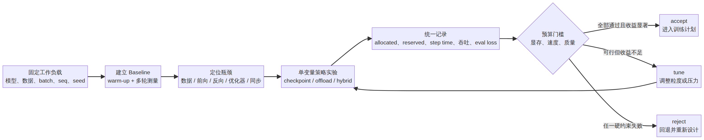
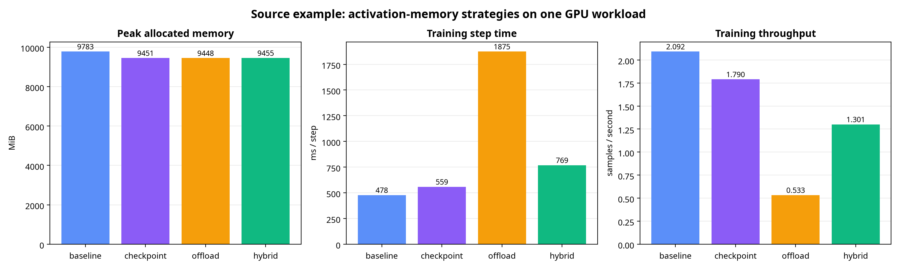
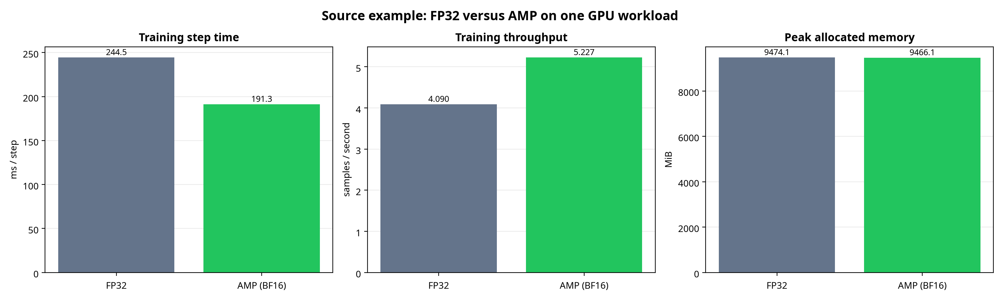

# 从“训练很慢/显存不够”到可审计决策：PyTorch 训练性能、激活检查点与卸载学习笔记

**面向场景**：你已经能写出 PyTorch 训练循环，但需要回答更工程化的问题：训练 step 到底慢在哪里？某个显存优化是否真的有效？显存下降以后，速度和质量是否仍在可接受范围内？
>
> 本文以 Datawhale 的三份项目型教程为学习入口，**重新组织、重新实现并扩展**为“**测量 → 对比 → 决策**”的实践闭环。它不复述原教程；所有示例代码均为本文重新编写，完整可运行源文件位于 [`code/`](./code/) 目录。


| 学习入口 | 本文重新提炼后的角色 | 原教程 |
|---|---|---|
| 训练性能分析 | 建立可复现的**测量口径**，而不是只看一次总耗时 | [73. Training Performance Analysis](https://github.com/datawhalechina/llm-algo-leetcode/blob/main/02_PyTorch_Algorithms/73_Training_Performance_Analysis.ipynb) |
| 激活检查点 / 卸载基准 | 在单变量控制下取得各个策略的**证据** | [76. Activation Checkpoint Offload Benchmark](https://github.com/datawhalechina/llm-algo-leetcode/blob/main/02_PyTorch_Algorithms/76_Activation_Checkpoint_Offload_Benchmark.ipynb) |
| 显存预算压缩项目 | 将证据代入显存、吞吐、质量约束，给出**工程决策** | [75. Memory Budget Compression Project](https://github.com/datawhalechina/llm-algo-leetcode/blob/main/02_PyTorch_Algorithms/75_Memory_Budget_Compression_Project.ipynb) |

本文首先向 [Datawhale 社区](https://datawhale.cn/) 与上述教程的贡献者致谢。文中的机制性描述还与 PyTorch 官方文档交叉核验，具体出处见文末参考文献。

---

## 目录

- [1. 先建立正确的问题：训练优化不是“跑得更快”](#1-先建立正确的问题训练优化不是跑得更快)
- [2. 训练 step 的成本模型与显存账本](#2-训练-step-的成本模型与显存账本)
- [3. 训练性能分析：可信测量的六条纪律](#3-训练性能分析可信测量的六条纪律)
- [4. 激活检查点与 CPU 卸载：两种交换方式](#4-激活检查点与-cpu-卸载两种交换方式)
- [5. 一个原创、可复现的策略基准](#5-一个原创可复现的策略基准)
- [6. 从结果到预算决策：accept / tune / reject](#6-从结果到预算决策accept--tune--reject)
- [7. 如何解读原教程给出的单机样例](#7-如何解读原教程给出的单机样例)
- [8. 我的思考：把“技巧列表”升级为决策系统](#8-我的思考把技巧列表升级为决策系统)
- [9. 实战检查清单](#9-实战检查清单)
- [参考文献与来源](#参考文献与来源)

---

## 1. 先建立正确的问题：训练优化不是“跑得更快”

一次训练优化至少有三个同时成立的目标：**训练速度**、**设备内存**与**训练质量**。若只比较 `step time`，很容易把问题看窄：某项修改也许缩短了一个 step，却增加了显存峰值；也许腾出了显存，却让 CPU↔GPU 数据搬运拖垮吞吐；也可能数值路径改变，使短期损失出现异常波动。因此，工程上的问题不是“哪个技巧最省显存”，而是：

> 在**固定任务与明确约束**下，哪一种策略在显存、吞吐与质量之间给出最值得保留的折中？

可以把训练 step 的墙钟时间粗略拆成：

$$
T_{\text{step}} \approx T_{\text{data}} + T_{\text{forward}} + T_{\text{backward}} + T_{\text{optimizer}} + T_{\text{sync}}
$$

其中，`data` 是数据准备与主机到设备的搬运，`forward/backward` 是模型计算，`optimizer` 是参数更新，`sync` 则包括显式同步、隐式同步、通信或等待。这个式子不是精确性能模型，而是一张**排障地图**：测出慢之后，才有资格讨论该优化数据、算子、梯度还是显存。

相应地，单卡训练的峰值显存可使用下面的账本理解：

$$
M_{\text{peak}} \approx M_{\text{parameters}} + M_{\text{gradients}} + M_{\text{optimizer}} + M_{\text{activations}} + M_{\text{temporary}} + M_{\text{allocator slack}}
$$

对于大模型微调，**激活**通常会随 batch size、序列长度、隐藏维度和层数快速增长；注意力模块还可能出现与序列长度平方相关的中间量。权重精度、优化器状态和缓存分配器也会影响峰值。因此，显存优化的前提不是猜测“激活一定最大”，而是用测量验证：在当前工作负载下，究竟是谁把峰值推高。



上图对应的可编辑 Mermaid 源码是 [`measurement_to_decision.mmd`](./figures/measurement_to_decision.mmd)。它给出全文的唯一主线：**任何优化都从一个可复现 baseline 出发，经过单变量实验，最后回到硬约束下的决策。**

---

## 2. 训练 step 的成本模型与显存账本

### 2.1 四个指标，缺一个都不完整

| 指标 | 计算方式 | 回答的问题 | 常见误读 |
|---|---|---|---|
| 平均 step time | $`\frac{T_{end}-T_{start}}{N}`$ | 一步训练的端到端延迟是否改善？ | CUDA 异步时不做同步，计到的只是 CPU 发射 kernel 的时间 |
| 吞吐 | $`\frac{\text{batch size} \times N}{T_{elapsed}}`$ | 单位时间实际处理了多少样本？ | 只看 step time，忽略 batch 或累积方式已改变 |
| peak allocated | `max_memory_allocated()` | 张量实际占用的峰值是否下降？ | 与 `reserved` 混为一谈 |
| eval loss / 质量指标 | 固定验证输入或验证集计算 | 性能收益是否以质量为代价？ | 只比较训练 loss，忽略泛化和随机性 |

PyTorch 的 `max_memory_allocated()` 返回指定设备上**张量占用**的历史峰值；在每个测量窗口前调用 `reset_peak_memory_stats()` 才能把窗口对齐。[\[6\]](https://pytorch.org/docs/stable/generated/torch.cuda.max_memory_allocated.html) PyTorch 还使用缓存分配器：`memory_reserved()` / `max_memory_reserved()` 表示分配器管理的总量，因此它可能显著高于张量实际占用，并且 `nvidia-smi` 的“已用显存”也不等同于 `allocated`。[\[7\]](https://pytorch.org/docs/stable/notes/cuda.html#memory-management)

**工程结论**：若目标是“这个模型/策略需要多少 GPU 容量”，优先报告 `peak allocated`，同时附上 `peak reserved` 来诊断缓存与碎片；不要把后者直接宣称为模型本体节省的显存。

### 2.2 为什么要记录峰值而不是最后一刻的显存

训练中许多临时张量只在少数算子或 backward 某一段出现。最后一行代码运行完以后看到的显存可能已经下降，却掩盖了曾经发生过的峰值 OOM 风险。容量规划需要的是最大值，而不是“收尾时还剩多少”。这也是本笔记所有基准都在 warm-up 后重置峰值统计的原因。

### 2.3 `allocated`、`reserved` 和 `empty_cache()`

| 概念 | 含义 | 适合用来回答什么 |
|---|---|---|
| `allocated` | 被活跃 PyTorch 张量占用的设备内存 | 策略是否真正降低张量峰值？ |
| `reserved` | PyTorch 缓存分配器保留、可复用的内存 | 是否存在明显缓存/碎片现象？ |
| `empty_cache()` | 释放**未使用**的缓存块给其他应用 | 进程间腾出缓存；**不能**释放仍被活跃张量占用的内存 |

官方文档明确说明，缓存分配器用于避免频繁分配时的设备同步；`empty_cache()` 只能释放未使用缓存，不能增加当前 PyTorch 工作负载实际可用的张量容量。[\[7\]](https://pytorch.org/docs/stable/notes/cuda.html#memory-management) 所以，把 `empty_cache()` 当作“解决模型 OOM 的通用按钮”通常是误区。

---

## 3. 训练性能分析：可信测量的六条纪律

Datawhale 的第 73 节强调训练分析应围绕 baseline 与证据收口，[\[1\]](https://github.com/datawhalechina/llm-algo-leetcode/blob/main/02_PyTorch_Algorithms/73_Training_Performance_Analysis.ipynb) 本文将其落成以下六条纪律。

| 纪律 | 必须固定/执行的内容 | 不这样做的后果 |
|---|---|---|
| 1. 固定工作负载 | 模型、数据、batch、seq len、优化器、seed、dtype、迭代数 | 不能把差异归因给某项策略 |
| 2. 预热 | 不计入首次若干步 | 首次编译、缓存、调度或分配污染均值 |
| 3. 同步计时 | CUDA 计时边界前后同步，或使用 CUDA Event | 得到虚假的“极快”CPU 发射时间 |
| 4. 多指标联合 | 时延、吞吐、allocated/reserved、质量一起记 | 把代价藏在未报告的维度中 |
| 5. 单变量实验 | 一轮只变 checkpoint、offload、AMP 或 batch 中的一个 | 结果不可解释也不可复现 |
| 6. 保存工件 | JSON、图表、环境、配置、决定理由 | 实验只能口头复述，无法复盘 |

CUDA 操作通常是异步排队的；PyTorch 官方文档建议在可靠墙钟计时中显式 `torch.cuda.synchronize()`，或使用 `torch.cuda.Event`。[\[5\]](https://pytorch.org/docs/stable/notes/cuda.html#asynchronous-execution) 因此，下面的计时器把同步视为测量协议的一部分，而不是“可选优化”。

```python
import time
import torch

def measure_steps(train_step, *, device, warmup=3, iters=20):
    """返回同一测量窗口内的平均 step time 与 GPU 峰值。"""
    for _ in range(warmup):
        train_step()

    if device.type == "cuda":
        torch.cuda.synchronize(device)
        torch.cuda.reset_peak_memory_stats(device)

    start = time.perf_counter()
    for _ in range(iters):
        train_step()
    if device.type == "cuda":
        torch.cuda.synchronize(device)
    elapsed = time.perf_counter() - start

    return {
        "step_time_ms": elapsed * 1_000 / iters,
        "peak_allocated_mb": (
            torch.cuda.max_memory_allocated(device) / 1024**2
            if device.type == "cuda" else None
        ),
        "peak_reserved_mb": (
            torch.cuda.max_memory_reserved(device) / 1024**2
            if device.type == "cuda" else None
        ),
    }
```

这段代码有四个关键点。第一，`warmup` 在时间窗之外；第二，测量的是**完整训练 step**，即 forward、loss、backward 和 optimizer update；第三，reset 发生在 warm-up 之后；第四，CPU 环境返回 `None`，而不是伪造一个“0 MiB GPU 显存”的结论。

### 3.1 从“总耗时”走到“瓶颈归因”

如果端到端耗时变差，仅凭一个柱状图无法判断原因。以下是很实用的第一轮切分表。

| 观察到的信号 | 优先怀疑 | 下一步证据 |
|---|---|---|
| GPU 利用率低，step 内有空洞 | 数据加载、CPU 预处理、H2D 拷贝 | profiler timeline、DataLoader worker、`pin_memory`、非阻塞拷贝 |
| forward 时间占比大 | attention、矩阵乘、序列长度 | 算子级 profiler、shape、FlashAttention/模型结构 |
| backward 时间占比大 | 激活重算、梯度图、checkpoint 粒度 | forward/backward 分段计时、checkpoint 范围 |
| `allocated` 接近卡容量 | 激活、长序列、临时 buffer | peak memory、memory snapshot、减小压力或改变策略 |
| `reserved - allocated` 很大 | 缓存/碎片/工作负载尺寸波动 | 分配器统计、固定 shape、谨慎评估 allocator 配置 |

这里的关键词是**优先怀疑**，而非直接断言。训练性能优化的价值在于把“感觉慢”转换为可证伪的假设。

---

## 4. 激活检查点与 CPU 卸载：两种交换方式


### 4.1 激活检查点：用计算换显存

默认训练会保留 forward 产生的许多中间激活，以便 backward 计算梯度。激活检查点不保存某个区域内的大部分中间量，而是在 backward 需要时**重新运行该区域 forward**。因此它把内存压力交换为额外计算。[\[4\]](https://docs.pytorch.org/docs/2.13/checkpoint.html)

$$
\text{checkpointing}:\qquad \downarrow M_{\text{activation}} \quad \text{in exchange for} \quad \uparrow T_{\text{backward}}
$$

PyTorch 的 `torch.utils.checkpoint.checkpoint` 正是这一语义：传入函数的输入会保留，而未保存的中间结果在 backward 期间按需重算。官方还推荐显式选择 `use_reentrant=False`；它支持更完整的 autograd 用法，并可在已重算所需张量后提前停止重算。[\[4\]](https://docs.pytorch.org/docs/2.13/checkpoint.html)

```python
from torch.utils.checkpoint import checkpoint

def forward_blocks(blocks, hidden, enable_checkpoint):
    for block in blocks:
        if enable_checkpoint:
            # 每一层是一个可控的 checkpoint 粒度。
            hidden = checkpoint(block, hidden, use_reentrant=False)
        else:
            hidden = block(hidden)
    return hidden
```

**粒度**是 checkpoint 的核心超参数。逐层 checkpoint 往往省得更多，却可能重算得更多；以若干层为段，则降低重算开销但保留更多激活。最佳粒度随模型结构、序列长度、GPU 算力和内存压力变化，不能从别人的 benchmark 直接照搬。

### 4.2 CPU 激活卸载：用数据搬运换显存

卸载不是“删除激活”。它是在 forward 阶段把 backward 将需要的保存张量放到主机侧；backward 发生时再搬回设备。`torch.autograd.graph.save_on_cpu` 提供了一个保存张量到 CPU 的上下文工具，适合教学或局部原型验证。[\[9\]](https://docs.pytorch.org/docs/2.13/autograd.html#torch.autograd.graph.save_on_cpu)

$$
\text{CPU offload}:\qquad \downarrow M_{\text{GPU activation}} \quad \text{in exchange for} \quad \uparrow T_{\text{transfer}} + \uparrow T_{\text{sync risk}}
$$

```python
from contextlib import nullcontext
import torch

def saved_tensor_context(strategy, device):
    if strategy in {"offload", "hybrid"} and device.type == "cuda":
        # pin_memory=True 只是一个待验证的搬运设计选择，不保证必然更快。
        return torch.autograd.graph.save_on_cpu(
            pin_memory=True,
            device_type="cuda",
        )
    return nullcontext()
```

卸载能否划算，取决于 PCIe/NVLink 拓扑、张量大小、主机内存、是否可与计算重叠以及模型的计算/通信比例。在算力很强、激活可重算较便宜的场景，checkpoint 常常更有竞争力；在 GPU 内存极紧而主机带宽足够时，offload 才可能成为必要选项。**“显存最低”不等于“训练最优”。**

### 4.3 Hybrid：两种代价可能相加

`hybrid` 同时启用 checkpoint 与 offload。它可能进一步降低 GPU 峰值，也可能只是在同一瓶颈上叠加了重算和搬运。因此不能预设 hybrid 一定更强；它只是需要被测量的第四个候选。

| 策略 | GPU 激活保存 | backward 额外工作 | 常见适用时机 | 首要风险 |
|---|---|---|---|---|
| baseline | 保存全部所需激活 | 无额外重算/搬运 | 显存充裕，作为对照 | 容量最紧张 |
| checkpoint | 少保存、按需重算 | 计算增加 | 重算相对便宜且激活压力大 | 反向变慢 |
| offload | 保存到 CPU，再取回 | 数据搬运增加 | GPU 极缺、主机内存/链路可用 | 吞吐断崖式下降 |
| hybrid | 同时少保存与部分卸载 | 重算与搬运都可能增加 | 仅当单策略不足时 | 复杂度高、收益不一定叠加 |

---

## 5. 一个原创、可复现的策略基准

本节的完整代码在 [`code/benchmark_memory_strategies.py`](./code/benchmark_memory_strategies.py)。它提供了一个 TinyTransformer 语言模型，并在完全相同的初始权重、输入 batch、优化器和测量轮数下比较 `baseline`、`checkpoint`、`offload`、`hybrid`。设计目标并非复刻某一张显卡上的绝对数字，而是把 Datawhale 教程的实验原则改写成可迁移的基准骨架。[\[2\]](https://github.com/datawhalechina/llm-algo-leetcode/blob/main/02_PyTorch_Algorithms/76_Activation_Checkpoint_Offload_Benchmark.ipynb)

### 5.1 运行方式

```bash
# 建议：在已安装支持 CUDA 的 PyTorch 的环境中运行。
python code/benchmark_memory_strategies.py \
  --seq-len 512 \
  --batch-size 2 \
  --depth 8 \
  --output-dir benchmark_output

# 输出：
# benchmark_output/benchmark_report.json
# benchmark_output/benchmark_summary.png
```

脚本在当前写作环境中已完成 Python 语法检查；此环境未安装 PyTorch，且没有可供运行的 CUDA，因此未伪造 GPU 结果。若没有 CUDA，脚本会明确退出而非输出假显存数据。请将其放到自己的 CUDA + PyTorch 环境复测。

### 5.2 工作负载与控制变量

```python
@dataclass(frozen=True)
class Workload:
    batch_size: int = 2
    seq_len: int = 256
    vocab_size: int = 2048
    d_model: int = 256
    n_heads: int = 8
    depth: int = 6
    ff_mult: int = 4
    warmup_steps: int = 2
    measured_steps: int = 6
    learning_rate: float = 1e-3
    seed: int = 2026
```

这组参数在每个候选策略间保持不变。尤其是 `seed`、输入 tokens、模型构造顺序都固定，以保证所有策略从相同权重开始。代码对每一种策略**重新创建模型和优化器**，避免 baseline 的参数更新历史泄漏给下一个候选。

### 5.3 训练 step 的核心实现

```python
def one_training_step(model, optimizer, inputs, labels, strategy, device):
    optimizer.zero_grad(set_to_none=True)
    with context_for_strategy(strategy, device):
        logits = model(inputs, use_checkpoint=strategy in {"checkpoint", "hybrid"})
        loss = F.cross_entropy(logits.flatten(0, 1), labels.flatten())
        loss.backward()
    optimizer.step()
    return float(loss.detach())
```

这里使用 `zero_grad(set_to_none=True)`，目的是让梯度缓冲在下一次 backward 中重新建立，减少不必要的清零工作；真正是否有收益仍需要在你的模型上测量。更重要的是，**只有策略上下文与 checkpoint 开关发生变化**，其他训练路径完全一致。

### 5.4 OOM 也应当是结果，而不是异常噪声

```python
def safe_run(strategy, cfg, device):
    try:
        return run_one_strategy(strategy, cfg, device)
    except torch.OutOfMemoryError as exc:
        torch.cuda.empty_cache()
        return {
            "name": strategy,
            "status": "oom",
            "error": str(exc).splitlines()[0],
        }
```

实验报告中保留 OOM 项是有意义的：它表明该候选在**当前压力与硬件上不可行**。但一个 OOM 不应被简单转译为“策略错误”，因为 batch、序列长度、模型规模和 allocator 状态都可能改变边界。

### 5.5 结果应保存为数据，而非只截图

每次运行会写出 JSON。建议至少保留如下字段：

```json
{
  "device": "<your GPU>",
  "torch_version": "<your torch version>",
  "cuda_version": "<your CUDA version>",
  "workload": {"batch_size": 2, "seq_len": 512, "depth": 8},
  "budget": {"memory_cap_mb": 10000, "min_samples_per_s": 1.0},
  "results": [
    {
      "name": "checkpoint",
      "step_time_ms": 0.0,
      "samples_per_s": 0.0,
      "eval_loss": 0.0,
      "peak_allocated_mb": 0.0,
      "peak_reserved_mb": 0.0
    }
  ],
  "decision": {"decision": "tune"}
}
```

其中 `<your ...>` 和 `0.0` 是结构示意，不是实验数据。JSON 让图表、预算模块、后续 CI 回归检查都能复用同一份原始证据。

---

## 6. 从结果到预算决策：accept / tune / reject


第 75 节的关键价值在于：它要求先写清**预算边界**，再选择方案。[\[3\]](https://github.com/datawhalechina/llm-algo-leetcode/blob/main/02_PyTorch_Algorithms/75_Memory_Budget_Compression_Project.ipynb) 这里采用三个硬约束和两个“值得保留”阈值。

$$
\begin{aligned}
\text{memory feasible} &\iff M_{peak} \le M_{cap}\\
\text{speed feasible} &\iff \text{throughput} \ge R_{min}\\
\text{quality feasible} &\iff \mathcal{L}_{eval} \le \mathcal{L}_{base}(1+\epsilon)
\end{aligned}
$$

只有三者同时成立，候选策略才进入“可行集合”。然后在可行集合内，根据峰值显存、吞吐、验证损失排序；再额外判断节省量和吞吐保留率是否达到团队定义的“有意义”阈值。

| 决策 | 含义 | 典型下一步 |
|---|---|---|
| `accept` | 满足全部硬约束，并有足够明确的净收益 | 固化配置，进入更长训练与回归测试 |
| `tune` | 可行，但显存收益太小、吞吐损失过大或不稳定 | 调 checkpoint 粒度、offload 范围、工作负载压力 |
| `reject` | 无任一候选同时满足显存、速度、质量 | 回退方案，重新构造候选或改变预算 |

完整实现位于 [`code/memory_budget_decision.py`](./code/memory_budget_decision.py)，并已在本地通过内置自检。核心逻辑如下。

```python
def decide_memory_plan(candidates, budget):
    rows, baseline, quality_cap = annotate_feasibility(candidates, budget)
    feasible = [row for row in rows if row["feasible"]]
    if not feasible:
        return {"decision": "reject", "reason": "No candidate meets all hard constraints."}

    feasible.sort(
        key=lambda row: (
            row["peak_allocated_mb"],
            -row["samples_per_s"],
            row["eval_loss"],
        )
    )
    best = feasible[0]
    memory_saving = baseline["peak_allocated_mb"] - best["peak_allocated_mb"]
    throughput_ratio = best["samples_per_s"] / baseline["samples_per_s"]

    decisive = (
        best["name"] != "baseline"
        and memory_saving >= budget.min_meaningful_saving_mb
        and throughput_ratio >= budget.min_throughput_ratio
    )
    return {"decision": "accept" if decisive else "tune", "best_candidate": best["name"]}
```

这段排序隐含一个**可修改的价值偏好**：先尽量低峰值显存，再尽量高吞吐，最后比较验证损失。如果项目是吞吐敏感的在线训练服务，可以调整为先最大化 `samples_per_s`；如果硬件卡容量是不可谈判的，则现在的词典序合理。把偏好写成代码，远比在讨论会里模糊地说“差不多可以”更可靠。

---

## 7. 如何解读原教程给出的单机样例

下面两张数值图均由 [`code/plot_datawhale_example_results.py`](./code/plot_datawhale_example_results.py) 根据原教程写出的 RTX 5070 Ti Laptop GPU 样例数据重新绘制。[\[1\]](https://github.com/datawhalechina/llm-algo-leetcode/blob/main/02_PyTorch_Algorithms/73_Training_Performance_Analysis.ipynb) [\[2\]](https://github.com/datawhalechina/llm-algo-leetcode/blob/main/02_PyTorch_Algorithms/76_Activation_Checkpoint_Offload_Benchmark.ipynb) 它们是**特定设备、特定模型、特定 PyTorch/CUDA 版本、特定 batch 与序列长度**下的一次教学记录，不是跨设备的普适基准。

### 7.1 策略 benchmark：checkpoint 值得留在候选集，offload 需要非常审慎



样例的压力工作负载使用 Qwen2.5-0.5B、FP32、AdamW、`batch=1`、`seq_len=768`。四个策略的验证损失一致，因此该次实验没有观察到质量差异；它把比较重点放在内存与效率。[\[2\]](https://github.com/datawhalechina/llm-algo-leetcode/blob/main/02_PyTorch_Algorithms/76_Activation_Checkpoint_Offload_Benchmark.ipynb)

| 样例策略 | peak allocated | step time | 吞吐 | 相对 baseline 的第一层结论 |
|---|---:|---:|---:|---|
| baseline | 9782.74 MiB | 478.113 ms | 2.092 samples/s | 对照组 |
| checkpoint | 9450.76 MiB | 558.504 ms | 1.790 samples/s | 节省 331.98 MiB（3.39%），吞吐降低 14.44% |
| offload | 9448.33 MiB | 1875.037 ms | 0.533 samples/s | 比 checkpoint 仅多省约 2.43 MiB，吞吐降低 74.52% |
| hybrid | 9454.64 MiB | 768.882 ms | 1.301 samples/s | 显存接近 checkpoint，但吞吐降低 37.81% |

这张图最值得学习的不是“checkpoint 总是最好”，而是**边际收益**。在这个工作负载中，offload 相对 checkpoint 几乎没有增加 allocated 显存收益，却带来巨大的吞吐损失。合理表述应是：“在这一组配置与预算下，checkpoint 是更有希望的候选；offload/hybrid 需要改变压力、拓扑或范围后才能再次证明其价值。”这比把某个单点胜负升级为一般规律更严谨。

### 7.2 AMP 样例：速度收益不自动等于显存收益



第 73 节还记录了一个 FP32 与 AMP（BF16）的单机对比：`step time` 从 244.490 ms 降至 191.331 ms，约降低 **21.74%**；吞吐从 4.090 增至 5.227 samples/s，约提高 **27.80%**；但 peak allocated 只从 9474.12 MiB 降到 9466.15 MiB，即约 **7.97 MiB**。[\[1\]](https://github.com/datawhalechina/llm-algo-leetcode/blob/main/02_PyTorch_Algorithms/73_Training_Performance_Analysis.ipynb)

这恰好是一个很好的反直觉例子：AMP 在该样例中带来了明显速度收益，却没有形成实质性 `allocated` 峰值下降。原因可能包括激活以外的显存主导项、某些张量仍保留高精度、allocator 行为以及模型实现细节。正确做法不是从这一个点推断 AMP“省/不省显存”，而是把它作为提醒：**优化手段的作用路径与最终峰值指标之间，并非一一对应。**

**不可直接横向比较的提醒**：AMP 图和策略图的序列长度、warm-up/测量轮数不同，因此不能把两张图的绝对吞吐或显存数值放到同一排行榜。它们各自只回答自己的控制变量问题。

---

## 8. 我的思考：把“技巧列表”升级为决策系统

### 8.1 “显存最小”是一个不完整的目标函数

很多显存笔记的终点是罗列技巧：减少 batch、AMP、checkpoint、offload、量化、ZeRO。这样的知识清单必要，但还不够。真正的项目必须区分“**把 OOM 变成可运行**”与“**把训练变成可交付**”。若 offload 使任务刚好不 OOM，却把吞吐降低到训练周期无法接受，它可能依旧是局部合理、全局不合理的选择。

我更倾向于把策略评估写成一个受约束优化问题：

$$
\min_{s \in \mathcal{S}}\; M_{peak}(s)\quad
\text{s.t.}\quad R(s)\ge R_{min},\quad
\mathcal{L}_{eval}(s)\le \mathcal{L}_{base}(1+\epsilon)
$$

其中 $`s`$ 是策略或策略组合。只有进入可行集合后，才值得讨论谁“最优”。这正是 76 的 benchmark 和 75 的预算决策应该分工的原因：前者负责提供测量，后者负责表达偏好与约束。

### 8.2 单点均值仍不够：建议增加置信信息

教程中的最小模板使用 warm-up + 平均值已经足以教学。但在真实项目中，建议记录更多统计量：至少重复若干独立 trial，报告中位数、P50/P95、最小/最大值，并记录 GPU 时钟、后台进程和数据缓存状态。原因很简单：若两个策略只差 1% 而运行波动本身有 3%，`accept` 结论没有证据强度。

一个可升级的结果表可以是：

| 策略 | median step ms | P95 step ms | peak allocated MiB | samples/s | eval loss | 结论 |
|---|---:|---:|---:|---:|---:|---|
| baseline | — | — | — | — | — | baseline |
| checkpoint | — | — | — | — | — | candidate |
| offload | — | — | — | — | — | candidate |
| hybrid | — | — | — | — | — | candidate |

### 8.3 质量守卫不应只是一条 loss 数字

用固定输入得到的 `eval_loss` 适合快速做**回归护栏**，但它并不替代完整验证。对于 SFT、分类、检索或生成任务，应把任务的核心指标纳入预算：例如准确率、F1、困惑度、BLEU、pass@k，或人工偏好指标。重要的是让质量门槛在实验前写出，而不是看到结果以后再修改标准。

### 8.4 压力测试比“轻量 smoke test”更能揭示策略边界

在低序列长度和小 batch 下，baseline 可能尚未逼近显存墙，checkpoint/offload 的收益自然难以显现。若目标是研究显存策略，应分层设计 workload：

| 档位 | 目的 | 典型配置策略 |
|---|---|---|
| smoke | 验证代码正确、loss/梯度没有异常 | 小 batch、小 seq、少量 step |
| realistic | 模拟日常训练设置 | 真实 batch/seq、代表性数据 |
| pressure | 放大激活压力、找容量边界 | 增大 seq 或 batch；仍保证可比较 |
| failure boundary | 找到 OOM / 吞吐不可接受的转折点 | 系统扫描一个变量，保存失败样本 |

这样做能回答一个更有价值的问题：**策略在哪个压力区间开始值得付出代价？**

---

## 9. 实战检查清单

### 9.1 实验前：先锁定边界

| 类别 | 必填项 |
|---|---|
| 环境 | GPU 名称、显存容量、驱动、PyTorch/CUDA 版本、是否开启 `torch.compile` |
| 工作负载 | 模型版本、dtype、batch、seq len、梯度累积、数据样本、seed |
| 训练 | 优化器、学习率、warm-up、测量步数、评估输入/验证集 |
| 策略 | checkpoint 粒度、offload 范围、`pin_memory`、混合精度配置 |
| 约束 | `memory_cap_mb`、`min_samples_per_s`、质量允许退化 $`\epsilon`$ |

### 9.2 实验中：保持可归因

- 每一轮只改变一个显存策略变量；不要同时改 batch、精度和 checkpoint 粒度。
- warm-up 后再 reset 峰值统计；用同步或 CUDA events 建立计时边界。
- 对 OOM、异常 loss、NaN、吞吐抖动保留原始记录，不要只保留“成功的图”。
- baseline 也必须跑同一套测量函数；不要从另一份旧日志中取数字。

### 9.3 实验后：形成可复盘结论

| 问题 | 合格回答示例 |
|---|---|
| 为什么尝试这个策略？ | baseline 的 peak allocated 超过 80% 卡容量，激活是主导压力项 |
| 改了什么？ | 仅将 transformer block 设为非重入 checkpoint；其余配置固定 |
| 得到了什么？ | 记录 step time、吞吐、allocated/reserved、验证质量与环境 JSON |
| 是否值得保留？ | 在预算下 `tune`：已可行，但节省量未达到预设阈值 |
| 下一步做什么？ | 在更长序列长度下扫描 checkpoint 段数，观察收益是否跨越阈值 |

---

## 参考文献与来源

| 编号 | 来源 |
|---|---|
| [\[1\]](https://github.com/datawhalechina/llm-algo-leetcode/blob/main/02_PyTorch_Algorithms/73_Training_Performance_Analysis.ipynb) | [Datawhale — 73. Training Performance Analysis](https://github.com/datawhalechina/llm-algo-leetcode/blob/main/02_PyTorch_Algorithms/73_Training_Performance_Analysis.ipynb) |
| [\[2\]](https://github.com/datawhalechina/llm-algo-leetcode/blob/main/02_PyTorch_Algorithms/76_Activation_Checkpoint_Offload_Benchmark.ipynb) | [Datawhale — 76. Activation Checkpoint Offload Benchmark](https://github.com/datawhalechina/llm-algo-leetcode/blob/main/02_PyTorch_Algorithms/76_Activation_Checkpoint_Offload_Benchmark.ipynb) |
| [\[3\]](https://github.com/datawhalechina/llm-algo-leetcode/blob/main/02_PyTorch_Algorithms/75_Memory_Budget_Compression_Project.ipynb) | [Datawhale — 75. Memory Budget Compression Project](https://github.com/datawhalechina/llm-algo-leetcode/blob/main/02_PyTorch_Algorithms/75_Memory_Budget_Compression_Project.ipynb) |
| [\[4\]](https://docs.pytorch.org/docs/2.13/checkpoint.html) | [PyTorch Documentation — torch.utils.checkpoint](https://docs.pytorch.org/docs/2.13/checkpoint.html) |
| [\[5\]](https://pytorch.org/docs/stable/notes/cuda.html#asynchronous-execution) | [PyTorch Documentation — CUDA semantics: Asynchronous execution](https://pytorch.org/docs/stable/notes/cuda.html#asynchronous-execution) |
| [\[6\]](https://pytorch.org/docs/stable/generated/torch.cuda.max_memory_allocated.html) | [PyTorch Documentation — torch.cuda.max_memory_allocated](https://pytorch.org/docs/stable/generated/torch.cuda.max_memory_allocated.html) |
| [\[7\]](https://pytorch.org/docs/stable/notes/cuda.html#memory-management) | [PyTorch Documentation — CUDA semantics: Memory management](https://pytorch.org/docs/stable/notes/cuda.html#memory-management) |
| [\[8\]](https://datawhale.cn/) | [Datawhale 社区](https://datawhale.cn/) |
| [\[9\]](https://docs.pytorch.org/docs/2.13/autograd.html#torch.autograd.graph.save_on_cpu) | [PyTorch Documentation — torch.autograd.graph.save_on_cpu](https://docs.pytorch.org/docs/2.13/autograd.html#torch.autograd.graph.save_on_cpu) |
