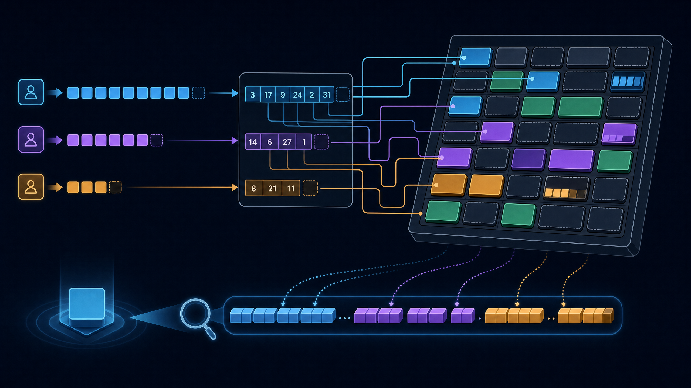
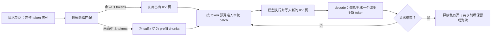
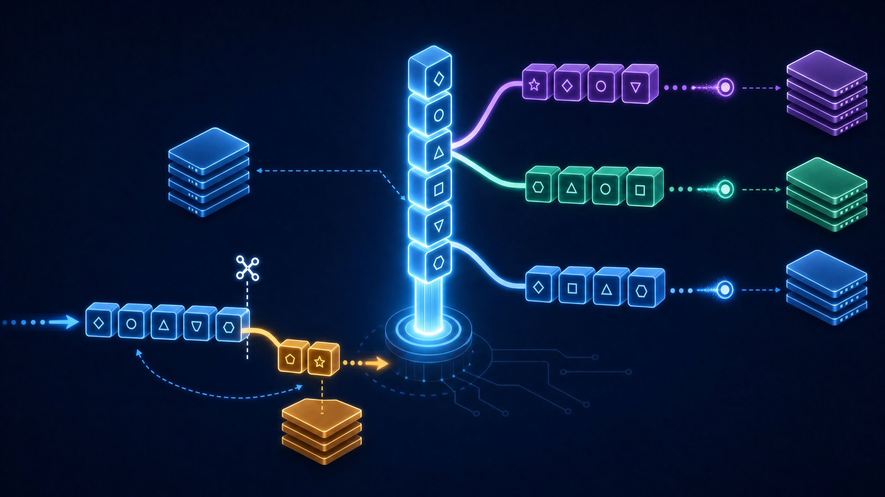
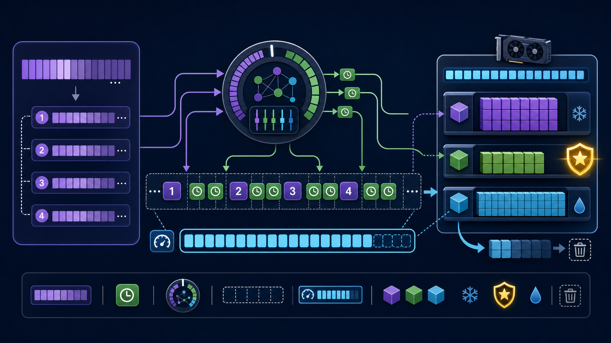

# 从 KV Cache 到服务决策：PagedAttention、RadixAttention、Prefix Caching 与调度的系统学习笔记

**面向场景**：你已经知道 Transformer 的 KV Cache 能避免自回归解码重复计算，但仍希望理解一个在线推理引擎为什么需要“分页、前缀树、分块预填充、缓存淘汰”这一整套机制，以及这些机制如何在一次请求的完整生命周期中协同。

> **核心结论**：高吞吐 LLM serving 的关键并不只是“把注意力算得更快”，而是把 KV Cache 从“某个请求私有的一整段张量”升级为一种**按页分配、按前缀共享、按预算执行、按价值保留**的运行时资源。



本文以 Datawhale 社区的四份动手教程为学习入口，重新组织为一条端到端的服务系统主线。它**不逐段转录教程**；文中的叙事、图解、公式推导、实验结构和全部 Python 实现均为原创重写。完整、可运行的 CPU-only 实验代码位于 [`code/serving_memory_lab.py`](./code/serving_memory_lab.py)，不依赖 PyTorch、CUDA 或特定推理框架。

首先向 [Datawhale 社区](https://datawhale.cn/) 及四份教程的贡献者致谢。教程链接、vLLM/SGLang 原始资料和官方文档均在文末列出；引用数字与参考资料一一对应。

| 学习入口 | 本文重新提炼后的系统角色 | 原教程 |
|---|---|---|
| vLLM PagedAttention | 将可变长 KV Cache 放入固定大小物理页池，以块表维持逻辑连续性 | [22. vLLM PagedAttention][1] |
| SGLang RadixAttention | 用压缩前缀树寻找最长可复用 token 前缀，让多个请求共享 KV 状态 | [24. SGLang RadixAttention][2] |
| Prefix Caching & Chunked Prefill | 将“命中多少缓存”转换为“还需计算多少后缀”，再细化成可调度 chunk | [34. Prefix Caching and Chunked Prefill][3] |
| KV Cache Scheduling | 在有限容量下做准入、刷新、淘汰和 decode/prefill 协同决策 | [37. KV Cache Scheduling][4] |

---

## 目录

- [1. 先建立一张地图：四种机制各自回答什么问题](#1-先建立一张地图四种机制各自回答什么问题)
- [2. KV Cache 为什么会成为服务系统的第一等资源](#2-kv-cache-为什么会成为服务系统的第一等资源)
- [3. PagedAttention：把连续的逻辑序列放到离散的物理页中](#3-pagedattention把连续的逻辑序列放到离散的物理页中)
- [4. RadixAttention：把共同开头从重复工作变成可共享资产](#4-radixattention把共同开头从重复工作变成可共享资产)
- [5. Prefix Caching 与 Chunked Prefill：把命中率变成执行计划](#5-prefix-caching-与-chunked-prefill把命中率变成执行计划)
- [6. KV Cache Scheduling：有限显存中的价值排序与安全淘汰](#6-kv-cache-scheduling有限显存中的价值排序与安全淘汰)
- [7. 一份完整、原创的 CPU 学习实验室](#7-一份完整原创的-cpu-学习实验室)
- [8. 如何评估系统：不要只盯着吞吐或命中率](#8-如何评估系统不要只盯着吞吐或命中率)
- [9. 我的思考：KV Cache 是“内存管理问题”，也是“工作负载塑形问题”](#9-我的思考kv-cache-是内存管理问题也是工作负载塑形问题)
- [10. 实战检查清单](#10-实战检查清单)
- [参考资料](#参考资料)

---

## 1. 先建立一张地图：四种机制各自回答什么问题

在线服务的请求具有两个典型的不确定性：每个 prompt 的长度不同，生成 token 的数量也无法在到达时完全确定。更重要的是，请求之间并不独立：同一个 system prompt、多轮对话历史、few-shot 样例或 RAG 模板常常在大量请求中重复出现。因此，真正的难题不是缓存“有没有”，而是缓存的**物理布局、共享边界、执行时机与生存时间**。

下表是理解四份教程时最有用的分层法。每一层都解决一种不同的浪费；把它们混成一个“KV Cache 优化”会失去设计上的因果关系。

| 层次 | 机制 | 主要对象 | 要消除的浪费 | 核心数据结构 | 不能单独解决的问题 |
|---|---|---|---|---|---|
| 物理布局 | PagedAttention | KV 页 / block | 为未知生成长度预留大连续段导致的空洞和碎片 | block table + free-page pool | 相同 prompt 的重复计算 |
| 逻辑复用 | RadixAttention | token 前缀 | 多请求把相同开头再次 prefill | radix tree / compressed trie | 长 prompt 抢占一个调度轮次 |
| 执行节奏 | Chunked Prefill | 未命中后缀 | 一次超长 prefill 影响 decode 延迟与批处理 | token budget + chunk queue | 显存容量不足时保留谁 |
| 资源决策 | KV Cache Scheduling | 缓存条目 / 页 | 有限显存被低价值、冷数据长期占用 | priority queue + metadata | 页级布局本身的寻址效率 |

可以将一条到达请求抽象成以下状态转换。`match` 只决定哪些历史状态可复用；`allocate` 才决定实际占哪些页；`schedule` 决定本轮将多少未命中 token 送进模型；`evict` 则在未来容量不足时回收不值得保留的状态。



> **阅读这张图的关键**：PagedAttention 主要服务于 `C/F/I` 三处的页生命周期；RadixAttention 主导 `B`；Chunked Prefill 主导 `D/E`；缓存调度贯穿 `E/I`。它们不是互斥方案，而是同一服务循环的不同控制面。

---

## 2. KV Cache 为什么会成为服务系统的第一等资源

### 2.1 Prefill 与 decode：同一模型、两种资源画像

在 **prefill** 中，模型一次处理 prompt 的许多 token，并为每层每个 token 写入 Key 与 Value。它的计算形状较大，通常更接近计算受限。**decode** 则是在已有上下文上追加新 token；每个活跃请求在每个迭代中只多一个 query token，却需要读取它的历史 K/V。两者因此不能只用“token 数”概括：prefill 主要决定首 token 之前做了多少工作，decode 更敏感于活跃序列数、上下文长度和内存访问。

vLLM 的自动前缀缓存文档也明确区分了这一边界：共享前缀只会跳过已命中部分的 **prefilling**；它并不消除新 token 的 **decoding** 成本。[9] 因而，“前缀命中率很高但输出很长”仍可能有较长的总响应时间，这不是缓存失效，而是优化对象发生了切换。

| 阶段 | 输入形状的直觉 | 主要写入 / 读取 | 用户侧常见指标 | 缓存机制的直接作用 |
|---|---|---|---|---|
| Prefill | 一次提交一段 prompt | 写入整段新增 K/V | TTFT（首 token 时间） | 前缀命中减少重算；分块控制单次工作量 |
| Decode | 每活跃请求每轮追加少量 token | 读取历史 K/V，并写入新 K/V | ITL（相邻 token 间隔）、生成流畅度 | 分页避免增长时重分配；调度保障存量请求 |

### 2.2 一个足以指导容量估算的 KV Cache 账本

对常见 decoder-only Transformer，若每个 token 在每一层保存 K 和 V，单请求的 KV 数据量可按下式估算：

$$
M_{\mathrm{KV}} = 2 \times L \times T \times n_{\mathrm{kv}} \times d_{\mathrm{head}} \times b.
$$

其中，$L$ 是层数，$T$ 是目前上下文 token 数，$n_{\mathrm{kv}}$ 是 KV heads 数，$d_{\mathrm{head}}$ 是每头维度，$b$ 是每个元素的字节数，而前面的 $2$ 对应 K 与 V。MHA 通常使 $n_{\mathrm{kv}}$ 等于 attention heads；GQA/MQA 通过减少 KV heads 降低这部分成本。这个式子只是张量体积账本，实际显存还会受到页尾空位、元数据、CUDA graph、工作区与分配器状态影响。

例如，假定 FP16、$L=32$、$n_{\mathrm{kv}}=8$、$d_{\mathrm{head}}=128$，一条达到 $4096$ token 的请求仅 KV 数据就约为 **512 MiB**。这不是某个真实模型的 benchmark，而是由上式进行的容量演算；它解释了为何少量长上下文并发请求就可能让服务系统首先受到显存约束。

> **不要忽略“随时间增长”**：权重加载后相对稳定，而 KV Cache 会随活跃请求及每条请求的上下文持续增长与释放。服务端的难点因此是一个在线资源分配问题，而不是启动时做一次静态显存规划。

vLLM 的原始论文将这种动态增长、收缩且容易碎片化的 KV Cache 视为限制 batch size 的核心瓶颈，并以虚拟内存式分页来缓解该问题。[5] 论文报告的吞吐收益属于其给定模型、硬件和基线下的实验结果，不应被直接当作任何部署的预期数字。

---

## 3. PagedAttention：把连续的逻辑序列放到离散的物理页中


### 3.1 从“地址连续”切换到“逻辑连续”

最朴素的实现会把一条请求的 KV Cache 当作一段连续大数组，并按最大可能生成长度提前预留空间。它的优点是寻址简单，代价却是容量浪费：请求实际结束得早，尾部空间便永久闲置直到释放。更糟的是，许多不同长度的请求交错到达、结束时，连续大块的分配与回收容易导致难以利用的间隙。

PagedAttention 采用不同视角：物理池被切成固定 token 容量的 `block`；每个请求维护自己的 `block_table`，使逻辑块编号映射到任意物理块编号。于是第 $p$ 个逻辑 token 的定位由三步构成：

$$
\ell = \left\lfloor\frac{p}{B}\right\rfloor,
\qquad
r = p \bmod B,
\qquad
\text{physical\_block}=\text{block\_table}[\ell],
$$

其中 $B$ 是每页容纳的 token 数，$\ell$ 是逻辑页号，$r$ 是页内偏移。注意力内核沿 `block_table` 读取离散的物理 K/V 页，但对模型语义而言上下文仍是原来的逻辑 token 顺序。vLLM 文档也提醒这里的 block 是 KV cache block，不能和 CUDA 的 GPU thread block 混为一谈。[6]

| 问题 | 连续预留式 KV Cache | 分页 KV Cache |
|---|---|---|
| 不知道最终输出长度 | 倾向按上界预留 | 首次 prefill 按当前长度分配，decode 越界时追加页 |
| 请求结束后 | 释放整段连续区 | 回收请求持有的页，放回全局空闲页池 |
| 逻辑连续性 | 依赖物理地址连续 | 由 block table 显式维持 |
| 尾部浪费 | 可能接近“预留上界 - 实际长度” | 单请求尾页至多浪费 $B-1$ 个 token 槽位 |
| 前缀共享 | 需要额外机制 | 可作为页的共享/引用计数基础，但并非自动发生 |

### 3.2 prefill 与 decode 的页分配条件

假设一条请求已有 $T$ 个 token，并且已持有 $N$ 个页。prefill 需要的页数为：

$$
N_{\mathrm{prefill}}=\left\lceil\frac{T}{B}\right\rceil.
$$

decode 追加一个 token 之前，如果 $T=N\cdot B$，代表现有页已经正好写满，必须先申请新页；否则只在末页写入一个新位置。将 token 长度先加一的写法中，同一条件可写为 $(T+1)\bmod B=1$。两个形式只是检查时点不同，**不要同时使用、不要产生双重分配**。

下面展示实验室中最核心的原创实现。真实系统会写入每层 K/V 张量并维护引用计数；为了让映射可观察，教学代码只把整数 token 写进页槽。

```python
class PagedKVPool:
    def prefill(self, request_id: str, prompt: Sequence[Token]) -> SequenceState:
        state = SequenceState(request_id=request_id, tokens=list(prompt))
        state.block_table = self._allocate(self.blocks_for(state.length))
        for logical_position, token in enumerate(state.tokens):
            page_index = logical_position // self.block_size
            offset = logical_position % self.block_size
            physical_block = state.block_table[page_index]
            self.pages[physical_block][offset] = token
        return state

    def append_decode_token(self, state: SequenceState, token: Token) -> None:
        logical_position = state.length
        if logical_position == len(state.block_table) * self.block_size:
            state.block_table.extend(self._allocate(1))
        page_index = logical_position // self.block_size
        offset = logical_position % self.block_size
        self.pages[state.block_table[page_index]][offset] = token
        state.tokens.append(token)
```

`prefill` 只按 prompt 的实际长度取页；`append_decode_token` 在写入前检查边界。`block_table` 不保证连续，反而应当允许像 `[7, 6, 3]` 这样的映射。`materialize` 再按块表把页依次读取并截断尾页，作为单元测试中“逻辑序列仍正确”的证据。

### 3.3 block size 不是魔法常数，而是一笔明确的交易

页大小太小会增加块表长度、元数据访问和调度颗粒度；页太大又使尾页浪费上升，并降低灵活性。选择应当围绕模型、并发长度分布、内核实现和共享模式进行压测，而不是复制另一套部署的数值。

| `block_size` 倾向 | 管理开销 | 尾页内部碎片 | 共享 / 回收粒度 | 更需要警惕的代价 |
|---|---|---|---|---|
| 小 | 较高 | 较低 | 更细 | 页表、调度和内核索引开销上升 |
| 大 | 较低 | 较高 | 更粗 | 短请求或频繁结束请求更易造成尾部浪费 |
| 适中 | 依赖实际工作负载 | 依赖长度分布 | 可平衡 | 必须用真实请求轨迹验证 |

**一个常见误解**是“分页会压缩 K/V 数值”。它不会。相同 token、相同精度和相同模型下，真正需要保存的 K/V 信息量并没有凭空减少；分页主要减少了因生命周期和长度未知造成的**分配浪费**，并为跨请求共享提供了可管理的页级载体。[5] [6]

---

## 4. RadixAttention：把共同开头从重复工作变成可共享资产



### 4.1 复用的必要条件是“从开头一致”，不是“中间碰巧相同”

对新 prompt $P$ 和已缓存路径集合 $\mathcal{C}$，可复用长度是：

$$
H(P)=\max_{C\in\mathcal{C}} \operatorname{LCP}(P,C),
$$

其中 `LCP` 表示最长公共**前缀**。如果 $P=[1,2,3,9,42]$，缓存路径为 $C=[1,2,3,9]$，那么 $H=4$；前四个 token 的 K/V 状态可直接接上，后缀 $[42]$ 仍需要 prefill。若两段 token 只在中部相同，却在开头分歧，则前面的隐藏状态已经不同，不能把那个中间片段视作通用前缀缓存。

SGLang 的 RadixAttention 将 token 序列作为 key、将对应 KV tensors 作为 value，并使用 radix tree 支持前缀查找、插入和淘汰。[8] Radix tree 与普通 trie 的关键区别是：一条边能够携带**一段** token，而不是只放一个 token；这减少了长公共路径上大量单节点的管理成本。

| 概念 | 在本文示例中的表示 | 在真实服务中的对应物 | 最容易混淆的地方 |
|---|---|---|---|
| `fragment` | `(1, 2, 3)` | 压缩边上的 token 片段 | 它不是一个“文本字符串”，而是 token ID 序列 |
| `cache_key` | `chat-B-turn-1` | 指向 KV block / 句柄的元数据 | 真实系统还需处理 refcount 与页生命周期 |
| `hit_length` | `4` | 可跳过 prefill 的 token 数 | 命中不会让 decode 新 token 免费 |
| node split | 公共 `[1,2,3]` + 两个后缀 | 新路径与旧路径分叉时的树重构 | 分裂的是索引边，不是修改历史 token 内容 |

### 4.2 为什么必须有“边分裂”

假设先后缓存 `[1,2,3,4]` 与 `[1,2,3,9]`。如果只把每条完整 prompt 平铺在根节点下，最长匹配能用暴力扫描求出，却没有显式表达公共 `[1,2,3]`。压缩树插入第二条路径时应将原来的边分裂：

```text
root
└── (1, 2, 3)
    ├── (4)  -> chat-A-turn-1
    └── (9)  -> chat-B-turn-1
```

这一步让多轮聊天、few-shot 批量提问、树状采样等共享结构真正变成一个公共路径。SGLang 的介绍明确指出，其运行时保留 prompt 与生成结果的 KV Cache，并通过 radix tree 实现高效的前缀搜索、插入和淘汰；该树与 paged layout、continuous batching 可以协同。[8]

完整实验室的 `RadixPrefixIndex.insert` 没有采用教程中的单层候选列表，而是实现了真正的“路径继续或边分裂”逻辑：

```python
if shared == len(child.fragment):
    parent = child
    tail = tail[shared:]
    continue

shared_node = RadixNode(fragment=child.fragment[:shared])
child.fragment = child.fragment[shared:]
shared_node.children.append(child)
child_position = parent.children.index(child)
parent.children[child_position] = shared_node
parent = shared_node
tail = tail[shared:]
```

前半段处理“旧边被新请求完全覆盖”的继续下行；后半段处理“共享一段但随后分叉”的情况。这里的 `shared_node` 是公共前缀，修改后的 `child` 保存原路径残余，而新请求残余会在下一轮循环挂入同一公共节点。

### 4.3 可复用性不仅由可见文本决定

工程上，前缀命中比较的是**进入模型的 token 序列和可兼容的运行时语义**。因此，表面上相同的自然语言并不必然共享：不同 tokenizer、不同 chat template、不同系统消息排列、不同 adapter、位置编码策略或多模态 token 化方式，都可能改变可安全复用的状态。反之，应用若把固定 system prompt、工具定义和文档上下文稳定地放在 prompt 开头，便在主动创造可复用的长前缀。

> **我的工程判断**：Prefix cache 不是后端单方面“打开开关”就能最大化的能力。它要求产品层、提示词层和调度层一起保持稳定的前缀形状；否则昂贵缓存只是在等待一组永远不会命中的 key。

---

## 5. Prefix Caching 与 Chunked Prefill：把命中率变成执行计划

### 5.1 从 `hit_length` 到“还剩多少模型工作”

令 prompt 总长为 $|P|$，最长可复用前缀为 $H$，则仍需 prefill 的后缀长度为：

$$
|S| = |P| - H.
$$

这个式子非常朴素，却是缓存指标与服务执行之间的桥梁。只统计“请求是否命中”会掩盖命中质量：命中 1 个 token 和命中 3,000 个 token 都会被算作一次 hit，但节省的计算完全不同。更实用的系统指标是**token 加权前缀命中率**：

$$
\mathrm{TokenHitRate}=\frac{\sum_i H_i}{\sum_i |P_i|},
$$

以及 `saved_prefill_tokens = ΣH_i`。前者说明全局可少算的 prompt token 比例，后者便于直接估算某个工作负载的潜在 prefill 降量。二者仍不能直接等价为端到端延迟收益，因为 decode、排队、调度和硬件饱和也在影响结果。

vLLM 的 APC 文档给出的典型受益场景正是重复查询同一长文档，以及在同一会话中反复带上历史上下文；这两种模式本质上都在提高 $H$ 的期望值。[9]

### 5.2 分块预填充处理的是“何时算”，而不是“算不算”

prefix caching 的任务是减少 $|S|$；chunked prefill 的任务是将剩余的 $S$ 改写为更细的服务工作项：

$$
S = \operatorname{concat}(c_1, c_2, \dots, c_m), \qquad |c_j|\le C.
$$

$C$ 是每个 chunk 的最大 token 数。长 request 的后缀不会在一个调度周期独占所有预算，而能与正在 decode 的请求穿插。vLLM 的性能文档将 chunked prefill 描述为：把大型 prefill 切成较小片段，并与 decode 请求一同组成 batch；文档还说明 `max_num_batched_tokens` 是 TTFT、ITL 和吞吐之间需要调节的预算旋钮。[10]



| 机制 | 直接减少什么 | 主要控制变量 | 典型收益 | 不应做出的过度推论 |
|---|---|---|---|---|
| Prefix Caching | 重复 prefill token | token 前缀稳定性、缓存容量 | 缩短命中请求的 TTFT，减少重复 K/V 写入 | 不能加快未命中请求，也不消除新输出的 decode |
| Chunked Prefill | 一次长 prefill 的独占性 | chunk 大小、每轮 token budget | 改善与 decode 共存时的响应平滑性 | 不能减少后缀 token 的总计算量 |
| 连续批处理 | 静态 batch 的空洞等待 | 请求队列与准入策略 | 已结束请求可被新请求替换 | 需要配合容量和公平性控制 |

### 5.3 一个透明的 decode-first 调度器

本文实验室采用的是一条易读的教学策略：先为每个等待 decode 的请求预留一个 token 预算，再将完整放得下的 prefill chunk 依序填入剩余预算。它**不是**任何框架默认策略的复刻，而是把“decode 延迟优先”的含义变成一个可检查的不变量：`used_tokens <= token_budget`。

```python
def schedule_one_iteration(pending_decode_ids, pending_prefills, token_budget):
    decode_ids = tuple(pending_decode_ids[:token_budget])
    budget_left = token_budget - len(decode_ids)
    admitted = []
    for chunk in pending_prefills:
        if len(chunk.tokens) <= budget_left:
            admitted.append(chunk)
            budget_left -= len(chunk.tokens)
        else:
            break
    return BatchPlan(
        decode_request_ids=decode_ids,
        prefill_chunks=tuple(admitted),
        used_tokens=token_budget - budget_left,
        token_budget=token_budget,
    )
```

它将一个模糊的目标——“不要让新来的长 prompt 打断正在流式输出的用户”——转译成可测量策略。但这种优先级也有代价：若长期存在大量 decode 请求，prefill 可能饥饿。因此生产系统通常还需引入最大等待时间、ageing、不同租户配额或 SLO 感知的配额，而不应把“decode-first”理解成唯一正确答案。

---

## 6. KV Cache Scheduling：有限显存中的价值排序与安全淘汰

### 6.1 命中之后，仍要回答“是否值得继续留着”

共享 cache 的容量有限。只以“最近访问”决定淘汰，可能误删一个非常高频的公共 system prompt；只以“命中次数”决定淘汰，又可能让遥远历史中的热点永久霸占显存；完全忽略大小，则可能牺牲许多小而常用的前缀去留下一条大而价值普通的上下文。因此，调度器需要为缓存条目维护可解释的价值元数据。

本文的教学实现给每个条目定义一个**明确标注为启发式、并非工业固定公式**的保留分数：

$$
\mathrm{score}(x)=\log_2(1+\mathrm{hits}_x)
+0.75\cdot\frac{1}{1+\mathrm{age}_x}
-0.50\cdot\frac{\mathrm{blocks}_x}{\mathrm{capacity}}.
$$

对数命中项避免极端历史热点无限碾压新数据；recency 项表达热路径偏好；size 项则显式承认大条目有更高的机会成本。真实系统的策略还可能纳入用户等级、deadline、预测重用、跨设备迁移成本与请求取消率。SGLang 的早期说明采用 LRU eviction，并配合 cache-aware scheduling 提升命中率；本文分数只用于演示“复用、时间、容量成本同时参与决策”的思想。[8]

| 元数据 | 它代表什么 | 增大时的直觉 | 若忽略它，常见错误 |
|---|---|---|---|
| `hits` | 已经被多少次复用 | 更可能再次产生收益 | 高频公共模板被过早驱逐 |
| `last_used` | 最近一次触达的逻辑时间 | 当前工作负载仍在使用它 | 过期会话长期占驻 |
| `blocks` | 持有的页数 / 容量成本 | 淘汰可快速回收更多空间 | 一个大对象挤掉多个小热点 |
| `refcount`（生产必需） | 是否仍被活跃请求引用 | 大于零时通常不可驱逐 | 释放仍被 decode 使用的 K/V，破坏正确性 |

### 6.2 为什么堆需要“懒删除”与 stale check

一条缓存记录每次命中后，其 `hits` 和 `last_used` 都会变化，分数也随之变化。若用最小堆寻找“最不值得保留”的项，直接在堆内部原地更新一个任意位置会使实现复杂。更简单的办法是在刷新时压入一条新记录，淘汰时再确认弹出的记录是否仍然是当前版本。

```python
def _refresh(self, record: CacheRecord) -> None:
    record.score = self._score(record)
    heapq.heappush(self._eviction_heap, (record.score, record.last_used, record.key))

# 弹出候选后：只接受与 entries 中最新元数据完全一致的记录。
is_stale = record is None or (
    score != record.score or observed_last_used != record.last_used
)
if not is_stale:
    break
```

这里的 stale check 是正确性的核心，而不是微小的性能细节。没有它，堆中残留的“旧的低分”可能把一个刚刚被访问、现已高价值的 prefix 驱逐。该模式被称为懒删除：将维护成本从每次更新时挪到真正需要弹出时，换来更简单、可审计的在线调度逻辑。

### 6.3 私有页、共享页和释放语义必须分开

教程用简化模型强调“缓存价值”，但真正工程实现还必须划清所有权。请求结束后，其私有 decode 后缀页可以立即回收；公共前缀可能仍被 radix tree 持有；正在被活跃请求读取的页即使很冷，也不能驱逐。换言之，**淘汰资格**应先由安全约束决定，再在可淘汰集合内根据价值评分排序。

> 一个推荐的优先级顺序是：先保证 `refcount == 0`、无 in-flight kernel、满足一致性要求；再判断容量不足；最后才比较 LRU/LFU/大小等策略分数。把策略分数置于内存安全之前，是在用“命中率”赌“正确性”。

---

## 7. 一份完整、原创的 CPU 学习实验室

### 7.1 获取与运行

完整源代码在 [`code/serving_memory_lab.py`](./code/serving_memory_lab.py)。它全部采用 Python 标准库，因此可以先在任何普通 CPU 环境中验证**数据结构与不变量**，再把理解迁移到 vLLM、SGLang 或其他实际 runtime。它不声称模拟 GPU kernel 性能，也不输出虚假的吞吐 / 显存 benchmark。

```bash
cd Memory/task4
python3 code/serving_memory_lab.py
```

本仓库环境已完成 `py_compile` 语法检查和可执行断言验证。实际运行输出如下，数值是程序的结构性 trace，而不是 GPU 性能结果：

```text
All invariants passed. This is a structural CPU simulation, not a GPU benchmark.

[1] Paged KV mapping
  alpha logical length: 9
  alpha block table:    [7, 6, 3]  (intentionally non-contiguous)

[2] Radix longest-prefix match
  hit / miss: (1, 2, 3, 9) / (42, 43)
  matched cache key: chat-B-turn-1

[3] Decode-first batch plan
  decode requests: ('alpha', 'beta')
  prefill chunks:  [(42, 43)]
  budget used:     4/5 tokens

[4] Value-aware KV retention
  events: ['add:common-system', 'add:tenant-a-history', 'reuse:common-system',
           'evict:tenant-a-history', 'add:tenant-b-history']
  key | blocks | hits | retention_score
  common-system | 2 | 2 | 2.1683
  tenant-b-history | 3 | 1 | 1.5
```

### 7.2 代码结构与每一部分要证明的事实

| 文件组成 | 主要类 / 函数 | 代码要证明的机制 | 断言验证的关键不变量 |
|---|---|---|---|
| 分页池 | `PagedKVPool`、`SequenceState` | 页可非连续，逻辑顺序由块表恢复 | `materialize(state) == 原 token 序列` |
| 前缀索引 | `RadixPrefixIndex`、`RadixNode` | 共享前缀会在插入时分裂成公共边 | 请求 `[1,2,3,9,42,43]` 命中长度为 4 |
| 执行计划 | `make_prefill_plan`、`schedule_one_iteration` | 只切分未命中后缀，并先安排 decode | `used_tokens <= token_budget` |
| 驱逐器 | `ValueAwareKVCache`、`CacheRecord` | 热且常用 prefix 在压力下更应留下 | 容量不超限，heap stale 项不被误用 |

以下是实验室中 PagedAttention、RadixAttention、chunked prefill 和 scheduling 的全套实现入口。建议先直接运行，再以表格中每个断言为线索阅读源码，而不是只看单个函数。

```python
# Paged KV：逻辑序列 [10..18] 由非连续物理页 [7, 6, 3] 恢复。
alpha = pool.prefill("alpha", [10, 11, 12, 13, 14, 15])
beta = pool.prefill("beta", [90, 91, 92, 93])
pool.append_decode_token(beta, 94)
for token in (16, 17, 18):
    pool.append_decode_token(alpha, token)
assert alpha.block_table == [7, 6, 3]
assert pool.materialize(alpha) == [10, 11, 12, 13, 14, 15, 16, 17, 18]

# Radix：插入时显式将共享 [1, 2, 3] 变成树中的公共边。
index.insert([1, 2, 3, 4], cache_key="chat-A-turn-1")
index.insert([1, 2, 3, 9], cache_key="chat-B-turn-1")
match = index.match([1, 2, 3, 9, 42, 43])
assert match.hit_length == 4
assert match.miss_suffix == (42, 43)

# Chunked prefill：只为 miss suffix 做 chunk，缓存命中部分不会重新入队。
chunks = make_prefill_plan("chat-B-turn-2", match.miss_suffix + (44, 45, 46), 2)
plan = schedule_one_iteration(["alpha", "beta"], chunks, token_budget=5)
assert plan.decode_request_ids == ("alpha", "beta")
assert [chunk.tokens for chunk in plan.prefill_chunks] == [(42, 43)]
```

### 7.3 该实验室刻意没有假装做什么

本实验没有真实 attention kernel、GPU allocator、异步 stream、张量并行、CUDA graph 或多层 K/V 张量。因此它不能回答“某一 GPU 上 TPS 是多少”“block size=16 是否最优”“某版本引擎的默认 policy 是什么”等性能问题。它能可靠回答的是：**页表映射是否保持逻辑序列正确、压缩树是否得到正确 LCP、调度是否遵守预算、淘汰堆是否跳过过期优先级记录。**

这种边界是学习代码可信的前提。将数据结构模拟输出误当成框架性能 benchmark，和把一组特定硬件上的论文数字直接推广到生产环境一样危险。

---

## 8. 如何评估系统：不要只盯着吞吐或命中率

一个缓存系统既可能“很会命中”却把 tail latency 拉高，也可能“显存利用率好”却经常驱逐下一轮马上会用的对话历史。评估应至少覆盖下面四组指标，并将工作负载切分为具有代表性的前缀结构：独立请求、共享 system prompt、多轮对话、固定文档多问和 agent 分支。

| 指标组 | 建议指标 | 它回答的问题 | 单看它的风险 |
|---|---|---|---|
| 复用 | token hit rate、saved prefill tokens、prefix cache occupancy | 系统少算了多少重复 prompt？ | 忽略输出长短和排队延迟 |
| 时延 | TTFT P50/P95/P99、ITL P50/P95/P99 | 首字与流式过程是否稳定？ | 平均值掩盖长尾阻塞 |
| 效率 | request/s、output token/s、GPU 利用率、每请求页数 | 硬件和页池是否被有效使用？ | 高吞吐可能靠牺牲个体延迟获得 |
| 正确性 / 安全 | 命中后 logits 一致性、refcount 违规数、OOM/拒绝数、驱逐后重算率 | 共享和回收有没有破坏语义？ | 把“跑得快”错当作“结果正确” |

### 8.1 推荐的对照实验矩阵

与其一次同时打开所有优化，不如从可归因的对照开始。每个单元应固定模型、tokenizer、采样参数、输入轨迹、并发曲线、KV 精度、GPU 数、`max_num_batched_tokens` 等条件；只改变表中被标记的一个因素。

| 实验 | 固定条件 | 变化因素 | 应观察的主要量 | 合格的结论表述 |
|---|---|---|---|---|
| A | 独立随机 prompt | Paged vs. 连续管理 | OOM 边界、页尾浪费、调度开销 | 分页是否提升可容纳并发，而非笼统声称“更快” |
| B | 长共享 system prompt | APC / Radix 开关 | token hit rate、TTFT | 复用是否实质减少 prefill 工作 |
| C | 长 prompt + 持续 decode | chunk size / token budget | ITL P95、TTFT、吞吐 | chunk 策略如何移动延迟-吞吐折中 |
| D | 有冷热前缀且容量紧 | LRU / 价值启发式 | miss after eviction、命中率、驱逐数 | 哪种策略更适合这条访问轨迹 |

### 8.2 三类容易被误读的“好结果”

首先，**TTFT 降低不等于总时延降低**。它可能来自前缀命中，但若生成端很长，decode 主导的时间仍在。其次，**高命中率不等于高节省量**；应采用 token 加权命中或实际节省的 prefill token。最后，**更多缓存不等于更高吞吐**；缓存可能挤压新请求准入空间，或因错误的淘汰策略导致反复缓存—驱逐—重算。

> 因此，最小报告单元建议是：工作负载特征 + 容量预算 + TTFT/ITL 分位数 + token hit rate + 页池占用 + 驱逐统计。没有工作负载和预算的“提升 X%”通常不可迁移。

---

## 9. 我的思考：KV Cache 是“内存管理问题”，也是“工作负载塑形问题”

### 9.1 四个机制可统一为“状态去重 + 资源承诺”

这四份教程初看分别在讲 allocator、树、切 chunk 与 heap；但把它们放进同一个请求生命周期后，会发现它们都在管理“模型已经计算出的状态”。PagedAttention 让状态以灵活的最小承诺单位存在；RadixAttention 发现哪些状态是同一份；Prefix Caching 确定少算多少；Chunked Prefill 决定何时承诺剩余计算；KV scheduling 决定状态在未来还有没有资格占据稀缺页。

这个统一视角带来一个实际好处：当问题出现时可以先定位层次。如果显存被页尾浪费压垮，优先检查页大小与 allocator；如果 TTFT 没有随共享模板改善，优先检查 token 前缀是否稳定；如果 ITL 变差，检查 chunk/budget 的准入；如果命中抖动，检查淘汰与工作负载局部性。不要把所有症状都归结为“缓存不够”。

### 9.2 产品接口会塑造缓存局部性

缓存命中并非纯后端随机事件。将固定工具 schema 放在 prompt 的同一位置、对检索文档排序做稳定化、避免每轮插入带随机性的冗长 metadata、按租户/模板适度分组请求，都会改变请求 token 的公共前缀分布。也就是说，服务层能优化的是已有局部性，应用层还能**创造局部性**。

但这种塑形必须尊重语义和公平性。为了命中率而强行把无关请求排队到一起，可能伤害用户延迟；为了保留热门租户的 prefix 而挤压长尾用户，可能造成资源不公平。最成熟的设计不只最大化 hit rate，而是在 SLO、隔离、容量和成本的约束下最大化有效复用。

### 9.3 “共享”会让正确性边界变得更严格

私有 KV cache 释放错了，通常只影响一个请求；共享 prefix 的引用计数错了，则可能影响所有沿该路径运行的请求。因而共享优化需要比私有缓存更严格的版本键、引用管理、驱逐原子性与可观测性。一个严谨的工程顺序应是：先以一致性测试与 refcount 审计建立正确性地基，再在真实 trace 上优化命中率，最后才为极限吞吐做更激进的内核和调度优化。

### 9.4 需要避免的三种错误类比

| 错误类比 | 为什么不成立 | 更准确的说法 |
|---|---|---|
| “PagedAttention = 操作系统分页，所以行为也完全一样” | 二者共享按块映射的思想，但 GPU KV pool、attention kernel 和请求生命周期并非通用 OS 虚拟内存 | 它是受虚拟内存启发的 KV 存储管理方法 [5] |
| “RadixAttention 比 PagedAttention 高级，因此能替代它” | 一个主要解决跨请求前缀复用，一个主要解决页级布局和增长 | 两者可组合，服务于不同层次 [8] |
| “前缀缓存命中后，响应就快了” | 只跳过命中前缀的 prefill；decode、排队和新后缀仍有成本 | 应分别报告 TTFT 与 ITL，并按 token 衡量命中 [9] [10] |

---

## 10. 实战检查清单

在真正启用此类优化前，请先把以下问题写成配置和监控项，而不是只保留在经验里。

| 阶段 | 需要确认的事实 | 推荐证据 |
|---|---|---|
| 建模前 | 模型层数、KV heads、head dim、KV dtype、上下文上界和并发画像 | 用 KV 账本估算 + 真实流量长度直方图 |
| 实现前 | cache key 是否涵盖模型、tokenizer、template、adapter 与位置语义 | key schema 单测、命中后输出一致性测试 |
| 运行时 | 每条页的所有者、refcount、in-flight 状态和可驱逐性 | allocator snapshot、引用计数断言、审计日志 |
| 调参时 | token budget、chunk size、页大小是否以目标 SLO 为中心 | TTFT/ITL 分位数、吞吐、页池占用的联动曲线 |
| 上线后 | 冷启动、热点迁移、长尾租户和容量饱和时的行为 | p95/p99、eviction rate、recompute rate、拒绝率 |

如果只能带走一句实施原则，我会选择这句：

> **先用稳定前缀创造可复用状态，再用分页使状态可管理，再用调度让状态在正确的时间占用正确的资源。**

---

## 参考资料

| 编号 | 来源 |
|---|---|
| [1] | [Datawhale — 22. vLLM PagedAttention](https://github.com/datawhalechina/llm-algo-leetcode/blob/main/02_PyTorch_Algorithms/22_vLLM_PagedAttention.ipynb) |
| [2] | [Datawhale — 24. SGLang RadixAttention](https://github.com/datawhalechina/llm-algo-leetcode/blob/main/02_PyTorch_Algorithms/24_SGLang_RadixAttention.ipynb) |
| [3] | [Datawhale — 34. Prefix Caching and Chunked Prefill](https://github.com/datawhalechina/llm-algo-leetcode/blob/main/02_PyTorch_Algorithms/34_Prefix_Caching_and_Chunked_Prefill.ipynb) |
| [4] | [Datawhale — 37. KV Cache Scheduling](https://github.com/datawhalechina/llm-algo-leetcode/blob/main/02_PyTorch_Algorithms/37_KV_Cache_Scheduling.ipynb) |
| [5] | [Kwon et al., *Efficient Memory Management for Large Language Model Serving with PagedAttention*, SOSP 2023](https://arxiv.org/abs/2309.06180) |
| [6] | [vLLM Documentation — Paged Attention Design](https://docs.vllm.ai/en/latest/design/paged_attention/) |
| [7] | [Zheng et al., *SGLang: Efficient Execution of Structured Language Model Programs*](https://arxiv.org/abs/2312.07104) |
| [8] | [LMSYS Blog — Fast and Expressive LLM Inference with RadixAttention and SGLang](https://www.lmsys.org/blog/2024-01-17-sglang/) |
| [9] | [vLLM Documentation — Automatic Prefix Caching](https://docs.vllm.ai/en/stable/features/automatic_prefix_caching.html) |
| [10] | [vLLM Documentation — Performance and Tuning: Chunked Prefill](https://docs.vllm.ai/en/v0.4.2/models/performance.html) |
| [11] | [Datawhale 社区](https://datawhale.cn/) |

---

**作者**：Manus AI<br>
**学习笔记性质**：基于 Datawhale 教程的原创梳理与可运行重构；示例代码用于解释核心不变量，不替代生产推理引擎的实现、基准或安全审计。

[1]: https://github.com/datawhalechina/llm-algo-leetcode/blob/main/02_PyTorch_Algorithms/22_vLLM_PagedAttention.ipynb
[2]: https://github.com/datawhalechina/llm-algo-leetcode/blob/main/02_PyTorch_Algorithms/24_SGLang_RadixAttention.ipynb
[3]: https://github.com/datawhalechina/llm-algo-leetcode/blob/main/02_PyTorch_Algorithms/34_Prefix_Caching_and_Chunked_Prefill.ipynb
[4]: https://github.com/datawhalechina/llm-algo-leetcode/blob/main/02_PyTorch_Algorithms/37_KV_Cache_Scheduling.ipynb
[5]: https://arxiv.org/abs/2309.06180
[6]: https://docs.vllm.ai/en/latest/design/paged_attention/
[7]: https://arxiv.org/abs/2312.07104
[8]: https://www.lmsys.org/blog/2024-01-17-sglang/
[9]: https://docs.vllm.ai/en/stable/features/automatic_prefix_caching.html
[10]: https://docs.vllm.ai/en/v0.4.2/models/performance.html
[11]: https://datawhale.cn/
