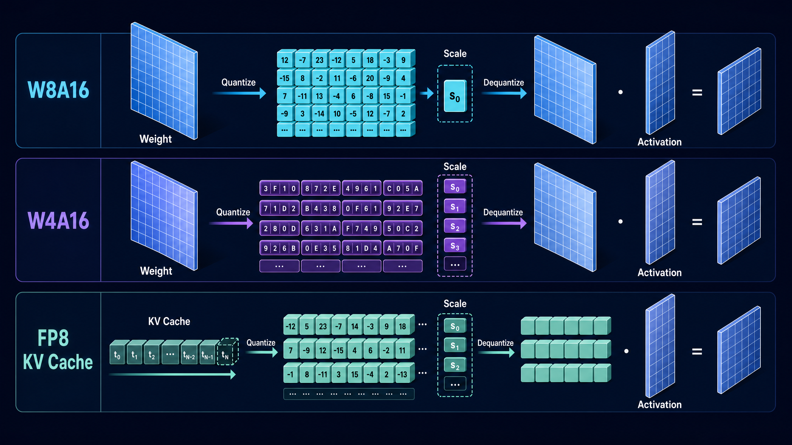
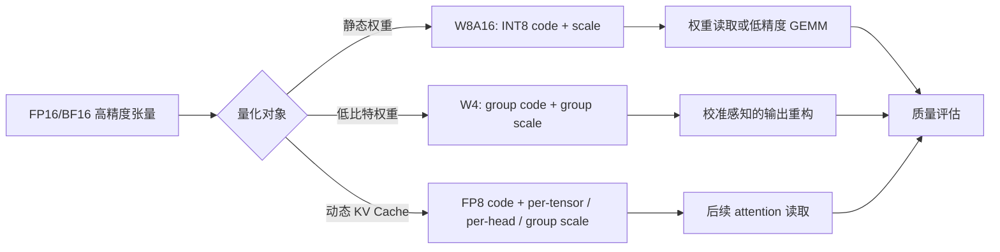
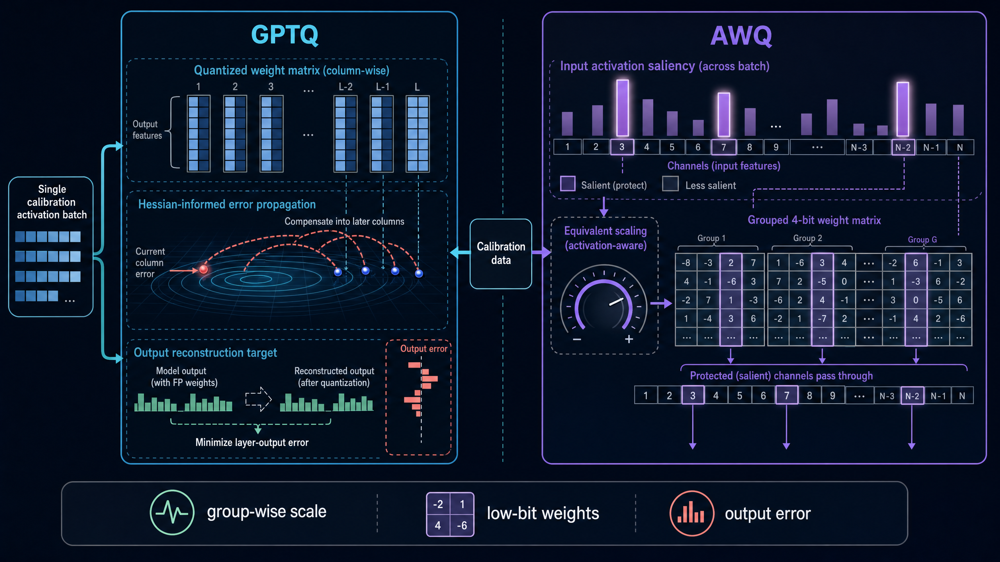
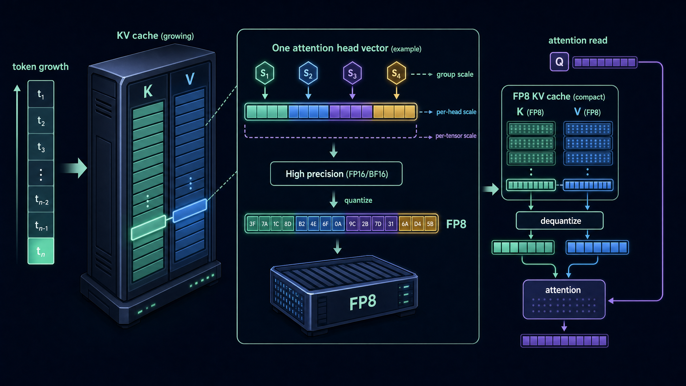
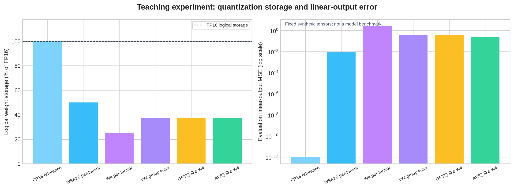
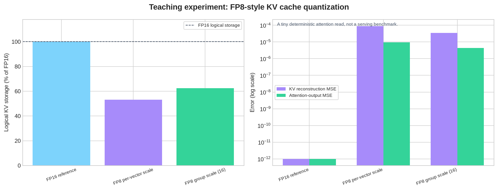

# 从整数权重到 FP8 KV Cache：W8A16、GPTQ、AWQ 与运行时量化的系统学习笔记

**面向场景**：你已经知道“量化可以省显存”，但希望进一步回答：为什么 W8A16 能立即降低权重容量却未必让计算变快？为什么 4-bit 时要关心校准数据？GPTQ 与 AWQ 真正在优化什么？KV Cache 为什么需要另一套 scale 策略？本笔记将三份 Datawhale 教程重新组织成一条可验证的推理系统主线。

> **核心结论**：量化不是把张量强行换成低精度 dtype，而是在给定的**存储、带宽、内核和质量预算**下，把量化误差放到“系统最能承受”的位置。W8A16 优先压静态权重；GPTQ 和 AWQ 用校准信息治理 4-bit 权重误差；FP8 / KV Cache 量化则把相同的误差预算延伸到动态、随上下文增长的推理状态。



本文以 Datawhale 社区的三份 Notebook 作为学习入口，但没有逐段转录教程。叙事、图解、公式表示、实验设计和所有源代码均为原创重写；完整可运行的 CPU 实验室位于 [`code/quantization_lab.py`](./code/quantization_lab.py)。它使用 NumPy 和 Matplotlib，生成两张可复现图表和一份 JSON 结果；它**不**模拟 CUDA 内核吞吐，也不将教学级近似冒充为生产 GPTQ、AWQ 或原生 FP8 实现。

首先向 [Datawhale 社区](https://datawhale.cn/)及三份教程的贡献者致谢。教程链接、原始论文和官方工程资料列于文末；正文中的数字引用可直接跳转。

| 本文模块 | 它解决的资源问题 | Datawhale 教程入口 |
|---|---|---|
| W8A16 | 用 INT8 存储静态权重，降低模型装载和访存压力 | [25. Quantization W8A16][1] |
| GPTQ 与 AWQ | 用校准信号决定 4-bit 权重量化误差应如何分配 | [40. GPTQ and AWQ Weight Quantization][2] |
| FP8 与 KV Cache | 压缩动态中间状态与随 token 增长的 K/V 缓存 | [41. FP8 and KV Cache Quantization][3] |

---

## 目录

- [1. 一张地图：先分清量化对象，再谈量化格式](#1-一张地图先分清量化对象再谈量化格式)
- [2. 量化的最小闭环：低比特码值加上 scale](#2-量化的最小闭环低比特码值加上-scale)
- [3. W8A16：存储变小，不等于计算自动变快](#3-w8a16存储变小不等于计算自动变快)
- [4. 从 W8 到 W4：为什么 4-bit 需要更精细的误差治理](#4-从-w8-到-w4为什么-4-bit-需要更精细的误差治理)
- [5. GPTQ：把量化误差视为层输出重构问题](#5-gptq把量化误差视为层输出重构问题)
- [6. AWQ：用激活统计识别值得保护的通道](#6-awq用激活统计识别值得保护的通道)
- [7. FP8 与 KV Cache：量化对象从静态参数变为动态状态](#7-fp8-与-kv-cache量化对象从静态参数变为动态状态)
- [8. 一份完整、原创、可运行的量化实验室](#8-一份完整原创可运行的量化实验室)
- [9. 读懂实验结果：精度、scale 元数据和质量指标的三角关系](#9-读懂实验结果精度scale-元数据和质量指标的三角关系)
- [10. 上线前检查清单](#10-上线前检查清单)
- [11. 我的思考：scale 是一种“可花费的精度预算”](#11-我的思考scale-是一种可花费的精度预算)
- [参考资料](#参考资料)

---

## 1. 一张地图：先分清量化对象，再谈量化格式

在 LLM 推理中，低精度数值并不只服务同一种张量。**权重**在模型加载后通常保持不变，主要消耗模型常驻显存和从显存到计算单元的读取带宽；**激活**随输入与层执行变化，常位于计算路径上；**KV Cache**则随着生成 token 和并发请求累积，是一个持续增长、持续读取的状态池。把三者混称为“把模型量化到 4-bit”会掩盖它们的设计约束。

| 对象 | 生命周期 | 典型量化目标 | 最先获得的收益 | 特有风险 |
|---|---|---|---|---|
| 模型权重 | 静态，加载后几乎不变 | W8A16、W4A16、GPTQ、AWQ | 模型大小、加载量、读权重带宽 | 层间累积误差、低比特离群值 |
| 输入 / 中间激活 | 每次前向都变化 | A8、FP8、混合精度 | 计算路径与激活带宽 | 分布漂移、动态范围、溢出 |
| KV Cache | 每个请求随 token 增长 | FP8 / INT8 KV、分组或按 head scale | 可容纳 token 数和并发量 | 误差进入后续 attention 读取 |
| scale / zero-point / shape | 随量化粒度保存 | 元数据 | 使反量化或低精度内核成为可能 | 元数据吞噬压缩收益、格式不匹配 |

三份教程刚好构成递进关系：第 25 节先把最稳定的权重做 W8A16；第 40 节将权重进一步压到低比特，并引入校准数据与通道敏感性；第 41 节转向动态的 FP8 和 KV Cache。这样的顺序非常重要：它先让我们掌握“量化—反量化”闭环，再讨论“怎样在更少的格点下保留真正重要的行为”。[1] [2] [3]



> **先问对象，再问位宽**。同样的 8-bit，可能意味着“权重以 INT8 常驻、激活仍为 FP16”，也可能意味着“使用具指数编码的 FP8 表示动态张量”，还可能意味着“KV 的 K、V 以 FP8 存储、query 在 attention 前被额外处理”。位宽相同不代表数值格式、scale 粒度、内核路径或质量风险相同。[4] [8]

---

## 2. 量化的最小闭环：低比特码值加上 scale

### 2.1 先用对称 absmax 量化建立直觉

最小的对称量化不需要复杂的理论。给定浮点张量 `x`，先为某个量化范围取一个 scale；再把 `x / scale` 四舍五入并裁剪到整数网格；需要恢复近似值时，将整数码乘回 `scale`。以 signed INT8 为例，正向端点是 `qmax = 127`，可写成以下不依赖 LaTeX 渲染器的账本：

```text
absmax = max(abs(x))
scale  = absmax / qmax
q       = clamp(round(x / scale), -qmax, qmax)
x_hat   = q * scale
```

`q` 是压缩后保存的整数码，而 `scale` 是恢复数值范围所需的元数据。若整个张量为零，`absmax` 也为零；此时将 `scale` 设为 `1` 能避免除零，并让 `q` 与 `x_hat` 保持全零。这类边界条件不是实现细枝末节：一旦 scale 变成 `NaN` 或 `Inf`，下游输出会被污染。

| 术语 | 该符号实际承担的角色 | 常见误解 |
|---|---|---|
| `qmax` | 整数网格的正向端点，例如 4-bit signed 为 `7`、8-bit signed 为 `127` | `qmax` 不是原始张量最大值 |
| `scale` | 将实数范围映射到有限码值的比例尺 | scale 越多并不必然更快；它也有存储与读取成本 |
| `q` | 真正的低比特码值 | 教学代码中的 `int8` 容器不等于物理上已做 nibble packing |
| `x_hat` | 用码值和元数据恢复的近似张量 | `x_hat` 与 `x` 一般不相等，差异是量化误差 |
| clipping | 超过可表示范围后被裁剪 | 只看平均误差会掩盖少数离群值被裁剪的风险 |

### 2.2 位宽减少的真正代价是“量化格点”变少

若用对称 signed 整数网格，`b` bit 大致提供 `2^b - 1` 个跨零的可用格点。W8 有充足的码值，W4 则只有 `-7` 到 `7` 的 15 个对称格点。若全层共用一个 scale，一个极端权重会把格距拉大，普通大小的权重容易被多个不同值舍入到同一格点。这就是从 W8 走向 W4 时，分组、校准与敏感性分析变得必要的原因。

```text
more bits or finer scale granularity
    -> smaller local quantization step
    -> often smaller numerical reconstruction error
    -> more code / scale metadata / kernel-management cost
```

这里的“often”必须保留。更细 scale 会降低许多局部区域的数值误差上界，但实际模型质量还取决于层结构、激活分布、采样方式、任务难度和内核数值实现。**张量 MSE 不是最终语言质量的替代品。**

---

## 3. W8A16：存储变小，不等于计算自动变快


### 3.1 W8A16 这个名字到底承诺了什么

`W8A16` 通常表示权重以 8-bit 形式存储或参与相应低精度路径，激活保持 16-bit。Datawhale 的练习以 `absmax_quantize` 与一个量化线性层说明最小闭环：权重在模型转换时量化，前向时根据 scale 恢复近似权重，再与高精度激活进行线性计算。[1]

完整实验室的 `W8A16Linear` 刻意保留这种边界：它让权重按 INT8 码值和 scale 记录，但在 NumPy 中先恢复权重再计算矩阵乘。因此它验证的是**存储语义与数值近似**，而不是 INT8 Tensor Core 吞吐。真正的速度增益取决于目标设备是否拥有匹配的低精度 GEMM、权重 packing、对齐、融合与批量形状；“dtype 已改为 int8”本身不等于硬件会选择快路径。[1] [6]

```python
class W8A16Linear:
    """教学层：INT8 权重码值 + 浮点激活，不测 GPU kernel 性能。"""

    def __init__(self, float_weight: np.ndarray, bias: np.ndarray | None = None) -> None:
        self.quantized_weight = symmetric_quantize(float_weight, bits=8)
        self.bias = bias

    @property
    def restored_weight(self) -> np.ndarray:
        return symmetric_dequantize(self.quantized_weight)

    def forward(self, activation: np.ndarray) -> np.ndarray:
        result = activation.astype(np.float32) @ self.restored_weight.T
        return result if self.bias is None else result + self.bias
```

这段代码有三个值得逐行理解的设计点。第一，量化状态被封装为包含 `q`、`scale`、位宽和原始 shape 的不可变记录；这样能明确“低精度值”和“恢复它的元数据”缺一不可。第二，`restored_weight` 是显式属性，避免让读者误以为普通 NumPy 矩阵乘会自动消费 INT8 code。第三，bias 保持浮点，体现常见的权重低精度、累加与偏置高精度的混合设计思路。

### 3.2 理论存储账本必须计入 scale

单纯说“INT8 是 FP16 的一半”只在忽略元数据、对齐与其他参数时才成立。实验室使用的**理想逻辑账本**是：低比特码值占用 `element_count * bits / 8` 字节，每个 FP32 scale 占 4 字节；它不计实际后端的 nibble packing、内存对齐、零点、bias、workspace 或 kernel header。

```text
logical_bytes = number_of_codes * bits / 8 + number_of_scales * 4
relative_percent = 100 * logical_bytes / fp16_weight_bytes
```

在本实验的 `24 x 48` 权重上，per-tensor W8A16 仅额外保存一个 scale，理想逻辑存储为 FP16 的 **50.17%**。数字看起来略高于精确的 50%，正是因为那个 scale 也要占字节。这种近似虽小，却提醒我们：一旦改用大量细粒度 scale，元数据成本会从“几乎无感”变成设计变量。

| 表达 | 能保证什么 | 不能保证什么 |
|---|---|---|
| INT8 权重码值 | 静态权重主体的逻辑存储下降 | 一定触发 INT8 GEMM 快路径 |
| FP16 激活 | 保留更大的激活动态范围 | 不需要激活校准 |
| per-tensor scale | 元数据最少、实现最直观 | 层中不同通道都适合同一量化步长 |
| 反量化后浮点 GEMM | 算法逻辑清晰、易于验证 | GPU 推理吞吐提升 |

---

## 4. 从 W8 到 W4：为什么 4-bit 需要更精细的误差治理

当同一层权重被压到 4-bit 时，码值范围从 `[-127, 127]` 收缩到 `[-7, 7]`。倘若整层共用一个 scale，少数离群元素会决定所有元素的格距，使大量普通元素被粗糙地舍入。一个直接而有效的折中是 **group-wise quantization**：按输出通道行、再沿输入维度切 group，每个 group 使用自己的 scale。

```text
for each output_row:
    for each input_group:
        group_scale = max(abs(group_weights)) / qmax
        group_codes = clamp(round(group_weights / group_scale), -qmax, qmax)
```

这并不是为了让格式“更复杂”，而是为了把每个尺度尺覆盖的动态范围变小。它的代价也很明确：scale 的数量从一个增加到 `out_features * group_count`，并且真实推理内核需要支持这种布局。常见的误区是只看 4-bit 码值的 25% 理论下限，而忽略 scale 元数据与实际 packing 约束。

| 策略 | scale 数量趋势 | 对离群值的敏感性 | 理想存储趋势 | 适合用来建立的直觉 |
|---|---:|---|---|---|
| per-tensor W4 | 最少 | 高 | 最小 | “一个大动态范围会拖累全体” |
| group-wise W4 | 随 group 数增加 | 较低 | 中等 | “把精度预算分配到局部” |
| 保护少量权重的混合路径 | 还需 mask / 原值 | 可很低 | 取决于实现 | 教学上可见 sensitive channel 的影响 |
| 等价缩放后的 W4 | scale 搜索成本更高 | 依赖校准代表性 | 仍能保持统一低比特权重结构 | “让重要通道更容易被低比特表达” |

我们之后会分别用 GPTQ 和 AWQ 回答两个不同的问题。GPTQ 问的是：**如何考虑一个列量化误差对同一层其他列、最终输出的影响？** AWQ 问的是：**哪些输入通道一旦被量化，最容易在输出中被激活放大？** 它们都使用校准信息，但优化视角不相同。[2] [4] [5]

---

## 5. GPTQ：把量化误差视为层输出重构问题



### 5.1 目标不是“让每个权重都最接近”，而是“让层行为尽量保持”

若一层线性算子写作 `Y = X @ W.T`，仅最小化 `W` 与 `W_hat` 的逐元素差异未必是最合理的目标。因为输入 `X` 的不同通道出现频率与幅度不同：某个权重即使数值误差很小，只要对应输入通道长期被强激活，也可能放大为明显的输出扰动。GPTQ 的原始工作将这种问题作为一次性的后训练权重量化，并利用近似二阶信息来提高低比特量化精度。[4]

在教学层面，可以把它理解为以下原则：量化一个输入列后产生的残差，不能只留在当前列；它应结合校准激活的相关结构，被传播到仍未量化的列中，让后续选择能够补偿前面留下的误差。完整 GPTQ 包含高效且稳定的数值处理，教程与本实验室都不试图将其等同复刻。

```text
calibration_gram = X_transpose @ X / batch_size
inverse_gram = inverse(calibration_gram + damping * identity)

for each unquantized column j:
    q_column = quantize(current_column, fixed_group_scale)
    residual = current_column - dequantize(q_column)
    use inverse_gram couplings to adjust later unquantized columns
```

### 5.2 实验室中的 `gptq_like_quantize` 做了什么

我们的 [`gptq_like_quantize`](./code/quantization_lab.py) 是一个有意透明的 CPU 教学近似。它先由校准 batch 构造带 damping 的 Gram 矩阵逆，然后按列前进：将当前列按组 scale 量化，记录 `residual`，并以逆 Gram 中“当前列与后续列”的耦合关系更新后续未量化列。源码保留了清晰而非最快的双层循环，目的是让误差补偿路径能被直接阅读。

```python
for column in range(start, end):
    codes = np.clip(np.rint(working[:, column] / group_scale), -qmax, qmax).astype(np.int8)
    restored_column = codes.astype(np.float32) * group_scale
    residual = working[:, column] - restored_column
    q[:, column] = codes

    if column + 1 < in_features:
        denominator = float(h_inv[column, column])
        coupling = h_inv[column, column + 1:] / max(denominator, EPS)
        working[:, column + 1:] -= residual[:, None] * coupling[None, :]
```

这里的 `working` 不是原始权重的替身，而是“尚可调整的后续列”；当前列一旦定为低比特码值，就不再改动。`damping` 则防止 Gram 矩阵数值病态时直接求逆不稳定。真实 GPTQ 的实现需要更完整的 Hessian 近似、顺序设计、数值分解、组处理与高效后端，读者不应把本代码的结果与论文中的性能或精度数字直接比较。[4]

> **如何阅读这张 GPTQ 图**：左侧并不是说真实 GPTQ 会把 Hessian 画成等高线，而是用等高线提示“不同方向的误差代价不同”；红色残差箭头被传播到后续蓝色列，表达逐列量化时的误差补偿思想；底部则强调最终要保持的是层输出重构，而不是让每个权重独立地最接近原值。

---

## 6. AWQ：用激活统计识别值得保护的通道

### 6.1 权重大，不等于最重要；被强激活，才可能真正危险

AWQ 的核心观察是：LLM 中并非所有权重同等重要，识别显著权重通道时应参考激活分布，而不是只看权重绝对值。原始工作使用离线激活统计找到 salient channels，并通过等价变换缩放这些通道，以避免硬件不友好的混合精度权重路径。[5]

若第 `j` 个输入通道的激活 RMS 很大，对应权重列的一点误差更可能被放大。教学实验室首先计算这种通道强度：

```text
activation_rms[j] = sqrt(mean(calibration_batch[:, j] ** 2))
normalized_rms = activation_rms / mean(activation_rms)
```

然后为候选 `alpha` 构造正的 `channel_scale`。在精确算术中，以下成对变换不会改变线性层结果：

```text
scaled_weight[:, j] = original_weight[:, j] * channel_scale[j]
scaled_activation[:, j] = original_activation[:, j] / channel_scale[j]
```

但在权重被量化后，`scaled_weight` 落在不同的低比特网格上，因此可以搜索某个 `alpha`，用校准输出 MSE 选择“在这个校准分布下更容易量化”的尺度。这个最小例子保留了 AWQ 的等价缩放直觉，并明确不将它称为 AWQ 的完整实现。

### 6.2 `awq_like_scale_search` 的可审计流程

```python
for alpha in candidate_alphas:
    channel_scale = np.clip(normalized_rms**alpha, 0.25, 4.0)
    scaled_weight = original_weight * channel_scale[None, :]
    state = groupwise_quantize_weights(scaled_weight, bits=4, group_size=16)
    restored_weight = groupwise_dequantize_weights(state) / channel_scale[None, :]
    error = output_mse(calibration, original_weight, restored_weight)
    keep_the_lowest_calibration_error_candidate()
```

候选集中包含 `alpha = 0`，即不缩放、纯 group-wise W4 的基线。因此实验室可用断言保证：在同一**校准目标**上被选中的 `AWQ-like` 候选不会比该基线更差。注意这个断言既不承诺在未见数据上一定更好，也不承诺真实 AWQ 的结论；它只验证了“显式校准目标与显式候选集合”这一可检查设计。

| 维度 | GPTQ | AWQ |
|---|---|---|
| 原始工作关注点 | 近似二阶信息下的一次性权重量化与误差补偿 | 激活感知的低比特 weight-only 量化 |
| 对校准数据的主要使用 | 估计量化误差对层输出的结构性影响 | 估计哪些通道会被激活放大 |
| 教学近似中保留的机制 | 逐列残差向后续列传播 | 通道 RMS、等价缩放、候选搜索 |
| 教学近似刻意省略的内容 | 完整数值分解、排序、生产级高效实现 | 官方 scale search、部署级 packing 与 kernel |
| 不应据此声称 | “任何 Hessian 代码都是 GPTQ” | “保留 FP 权重 mask 就等于真实 AWQ” |

> **图中“protected channels pass through”如何理解**：它是对敏感通道概念的视觉提示，不是要求真实部署保留一批浮点权重。原始 AWQ 的目标恰恰是利用等价缩放保护显著通道，同时维持硬件友好的低比特权重路径。[5]

---

## 7. FP8 与 KV Cache：量化对象从静态参数变为动态状态



### 7.1 FP8 不只是“用 8-bit 整数代替浮点数”

INT8 是固定点整数格式；FP8 则属于浮点格式家族，典型格式包括 E4M3 与 E5M2，二者在指数与尾数位数之间做不同取舍。NVIDIA 的技术资料说明，E4M3 更偏向前向路径的精度，E5M2 用更多指数位换取更大动态范围；两者都需要结合缩放策略理解。[6]

Datawhale 教程为聚焦量化闭环，用“对称低精度码值 + scale”近似 FP8 的存储与恢复逻辑，而不复刻真实 E4M3/E5M2 位级编码。[3] 本实验室延续并明确这一界限：它用一个 8-bit code container 和 scale 来研究**粒度、元数据和重构误差**，而不是声称这些字节就是实际 FP8 bit pattern。

| 表述 | 在本文中的准确含义 | 不代表什么 |
|---|---|---|
| FP8-style code + scale | 用 1-byte 教学码值与 scale 表达低精度存储 / 恢复闭环 | E4M3 或 E5M2 的真实编码、特殊值或舍入规则 |
| per-vector scale | 每个最后一维向量一个 scale | vLLM 的 per-tensor 策略定义 |
| group scale | 最后一维每若干元素一个 scale | 任何特定后端的格式或最佳配置 |
| FP8 hardware path | 设备支持的原生 FP8 Tensor Core / kernel | 只要保存 `int8` 就天然具备 |

### 7.2 KV Cache 的重要性来自“持续增长”和“反复读取”

每生成一个 token，decoder 模型会为每层写入新的 Key 和 Value；后续 token 的注意力会读取历史 K/V。因此 KV Cache 的容量随上下文长度、层数、KV heads 与并发请求增长，而不是像权重一样加载后固定。将 KV Cache 量化为 FP8 能降低它的内存占用，从而容纳更多 token 或请求；vLLM 文档支持 per-tensor 与 per-attention-head FP8 scale，并建议使用数据集校准获得更可靠的 scale。[8]

最简容量账本仍然有帮助。以下只计算 K 与 V 的元素主体，不包含页表、scale、对齐或运行时状态：

```text
kv_cache_bytes = 2 * num_layers * context_tokens * num_kv_heads * head_dim * bytes_per_element
```

由 FP16 的 `bytes_per_element = 2` 改为 1-byte 的 FP8-style 存储，主体容量在理想状态下可减半；但每个 scale 都会增加元数据，且实际效果还取决于 cache layout 与 attention backend。对长上下文服务，不能只看“权重是否已经 W4”，因为模型权重和运行期 KV Cache 是两本不同的内存账。

### 7.3 为什么 scale 粒度本身是一条质量—容量曲线

设 KV 向量的最后一维是 `head_dim`。如果整条向量只用一个 scale，数值范围由该向量最大元素决定；若将其分为多个 group，每个 group 都可拥有更合适的局部 step，但必须保存更多 scale。实验室提供 `quantize_last_axis` 来比较这两种方式：

```python
def quantize_last_axis(x: np.ndarray, bits: int = 8, group_size: int | None = None):
    last_dim = x.shape[-1]
    actual_group_size = last_dim if group_size is None else group_size
    n_groups = (last_dim + actual_group_size - 1) // actual_group_size

    for each_vector in x.reshape(-1, last_dim):
        for group in range(n_groups):
            chunk = each_vector[start:end]
            scale = max(abs(chunk)) / qmax
            codes[start:end] = round(chunk / scale)
```

vLLM 的工程接口讨论 per-tensor 和 per-attention-head 两种 FP8 KV scale，且注明 per-head 路径需要相应 attention backend 与校准通路。[8] 本笔记里的“最后一维 group scale”不是要替代那些策略，而是用一个更可视化、更容易单元测试的粒度，让读者看清同一基本交易：**误差更小往往意味着 scale 更多。**

> **KV 不能只验张量 MSE**：K 和 V 不是最终输出。它们会先与 query 构成 attention score、再经 softmax 与 value 聚合。实验室因此同时报告 KV 重构 MSE 与一个微型单头 attention 输出 MSE；生产评估还需更进一步检查模型级 perplexity、任务成功率、长上下文退化和在线质量。[3] [8]

---

## 8. 一份完整、原创、可运行的量化实验室

### 8.1 获取、运行与文件结构

完整代码没有截断，位于 [`code/quantization_lab.py`](./code/quantization_lab.py)。运行环境为 Python 3、NumPy 与 Matplotlib；它不依赖 GPU、PyTorch 或下载模型。每次运行使用固定随机种子构造**教学用合成张量**，因此数值可复现；这不是语言模型、校准语料或部署 benchmark。

```bash
cd Memory/task5
python3 -m py_compile code/quantization_lab.py
python3 code/quantization_lab.py
```

| 路径 | 交付物 | 用途 |
|---|---|---|
| [`code/quantization_lab.py`](./code/quantization_lab.py) | 完整、未截断的原创源代码 | 量化、反量化、量化线性层、GPTQ/AWQ 教学近似、KV 实验与绘图 |
| [`learning_lab_output.txt`](./learning_lab_output.txt) | 本仓库实际执行 trace | 记录通过的断言与关键测量值 |
| [`results/quantization_results.json`](./results/quantization_results.json) | 结构化实验结果 | 使图表中的数值可审阅、可二次处理 |
| [`assets/04_weight_quantization_tradeoffs.png`](./assets/04_weight_quantization_tradeoffs.png) | 确定性权重量化图表 | 比较逻辑存储与线性层输出 MSE |
| [`assets/05_kv_quantization_tradeoffs.png`](./assets/05_kv_quantization_tradeoffs.png) | 确定性 KV 图表 | 比较 scale 粒度、容量账本与 attention 输出 MSE |

### 8.2 代码模块与不变量

| 模块 | 主要接口 | 它要解释什么 | 程序检查的事实 |
|---|---|---|---|
| 对称量化 | `symmetric_quantize`、`symmetric_dequantize` | code、scale 与全零保护 | 输出可恢复为同 shape 且有限的浮点值 |
| W8A16 | `W8A16Linear` | INT8 权重、浮点激活的明确边界 | 前向输出有限；逻辑存储账本包含 scale |
| group-wise W4 | `groupwise_quantize_weights` | 更细粒度 scale 对抗局部离群值 | 组数向上取整，尾组可不足 group size |
| GPTQ-like | `gptq_like_quantize` | 由校准 Gram 结构驱动的逐列残差补偿 | 阻尼逆矩阵、仅更新未量化后续列 |
| AWQ-like | `awq_like_scale_search` | 激活 RMS 结合等价缩放的候选选择 | 候选集含未缩放基线，最优校准 MSE 不更差 |
| KV 量化 | `quantize_last_axis`、`dequantize_last_axis` | 每向量 / 每 group scale 的显式循环 | 恢复 shape 正确，KV 与 attention MSE 有限 |
| 图表与 JSON | `plot_*`、`main` | 从实际计算生成、不是手填数据 | 结果写入 JSON 后再绘图 |

### 8.3 从校准数据到 AWQ-like 搜索，代码如何连接

许多代码片段单独看都很短，但重要的是它们如何组成可以审计的闭环。`make_teaching_problem` 为了显示尺度差异，在固定种子下生成带少量离群权重和高 RMS 激活通道的小矩阵；`evaluate_weight_methods` 在同一权重、同一 calibration batch 和同一 evaluation batch 上运行每种方法；`results/quantization_results.json` 最后保存所有误差与逻辑字节数。

```python
awq_like, channel_scale, best_alpha = awq_like_scale_search(
    weight, calibration, bits=4, group_size=16
)
awq_like_restored = dequantize_awq_like(awq_like, channel_scale)

assert awq_calibration_output_mse <= groupwise_calibration_output_mse + 1e-7
```

这个断言依赖于候选包含 `alpha = 0`。`alpha = 0` 意味着 `channel_scale` 全为 1，等价于普通 group-wise W4；因此，按 calibration MSE 选出最小者不会比它更差。断言的作用不是证明“AWQ 总是更优”，而是验证该教学搜索没有违背自己的优化目标。

### 8.4 微型 attention 测试为什么值得保留

KV 量化实验不是只把 K/V 展平算 MSE，还对量化恢复后的 K、V 执行最小 attention read：

```python
def single_head_attention(query, key, value):
    scores = einsum("hd,htd->ht", query, key) / sqrt(head_dim)
    probabilities = softmax(scores, axis=-1)
    return einsum("ht,htd->hd", probabilities, value)
```

当 K 有误差时，attention score 与 softmax 分布会变化；当 V 有误差时，即使分布不变，输出聚合仍会变化。这个小测试不替代完整 Transformer 评估，却能防止最常见的误解：**KV 重构误差只是中间指标，真正受到影响的是 attention 与后续生成行为。**

---

## 9. 读懂实验结果：精度、scale 元数据和质量指标的三角关系

### 9.1 权重量化：更细的 scale 以元数据换取更小误差



下表来自本仓库实际运行产生的 [`results/quantization_results.json`](./results/quantization_results.json)，并已在 [`learning_lab_output.txt`](./learning_lab_output.txt) 中留下 trace。所有“存储占比”都是上述理想逻辑账本相对于 FP16 权重的比例；它们**不是**某张 GPU 的实际显存占用，也不是端到端吞吐数据。

| 方法 | 逻辑权重存储 / FP16 | 校准集线性输出 MSE | 评估集线性输出 MSE | 应如何解读 |
|---|---:|---:|---:|---|
| FP16 reference | 100.00% | 0.000000 | 0.000000 | 仅作为精度与容量参照 |
| W8A16 per-tensor | 50.17% | 0.009119 | 0.008953 | 8-bit + 单 scale 的误差已较小 |
| W4 per-tensor | 25.17% | 2.915930 | 2.880634 | 最省元数据，但全局 scale 受离群值影响明显 |
| W4 group-wise | 37.50% | 0.365883 | 0.363790 | 更多 scale 换来明显更低的输出误差 |
| GPTQ-like W4 | 37.50% | 0.350964 | 0.377897 | 校准目标下降；未见合成评估 batch 不保证同步更好 |
| AWQ-like W4 | 37.50% | 0.270996 | 0.261816 | 该实验中选中 `alpha=0.25`，且校准 / 评估误差均较低 |

图表与表格揭示三个不能被省略的限定。第一，W4 per-tensor 的码值主体最小，但不一定是“最优压缩”：若质量约束无法满足，省下的字节没有部署价值。第二，group-wise W4 的逻辑占比在本小矩阵中为 37.5%，而不是理想的 25%，因为 scale 元数据占比不再可忽略。第三，GPTQ-like 的校准误差下降、评估误差却略高于普通 group-wise W4，恰好说明校准集并不是魔法；校准数据若缺乏代表性，优化目标与未见负载可能错位。

### 9.2 KV Cache：更细的 group scale 降低误差，但吃掉一部分容量收益



| 方法 | 逻辑 KV 存储 / FP16 | KV 重构 MSE | attention 输出 MSE | scale shape 的含义 |
|---|---:|---:|---:|---|
| FP16 reference | 100.00% | 0.00000000 | 0.00000000 | 未量化 |
| FP8 per-vector scale | 53.12% | 0.00008950 | 0.00000940 | 每个 K 或 V 向量保存 1 个 scale |
| FP8 group scale (16) | 62.50% | 0.00003445 | 0.00000435 | 每 16 个最后一维元素保存 1 个 scale，共 4 个 |

实验中更细的 group scale 使用更多元数据，因此占比从 53.12% 上升到 62.50%；同时 KV MSE 与 attention 输出 MSE 降低。读者不应把这组小张量上的绝对数值推广到任意模型，但可带走因果逻辑：**细粒度 scale 将量化步长匹配到局部动态范围，通常有利于误差；代价是更多 scale 存储、读取与实现复杂度。**

> 生产系统需要把这种局部数值权衡放回服务目标：若长度主要很短，KV Cache 可能不是主导容量项；若长上下文并发很高，KV 的字节数和读带宽就会放大。vLLM 也提供了跳过特定量化敏感 KV 层的配置选项，这提醒我们“统一量化所有层”并非唯一安全策略。[8]

### 9.3 结果 trace

为使读者不必先运行代码即可检查实验，本仓库记录了以下实际 trace：

```text
All invariants passed. This is a structural CPU quantization lab, not a GPU benchmark.
[1] Weight quantization methods
  FP16 reference         100.00  0.00000000
  W8A16 per-tensor        50.17  0.00895315
  W4 per-tensor           25.17  2.88063431
  W4 group-wise           37.50  0.36379004
  GPTQ-like W4            37.50  0.37789688
  AWQ-like W4             37.50  0.26181567

[2] FP8-style KV cache methods
  FP16 reference         100.00  0.00000000  0.00000000
  FP8 per-vector scale    53.12  0.00008950  0.00000940
  FP8 group scale (16)    62.50  0.00003445  0.00000435
```

---

## 10. 上线前检查清单

量化工件能被保存、加载，不代表它已经适合上线。一个可执行的检查表需要同时覆盖语义、格式、内核与观测。下面的顺序故意把正确性放在吞吐之前。

| 阶段 | 必须确认的事实 | 推荐证据 | 典型失败模式 |
|---|---|---|---|
| 目标定义 | 是受权重、激活还是 KV Cache 容量约束 | 权重 / 激活 / KV 的独立内存账本 | 仅量化权重，却期望解决长上下文 OOM |
| 格式匹配 | checkpoint 格式与推理后端、设备和 kernel 一致 | 后端加载测试、支持矩阵、真实小批推理 | 量化格式存在，但没有匹配低比特 kernel |
| 校准设计 | calibration 覆盖真实 prompt、语言、长度和任务形态 | 校准集与线上流量分布检查 | 在窄分布上优化，线上出现质量回退 |
| 质量验证 | 不能只看 weight MSE | perplexity、任务成功率、长上下文样例、输出一致性 | 数值 MSE 小，关键任务仍失真 |
| KV 特性 | K/V scale 粒度、敏感层与缓存布局已评估 | 长上下文 + 多并发测试、per-layer 指标 | 某些 attention 层对 KV 量化异常敏感 |
| 容量账本 | code、scale、zero-point、packing、对齐与 workspace 都算入 | 运行时 allocator snapshot | “理论 4x 压缩”在小 batch 上没有落地 |
| 延迟与吞吐 | TTFT、ITL、tokens/s 与 P95/P99 独立观察 | 固定硬件、固定流量回放、warm-up 后测试 | 只看平均吞吐，忽略流式延迟恶化 |
| 回滚与观测 | 能按模型 / 层 / 租户关闭或回滚量化 | feature flag、质量监控、版本化工件 | 量化故障只能全局停服 |

### 10.1 三种特别常见的错误结论

| 错误结论 | 为什么不成立 | 更准确的说法 |
|---|---|---|
| “W8A16 一定比 FP16 快一倍” | 存储缩小与 kernel 吞吐是不同问题 | W8A16 可减少权重容量与读取量；速度取决于硬件和内核路径 |
| “量化权重 MSE 最低的方案最好” | 输入激活会重新加权各误差，模型级行为更复杂 | 至少报告 calibration / evaluation 输出误差与下游质量 |
| “FP8 KV Cache 就是保存成 int8” | FP8 的格式、scale、硬件支持和 attention backend 都影响语义 | 明确 FP8 格式、scale 粒度、校准方式与实际后端 [6] [8] |

---

## 11. 我的思考：scale 是一种“可花费的精度预算”

### 11.1 位宽固定时，scale 粒度就是精度的再分配机制

W4 不会因为名字变成“比 W8 更聪明”，它只是给每个权重更少的离散码值。真正让 4-bit 可用的，往往是把全局统一的量化步长分解为局部步长：per-channel、per-group、per-head 或 block-wise scale。因此我倾向于把 scale 看作一种**精度预算凭证**：每增加一个 scale，系统就获得一次“将码值网格对齐到局部动态范围”的机会，同时支付 metadata、读写和 kernel 复杂度。

这个视角也能统一 GPTQ、AWQ 和 FP8 KV。GPTQ 关注量化误差在校准相关结构中的传播；AWQ 借激活统计决定怎样重塑通道尺度；FP8 block scaling 则直接在动态张量的局部区域配置尺度。表面上算法不同，底层都在回答：**有限的低比特码值，应该把分辨率投放在哪里？**

### 11.2 静态权重与动态 KV Cache 应拥有不同的上线哲学

权重量化通常可离线执行、保存工件、反复验证；KV Cache 量化发生在请求运行过程中，面对的是不断变化的 token、会话长度、并发度和上下文模式。前者更接近“模型发布格式”问题，后者更接近“在线资源控制”问题。因此，一个成熟的系统不该只宣称“模型是 W4”，还应明确：KV 使用什么 dtype？scale 是 per-tensor 还是 per-head？是否做数据集校准？哪些层被跳过？发生质量或容量异常时如何回退？[8]

### 11.3 校准数据不是装饰物，而是部署假设的编码

GPTQ-like 与 AWQ-like 实验共同暴露了一条事实：任何依赖 calibration 的方法，都把一部分“未来线上会长什么样”的假设写进了低比特工件。本实验中 GPTQ-like 只保证校准目标优化，未见合成 evaluation 上未必最好；这不是缺陷，而是一个小而清晰的反例。真实部署应把 calibration 集视为产品协议的一部分：它需要覆盖真实语言、模板、上下文长度、工具调用和领域任务，而不是随便抽一小段通用文本。

### 11.4 最值得避免的是“用单一指标替代系统判断”

量化特别容易制造漂亮的单一数字：压缩比、MSE、perplexity 或 tokens/s。但服务质量往往是多目标的。一个方法也许压缩率高，却因 scale metadata 增多而没有预期容量收益；也许某个 benchmark 上速度快，却把长上下文 P99 延迟拉高；也许全局 perplexity 稳定，却在特定工具调用格式上出错。更可靠的结论必须带上模型、格式、硬件、kernel、流量、容量预算与质量指标的边界条件。

> **可以带走的一句话**：先用量化账本定位真正的资源瓶颈，再用与线上负载相匹配的校准与质量指标约束误差，最后才让后端内核把“更低位宽”兑现为更高吞吐或更大并发。

---

## 参考资料

| 编号 | 来源 |
|---|---|
| [1] | [Datawhale — 25. Quantization W8A16](https://github.com/datawhalechina/llm-algo-leetcode/blob/main/02_PyTorch_Algorithms/25_Quantization_W8A16.ipynb) |
| [2] | [Datawhale — 40. GPTQ and AWQ Weight Quantization](https://github.com/datawhalechina/llm-algo-leetcode/blob/main/02_PyTorch_Algorithms/40_GPTQ_and_AWQ_Weight_Quantization.ipynb) |
| [3] | [Datawhale — 41. FP8 and KV Cache Quantization](https://github.com/datawhalechina/llm-algo-leetcode/blob/main/02_PyTorch_Algorithms/41_FP8_and_KV_Cache_Quantization.ipynb) |
| [4] | [Frantar et al., *GPTQ: Accurate Post-Training Quantization for Generative Pre-trained Transformers*, ICLR 2023](https://arxiv.org/abs/2210.17323) |
| [5] | [Lin et al., *AWQ: Activation-aware Weight Quantization for LLM Compression and Acceleration*, MLSys 2024](https://arxiv.org/abs/2306.00978) |
| [6] | [NVIDIA Technical Blog — Floating-Point 8: An Introduction to Efficient, Lower-Precision AI Training](https://developer.nvidia.com/blog/floating-point-8-an-introduction-to-efficient-lower-precision-ai-training/) |
| [7] | [Datawhale 社区](https://datawhale.cn/) |
| [8] | [vLLM Documentation — Quantized KV Cache](https://docs.vllm.ai/en/latest/features/quantization/quantized_kvcache/) |

[1]: https://github.com/datawhalechina/llm-algo-leetcode/blob/main/02_PyTorch_Algorithms/25_Quantization_W8A16.ipynb
[2]: https://github.com/datawhalechina/llm-algo-leetcode/blob/main/02_PyTorch_Algorithms/40_GPTQ_and_AWQ_Weight_Quantization.ipynb
[3]: https://github.com/datawhalechina/llm-algo-leetcode/blob/main/02_PyTorch_Algorithms/41_FP8_and_KV_Cache_Quantization.ipynb
[4]: https://arxiv.org/abs/2210.17323
[5]: https://arxiv.org/abs/2306.00978
[6]: https://developer.nvidia.com/blog/floating-point-8-an-introduction-to-efficient-lower-precision-ai-training/
[7]: https://datawhale.cn/
[8]: https://docs.vllm.ai/en/latest/features/quantization/quantized_kvcache/
