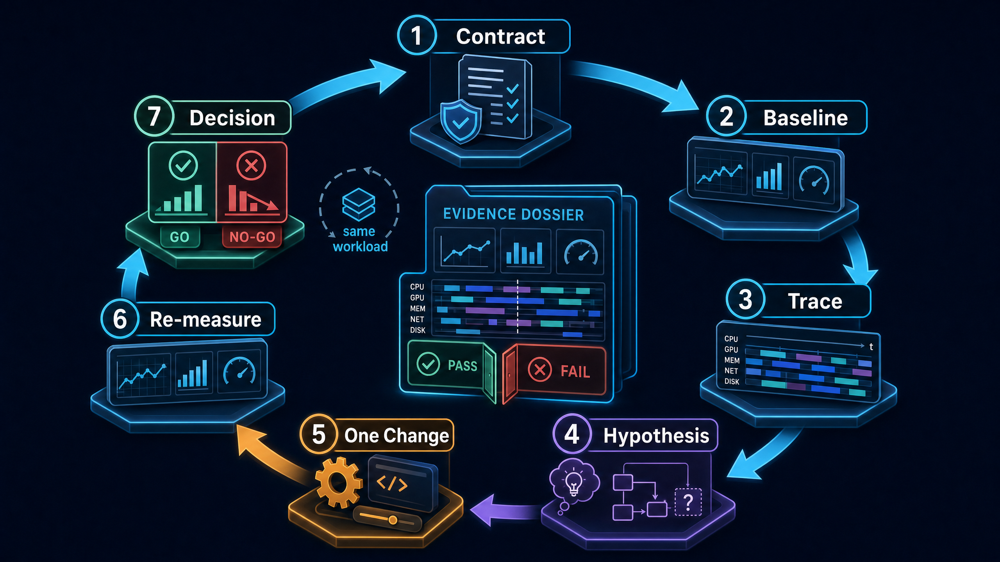
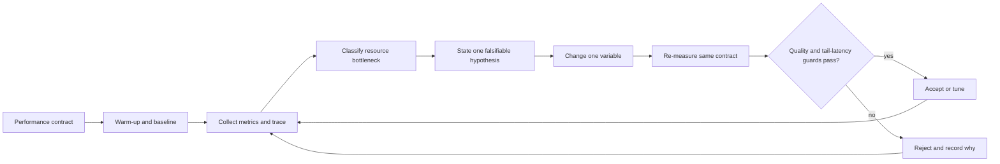
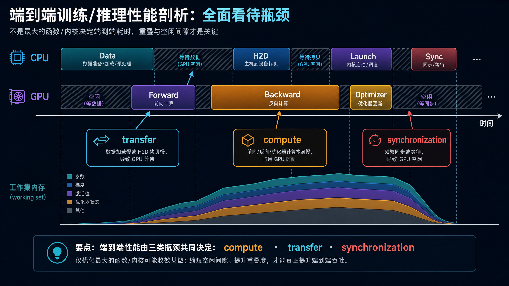
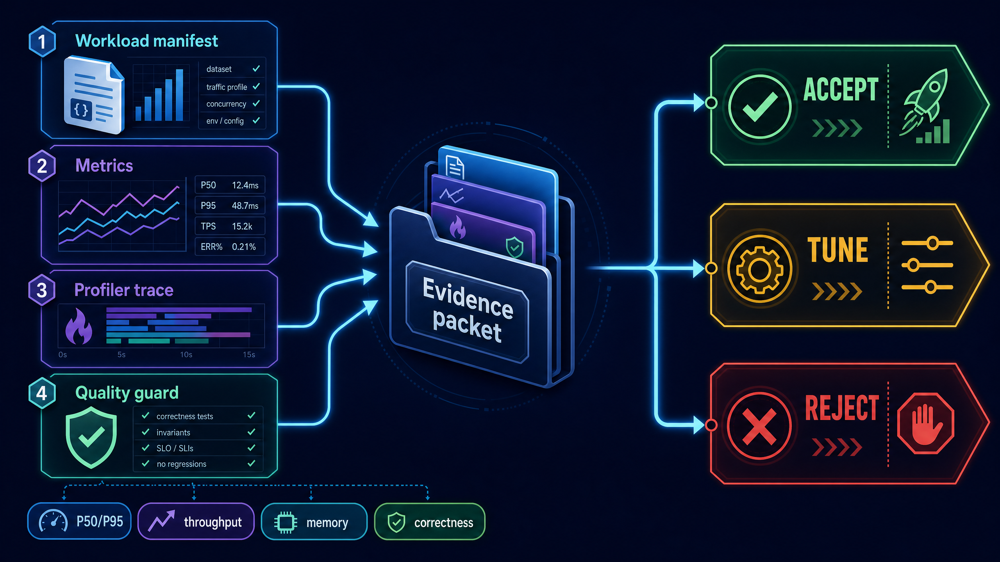
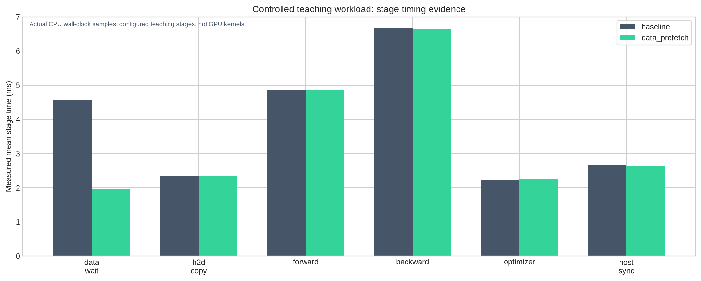
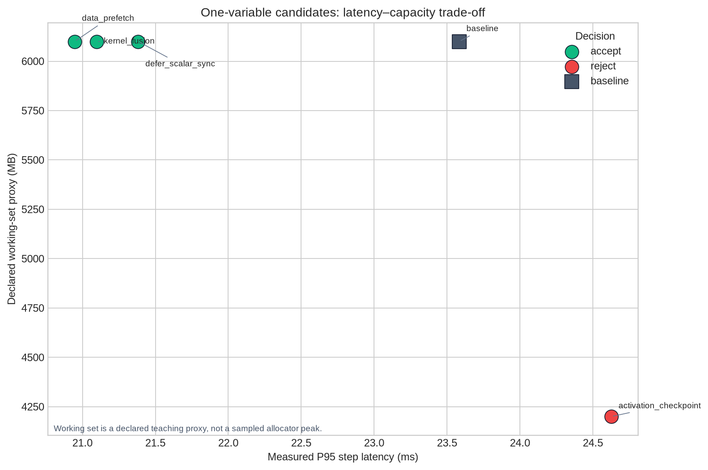
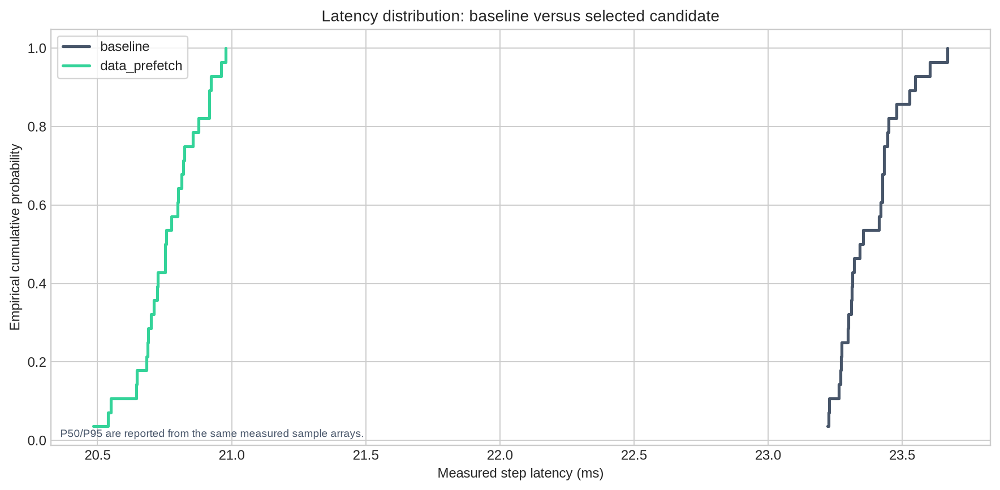

# 从“哪里慢”到“值不值得保留”：Profiling 驱动的端到端优化学习笔记

**适用场景**：你能够运行模型，却常在“看到了一个耗时热点”与“能够证明某项优化应该上线”之间断层。本笔记以 Datawhale 的端到端 profiling 教程为入口，重构出一条可复现、可证伪、可决策的性能工程路径：**固定合同 → 测 baseline → 采集证据 → 建立假设 → 单变量改动 → 复测 → 决策**。

> **一句话总览**：性能优化不是“让某一段代码看起来更快”，而是一个受 workload、质量、尾延迟、容量和证据共同约束的因果实验。热点只是线索；只有在相同合同下，改动后的端到端收益通过守卫条件，才有资格进入 `accept`。



本笔记没有逐段复述教程。正文叙事、图解、实验设计、决策门槛和全部源代码均为原创重写。仓库提供一份不依赖 GPU 的受控 CPU 实验室 [`code/profiling_lab.py`](./code/profiling_lab.py)，它以真实墙钟计时模拟可控的端到端阶段并生成可视化；也提供一份可在真实 PyTorch/CUDA 环境执行的 [`code/torch_profiler_template.py`](./code/torch_profiler_template.py)，用于采集短 profiler trace。前者用于理解协议，后者才是连接真实 workload 的起点。

感谢 [Datawhale 社区][2]及教程贡献者。本文明确区分**真实墙钟测量**、**教学阶段配置**与**真实 GPU profiler 证据**；不会将任何受控 CPU 实验数值包装成模型、GPU 或线上服务 benchmark。

| 学习入口 | 本笔记的扩展主题 | 你最终应带走的能力 |
|---|---|---|
| [Datawhale — 74. Profiling-Driven End-to-End Optimization][1] | 将四个最小函数扩展为完整证据包与可复现项目 | 建立从 baseline 到 `accept / tune / reject` 的闭环 |
| [PyTorch Profiler Recipe][3] | self/total time、shape、memory、schedule 与 trace | 正确阅读 profiler，而非只看一行“热点” |
| [PyTorch Performance Tuning Guide][4] | 同步、数据加载、融合、编译、缓存分配与分布式 | 让优化假设从资源类别出发 |
| [NVIDIA Deep Learning Performance][5] | 计算、内存受限层和 GPU 执行背景 | 将现象映射为计算/带宽/容量/通信/调度问题 |

---

## 目录

- [1. 先建立正确世界观：性能结论是一份“带合同的证据”](#1-先建立正确世界观性能结论是一份带合同的证据)
- [2. 端到端时间不是一个数：拆解阶段、空洞与资源类别](#2-端到端时间不是一个数拆解阶段空洞与资源类别)
- [3. baseline 的科学性：固定什么、预热什么、报告什么](#3-baseline-的科学性固定什么预热什么报告什么)
- [4. 从 profiler 表到瓶颈假设：热点不是最终判决](#4-从-profiler-表到瓶颈假设热点不是最终判决)
- [5. 优化实验的因果纪律：一次只改一个变量](#5-优化实验的因果纪律一次只改一个变量)
- [6. 将教程的最小模板读成工程协议](#6-将教程的最小模板读成工程协议)
- [7. 完整可运行的 CPU-first Profiling 实验室](#7-完整可运行的-cpu-first-profiling-实验室)
- [8. 读懂本仓库的实际测量与可视化](#8-读懂本仓库的实际测量与可视化)
- [9. 真实 PyTorch/CUDA profiler：如何把教学闭环接到实际工作负载](#9-真实-pytorchcuda-profiler如何把教学闭环接到实际工作负载)
- [10. 报告、决策与上线门槛](#10-报告决策与上线门槛)
- [11. 高频误区与我的思考](#11-高频误区与我的思考)
- [参考资料](#参考资料)

---

## 1. 先建立正确世界观：性能结论是一份“带合同的证据”

同样一句“训练 step 降到 90 ms”几乎没有信息量。它没有说明模型版本、输入长度、batch size、精度、硬件、后端、是否包含数据加载、是否 warm-up、是否同步 CUDA，也没有说明质量是否回退。没有这些上下文，两个数字不能被安全比较。

我把一次性能实验的最小合同写成下面的 ASCII 账本。它不是某个框架固定字段，而是要求每一个性能结论都回答的事实集合：

```text
performance_claim =
    workload_manifest
  + measurement_protocol
  + baseline_record
  + changed_variable
  + tuned_record
  + quality_guard
  + profiler_evidence
  + decision_rule
```

其中 `workload_manifest` 至少要包括模型/代码版本、阶段定义、batch、序列长度、输入分布、设备、驱动/运行时、后端和 dtype。`measurement_protocol` 说明预热轮数、采样轮数、统计量、同步边界和是否记录 trace。`quality_guard` 则取决于任务：训练可包含 loss/accuracy；推理可包含输出一致性、任务成功率或 SLA。Datawhale 教程明确要求固定 workload、先测 baseline、对比 step time、throughput 与 peak memory，并在端到端约束下输出是否保留优化的结论。[1]

| 合同字段 | 为什么必须固定或记录 | 若忽略会发生什么 |
|---|---|---|
| 模型与代码版本 | 算子图、编译缓存、权重与逻辑都会变 | 你不知道速度差来自优化还是换了实现 |
| 输入形状与分布 | shape 会改变 kernel、缓存和数据路径 | 一个短序列结论被错误外推到长上下文 |
| batch、并发与阶段边界 | 决定吞吐、排队、显存与 CPU/GPU 重叠 | 只优化了 microbenchmark，却没有改善 E2E |
| 设备、驱动、后端与 dtype | 会改变可用 kernel 与数值路径 | 两次“相同实验”实际不是同一个系统 |
| warm-up 与采样数 | 首轮初始化、编译和缓存会扭曲读数 | 用偶然的单次好结果做决策 |
| 质量守卫 | 更快但错误的结果没有业务价值 | 将精度/正确性回退误认为优化成果 |



> **性能数字不是脱离条件的属性，而是一次运行在既定条件下的观测。** 因此，“报告条件”不是写作负担，而是让结论可重复、可质疑、可复用的最低成本。

---

## 2. 端到端时间不是一个数：拆解阶段、空洞与资源类别



端到端 step time 可以粗略写成阶段总和，但真实系统还会受到重叠与等待的影响：

```text
end_to_end_time ≠ sum(the most visible operator times)

end_to_end_time ≈ critical_path(
    data preparation,
    host-to-device transfer,
    forward,
    backward or decode,
    optimizer or sampling,
    synchronization,
    communication,
    idle gaps
)
```

如果 DataLoader 慢，GPU 可能在等待数据；如果频繁调用 `.item()`、`tensor.cpu()` 或依赖 CUDA tensor 结果的 Python 分支，CPU/GPU 异步流水线可能被迫同步；如果小点操作没有融合，耗时可能主要来自多次 launch 和读写而非算术本身。PyTorch 的性能指南将这些同步、数据加载和 pointwise fusion 问题作为独立的优化类别，而非单一“模型算得慢”。[4]

| 资源类别 | 时间线中常见信号 | 必须补充的证据 | 可能的下一步 |
|---|---|---|---|
| 计算受限 `compute` | forward/backward/decode kernel 长，GPU 忙 | shape、算子 self time、硬件利用率、kernel 明细 | 检查算子形状、精度、融合和合适的后端 |
| 内存带宽受限 `memory` | 算术少但读写多，点操作/归一化占比高 | tensor 大小、访问模式、带宽利用率 | 融合点操作、优化布局、降低不必要读写 |
| 容量受限 `capacity` | OOM、allocator churn、峰值工作集过高 | allocator snapshot、张量生命周期、峰值时刻 | checkpoint/offload/量化，但必须复测时间成本 |
| 数据/传输受限 `data_transfer` | GPU 空洞出现在 batch 准备/H2D 周围 | DataLoader 队列、CPU 利用率、copy trace | worker、prefetch、pin memory、传输重叠 [4] |
| 通信受限 `communication` | 多卡 all-reduce 暴露在计算后 | collective trace、bucket、rank 偏斜 | 重叠、bucket、并行策略、负载均衡 |
| 同步/调度受限 `synchronization` | host 等待、短小 gap、CPU 频繁阻塞 | CPU/GPU 时间线、API 调用、stream 依赖 | 消除隐式同步、批量化、延后标量读取 [4] |

### 2.1 为什么“最慢的一行”不一定是首个优化目标

假设 backward 6 ms 是最长单阶段，data wait 4 ms，host sync 3 ms。你当然应该调查 backward；但如果 backward 已经是高效的矩阵乘，而 data wait 让 GPU 每个 step 空转 4 ms，改良数据预取可能更易实施、更稳定，且获得更大的端到端收益。反过来，单独加速一个已经与通信重叠的算子，可能几乎不会缩短 critical path。

本仓库的受控实验故意制造了这个现象：baseline 的最长阶段是 `backward`，但 `data_prefetch` 在相同合同下成为端到端最快的候选，因为它缩短的数据等待比其他单变量变化带来的 critical-path 缩短更多。**这不是“忽略 backward”，而是提醒我们先看全局时间线，再决定优先级。**

---

## 3. baseline 的科学性：固定什么、预热什么、报告什么

### 3.1 warm-up 的作用是让“稳态样本”进入统计，而不是美化数字

首次执行可能包含 Python 导入、内存分配、CUDA context 初始化、JIT/compile、cudnn autotune 或缓存填充。把这些混入正式样本，会把“首次成本”错当成稳态吞吐；反之，只报告异常快的某一轮，也会掩盖抖动。Datawhale 的最小函数先 warm-up 再以 `time.perf_counter()` 测多次平均耗时；在 CUDA 环境下，计时边界前后还应同步，从而避免把尚未完成的异步 GPU 工作遗漏到计时区间外。[1]

```python
def benchmark_step(step_fn, torch, warmup=5, iters=30):
    for _ in range(warmup):
        step_fn()
    synchronize_if_cuda(torch)

    samples_ms = []
    for _ in range(iters):
        synchronize_if_cuda(torch)
        start = time.perf_counter()
        step_fn()
        synchronize_if_cuda(torch)
        samples_ms.append((time.perf_counter() - start) * 1000.0)
    return summarize(samples_ms)
```

这段片段来自本仓库原创的 [`torch_profiler_template.py`](./code/torch_profiler_template.py)，完整文件还包含 trace schedule、top operator 表和 JSON 证据记录。两个同步的位置必须被解释清楚：第一个确保前一轮异步工作已完成；第二个确保当前轮 GPU 工作包含在墙钟读数中。它适用于“测完整 step 的 wall-clock latency”，但若要精确测某个 kernel，应结合 CUDA events 和合适的基准协议，而不能把每种问题都用相同方法处理。[3] [4]

### 3.2 平均值不够；至少将中心、尾部和吞吐一起报告

均值适合描述总体成本，P50 表示典型体验，P95/P99 捕捉尾部抖动，吞吐描述单位时间完成的有效工作。对流式推理，还应将 TTFT、inter-token latency 和 end-to-end completion 分开；对训练，则可报告 samples/s、tokens/s、step time 和计算/通信重叠情况。不同指标不能互相替代。

| 指标 | 简洁定义 | 最适合回答的问题 | 单独使用的盲点 |
|---|---|---|---|
| mean step time | 采样 step 耗时的平均 | 总体计算成本是否下降 | 掩盖极端慢样本 |
| P50 latency | 样本的中位数 | 典型一次执行有多快 | 看不见长尾停顿 |
| P95/P99 latency | 高分位耗时 | 尾部体验是否回退 | 需要足够样本量 |
| throughput | 有效 token/sample 除以时间 | 在固定单位工作量下系统产出是否提高 | 可能以更差 latency 为代价 |
| peak memory | 运行中的最大内存占用 | 容量风险是否下降 | 不说明吞吐或碎片 |
| quality guard | loss、校验和、输出一致性、任务分数等 | 改动是否保留正确行为 | 必须贴近真实业务目标 |

本实验室固定每 step 处理 `4096` 个教学 token，所以：

```text
throughput_tokens_per_s = 1000 * tokens_per_step / mean_step_ms

positive_time_gain       = baseline_mean_ms - tuned_mean_ms
positive_throughput_gain = tuned_throughput - baseline_throughput
positive_memory_gain     = baseline_working_set - tuned_working_set
```

明确正负号约定很重要。让“正数 = 更好”后，报告表与决策逻辑可直接复用；更重要的是，读者不会把 “tuned - baseline” 和 “baseline - tuned” 混用而得出反向结论。

---

## 4. 从 profiler 表到瓶颈假设：热点不是最终判决

PyTorch Profiler 能记录 CPU/CUDA 活动；`record_shapes=True` 可保留算子输入 shape，`profile_memory=True` 可显示 tensor 相关内存分配/释放。聚合表中 `self` 时间排除子算子，而 `total` 时间包含子算子；这一区别决定你是在看“真正的叶子热点”，还是看“聚合调用范围”。`record_function` 则让你可以把业务语义范围标进 trace，例如 `forward_and_loss`、`backward` 或 `optimizer_step`。[3]

```python
with torch.profiler.profile(
    activities=activities,
    schedule=torch.profiler.schedule(wait=0, warmup=1, active=active_steps, repeat=1),
    on_trace_ready=torch.profiler.tensorboard_trace_handler(str(output_dir)),
    record_shapes=True,
    profile_memory=True,
) as prof:
    for _ in range(iters):
        step_fn()
        prof.step()
```

真实长任务不应无差别记录所有 step。trace 会带来额外开销，也会变得很大；PyTorch 的 profiler 提供 `schedule`、`on_trace_ready` 和 `prof.step()`，用于跳过、预热和仅在 active 窗口保存少数代表性步骤。[3] 因此你应把 trace 当作**采样仪器**，而不是永远开启的日志。

### 4.1 一个可证伪的瓶颈假设应包含什么

坏假设是“backward 很慢”。它没有说明相对份额、资源类别、证据来源和验证动作。更好的写法是：

> 在已固定 `batch=8`、`seq_len=512`、后端与 warm-up 设置的 workload 下，baseline trace 中 `backward` 的测得均值为全部阶段求和的约 28.6%，是最大阶段；因此当前的**第一假设**是计算路径占主导。下一步先固定其它条件，单独尝试减少 backward 的点操作或验证 kernel 选择，并重新测量 P50/P95/throughput/质量守卫。

注意“第一假设”与“最终事实”的差别。阶段统计只能初步归因；真实项目还需要更细粒度 operator 表、GPU 时间线、kernel 形状、硬件计数器、队列深度或通信 trace 来排除重叠和等待。Datawhale 教程也提醒：若没有采集真实 profiler，相关字段应保持为空，不能用推测填充热点结论。[1]

| 现象 | 有价值的初始假设 | 必须主动排除的替代解释 |
|---|---|---|
| GPU 有大空洞 | data/transfer 或 host synchronization | GPU 实际在另一个 stream 工作、trace 范围缺失 |
| `aten::foo` total time 最大 | 调用树中 `foo` 范围值得展开 | 真正叶子热点可能是 child operator |
| `aten::empty` 内存项很大 | 有大量中间分配或重分配 | profiler 内存统计与 allocator peak 不等价 |
| 通信在 backward 后暴露 | compute-communication overlap 不充分 | rank 负载不均或 bucket 配置问题 |
| P95 上升但均值下降 | 优化引入长尾同步/编译/缓存 miss | 样本数不足或工作负载变了 |

---

## 5. 优化实验的因果纪律：一次只改一个变量



性能优化失败最常见的原因之一，是一次开启多个开关：改 batch、改 precision、开 compile、加 DataLoader workers、改 checkpoint、换 kernel，然后看到整体变快，却无法回答收益来自哪里、代价是什么、哪项在别的 workload 下会回退。一次只改变一个方向不是教条，而是为了让结论可归因。

```text
baseline:             all contract fields fixed
candidate A:           only data prefetch changes
candidate B:           only backward fusion changes
candidate C:           only host synchronization timing changes
candidate D:           only activation checkpointing changes

for every candidate:
    warm up -> measure same sample protocol -> collect same metrics
    -> compare against same baseline -> apply same quality and decision gates
```

| 单变量改动 | 预期收益 | 可能代价 | 不能省略的复测 |
|---|---|---|---|
| data prefetch / workers / pinning | 缩短供给等待、提高重叠 | CPU 争用、内存压力、样本抖动 | GPU 空洞、P95、数据正确性 [4] |
| pointwise fusion / compile | 减少 launch 和中间读写 | 编译时间、shape 限制、额外内存 | steady-state 与 cold-start 分开测 [4] |
| 延后标量同步 | 缩短 host 阻塞 | 结果可见性变化、debug 复杂度 | time line、正确性、异常路径 [4] |
| activation checkpointing | 降低 activation 容量 | backward 重计算、吞吐回退 | peak allocator、P95、吞吐、loss |
| precision / kernel 更换 | 提高算术效率或带宽效率 | 数值与 fallback 风险 | 质量回归、kernel 实际命中、shape 覆盖 |

**“一次只改一个变量”并不排斥系统优化。** 当证明 A、B、C 在各自的独立合同下都有因果收益后，才可以在新一轮实验中测试组合；组合方案应成为一个新的候选，需要重新建立 baseline、测交互作用并记录版本。这样才能避免把两个相互抵消或只在独立状态有效的改动错误叠加。

---

## 6. 将教程的最小模板读成工程协议

Datawhale 教程将完整闭环压缩为四个函数：`benchmark_fn`、`summarize_optimization_result`、`format_optimization_report` 与 `recommend_optimization_decision`。[1] 它们看起来简单，实际上各自对应一个不可跳过的工程职责。

| 教程函数 | 最小职责 | 扩展到端到端工程时应增加什么 |
|---|---|---|
| `benchmark_fn` | warm-up 后测量平均 ms | 样本数组、P50/P95、同步边界、环境 manifest、异常样本标记 |
| `summarize_optimization_result` | 统一正负号的时间/显存/吞吐差值 | 相对收益、尾部变化、容量与质量守卫、置信边界 |
| `format_optimization_report` | Markdown 表和结论 | trace 链接、热点证据、版本、单变量改动、下一步行动 |
| `recommend_optimization_decision` | accept/tune/reject | 显式阈值、P95 回退保护、正确性检查、回滚计划 |

### 6.1 计时函数：真正重要的是“计时边界”

```python
def benchmark_pipeline(contract, config):
    pipeline = ControlledPipeline(contract, config)
    for _ in range(contract.warmup_steps):
        pipeline.step()

    step_samples = []
    for _ in range(contract.measurement_steps):
        step_start_ns = time.perf_counter_ns()
        stage_ms, events, checksum = pipeline.step()
        step_end_ns = time.perf_counter_ns()
        step_samples.append((step_end_ns - step_start_ns) / 1_000_000.0)
```

本仓库的 [`profiling_lab.py`](./code/profiling_lab.py) 用 `perf_counter_ns()` 保存每一步的样本，避免只留下平均值。它还同时保存每个 stage 的样本数组、Chrome trace 格式的事件、固定合同和质量校验和。教学 pipeline 通过短暂 sleep 使阶段时长可控，但记录的是**实际墙钟观测值**，所以系统调度抖动依然会出现在 P50/P95 中。

### 6.2 汇总函数：让“收益”在所有指标上使用同一语义

```python
def compare_runs(baseline, tuned):
    time_delta = baseline["mean_step_ms"] - tuned["mean_step_ms"]
    p95_delta = baseline["p95_step_ms"] - tuned["p95_step_ms"]
    memory_delta = baseline["declared_working_set_mb"] - tuned["declared_working_set_mb"]
    throughput_delta = tuned["throughput_tokens_per_s"] - baseline["throughput_tokens_per_s"]
    return positive_is_better_deltas()
```

这段约定避免了“同一表中正数有时代表变好、有时代表变坏”的阅读灾难。注意这里的 `declared_working_set_mb` 是受控教学实验**明确声明的容量 proxy**，不是 `torch.cuda.max_memory_allocated()` 或生产 allocator sampling。真实 GPU 项目应以真实 allocator/API 数据替换它，并说明峰值是在何时、何个进程或哪个 rank 采集的。

### 6.3 决策函数：速度不能否决正确性与尾延迟

```python
def recommend_decision(baseline, tuned, comparison, max_p95_regression_pct):
    if not tuned["quality_passed"]:
        return reject("quality guard failed")
    if comparison["p95_gain_pct"] < -max_p95_regression_pct:
        return reject("tail latency violates workload contract")
    if comparison["mean_step_gain_pct"] >= 8 and comparison["throughput_gain_pct"] >= 8:
        return accept("speed and throughput clear the rollout gate")
    if comparison["mean_step_gain_pct"] > 0 and comparison["throughput_gain_pct"] > 0:
        return tune("direction is positive but evidence is not yet strong")
    return reject("no stable end-to-end gain")
```

本代码把 `accept` 门槛设为 mean latency 和 throughput 均至少改善 8%，同时要求质量与 P95 通过。这个阈值不是通用行业标准，而是**教学合同中的显式选择**；真正项目应由产品 SLA、容量预算、风险偏好和测量噪声决定。重要的不是 8 这个数字，而是：阈值应在看结果前被写进合同，并且所有候选共享同一规则。

---

## 7. 完整可运行的 CPU-first Profiling 实验室

### 7.1 文件与运行方式

全部源代码均已完整附在仓库中，不依赖网络、GPU 或隐藏 notebook 状态。第一份代码面向可重复学习；第二份模板面向有 PyTorch 环境后的真实 trace 采集。

```bash
cd Memory/task6
python3 -m py_compile code/profiling_lab.py code/torch_profiler_template.py
python3 code/profiling_lab.py
```

| 路径 | 交付物 | 作用 |
|---|---|---|
| [`code/profiling_lab.py`](./code/profiling_lab.py) | 592 行完整原创实验室 | 合同、受控阶段、实际计时、trace、瓶颈归因、报告、决策与作图 |
| [`code/torch_profiler_template.py`](./code/torch_profiler_template.py) | 168 行完整真实 profiler 模板 | CUDA 同步计时、`torch.profiler` schedule、trace 与 top operators |
| [`learning_lab_output.txt`](./learning_lab_output.txt) | 实际运行 trace | 记录通过的断言、候选收益和决策 |
| [`results/profiling_results.json`](./results/profiling_results.json) | 结构化实验结果 | 便于审阅指标、阶段份额、合同与决策原因 |
| [`results/controlled_baseline_trace.json`](./results/controlled_baseline_trace.json) | Chrome trace 形状的教学事件 | 说明 stage 级 trace 的数据结构与 provenance |
| [`assets/04_stage_breakdown.png`](./assets/04_stage_breakdown.png) | 确定性性能图 | baseline 与选中候选的阶段均值对比 |
| [`assets/05_candidate_tradeoffs.png`](./assets/05_candidate_tradeoffs.png) | 确定性性能图 | 单变量候选的 P95—容量 proxy 权衡 |
| [`assets/06_latency_distribution.png`](./assets/06_latency_distribution.png) | 确定性性能图 | baseline 与选中候选的样本分布比较 |

### 7.2 实验室的结构与不变量

| 组件 | 核心接口 | 它让你学到什么 | 程序实际验证什么 |
|---|---|---|---|
| 合同 | `WorkloadContract` | 对比前先锁定 workload | warm-up、样本数与质量 checksum 一致 |
| 阶段 | `StageSpec`、`ControlledPipeline` | 用有业务含义的 stage 而非单一总时间做 trace | 每一 stage 均保存样本和事件 |
| 计时 | `benchmark_pipeline` | 平均值、P50、P95 与 stage share 来自同一组样本 | 结果为有限数值 |
| 瓶颈假设 | `classify_bottleneck` | 将最大 stage 映射为资源类别和下一步动作 | 最大份额、证据文本与类别一致 |
| 比较 | `compare_runs` | 统一“正数代表改善”的口径 | 时间、P95、吞吐与容量差值可重算 |
| 决策 | `recommend_decision` | 质量与长尾能否决局部速度收益 | 合同、quality 与 P95 guard 均参与决策 |
| 可视化 | `plot_*` | 不只看数字，观察阶段、Pareto 与分布 | 图源来自实际测量 JSON，而非手填 |

### 7.3 四个候选为什么值得同时存在

实验室从同一 baseline 各自派生四个**独立的单变量候选**。它们不在同一次运行叠加，因此可分别展示 data、compute、synchronization 与 capacity 的工程权衡。

```text
baseline:              data_wait=4.4 ms, backward=6.5 ms, host_sync=2.5 ms

data_prefetch:         only data_wait target becomes 1.8 ms
kernel_fusion:         only backward target becomes 4.1 ms
defer_scalar_sync:     only host_sync target becomes 0.45 ms
activation_checkpoint: one named technique lowers capacity proxy but raises backward target
```

最后一个候选尤其重要。activation checkpointing 往往旨在用重计算换取更低的 activation 存储；它是否“成功”不能由峰值容量单独决定。若容量是硬约束，它即使变慢也可能值得 `tune`；若本轮合同要求端到端吞吐不回退，便应 `reject` 并把它记录为“解决了容量、但违反速度合同”的反例。PyTorch 性能指南也将 checkpoint 描述为以重计算降低内存需求的机制，而不是免费加速。[4]

---

## 8. 读懂本仓库的实际测量与可视化

### 8.1 Baseline 先给出一个可检验的瓶颈假设

本次实际运行产生的 JSON 显示，固定教学合同下 baseline 的平均 step time 约为 **23 ms**，P95 约为 **23.4 ms**，最大 measured stage 是 `backward`，占所有阶段均值之和的约 **28.6%**。它被标为 `compute` 类的**初始假设**，而不是最终硬件结论。所有实际数值和完整 stage 样本均在 [`results/profiling_results.json`](./results/profiling_results.json) 中可审阅。



图中 baseline 的 `backward` 仍是最长条，但 `data_prefetch` 通过降低 `data_wait` 获得了约 11% 的端到端 mean step gain。这展示了一个常被忽略的事实：**最长阶段不自动等于最优先、最有收益或最容易改变的优化点。** 应按 potential gain、实现风险、合同约束和可验证性排序，而非机械地从最长条开始。

### 8.2 单变量候选结果

以下数字来自本仓库重新运行后的 [`learning_lab_output.txt`](./learning_lab_output.txt)。测量会随操作系统调度发生小幅波动，因而不应与其他机器横向比较；值得学习的是每个候选使用同一合同、同一 baseline 和同一 decision gate。

| 候选 | 单变量改动 | mean step gain | P95 gain | working-set proxy | throughput gain | 决策 |
|---|---|---:|---:|---:|---:|---|
| `data_prefetch` | 缩短受控数据等待 | +11.20% | +11.18% | 0 MB | +12.61% | `accept` |
| `kernel_fusion` | 缩短受控 backward compute | +10.52% | +10.54% | 0 MB | +11.75% | `accept` |
| `defer_scalar_sync` | 缩短受控 host sync | +9.18% | +9.33% | 0 MB | +10.10% | `accept` |
| `activation_checkpoint` | 降低容量 proxy、增加重计算 | -4.51% | -4.42% | +1900 MB | -4.32% | `reject` |



这里的图不是要说“data prefetch 总比 kernel fusion 更好”。它只说明，在本次受控的 teaching pipeline 中，前者对 end-to-end critical path 的可缩短部分稍大；而 activation checkpoint 在该**速度优先合同**下因重计算导致平均值与 P95 回退，尽管容量 proxy 降低 1900 MB 仍被拒绝。如果将合同改成“必须将 peak memory 降到某一硬阈值以下”，决策规则应随之改变，而不是硬把同一结果解释成失败。

### 8.3 只看均值会遗漏什么



平均值把所有样本压缩成一个数；ECDF 保留分布形状。若候选平均更快但曲线右端更长，可能意味着 P95/P99 变差；这在流式推理、交互服务和批处理 deadline 中都很重要。本实验的 `data_prefetch` 曲线整体向左，且 P95 同步改善，因此通过了教学 gate。真实系统还应增加更多样本、独立重复轮次以及 cold/warm、短/长上下文、低/高并发的分层报告。

```text
A credible rollout report answers all of these:
1. Did mean latency improve?
2. Did P95/P99 remain within the workload contract?
3. Did throughput improve at the same effective work unit?
4. Did true allocator peak / capacity target improve when relevant?
5. Did quality and correctness pass?
6. Is the bottleneck evidence from an actual trace, not an inference from one number?
```

---

## 9. 真实 PyTorch/CUDA profiler：如何把教学闭环接到实际工作负载

实验室完成后，下一步不是把受控阶段数值贴到真实模型上，而是将**相同的协议**迁移过去。以下模板可以在安装 PyTorch 的机器执行；若有 CUDA，它会自动纳入 CUDA activity 并以 TensorBoard trace handler 输出 trace。它的微型 MLP 仅用于演示 instrumentation，必须替换为你的真实 train step 或 inference step 才能得出业务结论。

```bash
cd Memory/task6
python3 code/torch_profiler_template.py --output-dir results/torch_trace
```

使用真实模板后，应得到这类证据包：

```text
results/torch_trace/
├── *.pt.trace.json          # TensorBoard / Chrome trace 产物
├── top_operators.txt        # 按 self CPU/CUDA time 排序的聚合表
└── profile_summary.json     # device、计时分位数、profiler 设置和 provenance
```

### 9.1 真实 trace 的阅读顺序

| 顺序 | 先看什么 | 为什么 | 常见过度解读 |
|---:|---|---|---|
| 1 | 合同与 warm-up 是否正确 | 防止把不同 workload 放在一张表比较 | 忽略动态 shape、缓存和 cold start |
| 2 | 完整 CPU/GPU 时间线 | 首先定位 critical path 和 GPU 空洞 | 直接跳到 top operator 表 |
| 3 | 聚合表的 self 与 total time | 区分调用范围与叶子成本 | 将 wrapper 的 total time 当 kernel 自身成本 |
| 4 | shape 与调用次数 | 识别小 kernel 风暴、意外 shape、重复 work | 只按总时长排序不看次数 |
| 5 | memory view / allocator 数据 | 将分配与生命周期同峰值联系 | 将 profiler memory 列等同 allocator peak |
| 6 | 一项可证伪的改动和复测 | 建立因果而非相关 | 一次性开所有优化开关 |

PyTorch Profiler Recipe 的 `record_shapes`、`profile_memory`、`record_function` 和 schedule 都是为这一循序分析服务的；它也说明 CPU/CUDA 活动、栈信息与 profiling 本身会有开销，应当谨慎解释而不是持续全量开启。[3]

### 9.2 推理 workload 需要自己的阶段边界

训练的典型阶段是 `data -> H2D -> forward -> backward -> optimizer`；LLM 推理则更适合拆成 `request admission -> tokenization -> prefill -> KV allocation/read -> decode -> sampling -> detokenization/streaming`。若只报“平均 tokens/s”，你将无法知道优化是减少 prefill、加速 decode，还是仅改变了请求组成。Datawhale 的教程也要求推理侧关注 prefill、decode、KV Cache、采样、数据搬运与 kernel 开销等不同阶段。[1]

```text
For each inference report, include at least:
- request mix: prompt-length and output-length distributions
- concurrency and arrival pattern
- TTFT, decode inter-token latency, end-to-end completion latency
- tokens/s defined at a clear scope: model, server, or client
- KV cache policy, admission/eviction behavior, and OOM/retry counts
- output / task quality guard
```

---

## 10. 报告、决策与上线门槛


一份好报告不是图表的堆叠，而是任何同事都能复跑、反驳、理解风险并决定下一步的最小证据包。本实验室的 JSON 使用以下结构，真实项目可以保留同一骨架：

```json
{
  "contract": {"model": "...", "batch": "...", "seq_len": "...", "warmup": "..."},
  "baseline": {"metrics": "...", "bottleneck": "..."},
  "candidate": {"changed_knob": "...", "metrics": "..."},
  "comparison": {"mean": "...", "p95": "...", "throughput": "...", "memory": "..."},
  "quality_guard": {"status": "...", "evidence": "..."},
  "profiling": {"tool": "...", "trace": "...", "top_operators": "..."},
  "decision": {"accept_or_tune_or_reject": "...", "reason": "...", "next_action": "..."}
}
```

| 决策 | 适用条件 | 报告中不可缺的说明 | 下一步 |
|---|---|---|---|
| `accept` | 预先定义的速度/吞吐门槛达到，P95 与质量通过，证据充分 | 改动、合同、收益、trace、回滚方式 | 在更真实的流量/硬件切片重复验证 |
| `tune` | 方向正确但收益不足、证据不全或有明确可修复风险 | 当前正收益与未满足项 | 保持单变量，补 trace/样本/边界 workload |
| `reject` | 质量失败、P95 超标或 E2E 收益不稳定 | 哪个 guard 失败、是否应回滚 | 记录负结果，重新制定瓶颈假设 |

### 10.1 决策门槛应该在看结果之前写下

若先看完结果再说“11% 看起来不错，应该 accept”，门槛极易被选择性调整。更稳健的办法是在试验前声明：质量必须通过；P95 不得回退超过 3%；mean latency 和吞吐均至少改善 8% 才可 accept；介于零与门槛之间则 tune。随后让脚本把规则应用于全部候选。

这并不要求所有项目使用 8% 或 3%。例如一次大规模模型升级可能容忍 5% 的吞吐损失以换取 4 GB 真实峰值显存；一条严格在线 SLA 则可能要求 P99 绝不回退。**规则可以不同，但规则必须显式、先验并与业务约束一致。**

---

## 11. 高频误区与我的思考

### 11.1 高频误区

| 误区 | 为什么会误导 | 更稳健的替代做法 |
|---|---|---|
| “最大的 top operator 就是唯一瓶颈” | 可能已与其它工作重叠，也可能只是 wrapper 的 total time | 先看 E2E 时间线、self/total、空洞与依赖 |
| “一次跑得快就证明优化有效” | 冷启动、缓存和调度噪声足以改变单次读数 | warm-up、多样本、P50/P95、独立重复 |
| “平均值降低即可上线” | 尾延迟、质量、容量或稳定性可能退化 | 将 mean、tail、throughput、memory、quality 一起 gate |
| “显存下降就是性能优化” | checkpoint/offload 常用计算或传输换容量 | 明确速度优先还是容量优先合同，再做权衡 |
| “打开 compile/AMP/worker 一定更快” | 后端、shape、硬件、数据路径与 warm-up 决定结果 | 每个开关都是单变量候选，需要同合同复测 [4] |
| “没有 GPU 也能得出 GPU profiler 结论” | 受控 CPU 实验只能验证协议和代码路径 | 真实结论必须来自目标硬件的 trace/计数器 |

### 11.2 我的思考一：profiling 的真正产物不是火焰图，而是“可否决的因果叙事”

一张火焰图或 profiler 表的价值在于激发假设，而不是直接宣判方案。完整的因果叙事应包含：同一合同下 baseline 的证据；某个资源类别的具体假设；仅改变一个可描述变量的候选；同一协议下的复测；质量与尾延迟守卫；以及能被反例推翻的决定。这样，优化失败不会变成无效劳动，而是会产出下一轮优先级。

### 11.3 我的思考二：把工作负载合同当作性能工程的“类型系统”

类型系统阻止把不兼容的值混算；workload contract 阻止把不可比的性能数混表。模型、长度、batch、并发、设备、后端、dtype、warm-up、统计口径和质量 guard 就像一个性能数据点的类型签名。当两个实验的签名不一致时，最专业的动作不是强行计算加速比，而是先标注“不具可比性”。

### 11.4 我的思考三：优化会移动瓶颈，因此报告必须记录“瓶颈迁移”

本实验中 baseline 的主导阶段是 backward；缩短 data wait 后，backward 的相对份额反而增大。此时继续优化 data path 的边际收益很可能下降，新的调查重心应转向 compute。性能优化不是一次性找到“真凶”，而是在每轮改动后重新画 critical path。能持续记录这种迁移的团队，才会避免在已经不主导的地方继续堆复杂度。

### 11.5 我的思考四：容量优化需要第二套成功标准

activation checkpoint 在受控实验中节省了 1900 MB 工作集 proxy，却因吞吐和 P95 回退被当前速度优先合同拒绝。这不是说 checkpoint 不好，而是说明“减少容量”和“降低时延”是不同目标。如果真实系统正因 OOM 无法提高 batch 或并发，容量优化可以解锁更大的系统级收益；此时合同应将真实 peak memory 阈值、可达 batch/concurrency 与整体 throughput 纳入成功条件。**不要让单一 latency 指标取消一个可能解除硬容量约束的方案。**

> **最终带走的原则**：先固定合同，后采集证据；先分类资源，后提出假设；一次只改一个变量；让质量和尾延迟拥有否决权；把 `reject` 当作有价值的知识；在每次成功后重新寻找被移动的下一处瓶颈。

---

## 参考资料

| 编号 | 来源 |
|---|---|
| [1] | [Datawhale — 74. Profiling-Driven End-to-End Optimization](https://github.com/datawhalechina/llm-algo-leetcode/blob/main/02_PyTorch_Algorithms/74_Profiling_Driven_End_to_End_Optimization.ipynb) |
| [2] | [Datawhale 社区](https://datawhale.cn/) |
| [3] | [PyTorch — PyTorch Profiler Recipe](https://docs.pytorch.org/tutorials/recipes/recipes/profiler_recipe.html) |
| [4] | [PyTorch — Performance Tuning Guide](https://docs.pytorch.org/tutorials/recipes/recipes/tuning_guide.html) |
| [5] | [NVIDIA — Deep Learning Performance Documentation](https://docs.nvidia.com/deeplearning/performance/index.html) |

[1]: https://github.com/datawhalechina/llm-algo-leetcode/blob/main/02_PyTorch_Algorithms/74_Profiling_Driven_End_to_End_Optimization.ipynb
[2]: https://datawhale.cn/
[3]: https://docs.pytorch.org/tutorials/recipes/recipes/profiler_recipe.html
[4]: https://docs.pytorch.org/tutorials/recipes/recipes/tuning_guide.html
[5]: https://docs.nvidia.com/deeplearning/performance/index.html
